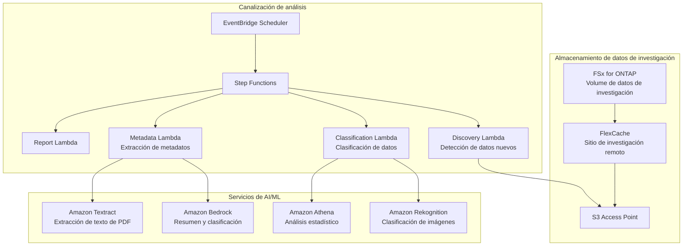

# Life Sciences Research — Patrón de análisis de datos de investigación

🌐 **Language / 言語**: [日本語](README.md) | [English](README.en.md) | [한국어](README.ko.md) | [简体中文](README.zh-CN.md) | [繁體中文](README.zh-TW.md) | [Français](README.fr.md) | [Deutsch](README.de.md) | Español

## Descripción general

Un patrón para analizar sin servidor los datos de investigación (imágenes, resultados de secuenciación, PDF de artículos) situados en el servidor de archivos (FSx for ONTAP) de una organización de investigación en ciencias de la vida, a través de S3 Access Points. FlexCache acelera el acceso a los datos entre los sitios de investigación.

## Problemas resueltos

| Problema | Solución de este patrón |
|------|-------------------|
| Latencia de uso compartido de datos entre sitios de investigación | Almacenamiento en caché entre sitios con FlexCache |
| Clasificación manual de grandes volúmenes de imágenes de investigación | Clasificación automática con S3 AP + Rekognition |
| Gestión de metadatos de los PDF de artículos | Extracción automática con S3 AP + Textract + Bedrock |
| Comprobación de calidad de los datos de secuenciación | QC automático con Lambda + Athena |
| Cumplimiento (retención de datos) | Registros de auditoría + informes automáticos |

## Arquitectura



## Datos objetivo

| Tipo de datos | Extensiones | Procesamiento | FlexCache aplicado |
|-----------|--------|---------|:---:|
| Imágenes de microscopía | .tiff, .nd2, .czi | Clasificación de imágenes, comprobación de calidad | ✅ |
| Resultados de secuenciación | .fastq, .bam, .vcf | QC, agregación de variant calls | ✅ |
| PDF de artículos | .pdf | Extracción de texto, resumen, análisis de citas | ✅ |
| Registros de experimentos | .csv, .xlsx | Análisis estadístico, detección de anomalías | ⚠️ Alta frecuencia de actualización |
| Protocolos | .docx, .md | Extracción de metadatos | ✅ |

## Relación con casos de uso existentes

| UC relacionado | Punto de relación |
|---------|------------|
| [healthcare-dicom/](../healthcare-dicom/) | Patrón compartido de procesamiento de imágenes médicas |
| [genomics-pipeline/](../genomics-pipeline/) | Patrón compartido de procesamiento de datos de secuenciación |
| [education-research/](../education-research/) | Patrón compartido de clasificación de PDF de artículos |
| [genai-rag-enterprise-files/](../genai-rag-enterprise-files/) | Canalización RAG compartida |

## Rol de FlexCache

- Almacenar en caché los datos de investigación de la sede en el FlexCache de cada sitio
- Reducir la transferencia WAN de datos de imágenes de gran tamaño
- Colocar los datos cerca del entorno de procesamiento de AI
- Proporcionar al análisis sin servidor a través de S3 AP

## Estructura de directorios

```
life-sciences-research/
├── README.md
├── template.yaml
├── functions/
│   ├── discovery/handler.py
│   ├── classification/handler.py
│   ├── metadata_extraction/handler.py
│   └── report/handler.py
├── tests/
├── events/
│   └── sample-input.json
└── docs/
    ├── architecture.md
    ├── demo-guide.md
    └── poc-checklist.md
```

## Enlaces relacionados

- [FlexCache AnyCast / DR](../flexcache-anycast-dr/README.md)
- [Mapeo de sector / carga de trabajo](../docs/industry-workload-mapping.md)
- [Matriz de compatibilidad](../docs/support-matrix-fsx-ontap-flexcache-s3ap.md)


## Success Metrics

### Outcome
Promover el aprovechamiento de los datos de investigación mediante la clasificación automática y la extracción de metadatos de los datos de investigación (imágenes, secuencias, artículos).

### Metrics
| Métrica | Objetivo (ejemplo) |
|-----------|------------|
| Archivos clasificados por ejecución | > 100 files |
| Precisión de clasificación | > 85% |
| Tasa de éxito de la extracción de metadatos | > 90% |
| Tiempo de procesamiento por archivo | < 30 s |
| Tasa de Human Review | < 20% (datos con clasificación incierta) |

### Measurement Method
Historial de ejecución de Step Functions, metadatos de resultados de clasificación, CloudWatch Metrics.


---

## Enlaces a la documentación de AWS

| Servicio | Documentación |
|---------|------------|
| FSx for ONTAP | [Guía del usuario](https://docs.aws.amazon.com/fsx/latest/ONTAPGuide/what-is-fsx-ontap.html) |
| S3 Access Points for FSx for ONTAP | [Guía de S3 AP](https://docs.aws.amazon.com/fsx/latest/ONTAPGuide/s3-access-points.html) |
| AWS HealthOmics | [Guía del usuario](https://docs.aws.amazon.com/omics/latest/dev/what-is-service.html) |
| Amazon Rekognition | [Guía para desarrolladores](https://docs.aws.amazon.com/rekognition/latest/dg/what-is.html) |
| Amazon Comprehend | [Guía para desarrolladores](https://docs.aws.amazon.com/comprehend/latest/dg/what-is.html) |
| Amazon Bedrock | [Guía del usuario](https://docs.aws.amazon.com/bedrock/latest/userguide/what-is-bedrock.html) |
| Step Functions | [Guía para desarrolladores](https://docs.aws.amazon.com/step-functions/latest/dg/welcome.html) |

### Alineación con Well-Architected Framework

| Pilar | Alineación |
|----|------|
| Excelencia operativa | Registro estructurado, CloudWatch Metrics, seguimiento de resultados de clasificación |
| Seguridad | IAM de privilegio mínimo, cifrado KMS, protección de datos de investigación |
| Fiabilidad | Step Functions Retry/Catch, procesamiento paralelo Map state |
| Eficiencia del rendimiento | Lambda ARM64, optimización del procesamiento por tipo de archivo |
| Optimización de costos | Sin servidor, ejecución bajo demanda |
| Sostenibilidad | Archivado recomendado de datos innecesarios, gestión del ciclo de vida |

### Soluciones de AWS relacionadas

- [AWS for Health & Life Sciences](https://aws.amazon.com/health/)
- [AWS HealthOmics](https://aws.amazon.com/omics/)
- [Genomics Workflows on AWS](https://aws.amazon.com/solutions/implementations/genomics-secondary-analysis-using-aws-step-functions-and-aws-batch/)


---

## Estimación de costos (aproximado mensual)

> **Nota**: Las siguientes cifras son aproximadas para la región ap-northeast-1; los costos reales varían según el uso. Consulte los precios más recientes con la [AWS Pricing Calculator](https://calculator.aws/).

### Componentes serverless (pago por uso)

| Servicio | Precio unitario | Uso supuesto | Estimación mensual |
|---------|------|-----------|---------|
| Lambda | $0.0000166667/GB-sec | 4 funciones × 30 files/día | ~$1-5 |
| S3 API (GetObject/ListObjects) | $0.0047/10K requests | ~10K requests/día | ~$1.5 |
| Step Functions | $0.025/1K state transitions | ~1K transitions/día | ~$0.75 |
| Bedrock (Nova Lite) | $0.00006/1K input tokens | ~20K tokens/ejecución | ~$3-10 |
| Athena | $5/TB scanned | N/A | ~$0.5-2 |
| SNS | $0.50/100K notifications | ~100 notifications/día | ~$0.15 |
| CloudWatch Logs | $0.76/GB ingested | ~1 GB/mes | ~$0.76 |

### Costos fijos (FSx for ONTAP — se asume entorno existente)

| Componente | Mensual |
|--------------|------|
| FSx for ONTAP (128 MBps, 1 TB) | ~$230 (compartido con el entorno existente) |
| S3 Access Point | Sin cargo adicional (solo cargos de S3 API) |

### Estimación total

| Configuración | Estimación mensual |
|------|---------|
| Configuración mínima (1 vez al día) | ~$5-15 |
| Configuración estándar (por hora) | ~$15-50 |
| Configuración a gran escala (alta frecuencia + alarmas) | ~$50-150 |

> **Governance Caveat**: Las estimaciones de costos son aproximadas, no valores garantizados. La facturación real varía según el patrón de uso, el volumen de datos y la región.

---

## Pruebas locales

### Verificación de Prerequisites

```bash
# Comprobar los requisitos previos
aws --version          # AWS CLI v2
sam --version          # SAM CLI
python3 --version      # Python 3.9+
docker --version       # Docker (para sam local)
aws sts get-caller-identity  # Credenciales de AWS
```

### sam local invoke

```bash
# Compilación
# Requisito previo: se necesita AWS SAM CLI. «sam build» empaqueta el código automáticamente.
sam build

# Ejecutar el Discovery Lambda localmente
sam local invoke DiscoveryFunction --event events/discovery-event.json

# Con anulación de variables de entorno
sam local invoke DiscoveryFunction \
  --event events/discovery-event.json \
  --env-vars env.json
```

### Pruebas unitarias

```bash
python3 -m pytest tests/ -v
```

Para más detalles, consulte la [Guía de inicio rápido de pruebas locales](../docs/local-testing-quick-start.md).

---

## Muestra de salida (Output Sample)

Ejemplo de salida de la canalización de clasificación de datos de investigación en ciencias de la vida:

```json
{
  "discovery": {
    "status": "completed",
    "object_count": 20,
    "categories": {"microscopy": 8, "sequence": 7, "research_pdf": 5}
  },
  "classification": [
    {
      "key": "research/experiment-001/image-confocal.tiff",
      "data_type": "confocal_microscopy",
      "resolution": "2048x2048",
      "channels": 4,
      "metadata_extracted": true
    },
    {
      "key": "research/experiment-001/reads.fastq.gz",
      "data_type": "rna_seq",
      "read_count": 15000000,
      "quality_score_avg": 35.2
    }
  ],
  "report": {
    "total_classified": 20,
    "categories_found": 3,
    "storage_recommendation": "archive microscopy raw data after 90 days"
  }
}
```

> **Nota**: Lo anterior es una salida de muestra; los valores reales varían según el entorno y los datos de entrada. Las cifras de benchmark son una sizing reference, no un service limit.

---

## Performance Considerations

- La capacidad de rendimiento de FSx for ONTAP se comparte entre NFS/SMB/S3AP
- El acceso a través de S3 Access Point genera una sobrecarga de latencia de decenas de milisegundos
- Al procesar grandes volúmenes de archivos, controle el grado de paralelismo con el MaxConcurrency del Step Functions Map state
- Aumentar el tamaño de memoria de Lambda también contribuye a mejorar el ancho de banda de red

> **Nota**: Las cifras de rendimiento de este patrón son una sizing reference, no un service limit. El rendimiento en entornos reales varía según la capacidad de rendimiento de FSx for ONTAP, la configuración de red y las cargas de trabajo concurrentes.

---

## Casos de referencia del sector / Industry Reference Cases

> **Evidence Tier**: Public (de blogs oficiales / sesiones de conferencias)

### AstraZeneca: Sistema multiagente (DAIS 2026)

AstraZeneca creó un sistema multiagente para que los equipos comerciales accedan a datos farmacéuticos (estructurados + no estructurados, más de 400 000 documentos clínicos) a través de las áreas terapéuticas. Un Supervisor Agent coordina subagentes específicos por área terapéutica preservando los límites de permisos, escalando de 5 → 20+ agentes.

- **Resultados**: escala 10x de agentes (5 PoC → 20+ en producción, 50+ diseñados)
- **Arquitectura**: Supervisor Agent + subagentes por área terapéutica + consulta de datos estructurados + RAG de documentos no estructurados + seguridad a nivel de fila/columna
- **Lecciones clave**: diseño que preserva los permisos, criterios de división del supervisor frente a la incorporación de agentes, pruebas human-in-the-loop, importancia de la calidad de los datos
- **Relación con FSx for ONTAP**: almacenar grandes volúmenes de documentos clínicos en recursos compartidos NAS → la canalización de AI accede a través de S3 AP → extraer los metadatos de ACL y propagarlos a la base de datos vectorial → búsqueda con filtros de permisos por área terapéutica

Este patrón (UC7) proporciona una arquitectura que resuelve la misma clase de problema (análisis de AI + clasificación de documentos de investigación) con FSx for ONTAP S3 AP + AWS Bedrock. La extensión multiagente puede realizarse mediante enrutamiento por área terapéutica con Step Functions.

Análisis detallado: [Análisis de casos DAIS 2026 Agent Bricks](../docs/investigations/dais2026-agent-bricks-industry-cases.md)

Sources:
- [DAIS 2026 Session: AstraZeneca's Multi-Agent System](https://www.databricks.com/dataaisummit/session/astrazenecas-multi-agent-system-lessons-scaling-agents-10x-agent-bricks)
- [Agent Bricks DAIS 2026 Blog](https://www.databricks.com/blog/agent-bricks-dais-2026)

---

## Implementación

Implemente con el AWS SAM CLI (reemplace los marcadores de posición según su entorno):

```bash
# Requisito previo: se necesita AWS SAM CLI. «sam build» empaqueta el código automáticamente.
sam build

sam deploy \
  --stack-name fsxn-life-sciences-research \
  --parameter-overrides \
    S3AccessPointAlias=<your-s3ap-alias> \
    S3AccessPointName=<your-s3ap-name> \
    NotificationEmail=<your-email@example.com> \
  --capabilities CAPABILITY_NAMED_IAM \
  --resolve-s3 \
  --region <your-region>
```

> **Atención**: `template.yaml` está diseñado para usarse con el SAM CLI (`sam build` + `sam deploy`).
> Para implementar directamente con el comando `aws cloudformation deploy`, utilice `template-deploy.yaml` en su lugar (requiere empaquetar previamente los archivos zip de Lambda y subirlos a S3).

## Governance Note

> Este patrón proporciona orientación de arquitectura técnica. No constituye asesoramiento legal, de cumplimiento ni regulatorio. Las organizaciones deben consultar a profesionales cualificados.
