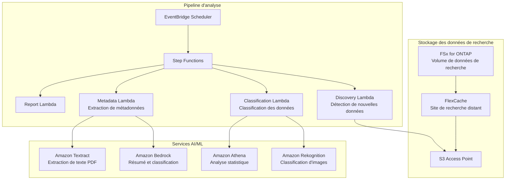

# Life Sciences Research — Modèle d'analyse de données de recherche

🌐 **Language / 言語**: [日本語](README.md) | [English](README.en.md) | [한국어](README.ko.md) | [简体中文](README.zh-CN.md) | [繁體中文](README.zh-TW.md) | Français | [Deutsch](README.de.md) | [Español](README.es.md)

## Vue d'ensemble

Un modèle pour analyser sans serveur les données de recherche (images, résultats de séquençage, PDF d'articles) situées sur le serveur de fichiers (FSx for ONTAP) d'un organisme de recherche en sciences de la vie, via les S3 Access Points. FlexCache accélère l'accès aux données entre les sites de recherche.

## Problèmes résolus

| Problème | Solution apportée par ce modèle |
|------|-------------------|
| Latence de partage de données entre sites de recherche | Mise en cache inter-sites avec FlexCache |
| Classification manuelle de gros volumes d'images de recherche | Classification automatique avec S3 AP + Rekognition |
| Gestion des métadonnées des PDF d'articles | Extraction automatique avec S3 AP + Textract + Bedrock |
| Contrôle qualité des données de séquençage | QC automatique avec Lambda + Athena |
| Conformité (conservation des données) | Journaux d'audit + rapports automatiques |

## Architecture



## Données cibles

| Type de données | Extensions | Traitement | FlexCache appliqué |
|-----------|--------|---------|:---:|
| Images de microscopie | .tiff, .nd2, .czi | Classification d'images, contrôle qualité | ✅ |
| Résultats de séquençage | .fastq, .bam, .vcf | QC, agrégation des variant calls | ✅ |
| PDF d'articles | .pdf | Extraction de texte, résumé, analyse de citations | ✅ |
| Journaux d'expériences | .csv, .xlsx | Analyse statistique, détection d'anomalies | ⚠️ Fréquence de mise à jour élevée |
| Protocoles | .docx, .md | Extraction de métadonnées | ✅ |

## Liens avec les cas d'usage existants

| UC associé | Point de liaison |
|---------|------------|
| [healthcare-dicom/](../healthcare-dicom/) | Partage du modèle de traitement d'imagerie médicale |
| [genomics-pipeline/](../genomics-pipeline/) | Partage du modèle de traitement de données de séquençage |
| [education-research/](../education-research/) | Partage du modèle de classification de PDF d'articles |
| [genai-rag-enterprise-files/](../genai-rag-enterprise-files/) | Partage du pipeline RAG |

## Rôle de FlexCache

- Mettre en cache les données de recherche du siège dans le FlexCache de chaque site
- Réduire le transfert WAN des données d'images volumineuses
- Placer les données à proximité de l'environnement de traitement AI
- Fournir à l'analyse serverless via S3 AP

## Structure des répertoires

```
life-sciences-research/
├── README.md
├── template.yaml
├── functions/
│   ├── discovery/handler.py
│   ├── classification/handler.py
│   ├── metadata_extraction/handler.py
│   └── report/handler.py
├── tests/
├── events/
│   └── sample-input.json
└── docs/
    ├── architecture.md
    ├── demo-guide.md
    └── poc-checklist.md
```

## Liens connexes

- [FlexCache AnyCast / DR](../flexcache-anycast-dr/README.md)
- [Cartographie secteur / charge de travail](../docs/industry-workload-mapping.md)
- [Matrice de support](../docs/support-matrix-fsx-ontap-flexcache-s3ap.md)


## Success Metrics

### Outcome
Favoriser l'utilisation des données de recherche grâce à la classification automatique et à l'extraction de métadonnées des données de recherche (images, séquences, articles).

### Metrics
| Métrique | Objectif (exemple) |
|-----------|------------|
| Fichiers classifiés par exécution | > 100 files |
| Précision de classification | > 85% |
| Taux de réussite de l'extraction de métadonnées | > 90% |
| Temps de traitement par fichier | < 30 s |
| Taux de Human Review | < 20% (données à classification incertaine) |

### Measurement Method
Historique d'exécution Step Functions, métadonnées des résultats de classification, CloudWatch Metrics.


---

## Liens vers la documentation AWS

| Service | Documentation |
|---------|------------|
| FSx for ONTAP | [Guide de l'utilisateur](https://docs.aws.amazon.com/fsx/latest/ONTAPGuide/what-is-fsx-ontap.html) |
| S3 Access Points for FSx for ONTAP | [Guide S3 AP](https://docs.aws.amazon.com/fsx/latest/ONTAPGuide/s3-access-points.html) |
| AWS HealthOmics | [Guide de l'utilisateur](https://docs.aws.amazon.com/omics/latest/dev/what-is-service.html) |
| Amazon Rekognition | [Guide du développeur](https://docs.aws.amazon.com/rekognition/latest/dg/what-is.html) |
| Amazon Comprehend | [Guide du développeur](https://docs.aws.amazon.com/comprehend/latest/dg/what-is.html) |
| Amazon Bedrock | [Guide de l'utilisateur](https://docs.aws.amazon.com/bedrock/latest/userguide/what-is-bedrock.html) |
| Step Functions | [Guide du développeur](https://docs.aws.amazon.com/step-functions/latest/dg/welcome.html) |

### Alignement Well-Architected Framework

| Pilier | Alignement |
|----|------|
| Excellence opérationnelle | Journalisation structurée, CloudWatch Metrics, suivi des résultats de classification |
| Sécurité | IAM moindre privilège, chiffrement KMS, protection des données de recherche |
| Fiabilité | Step Functions Retry/Catch, traitement parallèle Map state |
| Efficacité des performances | Lambda ARM64, optimisation du traitement par type de fichier |
| Optimisation des coûts | Serverless, exécution à la demande |
| Durabilité | Archivage recommandé des données inutiles, gestion du cycle de vie |

### Solutions AWS connexes

- [AWS for Health & Life Sciences](https://aws.amazon.com/health/)
- [AWS HealthOmics](https://aws.amazon.com/omics/)
- [Genomics Workflows on AWS](https://aws.amazon.com/solutions/implementations/genomics-secondary-analysis-using-aws-step-functions-and-aws-batch/)


---

## Estimation des coûts (approximation mensuelle)

> **Remarque**: Les valeurs ci-dessous sont des approximations pour la région ap-northeast-1 ; les coûts réels varient selon l'utilisation. Vérifiez les tarifs les plus récents avec le [AWS Pricing Calculator](https://calculator.aws/).

### Composants serverless (paiement à l'usage)

| Service | Prix unitaire | Utilisation supposée | Estimation mensuelle |
|---------|------|-----------|---------|
| Lambda | $0.0000166667/GB-sec | 4 fonctions × 30 files/jour | ~$1-5 |
| S3 API (GetObject/ListObjects) | $0.0047/10K requests | ~10K requests/jour | ~$1.5 |
| Step Functions | $0.025/1K state transitions | ~1K transitions/jour | ~$0.75 |
| Bedrock (Nova Lite) | $0.00006/1K input tokens | ~20K tokens/exécution | ~$3-10 |
| Athena | $5/TB scanned | N/A | ~$0.5-2 |
| SNS | $0.50/100K notifications | ~100 notifications/jour | ~$0.15 |
| CloudWatch Logs | $0.76/GB ingested | ~1 GB/mois | ~$0.76 |

### Coûts fixes (FSx for ONTAP — environnement existant supposé)

| Composant | Mensuel |
|--------------|------|
| FSx for ONTAP (128 MBps, 1 TB) | ~$230 (partagé avec l'environnement existant) |
| S3 Access Point | Aucun frais supplémentaire (frais S3 API uniquement) |

### Estimation totale

| Configuration | Estimation mensuelle |
|------|---------|
| Configuration minimale (1 exécution par jour) | ~$5-15 |
| Configuration standard (exécution horaire) | ~$15-50 |
| Configuration à grande échelle (haute fréquence + alarmes) | ~$50-150 |

> **Governance Caveat**: Les estimations de coûts sont approximatives et ne constituent pas des valeurs garanties. La facturation réelle varie selon le modèle d'utilisation, le volume de données et la région.

---

## Tests locaux

### Vérification Prerequisites

```bash
# Vérification des prérequis
aws --version          # AWS CLI v2
sam --version          # SAM CLI
python3 --version      # Python 3.9+
docker --version       # Docker (pour sam local)
aws sts get-caller-identity  # Informations d'identification AWS
```

### sam local invoke

```bash
# Build
# Prérequis : AWS SAM CLI requis. « sam build » package le code automatiquement.
sam build

# Exécuter le Discovery Lambda en local
sam local invoke DiscoveryFunction --event events/discovery-event.json

# Avec remplacement des variables d'environnement
sam local invoke DiscoveryFunction \
  --event events/discovery-event.json \
  --env-vars env.json
```

### Tests unitaires

```bash
python3 -m pytest tests/ -v
```

Pour plus de détails, consultez le [Démarrage rapide des tests locaux](../docs/local-testing-quick-start.md).

---

## Exemple de sortie (Output Sample)

Exemple de sortie du pipeline de classification des données de recherche en sciences de la vie :

```json
{
  "discovery": {
    "status": "completed",
    "object_count": 20,
    "categories": {"microscopy": 8, "sequence": 7, "research_pdf": 5}
  },
  "classification": [
    {
      "key": "research/experiment-001/image-confocal.tiff",
      "data_type": "confocal_microscopy",
      "resolution": "2048x2048",
      "channels": 4,
      "metadata_extracted": true
    },
    {
      "key": "research/experiment-001/reads.fastq.gz",
      "data_type": "rna_seq",
      "read_count": 15000000,
      "quality_score_avg": 35.2
    }
  ],
  "report": {
    "total_classified": 20,
    "categories_found": 3,
    "storage_recommendation": "archive microscopy raw data after 90 days"
  }
}
```

> **Remarque**: Ce qui précède est un exemple de sortie ; les valeurs réelles varient selon l'environnement et les données d'entrée. Les chiffres de benchmark sont une sizing reference, pas une service limit.

---

## Performance Considerations

- La capacité de débit de FSx for ONTAP est partagée entre NFS/SMB/S3AP
- L'accès via S3 Access Point entraîne une surcharge de latence de quelques dizaines de millisecondes
- Pour le traitement de gros volumes de fichiers, contrôlez le degré de parallélisme avec le MaxConcurrency du Step Functions Map state
- L'augmentation de la taille mémoire de Lambda contribue également à améliorer la bande passante réseau

> **Remarque**: Les chiffres de performance de ce modèle sont une sizing reference, pas une service limit. Les performances en environnement réel varient selon la capacité de débit de FSx for ONTAP, la configuration réseau et les charges de travail concurrentes.

---

## Cas de référence sectoriels / Industry Reference Cases

> **Evidence Tier**: Public (issu de blogs officiels / sessions de conférence)

### AstraZeneca : Système multi-agents (DAIS 2026)

AstraZeneca a construit un système multi-agents permettant aux équipes commerciales d'accéder aux données pharmaceutiques (structurées + non structurées, 400 000+ documents cliniques) à travers les domaines thérapeutiques. Un Supervisor Agent coordonne des sous-agents par domaine thérapeutique tout en préservant les limites d'autorisation, passant de 5 → 20+ agents.

- **Résultats**: Mise à l'échelle 10x des agents (5 PoC → 20+ en production, 50+ conçus)
- **Architecture**: Supervisor Agent + sous-agents par domaine thérapeutique + requête de données structurées + RAG de documents non structurés + sécurité au niveau ligne/colonne
- **Enseignements clés**: Conception préservant les autorisations, critères de division du superviseur vs ajout d'agents, tests human-in-the-loop, importance de la qualité des données
- **Lien avec FSx for ONTAP**: Stocker de gros volumes de documents cliniques sur des partages NAS → accès du pipeline AI via S3 AP → extraction des métadonnées ACL et propagation vers la base vectorielle → recherche avec des filtres d'autorisation par domaine thérapeutique

Ce modèle (UC7) fournit une architecture qui résout la même classe de problème (analyse AI + classification de documents de recherche) avec FSx for ONTAP S3 AP + AWS Bedrock. L'extension multi-agents peut être réalisée via un routage par domaine thérapeutique avec Step Functions.

Analyse détaillée : [Analyse de cas DAIS 2026 Agent Bricks](../docs/investigations/dais2026-agent-bricks-industry-cases.md)

Sources:
- [DAIS 2026 Session: AstraZeneca's Multi-Agent System](https://www.databricks.com/dataaisummit/session/astrazenecas-multi-agent-system-lessons-scaling-agents-10x-agent-bricks)
- [Agent Bricks DAIS 2026 Blog](https://www.databricks.com/blog/agent-bricks-dais-2026)

---

## Déploiement

Déployez avec le AWS SAM CLI (remplacez les valeurs de substitution selon votre environnement) :

```bash
# Prérequis : AWS SAM CLI requis. « sam build » package le code automatiquement.
sam build

sam deploy \
  --stack-name fsxn-life-sciences-research \
  --parameter-overrides \
    S3AccessPointAlias=<your-s3ap-alias> \
    S3AccessPointName=<your-s3ap-name> \
    NotificationEmail=<your-email@example.com> \
  --capabilities CAPABILITY_NAMED_IAM \
  --resolve-s3 \
  --region <your-region>
```

> **Attention**: `template.yaml` est destiné à être utilisé avec le SAM CLI (`sam build` + `sam deploy`).
> Pour déployer directement avec la commande `aws cloudformation deploy`, utilisez plutôt `template-deploy.yaml` (nécessite le pré-packaging des fichiers zip Lambda et leur téléversement vers S3).

## Governance Note

> Ce modèle fournit des conseils d'architecture technique. Il ne constitue pas un avis juridique, de conformité ou réglementaire. Les organisations doivent consulter des professionnels qualifiés.
