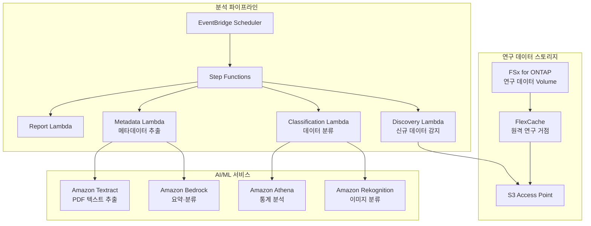

# Life Sciences Research — 연구 데이터 분석 패턴

🌐 **Language / 言語**: [日本語](README.md) | [English](README.en.md) | 한국어 | [简体中文](README.zh-CN.md) | [繁體中文](README.zh-TW.md) | [Français](README.fr.md) | [Deutsch](README.de.md) | [Español](README.es.md)

## 개요

라이프사이언스 연구 기관의 파일 서버(FSx for ONTAP)에 있는 연구 데이터(이미지, 시퀀스 결과, 논문 PDF)를 S3 Access Points를 통해 서버리스로 분석하는 패턴입니다. FlexCache로 연구 거점 간 데이터 액세스를 가속화합니다.

## 해결하는 과제

| 과제 | 본 패턴에 의한 해결 |
|------|-------------------|
| 연구 거점 간 데이터 공유 지연 | FlexCache로 거점 간 캐시 |
| 대량의 연구 이미지 수동 분류 | S3 AP + Rekognition으로 자동 분류 |
| 논문 PDF의 메타데이터 관리 | S3 AP + Textract + Bedrock으로 자동 추출 |
| 시퀀스 데이터의 품질 검사 | Lambda + Athena로 자동 QC |
| 컴플라이언스(데이터 보존) | 감사 로그 + 자동 리포트 |

## 아키텍처



## 대상 데이터

| 데이터 종별 | 확장자 | 처리 내용 | FlexCache 적용 |
|-----------|--------|---------|:---:|
| 현미경 이미지 | .tiff, .nd2, .czi | 이미지 분류, 품질 검사 | ✅ |
| 시퀀스 결과 | .fastq, .bam, .vcf | QC, 배리언트 콜 집계 | ✅ |
| 논문 PDF | .pdf | 텍스트 추출, 요약, 인용 분석 | ✅ |
| 실험 로그 | .csv, .xlsx | 통계 분석, 이상 감지 | ⚠️ 갱신 빈도 높음 |
| 프로토콜 | .docx, .md | 메타데이터 추출 | ✅ |

## 기존 유스케이스와의 관련성

| 관련 UC | 관련 포인트 |
|---------|------------|
| [healthcare-dicom/](../healthcare-dicom/) | 의료 이미지 처리 패턴 공유 |
| [genomics-pipeline/](../genomics-pipeline/) | 시퀀스 데이터 처리 패턴 공유 |
| [education-research/](../education-research/) | 논문 PDF 분류 패턴 공유 |
| [genai-rag-enterprise-files/](../genai-rag-enterprise-files/) | RAG 파이프라인 공유 |

## FlexCache의 역할

- 본부의 연구 데이터를 각 거점의 FlexCache에 캐시
- 대용량 이미지 데이터의 WAN 전송 절감
- AI 처리 환경 근방에 데이터 배치
- S3 AP를 통해 서버리스 분석에 제공

## 디렉터리 구성

```
life-sciences-research/
├── README.md
├── template.yaml
├── functions/
│   ├── discovery/handler.py
│   ├── classification/handler.py
│   ├── metadata_extraction/handler.py
│   └── report/handler.py
├── tests/
├── events/
│   └── sample-input.json
└── docs/
    ├── architecture.md
    ├── demo-guide.md
    └── poc-checklist.md
```

## 관련 링크

- [FlexCache AnyCast / DR](../flexcache-anycast-dr/README.md)
- [업계·워크로드 매핑](../docs/industry-workload-mapping.md)
- [지원 매트릭스](../docs/support-matrix-fsx-ontap-flexcache-s3ap.md)


## Success Metrics

### Outcome
연구 데이터(이미지·시퀀스·논문)의 자동 분류·메타데이터 추출을 통해 연구 데이터 활용을 촉진합니다.

### Metrics
| 메트릭 | 목표값(예) |
|-----------|------------|
| 분류 처리 파일 수 / 실행 | > 100 files |
| 분류 정확도 | > 85% |
| 메타데이터 추출 성공률 | > 90% |
| 처리 시간 / 파일 | < 30초 |
| Human Review 대상률 | < 20%(분류 불확실 데이터) |

### Measurement Method
Step Functions 실행 이력, 분류 결과 메타데이터, CloudWatch Metrics.


---

## AWS 문서 링크

| 서비스 | 문서 |
|---------|------------|
| FSx for ONTAP | [사용 설명서](https://docs.aws.amazon.com/fsx/latest/ONTAPGuide/what-is-fsx-ontap.html) |
| S3 Access Points for FSx for ONTAP | [S3 AP 가이드](https://docs.aws.amazon.com/fsx/latest/ONTAPGuide/s3-access-points.html) |
| AWS HealthOmics | [사용 설명서](https://docs.aws.amazon.com/omics/latest/dev/what-is-service.html) |
| Amazon Rekognition | [개발자 가이드](https://docs.aws.amazon.com/rekognition/latest/dg/what-is.html) |
| Amazon Comprehend | [개발자 가이드](https://docs.aws.amazon.com/comprehend/latest/dg/what-is.html) |
| Amazon Bedrock | [사용 설명서](https://docs.aws.amazon.com/bedrock/latest/userguide/what-is-bedrock.html) |
| Step Functions | [개발자 가이드](https://docs.aws.amazon.com/step-functions/latest/dg/welcome.html) |

### Well-Architected Framework 대응

| 기둥 | 대응 |
|----|------|
| 운영 우수성 | 구조화 로그, CloudWatch Metrics, 분류 결과 추적 |
| 보안 | IAM 최소 권한, KMS 암호화, 연구 데이터 보호 |
| 신뢰성 | Step Functions Retry/Catch, Map state 병렬 처리 |
| 성능 효율성 | Lambda ARM64, 파일 타입별 처리 최적화 |
| 비용 최적화 | 서버리스, 온디맨드 실행 |
| 지속 가능성 | 불필요 데이터 아카이브 권장, 라이프사이클 관리 |

### 관련 AWS 솔루션

- [AWS for Health & Life Sciences](https://aws.amazon.com/health/)
- [AWS HealthOmics](https://aws.amazon.com/omics/)
- [Genomics Workflows on AWS](https://aws.amazon.com/solutions/implementations/genomics-secondary-analysis-using-aws-step-functions-and-aws-batch/)


---

## 비용 견적(월간 개산)

> **참고**: 아래는 ap-northeast-1 리전의 개산이며, 실제 비용은 사용량에 따라 달라집니다. 최신 요금은 [AWS Pricing Calculator](https://calculator.aws/)에서 확인하세요.

### 서버리스 구성 요소(종량 과금)

| 서비스 | 단가 | 상정 사용량 | 월간 개산 |
|---------|------|-----------|---------|
| Lambda | $0.0000166667/GB-sec | 4 함수 × 30 files/일 | ~$1-5 |
| S3 API (GetObject/ListObjects) | $0.0047/10K requests | ~10K requests/일 | ~$1.5 |
| Step Functions | $0.025/1K state transitions | ~1K transitions/일 | ~$0.75 |
| Bedrock (Nova Lite) | $0.00006/1K input tokens | ~20K tokens/실행 | ~$3-10 |
| Athena | $5/TB scanned | N/A | ~$0.5-2 |
| SNS | $0.50/100K notifications | ~100 notifications/일 | ~$0.15 |
| CloudWatch Logs | $0.76/GB ingested | ~1 GB/월 | ~$0.76 |

### 고정 비용(FSx for ONTAP — 기존 환경 전제)

| 구성 요소 | 월간 |
|--------------|------|
| FSx for ONTAP (128 MBps, 1 TB) | ~$230 (기존 환경 공유) |
| S3 Access Point | 추가 요금 없음(S3 API 요금만) |

### 합계 개산

| 구성 | 월간 개산 |
|------|---------|
| 최소 구성(일 1회 실행) | ~$5-15 |
| 표준 구성(시간별 실행) | ~$15-50 |
| 대규모 구성(고빈도 + 알람) | ~$50-150 |

> **Governance Caveat**: 비용 견적은 개산이며 보증값이 아닙니다. 실제 청구액은 사용 패턴, 데이터 양, 리전에 따라 달라집니다.

---

## 로컬 테스트

### Prerequisites 체크

```bash
# 전제 조건 확인
aws --version          # AWS CLI v2
sam --version          # SAM CLI
python3 --version      # Python 3.9+
docker --version       # Docker (sam local 용)
aws sts get-caller-identity  # AWS 자격 증명
```

### sam local invoke

```bash
# 빌드
# 전제: AWS SAM CLI가 필요합니다. sam build가 코드를 자동으로 패키징합니다.
sam build

# Discovery Lambda의 로컬 실행
sam local invoke DiscoveryFunction --event events/discovery-event.json

# 환경 변수 오버라이드 포함
sam local invoke DiscoveryFunction \
  --event events/discovery-event.json \
  --env-vars env.json
```

### 유닛 테스트

```bash
python3 -m pytest tests/ -v
```

자세한 내용은 [로컬 테스트 퀵스타트](../docs/local-testing-quick-start.md)를 참조하세요.

---

## 출력 샘플 (Output Sample)

라이프사이언스 연구 데이터 분류 파이프라인의 출력 예시:

```json
{
  "discovery": {
    "status": "completed",
    "object_count": 20,
    "categories": {"microscopy": 8, "sequence": 7, "research_pdf": 5}
  },
  "classification": [
    {
      "key": "research/experiment-001/image-confocal.tiff",
      "data_type": "confocal_microscopy",
      "resolution": "2048x2048",
      "channels": 4,
      "metadata_extracted": true
    },
    {
      "key": "research/experiment-001/reads.fastq.gz",
      "data_type": "rna_seq",
      "read_count": 15000000,
      "quality_score_avg": 35.2
    }
  ],
  "report": {
    "total_classified": 20,
    "categories_found": 3,
    "storage_recommendation": "archive microscopy raw data after 90 days"
  }
}
```

> **참고**: 위는 샘플 출력이며, 실제 값은 환경·입력 데이터에 따라 달라집니다. 벤치마크 수치는 sizing reference이며 service limit이 아닙니다.

---

## Performance Considerations

- FSx for ONTAP의 스루풋 용량은 NFS/SMB/S3AP에서 공유됩니다
- S3 Access Point를 통한 레이턴시는 수십 밀리초의 오버헤드가 발생합니다
- 대량 파일 처리 시에는 Step Functions Map state의 MaxConcurrency로 병렬도를 제어하세요
- Lambda 메모리 크기 증가는 네트워크 대역폭 향상에도 기여합니다

> **참고**: 본 패턴의 성능 수치는 sizing reference이며 service limit이 아닙니다. 실환경에서의 성능은 FSx for ONTAP 스루풋 용량, 네트워크 구성, 동시 실행 워크로드에 따라 달라집니다.

---

## 업계 참고 사례 / Industry Reference Cases

> **Evidence Tier**: Public(공식 블로그 / 콘퍼런스 세션 출처)

### AstraZeneca: 멀티 에이전트 시스템 (DAIS 2026)

AstraZeneca는 치료 영역 횡단으로 커머셜 팀이 의약품 데이터(구조화 + 비구조화 40만+ 임상 문서)에 액세스하는 멀티 에이전트 시스템을 구축했습니다. Supervisor Agent가 치료 영역별 서브에이전트를 통괄하며, 권한 경계를 유지하면서 5 → 20+ 에이전트로 스케일했습니다.

- **성과**: 에이전트 10x 스케일(5 PoC → 20+ 프로덕션, 50+ 설계 완료)
- **아키텍처**: Supervisor Agent + 치료 영역별 서브에이전트 + 구조화 데이터 쿼리 + 비구조화 문서 RAG + 행/열 레벨 보안
- **주요 교훈**: 권한 유지 설계, Supervisor 분할 vs 에이전트 추가의 판단 기준, Human-in-the-loop 테스트, 데이터 품질의 중요성
- **FSx for ONTAP와의 관련**: 대량 임상 문서를 NAS 공유에 저장 → S3 AP로 AI 파이프라인이 액세스 → ACL 메타데이터를 추출하여 벡터 DB에 전파 → 치료 영역별 권한 필터로 검색

본 패턴(UC7)은 동종의 과제(연구 문서의 AI 분석 + 분류)를 FSx for ONTAP S3 AP + AWS Bedrock으로 해결하는 아키텍처를 제공합니다. 멀티 에이전트 확장은 Step Functions에 의한 치료 영역별 라우팅으로 실현 가능합니다.

상세 분석: [DAIS 2026 Agent Bricks 사례 분석](../docs/investigations/dais2026-agent-bricks-industry-cases.md)

Sources:
- [DAIS 2026 Session: AstraZeneca's Multi-Agent System](https://www.databricks.com/dataaisummit/session/astrazenecas-multi-agent-system-lessons-scaling-agents-10x-agent-bricks)
- [Agent Bricks DAIS 2026 Blog](https://www.databricks.com/blog/agent-bricks-dais-2026)

---

## 배포

AWS SAM CLI로 배포합니다(플레이스홀더는 환경에 맞게 교체하세요):

```bash
# 전제: AWS SAM CLI가 필요합니다. sam build가 코드를 자동으로 패키징합니다.
sam build

sam deploy \
  --stack-name fsxn-life-sciences-research \
  --parameter-overrides \
    S3AccessPointAlias=<your-s3ap-alias> \
    S3AccessPointName=<your-s3ap-name> \
    NotificationEmail=<your-email@example.com> \
  --capabilities CAPABILITY_NAMED_IAM \
  --resolve-s3 \
  --region <your-region>
```

> **주의**: `template.yaml`은 SAM CLI(`sam build` + `sam deploy`)로 사용합니다.
> `aws cloudformation deploy` 명령으로 직접 배포하는 경우 `template-deploy.yaml`을 사용하세요(Lambda zip 파일의 사전 패키징과 S3 업로드가 필요합니다).

## Governance Note

> 본 패턴은 기술 아키텍처 가이던스를 제공합니다. 법적·컴플라이언스·규제상의 조언이 아닙니다. 조직은 적격한 전문가와 상담하세요.
