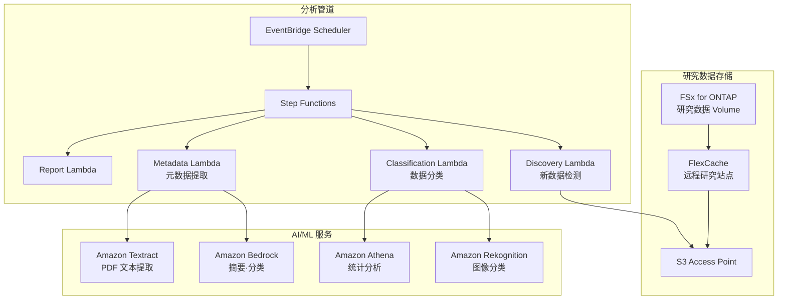

# Life Sciences Research — 研究数据分析模式

🌐 **Language / 言語**: [日本語](README.md) | [English](README.en.md) | [한국어](README.ko.md) | 简体中文 | [繁體中文](README.zh-TW.md) | [Français](README.fr.md) | [Deutsch](README.de.md) | [Español](README.es.md)

## 概述

一种通过 S3 Access Points 对生命科学研究机构文件服务器（FSx for ONTAP）上的研究数据（图像、测序结果、论文 PDF）进行无服务器分析的模式。使用 FlexCache 加速研究站点之间的数据访问。

## 解决的问题

| 问题 | 本模式的解决方案 |
|------|-------------------|
| 研究站点之间的数据共享延迟 | 使用 FlexCache 进行站点间缓存 |
| 大量研究图像的手动分类 | 使用 S3 AP + Rekognition 自动分类 |
| 论文 PDF 的元数据管理 | 使用 S3 AP + Textract + Bedrock 自动提取 |
| 测序数据的质量检查 | 使用 Lambda + Athena 自动 QC |
| 合规性（数据保留） | 审计日志 + 自动报告 |

## 架构



## 目标数据

| 数据类型 | 扩展名 | 处理内容 | FlexCache 适用 |
|-----------|--------|---------|:---:|
| 显微镜图像 | .tiff, .nd2, .czi | 图像分类、质量检查 | ✅ |
| 测序结果 | .fastq, .bam, .vcf | QC、变异检出汇总 | ✅ |
| 论文 PDF | .pdf | 文本提取、摘要、引用分析 | ✅ |
| 实验日志 | .csv, .xlsx | 统计分析、异常检测 | ⚠️ 更新频率高 |
| 协议 | .docx, .md | 元数据提取 | ✅ |

## 与现有用例的关联

| 相关 UC | 关联点 |
|---------|------------|
| [healthcare-dicom/](../healthcare-dicom/) | 共享医学影像处理模式 |
| [genomics-pipeline/](../genomics-pipeline/) | 共享测序数据处理模式 |
| [education-research/](../education-research/) | 共享论文 PDF 分类模式 |
| [genai-rag-enterprise-files/](../genai-rag-enterprise-files/) | 共享 RAG 管道 |

## FlexCache 的作用

- 将总部的研究数据缓存到各站点的 FlexCache
- 减少大容量图像数据的 WAN 传输
- 将数据放置在 AI 处理环境附近
- 通过 S3 AP 提供给无服务器分析

## 目录结构

```
life-sciences-research/
├── README.md
├── template.yaml
├── functions/
│   ├── discovery/handler.py
│   ├── classification/handler.py
│   ├── metadata_extraction/handler.py
│   └── report/handler.py
├── tests/
├── events/
│   └── sample-input.json
└── docs/
    ├── architecture.md
    ├── demo-guide.md
    └── poc-checklist.md
```

## 相关链接

- [FlexCache AnyCast / DR](../flexcache-anycast-dr/README.md)
- [行业·工作负载映射](../docs/industry-workload-mapping.md)
- [支持矩阵](../docs/support-matrix-fsx-ontap-flexcache-s3ap.md)


## Success Metrics

### Outcome
通过研究数据（图像·测序·论文）的自动分类·元数据提取，促进研究数据的利用。

### Metrics
| 指标 | 目标值（示例） |
|-----------|------------|
| 每次执行的分类处理文件数 | > 100 files |
| 分类精度 | > 85% |
| 元数据提取成功率 | > 90% |
| 每个文件的处理时间 | < 30 秒 |
| Human Review 对象率 | < 20%（分类不确定的数据） |

### Measurement Method
Step Functions 执行历史、分类结果元数据、CloudWatch Metrics。


---

## AWS 文档链接

| 服务 | 文档 |
|---------|------------|
| FSx for ONTAP | [用户指南](https://docs.aws.amazon.com/fsx/latest/ONTAPGuide/what-is-fsx-ontap.html) |
| S3 Access Points for FSx for ONTAP | [S3 AP 指南](https://docs.aws.amazon.com/fsx/latest/ONTAPGuide/s3-access-points.html) |
| AWS HealthOmics | [用户指南](https://docs.aws.amazon.com/omics/latest/dev/what-is-service.html) |
| Amazon Rekognition | [开发者指南](https://docs.aws.amazon.com/rekognition/latest/dg/what-is.html) |
| Amazon Comprehend | [开发者指南](https://docs.aws.amazon.com/comprehend/latest/dg/what-is.html) |
| Amazon Bedrock | [用户指南](https://docs.aws.amazon.com/bedrock/latest/userguide/what-is-bedrock.html) |
| Step Functions | [开发者指南](https://docs.aws.amazon.com/step-functions/latest/dg/welcome.html) |

### Well-Architected Framework 对应

| 支柱 | 对应 |
|----|------|
| 卓越运营 | 结构化日志、CloudWatch Metrics、分类结果跟踪 |
| 安全性 | IAM 最小权限、KMS 加密、研究数据保护 |
| 可靠性 | Step Functions Retry/Catch、Map state 并行处理 |
| 性能效率 | Lambda ARM64、按文件类型优化处理 |
| 成本优化 | 无服务器、按需执行 |
| 可持续性 | 建议归档不必要的数据、生命周期管理 |

### 相关 AWS 解决方案

- [AWS for Health & Life Sciences](https://aws.amazon.com/health/)
- [AWS HealthOmics](https://aws.amazon.com/omics/)
- [Genomics Workflows on AWS](https://aws.amazon.com/solutions/implementations/genomics-secondary-analysis-using-aws-step-functions-and-aws-batch/)


---

## 成本估算（每月概算）

> **注记**: 以下为 ap-northeast-1 区域的概算，实际成本因使用量而异。请使用 [AWS Pricing Calculator](https://calculator.aws/) 确认最新价格。

### 无服务器组件（按量计费）

| 服务 | 单价 | 预估使用量 | 每月概算 |
|---------|------|-----------|---------|
| Lambda | $0.0000166667/GB-sec | 4 函数 × 30 files/天 | ~$1-5 |
| S3 API (GetObject/ListObjects) | $0.0047/10K requests | ~10K requests/天 | ~$1.5 |
| Step Functions | $0.025/1K state transitions | ~1K transitions/天 | ~$0.75 |
| Bedrock (Nova Lite) | $0.00006/1K input tokens | ~20K tokens/执行 | ~$3-10 |
| Athena | $5/TB scanned | N/A | ~$0.5-2 |
| SNS | $0.50/100K notifications | ~100 notifications/天 | ~$0.15 |
| CloudWatch Logs | $0.76/GB ingested | ~1 GB/月 | ~$0.76 |

### 固定成本（FSx for ONTAP — 假设已有环境）

| 组件 | 每月 |
|--------------|------|
| FSx for ONTAP (128 MBps, 1 TB) | ~$230 (共享已有环境) |
| S3 Access Point | 无额外费用（仅 S3 API 费用） |

### 合计概算

| 配置 | 每月概算 |
|------|---------|
| 最小配置（每日 1 次执行） | ~$5-15 |
| 标准配置（每小时执行） | ~$15-50 |
| 大规模配置（高频率 + 告警） | ~$50-150 |

> **Governance Caveat**: 成本估算为概算，并非保证值。实际账单因使用模式、数据量和区域而异。

---

## 本地测试

### Prerequisites 检查

```bash
# 确认前提条件
aws --version          # AWS CLI v2
sam --version          # SAM CLI
python3 --version      # Python 3.9+
docker --version       # Docker (sam local 用)
aws sts get-caller-identity  # AWS 凭证
```

### sam local invoke

```bash
# 构建
# 前提: 需要 AWS SAM CLI。sam build 会自动打包代码。
sam build

# 本地运行 Discovery Lambda
sam local invoke DiscoveryFunction --event events/discovery-event.json

# 带环境变量覆盖
sam local invoke DiscoveryFunction \
  --event events/discovery-event.json \
  --env-vars env.json
```

### 单元测试

```bash
python3 -m pytest tests/ -v
```

详情请参阅 [本地测试快速入门](../docs/local-testing-quick-start.md)。

---

## 输出示例 (Output Sample)

生命科学研究数据分类管道的输出示例:

```json
{
  "discovery": {
    "status": "completed",
    "object_count": 20,
    "categories": {"microscopy": 8, "sequence": 7, "research_pdf": 5}
  },
  "classification": [
    {
      "key": "research/experiment-001/image-confocal.tiff",
      "data_type": "confocal_microscopy",
      "resolution": "2048x2048",
      "channels": 4,
      "metadata_extracted": true
    },
    {
      "key": "research/experiment-001/reads.fastq.gz",
      "data_type": "rna_seq",
      "read_count": 15000000,
      "quality_score_avg": 35.2
    }
  ],
  "report": {
    "total_classified": 20,
    "categories_found": 3,
    "storage_recommendation": "archive microscopy raw data after 90 days"
  }
}
```

> **注记**: 以上为示例输出，实际值因环境·输入数据而异。基准数值为 sizing reference，而非 service limit。

---

## Performance Considerations

- FSx for ONTAP 的吞吐容量由 NFS/SMB/S3AP 共享
- 通过 S3 Access Point 的延迟会产生数十毫秒的开销
- 处理大量文件时，请使用 Step Functions Map state 的 MaxConcurrency 控制并行度
- 增加 Lambda 内存大小也有助于提升网络带宽

> **注记**: 本模式的性能数值为 sizing reference，而非 service limit。实际环境中的性能因 FSx for ONTAP 吞吐容量、网络配置和并发工作负载而异。

---

## 行业参考案例 / Industry Reference Cases

> **Evidence Tier**: Public（来自官方博客 / 大会会议）

### AstraZeneca: 多智能体系统 (DAIS 2026)

AstraZeneca 构建了一个多智能体系统，使商业团队能够跨治疗领域访问药品数据（结构化 + 非结构化，40 万+ 临床文档）。Supervisor Agent 统筹按治疗领域划分的子智能体，在保持权限边界的同时从 5 → 20+ 智能体扩展。

- **成果**: 智能体 10x 扩展（5 PoC → 20+ 生产，50+ 已设计）
- **架构**: Supervisor Agent + 按治疗领域的子智能体 + 结构化数据查询 + 非结构化文档 RAG + 行/列级安全
- **主要教训**: 权限保持设计、Supervisor 拆分 vs 增加智能体的判断标准、Human-in-the-loop 测试、数据质量的重要性
- **与 FSx for ONTAP 的关联**: 将大量临床文档存储在 NAS 共享 → 通过 S3 AP 由 AI 管道访问 → 提取 ACL 元数据并传播到向量数据库 → 使用按治疗领域的权限过滤器进行检索

本模式（UC7）提供了一种使用 FSx for ONTAP S3 AP + AWS Bedrock 解决同类问题（研究文档的 AI 分析 + 分类）的架构。多智能体扩展可通过 Step Functions 的按治疗领域路由实现。

详细分析: [DAIS 2026 Agent Bricks 案例分析](../docs/investigations/dais2026-agent-bricks-industry-cases.md)

Sources:
- [DAIS 2026 Session: AstraZeneca's Multi-Agent System](https://www.databricks.com/dataaisummit/session/astrazenecas-multi-agent-system-lessons-scaling-agents-10x-agent-bricks)
- [Agent Bricks DAIS 2026 Blog](https://www.databricks.com/blog/agent-bricks-dais-2026)

---

## 部署

使用 AWS SAM CLI 部署（请将占位符替换为您的环境）:

```bash
# 前提: 需要 AWS SAM CLI。sam build 会自动打包代码。
sam build

sam deploy \
  --stack-name fsxn-life-sciences-research \
  --parameter-overrides \
    S3AccessPointAlias=<your-s3ap-alias> \
    S3AccessPointName=<your-s3ap-name> \
    NotificationEmail=<your-email@example.com> \
  --capabilities CAPABILITY_NAMED_IAM \
  --resolve-s3 \
  --region <your-region>
```

> **注意**: `template.yaml` 用于 SAM CLI（`sam build` + `sam deploy`）。
> 如需使用 `aws cloudformation deploy` 命令直接部署，请改用 `template-deploy.yaml`（需要预先打包 Lambda zip 文件并上传到 S3）。

## Governance Note

> 本模式提供技术架构指导。它不构成法律、合规或监管建议。组织应咨询合格的专业人士。
