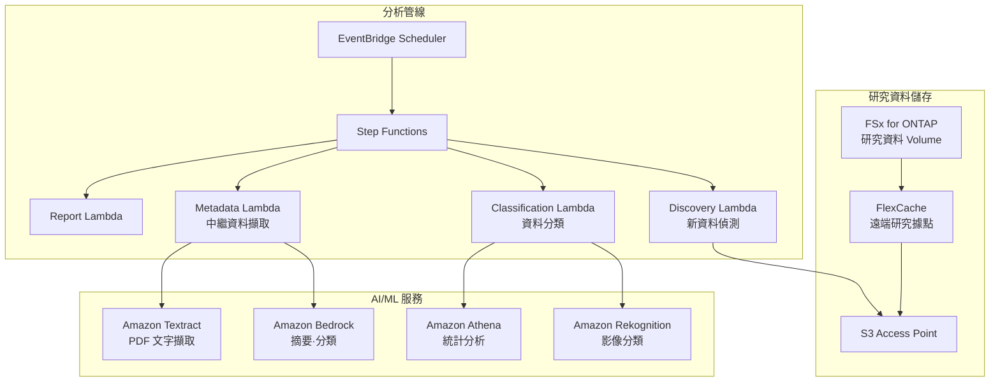

# Life Sciences Research — 研究資料分析模式

🌐 **Language / 言語**: [日本語](README.md) | [English](README.en.md) | [한국어](README.ko.md) | [简体中文](README.zh-CN.md) | 繁體中文 | [Français](README.fr.md) | [Deutsch](README.de.md) | [Español](README.es.md)

## 概述

一種透過 S3 Access Points 對生命科學研究機構檔案伺服器（FSx for ONTAP）上的研究資料（影像、定序結果、論文 PDF）進行無伺服器分析的模式。使用 FlexCache 加速研究據點之間的資料存取。

## 解決的問題

| 問題 | 本模式的解決方案 |
|------|-------------------|
| 研究據點之間的資料共享延遲 | 使用 FlexCache 進行據點間快取 |
| 大量研究影像的手動分類 | 使用 S3 AP + Rekognition 自動分類 |
| 論文 PDF 的中繼資料管理 | 使用 S3 AP + Textract + Bedrock 自動擷取 |
| 定序資料的品質檢查 | 使用 Lambda + Athena 自動 QC |
| 合規性（資料保留） | 稽核日誌 + 自動報告 |

## 架構



## 目標資料

| 資料類型 | 副檔名 | 處理內容 | FlexCache 適用 |
|-----------|--------|---------|:---:|
| 顯微鏡影像 | .tiff, .nd2, .czi | 影像分類、品質檢查 | ✅ |
| 定序結果 | .fastq, .bam, .vcf | QC、變異檢出彙總 | ✅ |
| 論文 PDF | .pdf | 文字擷取、摘要、引用分析 | ✅ |
| 實驗日誌 | .csv, .xlsx | 統計分析、異常偵測 | ⚠️ 更新頻率高 |
| 協定 | .docx, .md | 中繼資料擷取 | ✅ |

## 與現有使用案例的關聯

| 相關 UC | 關聯點 |
|---------|------------|
| [healthcare-dicom/](../healthcare-dicom/) | 共享醫學影像處理模式 |
| [genomics-pipeline/](../genomics-pipeline/) | 共享定序資料處理模式 |
| [education-research/](../education-research/) | 共享論文 PDF 分類模式 |
| [genai-rag-enterprise-files/](../genai-rag-enterprise-files/) | 共享 RAG 管線 |

## FlexCache 的角色

- 將總部的研究資料快取到各據點的 FlexCache
- 減少大容量影像資料的 WAN 傳輸
- 將資料放置在 AI 處理環境附近
- 透過 S3 AP 提供給無伺服器分析

## 目錄結構

```
life-sciences-research/
├── README.md
├── template.yaml
├── functions/
│   ├── discovery/handler.py
│   ├── classification/handler.py
│   ├── metadata_extraction/handler.py
│   └── report/handler.py
├── tests/
├── events/
│   └── sample-input.json
└── docs/
    ├── architecture.md
    ├── demo-guide.md
    └── poc-checklist.md
```

## 相關連結

- [FlexCache AnyCast / DR](../flexcache-anycast-dr/README.md)
- [產業·工作負載對應](../docs/industry-workload-mapping.md)
- [支援矩陣](../docs/support-matrix-fsx-ontap-flexcache-s3ap.md)


## Success Metrics

### Outcome
透過研究資料（影像·定序·論文）的自動分類·中繼資料擷取，促進研究資料的運用。

### Metrics
| 指標 | 目標值（範例） |
|-----------|------------|
| 每次執行的分類處理檔案數 | > 100 files |
| 分類精度 | > 85% |
| 中繼資料擷取成功率 | > 90% |
| 每個檔案的處理時間 | < 30 秒 |
| Human Review 對象率 | < 20%（分類不確定的資料） |

### Measurement Method
Step Functions 執行歷史、分類結果中繼資料、CloudWatch Metrics。


---

## AWS 文件連結

| 服務 | 文件 |
|---------|------------|
| FSx for ONTAP | [使用者指南](https://docs.aws.amazon.com/fsx/latest/ONTAPGuide/what-is-fsx-ontap.html) |
| S3 Access Points for FSx for ONTAP | [S3 AP 指南](https://docs.aws.amazon.com/fsx/latest/ONTAPGuide/s3-access-points.html) |
| AWS HealthOmics | [使用者指南](https://docs.aws.amazon.com/omics/latest/dev/what-is-service.html) |
| Amazon Rekognition | [開發人員指南](https://docs.aws.amazon.com/rekognition/latest/dg/what-is.html) |
| Amazon Comprehend | [開發人員指南](https://docs.aws.amazon.com/comprehend/latest/dg/what-is.html) |
| Amazon Bedrock | [使用者指南](https://docs.aws.amazon.com/bedrock/latest/userguide/what-is-bedrock.html) |
| Step Functions | [開發人員指南](https://docs.aws.amazon.com/step-functions/latest/dg/welcome.html) |

### Well-Architected Framework 對應

| 支柱 | 對應 |
|----|------|
| 卓越營運 | 結構化日誌、CloudWatch Metrics、分類結果追蹤 |
| 安全性 | IAM 最小權限、KMS 加密、研究資料保護 |
| 可靠性 | Step Functions Retry/Catch、Map state 平行處理 |
| 效能效率 | Lambda ARM64、依檔案類型最佳化處理 |
| 成本最佳化 | 無伺服器、隨需執行 |
| 永續性 | 建議封存不必要的資料、生命週期管理 |

### 相關 AWS 解決方案

- [AWS for Health & Life Sciences](https://aws.amazon.com/health/)
- [AWS HealthOmics](https://aws.amazon.com/omics/)
- [Genomics Workflows on AWS](https://aws.amazon.com/solutions/implementations/genomics-secondary-analysis-using-aws-step-functions-and-aws-batch/)


---

## 成本估算（每月概算）

> **註記**: 以下為 ap-northeast-1 區域的概算，實際成本因使用量而異。請使用 [AWS Pricing Calculator](https://calculator.aws/) 確認最新價格。

### 無伺服器元件（按量計費）

| 服務 | 單價 | 預估使用量 | 每月概算 |
|---------|------|-----------|---------|
| Lambda | $0.0000166667/GB-sec | 4 函式 × 30 files/日 | ~$1-5 |
| S3 API (GetObject/ListObjects) | $0.0047/10K requests | ~10K requests/日 | ~$1.5 |
| Step Functions | $0.025/1K state transitions | ~1K transitions/日 | ~$0.75 |
| Bedrock (Nova Lite) | $0.00006/1K input tokens | ~20K tokens/執行 | ~$3-10 |
| Athena | $5/TB scanned | N/A | ~$0.5-2 |
| SNS | $0.50/100K notifications | ~100 notifications/日 | ~$0.15 |
| CloudWatch Logs | $0.76/GB ingested | ~1 GB/月 | ~$0.76 |

### 固定成本（FSx for ONTAP — 假設既有環境）

| 元件 | 每月 |
|--------------|------|
| FSx for ONTAP (128 MBps, 1 TB) | ~$230 (共享既有環境) |
| S3 Access Point | 無額外費用（僅 S3 API 費用） |

### 合計概算

| 組態 | 每月概算 |
|------|---------|
| 最小組態（每日 1 次執行） | ~$5-15 |
| 標準組態（每小時執行） | ~$15-50 |
| 大規模組態（高頻率 + 警報） | ~$50-150 |

> **Governance Caveat**: 成本估算為概算，並非保證值。實際帳單因使用模式、資料量和區域而異。

---

## 本地測試

### Prerequisites 檢查

```bash
# 確認前提條件
aws --version          # AWS CLI v2
sam --version          # SAM CLI
python3 --version      # Python 3.9+
docker --version       # Docker (sam local 用)
aws sts get-caller-identity  # AWS 認證資訊
```

### sam local invoke

```bash
# 建置
# 前提: 需要 AWS SAM CLI。sam build 會自動封裝程式碼。
sam build

# 在本地執行 Discovery Lambda
sam local invoke DiscoveryFunction --event events/discovery-event.json

# 帶環境變數覆寫
sam local invoke DiscoveryFunction \
  --event events/discovery-event.json \
  --env-vars env.json
```

### 單元測試

```bash
python3 -m pytest tests/ -v
```

詳情請參閱 [本地測試快速入門](../docs/local-testing-quick-start.md)。

---

## 輸出範例 (Output Sample)

生命科學研究資料分類管線的輸出範例:

```json
{
  "discovery": {
    "status": "completed",
    "object_count": 20,
    "categories": {"microscopy": 8, "sequence": 7, "research_pdf": 5}
  },
  "classification": [
    {
      "key": "research/experiment-001/image-confocal.tiff",
      "data_type": "confocal_microscopy",
      "resolution": "2048x2048",
      "channels": 4,
      "metadata_extracted": true
    },
    {
      "key": "research/experiment-001/reads.fastq.gz",
      "data_type": "rna_seq",
      "read_count": 15000000,
      "quality_score_avg": 35.2
    }
  ],
  "report": {
    "total_classified": 20,
    "categories_found": 3,
    "storage_recommendation": "archive microscopy raw data after 90 days"
  }
}
```

> **註記**: 以上為範例輸出，實際值因環境·輸入資料而異。基準數值為 sizing reference，而非 service limit。

---

## Performance Considerations

- FSx for ONTAP 的輸送量容量由 NFS/SMB/S3AP 共享
- 透過 S3 Access Point 的延遲會產生數十毫秒的額外負擔
- 處理大量檔案時，請使用 Step Functions Map state 的 MaxConcurrency 控制平行度
- 增加 Lambda 記憶體大小也有助於提升網路頻寬

> **註記**: 本模式的效能數值為 sizing reference，而非 service limit。實際環境中的效能因 FSx for ONTAP 輸送量容量、網路組態和並行工作負載而異。

---

## 產業參考案例 / Industry Reference Cases

> **Evidence Tier**: Public（來自官方部落格 / 研討會議程）

### AstraZeneca: 多代理系統 (DAIS 2026)

AstraZeneca 建置了一個多代理系統，讓商業團隊能夠跨治療領域存取藥品資料（結構化 + 非結構化，40 萬+ 臨床文件）。Supervisor Agent 統籌依治療領域劃分的子代理，在保持權限邊界的同時從 5 → 20+ 代理擴展。

- **成果**: 代理 10x 擴展（5 PoC → 20+ 生產，50+ 已設計）
- **架構**: Supervisor Agent + 依治療領域的子代理 + 結構化資料查詢 + 非結構化文件 RAG + 列/欄層級安全
- **主要教訓**: 權限保持設計、Supervisor 拆分 vs 新增代理的判斷標準、Human-in-the-loop 測試、資料品質的重要性
- **與 FSx for ONTAP 的關聯**: 將大量臨床文件儲存在 NAS 共享 → 透過 S3 AP 由 AI 管線存取 → 擷取 ACL 中繼資料並傳播到向量資料庫 → 使用依治療領域的權限篩選器進行檢索

本模式（UC7）提供了一種使用 FSx for ONTAP S3 AP + AWS Bedrock 解決同類問題（研究文件的 AI 分析 + 分類）的架構。多代理擴展可透過 Step Functions 的依治療領域路由實現。

詳細分析: [DAIS 2026 Agent Bricks 案例分析](../docs/investigations/dais2026-agent-bricks-industry-cases.md)

Sources:
- [DAIS 2026 Session: AstraZeneca's Multi-Agent System](https://www.databricks.com/dataaisummit/session/astrazenecas-multi-agent-system-lessons-scaling-agents-10x-agent-bricks)
- [Agent Bricks DAIS 2026 Blog](https://www.databricks.com/blog/agent-bricks-dais-2026)

---

## 部署

使用 AWS SAM CLI 部署（請將預留位置替換為您的環境）:

```bash
# 前提: 需要 AWS SAM CLI。sam build 會自動封裝程式碼。
sam build

sam deploy \
  --stack-name fsxn-life-sciences-research \
  --parameter-overrides \
    S3AccessPointAlias=<your-s3ap-alias> \
    S3AccessPointName=<your-s3ap-name> \
    NotificationEmail=<your-email@example.com> \
  --capabilities CAPABILITY_NAMED_IAM \
  --resolve-s3 \
  --region <your-region>
```

> **注意**: `template.yaml` 用於 SAM CLI（`sam build` + `sam deploy`）。
> 如需使用 `aws cloudformation deploy` 命令直接部署，請改用 `template-deploy.yaml`（需要預先封裝 Lambda zip 檔案並上傳到 S3）。

## Governance Note

> 本模式提供技術架構指導。它不構成法律、合規或監管建議。組織應諮詢合格的專業人士。
