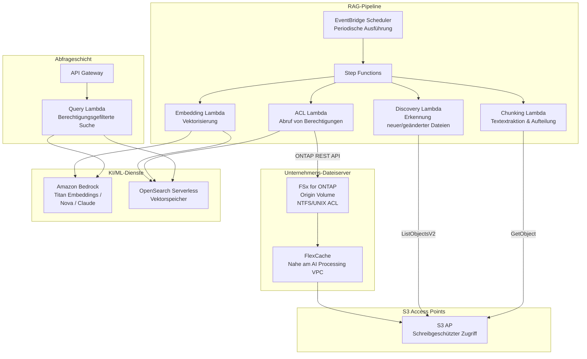

# GenAI RAG over Enterprise Files

🌐 **Language / 言語**: [日本語](README.md) | [English](README.en.md) | [한국어](README.ko.md) | [简体中文](README.zh-CN.md) | [繁體中文](README.zh-TW.md) | [Français](README.fr.md) | [Deutsch](README.de.md) | [Español](README.es.md)

## Überblick

Ein Muster, das vertrauliche Dokumente auf einem Unternehmens-Dateiserver (FSx for ONTAP) über S3 Access Points sicher an Amazon Bedrock / RAG-Pipelines bereitstellt, **ohne sie nach S3 zu kopieren**. Es realisiert berechtigungsbasiertes RAG (Permission-aware RAG) unter Beibehaltung der Dateiberechtigungen (ACL/NTFS).

## Gelöste Herausforderungen

| Herausforderung | Lösung mit diesem Muster |
|------|-------------------|
| Datenstreuung durch Kopieren vertraulicher Dateien nach S3 | Direktes Lesen über S3 AP, kein Kopieren nötig |
| Verlust der Dateiberechtigungen | ACLs über die ONTAP REST API abrufen und bei der RAG-Antwort filtern |
| Probleme mit der Datenaktualität | FlexCache + S3 AP stellen die aktuellsten Daten bereit |
| Vollständige Verarbeitung großer Dateiserver | EventBridge Scheduler + Delta-Erkennung zur Effizienzsteigerung |
| Distanz zwischen KI-Verarbeitungsumgebung und Daten | FlexCache platziert Daten nahe am KI-Verarbeitungs-VPC |

## Architektur



## Konzept des Permission-aware RAG

1. **Zur Indexierungszeit**: ACL-/Berechtigungsinformationen jedes Dokuments über die ONTAP REST API abrufen und als Metadaten im Vektorspeicher ablegen
2. **Zur Abfragezeit**: Basierend auf dem AD-SID / der Gruppenzugehörigkeit des Benutzers den Suchbereich auf nur die für den Benutzer zugänglichen Dokumente filtern
3. **Zur Antwortzeit**: Nur die gefilterten Dokumente an Bedrock zur Antwortgenerierung übergeben

```
Benutzerabfrage → Berechtigungsfilter → Vektorsuche → Bedrock-Antwortgenerierung
                    ↓
            Nur Dokumente suchen, die über den
            AD-SID des Benutzers zugänglich sind
```

## Rolle von FlexCache

- Daten nahe der KI-Verarbeitungsumgebung (Lambda VPC) platzieren
- Massenlesevorgänge während der Embedding-Verarbeitung beschleunigen
- WAN-Übertragungen zum Origin reduzieren
- Über S3 AP für serverlose Verarbeitung bereitstellen

## Bezug zu bestehenden Use Cases

| Zugehöriger UC | Verbindungspunkt |
|---------|------------|
| [legal-compliance/](../legal-compliance/) | Gemeinsames ACL-Abrufmuster |
| [financial-idp/](../financial-idp/) | Gemeinsame Dokumentenverarbeitungs-Pipeline |
| [healthcare-dicom/](../healthcare-dicom/) | Berechtigungsbasierte Zugriffssteuerung |
| [FlexCache AnyCast/DR](../flexcache-anycast-dr/) | FlexCache-Platzierungsmuster |

## Verzeichnisstruktur

```
genai-rag-enterprise-files/
├── README.md
├── template.yaml
├── functions/
│   ├── discovery/handler.py
│   ├── chunking/handler.py
│   ├── embedding/handler.py
│   ├── acl_extraction/handler.py
│   └── query/handler.py
├── tests/
│   └── test_handlers.py
├── events/
│   └── sample-input.json
└── docs/
    ├── architecture.md
    ├── demo-guide.md
    ├── poc-checklist.md
    └── use-case-mapping.md
```

## Sicherheitsdesign

- **Keine Datenbewegung**: Dateien verbleiben auf FSx for ONTAP, schreibgeschützt über S3 AP
- **Berechtigungserhalt**: ACLs über die ONTAP REST API abrufen und bei der RAG-Antwort filtern
- **Verschlüsselung**: SSE-FSX (Speicher), TLS (während der Übertragung), KMS (Ausgabe)
- **Geringste Rechte**: Lambda erhält nur die notwendigen S3-AP-Operationen
- **Audit**: CloudTrail + ONTAP-Audit-Protokolle

## Zielbranchen

- Finanzwesen (Verträge, regulatorische Dokumente)
- Recht (Rechtsprechung, Verträge, Compliance-Dokumente)
- Gesundheitswesen (Forschungsarbeiten, klinische Daten)
- Fertigung (Konstruktionsdokumente, Qualitätsmanagement-Dokumente)
- Behörden (amtliche Dokumente, politische Dokumente)

## Zugehörige Links

- [Dynamic FlexCache Render Workflow](../dynamic-flexcache-render-workflow/README.md)
- [FlexCache AnyCast / DR](../flexcache-anycast-dr/README.md)
- [Branchen- und Workload-Zuordnung](../docs/industry-workload-mapping.md)


## Success Metrics

### Outcome
Unternehmensdateien ohne Datenkopie mit KI/ML verbinden – durch berechtigungsbasierte RAG-Vorverarbeitung.

### Metrics
| Metrik | Zielwert (Beispiel) |
|-----------|------------|
| Pro Ausführung gechunkte Dateien | > 200 files |
| Erfolgsrate der ACL-Extraktion | > 95% |
| Embedding-Generierungszeit | < 5 Min. / 100 files |
| Genauigkeit der Permission-aware-Filterung | > 99% |
| Human-Review-Anteil | < 10% (Chunks mit geringer Konfidenz) |

### Measurement Method
Step-Functions-Ausführungsverlauf, Bedrock-Embedding-Antworten, ACL-Extraktionsprotokolle, CloudWatch Metrics.


---

## AWS-Dokumentationslinks

| Dienst | Dokumentation |
|---------|------------|
| FSx for ONTAP | [Benutzerhandbuch](https://docs.aws.amazon.com/fsx/latest/ONTAPGuide/what-is-fsx-ontap.html) |
| S3 Access Points for FSx for ONTAP | [S3-AP-Leitfaden](https://docs.aws.amazon.com/fsx/latest/ONTAPGuide/s3-access-points.html) |
| Amazon Bedrock | [Benutzerhandbuch](https://docs.aws.amazon.com/bedrock/latest/userguide/what-is-bedrock.html) |
| Amazon Bedrock Knowledge Bases | [Wissensdatenbanken](https://docs.aws.amazon.com/bedrock/latest/userguide/knowledge-base.html) |
| Amazon OpenSearch Serverless | [Entwicklerhandbuch](https://docs.aws.amazon.com/opensearch-service/latest/developerguide/serverless.html) |
| Amazon Titan Embeddings | [Titan-Modelle](https://docs.aws.amazon.com/bedrock/latest/userguide/titan-embedding-models.html) |
| Step Functions | [Entwicklerhandbuch](https://docs.aws.amazon.com/step-functions/latest/dg/welcome.html) |

### Ausrichtung am Well-Architected Framework

| Säule | Ausrichtung |
|----|------|
| Operative Exzellenz | Strukturierte Protokolle, CloudWatch Metrics, Verfolgung des Embedding-Fortschritts |
| Sicherheit | Permission-aware-Filterung, IAM-Least-Privilege, KMS-Verschlüsselung |
| Zuverlässigkeit | Step Functions Retry/Catch, Wiederholung pro Chunk |
| Leistungseffizienz | Batch-Embedding, paralleles Chunking, Lambda-Speicheroptimierung |
| Kostenoptimierung | Serverless, differenzielles Embedding (nur geänderte Dateien neu verarbeiten) |
| Nachhaltigkeit | On-Demand-Ausführung, automatische OCU-Skalierung von OpenSearch Serverless |

### Zugehörige AWS-Blogs & Beispiele

- [RAG with Amazon Bedrock](https://aws.amazon.com/blogs/machine-learning/question-answering-using-retrieval-augmented-generation-with-foundation-models-in-amazon-sagemaker-jumpstart/)
- [aws-samples/amazon-bedrock-rag-workshop](https://github.com/aws-samples/amazon-bedrock-rag-workshop)


---

## Kostenschätzung (monatliche Näherung)

> **Hinweis**: Die folgenden Werte sind Näherungen für die Region ap-northeast-1; die tatsächlichen Kosten variieren je nach Nutzung. Prüfen Sie die aktuellen Preise mit dem [AWS Pricing Calculator](https://calculator.aws/).

### Serverlose Komponenten (nutzungsbasierte Abrechnung)

| Dienst | Einzelpreis | Angenommene Nutzung | Monatliche Näherung |
|---------|------|-----------|---------|
| Lambda | $0.0000166667/GB-sec | 5 Funktionen × 50 docs/Tag | ~$1-5 |
| S3 API (GetObject/ListObjects) | $0.0047/10K requests | ~10K requests/Tag | ~$1.5 |
| Step Functions | $0.025/1K state transitions | ~1K transitions/Tag | ~$0.75 |
| Bedrock (Nova Lite) | $0.00006/1K input tokens | ~200K tokens/Ausführung (embedding + query) | ~$3-10 |
| Athena | $5/TB scanned | N/A | ~$0.5-2 |
| SNS | $0.50/100K notifications | ~100 notifications/Tag | ~$0.15 |
| CloudWatch Logs | $0.76/GB ingested | ~1 GB/Monat | ~$0.76 |
| OpenSearch Serverless | $0.24/OCU-hour |


### Fixkosten (FSx for ONTAP — bestehende Umgebung vorausgesetzt)

| Komponente | Monatlich |
|--------------|------|
| FSx for ONTAP (128 MBps, 1 TB) | ~$230 (gemeinsam mit bestehender Umgebung genutzt) |
| S3 Access Point | Keine Zusatzkosten (nur S3-API-Gebühren) |

### Gesamtnäherung

| Konfiguration | Monatliche Näherung |
|------|---------|
| Minimalkonfiguration (einmal täglich) | ~$5-15 |
| Standardkonfiguration (stündlich) | ~$15-50 |
| Großkonfiguration (hohe Frequenz + Alarme) | ~$50-150 |

> **Governance Caveat**: Kostenschätzungen sind Näherungen und keine garantierten Werte. Der tatsächliche Rechnungsbetrag variiert je nach Nutzungsmuster, Datenvolumen und Region.

---

## Lokale Tests

### Prüfung der Voraussetzungen

```bash
# Voraussetzungen prüfen
aws --version          # AWS CLI v2
sam --version          # SAM CLI
python3 --version      # Python 3.9+
docker --version       # Docker (für sam local)
aws sts get-caller-identity  # AWS-Anmeldeinformationen
```

### sam local invoke

```bash
# Build
# Voraussetzung: AWS SAM CLI ist erforderlich. „sam build" packt Code und Shared Layer automatisch.
sam build

# Lokale Ausführung der Discovery Lambda
sam local invoke DiscoveryFunction --event events/discovery-event.json

# Mit Überschreibung von Umgebungsvariablen
sam local invoke DiscoveryFunction \
  --event events/discovery-event.json \
  --env-vars env.json
```

### Unit-Tests

```bash
python3 -m pytest tests/ -v
```

Weitere Einzelheiten finden Sie im [Schnellstart für lokale Tests](../docs/local-testing-quick-start.md).

---

## Ausgabebeispiel (Output Sample)

Beispielausgabe der Permission-aware-RAG-Pipeline:

```json
{
  "embedding_pipeline": {
    "files_processed": 50,
    "chunks_generated": 320,
    "embeddings_stored": 320,
    "vector_db": "opensearch_serverless"
  },
  "query_result": {
    "query": "Erzählen Sie mir vom Budgetplan für das Geschäftsjahr 2026",
    "user_id": "user-001",
    "permitted_files": 35,
    "filtered_files": 15,
    "relevant_chunks": 5,
    "answer": "Im Budgetplan für das Geschäftsjahr 2026 steigen die IT-Investitionen um 15 % gegenüber dem Vorjahr...",
    "sources": [
      {"file": "budget/2026-plan.pdf", "chunk_id": 12, "score": 0.94},
      {"file": "budget/2026-summary.docx", "chunk_id": 3, "score": 0.89}
    ],
    "confidence": 0.91
  }
}
```

> **Hinweis**: Das Obige ist eine Beispielausgabe; die tatsächlichen Werte variieren je nach Umgebung und Eingabedaten. Benchmark-Zahlen sind ein sizing reference, kein service limit.

---

## Performance Considerations

- Die Durchsatzkapazität von FSx for ONTAP wird von NFS/SMB/S3AP gemeinsam genutzt
- Der Zugriff über einen S3 Access Point verursacht einen Latenz-Overhead von einigen zehn Millisekunden
- Steuern Sie bei der Verarbeitung großer Dateimengen den Parallelitätsgrad über die MaxConcurrency des Step-Functions-Map-States
- Eine Erhöhung der Lambda-Speichergröße verbessert auch die Netzwerkbandbreite

> **Hinweis**: Die Leistungszahlen dieses Musters sind ein sizing reference, kein service limit. Die Leistung in der realen Umgebung variiert je nach Durchsatzkapazität von FSx for ONTAP, Netzwerkkonfiguration und gleichzeitig laufenden Workloads.

---

## Bereitstellung

Mit der AWS SAM CLI bereitstellen (ersetzen Sie die Platzhalter für Ihre Umgebung):

```bash
# Voraussetzung: AWS SAM CLI ist erforderlich. „sam build" packt Code und Shared Layer automatisch.
sam build

sam deploy \
  --stack-name fsxn-rag-enterprise-files \
  --parameter-overrides \
    S3AccessPointAlias=<your-s3ap-alias> \
    S3AccessPointName=<your-s3ap-name> \
    NotificationEmail=<your-email@example.com> \
  --capabilities CAPABILITY_NAMED_IAM \
  --resolve-s3 \
  --region <your-region>
```

> **Achtung**: `template.yaml` wird mit der SAM CLI (`sam build` + `sam deploy`) verwendet.
> Für eine direkte Bereitstellung mit dem Befehl `aws cloudformation deploy` verwenden Sie stattdessen `template-deploy.yaml` (erfordert das vorherige Packen der Lambda-Zip-Dateien und deren Upload nach S3).

> **Zur Extraktion von ACLs auf Dateiebene**: Standardmäßig läuft die ACL-Extraktion im Simulationsmodus (kein ONTAP erforderlich). Um echte ACLs abzurufen, geben Sie `OntapManagementIp` / `OntapSecretName` an. Beachten Sie jedoch, dass dieses Template kein `VpcConfig` enthält; um ein privates ONTAP-Management-LIF zu erreichen, ist daher eine zusätzliche Netzwerkkonfiguration erforderlich.

## Governance Note

> Dieses Muster bietet technische Architekturhinweise. Es stellt keine rechtliche, Compliance- oder regulatorische Beratung dar. Organisationen sollten qualifizierte Fachleute konsultieren.
