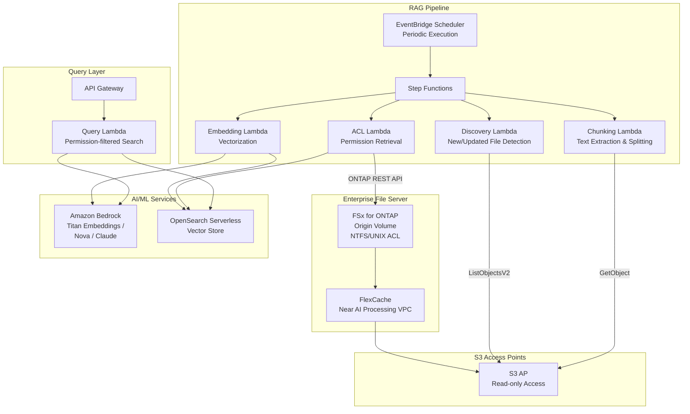

# GenAI RAG over Enterprise Files

🌐 **Language / 言語**: [日本語](README.md) | [English](README.en.md) | [한국어](README.ko.md) | [简体中文](README.zh-CN.md) | [繁體中文](README.zh-TW.md) | [Français](README.fr.md) | [Deutsch](README.de.md) | [Español](README.es.md)

## Overview

A pattern that securely provides confidential documents on enterprise file servers (FSx for ONTAP) to Amazon Bedrock / RAG pipelines via S3 Access Points **without copying to S3**. Achieves Permission-aware RAG while maintaining file permissions (ACL/NTFS).

## Problems Solved

| Problem | Solution |
|---------|----------|
| Data sprawl from copying sensitive files to S3 | Direct read via S3 AP, no copy needed |
| Loss of file permissions | Retrieve ACLs via ONTAP REST API, filter at RAG response time |
| Data freshness issues | FlexCache + S3 AP provides latest data |
| Full-volume processing of large file servers | EventBridge Scheduler + delta detection for efficiency |
| Distance between AI processing and data | FlexCache places data near AI processing VPC |

## Architecture



## Permission-aware RAG Concept

1. **At index time**: Retrieve ACL/permission info for each document via ONTAP REST API and store as metadata in the vector store
2. **At query time**: Filter search scope to only documents accessible by the user based on their AD SID / group membership
3. **At response time**: Pass only filtered documents to Bedrock for answer generation

```
User Query → Permission Filter → Vector Search → Bedrock Answer Generation
                    ↓
            Filter to documents
            accessible by user's AD SID
```

## Role of FlexCache

- Place data near AI processing environment (Lambda VPC)
- Accelerate bulk reads during embedding processing
- Reduce WAN transfers to origin
- Serve serverless processing via S3 AP

## Related Use Cases

| Related UC | Connection |
|-----------|-----------|
| [legal-compliance/](../legal-compliance/) | Shared ACL retrieval pattern |
| [financial-idp/](../financial-idp/) | Shared document processing pipeline |
| [healthcare-dicom/](../healthcare-dicom/) | Permission-based access control |
| [FlexCache AnyCast/DR](../flexcache-anycast-dr/) | FlexCache placement patterns |

## Security Design

- **No data movement**: Files remain on FSx for ONTAP, read-only via S3 AP
- **Permission preservation**: ACLs retrieved via ONTAP REST API, filtered at RAG response
- **Encryption**: SSE-FSX (storage), TLS (in-transit), KMS (output)
- **Least privilege**: Lambda permitted only necessary S3 AP operations
- **Audit**: CloudTrail + ONTAP audit logs

## Target Industries

- Finance (contracts, regulatory documents)
- Legal (case law, contracts, compliance documents)
- Healthcare (research papers, clinical data)
- Manufacturing (design documents, quality management)
- Government (official documents, policy documents)

## Deployment

Deploy with the AWS SAM CLI (replace the placeholders for your environment):

```bash
# Prerequisite: AWS SAM CLI required. 'sam build' packages the code and shared layer automatically.
sam build

sam deploy \
  --stack-name fsxn-rag-enterprise-files \
  --parameter-overrides \
    S3AccessPointAlias=<your-s3ap-alias> \
    S3AccessPointName=<your-s3ap-name> \
    NotificationEmail=<your-email@example.com> \
  --capabilities CAPABILITY_NAMED_IAM \
  --resolve-s3 \
  --region <your-region>
```

> **Note**: `template.yaml` is designed for use with SAM CLI (`sam build` + `sam deploy`).
> To deploy with raw `aws cloudformation deploy`, use `template-deploy.yaml` instead (requires pre-packaging Lambda zip files and uploading them to an S3 bucket).

> **About file-level ACL extraction**: by default, ACL extraction runs in simulation mode (no ONTAP required). To extract real ACLs, set `OntapManagementIp` / `OntapSecretName`. Note that this template does not include a `VpcConfig`, so reaching a private ONTAP management LIF requires additional network configuration.

## Success Metrics

| Metric | Target |
|--------|--------|
| Files chunked per execution | > 200 files |
| ACL extraction success rate | > 95% |
| Embedding generation time | < 5 min / 100 files |
| Permission-aware filtering accuracy | > 99% |
| Human Review rate | < 10% (low-confidence chunks) |
