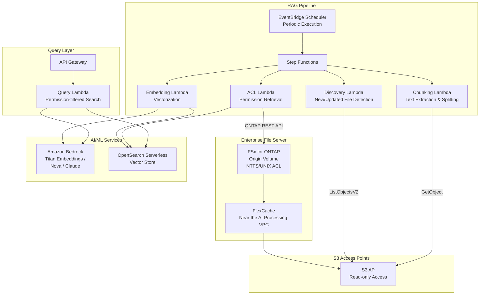

# GenAI RAG over Enterprise Files

🌐 **Language / 言語**: [日本語](README.md) | [English](README.en.md) | [한국어](README.ko.md) | [简体中文](README.zh-CN.md) | [繁體中文](README.zh-TW.md) | [Français](README.fr.md) | [Deutsch](README.de.md) | [Español](README.es.md)

## Overview

A pattern that securely serves confidential documents on an enterprise file server (FSx for ONTAP) to Amazon Bedrock / RAG pipelines via S3 Access Points **without copying them to S3**. It achieves Permission-aware RAG while preserving file permissions (ACL/NTFS).

## Problems Solved

| Problem | Solution with this pattern |
|------|-------------------|
| Data sprawl caused by copying confidential files to S3 | Direct read via S3 AP, no copy required |
| Loss of file permissions | Retrieve ACLs via ONTAP REST API and filter at RAG response time |
| Data freshness issues | FlexCache + S3 AP serve the latest data |
| Full-volume processing of large file servers | EventBridge Scheduler + delta detection for efficiency |
| Distance between AI processing environment and data | FlexCache places data near the AI processing VPC |

## Architecture



## Permission-aware RAG Concept

1. **At index time**: Retrieve each document's ACL/permission info via the ONTAP REST API and store it as metadata in the vector store
2. **At query time**: Based on the user's AD SID / group membership, filter the search scope to only documents the user can access
3. **At response time**: Pass only the filtered documents to Bedrock for answer generation

```
User query → Permission filter → Vector search → Bedrock answer generation
                    ↓
            Search only documents accessible
            by the user's AD SID
```

## Role of FlexCache

- Place data near the AI processing environment (Lambda VPC)
- Accelerate bulk reads during embedding processing
- Reduce WAN transfers to the origin
- Serve serverless processing via S3 AP

## Related Use Cases

| Related UC | Connection |
|---------|------------|
| [legal-compliance/](../legal-compliance/) | Shared ACL retrieval pattern |
| [financial-idp/](../financial-idp/) | Shared document processing pipeline |
| [healthcare-dicom/](../healthcare-dicom/) | Permission-based access control |
| [FlexCache AnyCast/DR](../flexcache-anycast-dr/) | FlexCache placement pattern |

## Directory Structure

```
genai-rag-enterprise-files/
├── README.md
├── template.yaml
├── functions/
│   ├── discovery/handler.py
│   ├── chunking/handler.py
│   ├── embedding/handler.py
│   ├── acl_extraction/handler.py
│   └── query/handler.py
├── tests/
│   └── test_handlers.py
├── events/
│   └── sample-input.json
└── docs/
    ├── architecture.md
    ├── demo-guide.md
    ├── poc-checklist.md
    └── use-case-mapping.md
```

## Security Design

- **No data movement**: Files remain on FSx for ONTAP and are read-only via S3 AP
- **Permission preservation**: Retrieve ACLs via the ONTAP REST API and filter at RAG response time
- **Encryption**: SSE-FSX (storage), TLS (in transit), KMS (output)
- **Least privilege**: Lambda is granted only the necessary S3 AP operations
- **Audit**: CloudTrail + ONTAP audit logs

## Target Industries

- Finance (contracts, regulatory documents)
- Legal (case law, contracts, compliance documents)
- Healthcare (research papers, clinical data)
- Manufacturing (design documents, quality management documents)
- Government (official documents, policy documents)

## Related Links

- [Dynamic FlexCache Render Workflow](../dynamic-flexcache-render-workflow/README.md)
- [FlexCache AnyCast / DR](../flexcache-anycast-dr/README.md)
- [Industry & Workload Mapping](../docs/industry-workload-mapping.md)


## Success Metrics

### Outcome
Connect enterprise files to AI/ML without copying data, using permission-aware RAG preprocessing.

### Metrics
| Metric | Target (example) |
|-----------|------------|
| Files chunked per execution | > 200 files |
| ACL extraction success rate | > 95% |
| Embedding generation time | < 5 min / 100 files |
| Permission-aware filtering accuracy | > 99% |
| Human Review rate | < 10% (low-confidence chunks) |

### Measurement Method
Step Functions execution history, Bedrock Embedding responses, ACL extraction logs, CloudWatch Metrics.


---

## AWS Documentation Links

| Service | Documentation |
|---------|------------|
| FSx for ONTAP | [User Guide](https://docs.aws.amazon.com/fsx/latest/ONTAPGuide/what-is-fsx-ontap.html) |
| S3 Access Points for FSx for ONTAP | [S3 AP Guide](https://docs.aws.amazon.com/fsx/latest/ONTAPGuide/s3-access-points.html) |
| Amazon Bedrock | [User Guide](https://docs.aws.amazon.com/bedrock/latest/userguide/what-is-bedrock.html) |
| Amazon Bedrock Knowledge Bases | [Knowledge Bases](https://docs.aws.amazon.com/bedrock/latest/userguide/knowledge-base.html) |
| Amazon OpenSearch Serverless | [Developer Guide](https://docs.aws.amazon.com/opensearch-service/latest/developerguide/serverless.html) |
| Amazon Titan Embeddings | [Titan Models](https://docs.aws.amazon.com/bedrock/latest/userguide/titan-embedding-models.html) |
| Step Functions | [Developer Guide](https://docs.aws.amazon.com/step-functions/latest/dg/welcome.html) |

### Well-Architected Framework Alignment

| Pillar | Alignment |
|----|------|
| Operational Excellence | Structured logging, CloudWatch Metrics, embedding progress tracking |
| Security | Permission-aware filtering, IAM least privilege, KMS encryption |
| Reliability | Step Functions Retry/Catch, per-chunk retry |
| Performance Efficiency | Batch embedding, parallel chunking, Lambda memory optimization |
| Cost Optimization | Serverless, incremental embedding (reprocess only changed files) |
| Sustainability | On-demand execution, OpenSearch Serverless OCU auto-scaling |

### Related AWS Blogs & Samples

- [RAG with Amazon Bedrock](https://aws.amazon.com/blogs/machine-learning/question-answering-using-retrieval-augmented-generation-with-foundation-models-in-amazon-sagemaker-jumpstart/)
- [aws-samples/amazon-bedrock-rag-workshop](https://github.com/aws-samples/amazon-bedrock-rag-workshop)


---

## Cost Estimate (Monthly Approximation)

> **Note**: The following are approximate estimates for the ap-northeast-1 region; actual costs vary with usage. Check the latest pricing with the [AWS Pricing Calculator](https://calculator.aws/).

### Serverless Components (Usage-based Billing)

| Service | Unit Price | Assumed Usage | Monthly Estimate |
|---------|------|-----------|---------|
| Lambda | $0.0000166667/GB-sec | 5 functions × 50 docs/day | ~$1-5 |
| S3 API (GetObject/ListObjects) | $0.0047/10K requests | ~10K requests/day | ~$1.5 |
| Step Functions | $0.025/1K state transitions | ~1K transitions/day | ~$0.75 |
| Bedrock (Nova Lite) | $0.00006/1K input tokens | ~200K tokens/execution (embedding + query) | ~$3-10 |
| Athena | $5/TB scanned | N/A | ~$0.5-2 |
| SNS | $0.50/100K notifications | ~100 notifications/day | ~$0.15 |
| CloudWatch Logs | $0.76/GB ingested | ~1 GB/month | ~$0.76 |
| OpenSearch Serverless | $0.24/OCU-hour |


### Fixed Costs (FSx for ONTAP — Assumes an Existing Environment)

| Component | Monthly |
|--------------|------|
| FSx for ONTAP (128 MBps, 1 TB) | ~$230 (shared with existing environment) |
| S3 Access Point | No additional charge (S3 API charges only) |

### Total Approximation

| Configuration | Monthly Estimate |
|------|---------|
| Minimal (once daily) | ~$5-15 |
| Standard (hourly) | ~$15-50 |
| Large-scale (high frequency + alarms) | ~$50-150 |

> **Governance Caveat**: Cost estimates are approximate and not guaranteed. Actual charges vary with usage patterns, data volume, and region.

---

## Local Testing

### Prerequisites Check

```bash
# Check prerequisites
aws --version          # AWS CLI v2
sam --version          # SAM CLI
python3 --version      # Python 3.9+
docker --version       # Docker (for sam local)
aws sts get-caller-identity  # AWS credentials
```

### sam local invoke

```bash
# Build
# Prerequisite: AWS SAM CLI is required. 'sam build' packages the code and shared layer automatically.
sam build

# Run the Discovery Lambda locally
sam local invoke DiscoveryFunction --event events/discovery-event.json

# With environment variable overrides
sam local invoke DiscoveryFunction \
  --event events/discovery-event.json \
  --env-vars env.json
```

### Unit Tests

```bash
python3 -m pytest tests/ -v
```

See [Local Testing Quick Start](../docs/local-testing-quick-start.md) for details.

---

## Output Sample

Example output from the Permission-aware RAG pipeline:

```json
{
  "embedding_pipeline": {
    "files_processed": 50,
    "chunks_generated": 320,
    "embeddings_stored": 320,
    "vector_db": "opensearch_serverless"
  },
  "query_result": {
    "query": "Tell me about the FY2026 budget plan",
    "user_id": "user-001",
    "permitted_files": 35,
    "filtered_files": 15,
    "relevant_chunks": 5,
    "answer": "For the FY2026 budget plan, IT investment increases 15% year over year...",
    "sources": [
      {"file": "budget/2026-plan.pdf", "chunk_id": 12, "score": 0.94},
      {"file": "budget/2026-summary.docx", "chunk_id": 3, "score": 0.89}
    ],
    "confidence": 0.91
  }
}
```

> **Note**: The above is sample output; actual values vary with the environment and input data. Benchmark figures are a sizing reference, not a service limit.

---

## Performance Considerations

- The throughput capacity of FSx for ONTAP is shared across NFS/SMB/S3AP
- Access via an S3 Access Point incurs tens of milliseconds of overhead
- For large-scale file processing, control parallelism with the MaxConcurrency of the Step Functions Map state
- Increasing Lambda memory size also improves network bandwidth

> **Note**: The performance figures in this pattern are a sizing reference, not a service limit. Real-world performance varies with FSx for ONTAP throughput capacity, network configuration, and concurrent workloads.

---

## Deployment

Deploy with the AWS SAM CLI (replace the placeholders for your environment):

```bash
# Prerequisite: AWS SAM CLI is required. 'sam build' packages the code and shared layer automatically.
sam build

sam deploy \
  --stack-name fsxn-rag-enterprise-files \
  --parameter-overrides \
    S3AccessPointAlias=<your-s3ap-alias> \
    S3AccessPointName=<your-s3ap-name> \
    NotificationEmail=<your-email@example.com> \
  --capabilities CAPABILITY_NAMED_IAM \
  --resolve-s3 \
  --region <your-region>
```

> **Note**: `template.yaml` is used with the SAM CLI (`sam build` + `sam deploy`).
> To deploy directly with the `aws cloudformation deploy` command, use `template-deploy.yaml` instead (it requires pre-packaging the Lambda zip files and uploading them to S3).

> **About file-level ACL extraction**: By default, ACL extraction runs in simulation mode (no ONTAP required). To retrieve real ACLs, specify `OntapManagementIp` / `OntapSecretName`. Note that this template does not include a `VpcConfig`, so reaching a private ONTAP management LIF requires additional network configuration.

## Governance Note

> This pattern provides technical architecture guidance. It is not legal, compliance, or regulatory advice. Organizations should consult qualified professionals.
