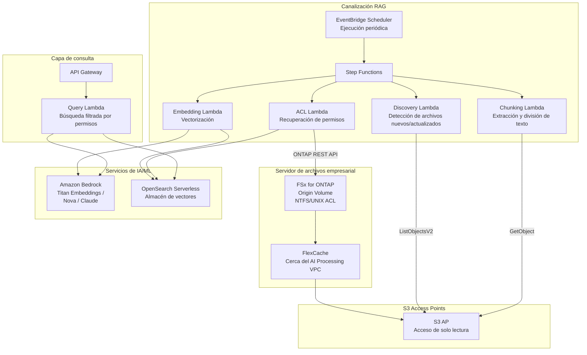

# GenAI RAG over Enterprise Files

🌐 **Language / 言語**: [日本語](README.md) | [English](README.en.md) | [한국어](README.ko.md) | [简体中文](README.zh-CN.md) | [繁體中文](README.zh-TW.md) | [Français](README.fr.md) | [Deutsch](README.de.md) | [Español](README.es.md)

## Resumen

Un patrón que proporciona de forma segura documentos confidenciales de un servidor de archivos empresarial (FSx for ONTAP) a las canalizaciones de Amazon Bedrock / RAG mediante S3 Access Points, **sin copiarlos a S3**. Logra un RAG basado en permisos (Permission-aware RAG) manteniendo los permisos de archivo (ACL/NTFS).

## Problemas que resuelve

| Problema | Solución con este patrón |
|------|-------------------|
| Dispersión de datos por copiar archivos confidenciales a S3 | Lectura directa vía S3 AP, sin necesidad de copia |
| Pérdida de los permisos de archivo | Recuperar las ACL mediante la API REST de ONTAP y filtrar en la respuesta del RAG |
| Problemas de frescura de datos | FlexCache + S3 AP proporcionan los datos más recientes |
| Procesamiento completo de servidores de archivos grandes | EventBridge Scheduler + detección diferencial para mayor eficiencia |
| Distancia entre el entorno de procesamiento de IA y los datos | FlexCache coloca los datos cerca del VPC de procesamiento de IA |

## Arquitectura



## Concepto del Permission-aware RAG

1. **En el momento de la indexación**: Recuperar la información de ACL/permisos de cada documento mediante la API REST de ONTAP y almacenarla como metadatos en el almacén de vectores
2. **En el momento de la consulta**: Según el SID de AD / la pertenencia a grupos del usuario, filtrar el ámbito de búsqueda a solo los documentos accesibles por el usuario
3. **En el momento de la respuesta**: Pasar solo los documentos filtrados a Bedrock para la generación de la respuesta

```
Consulta del usuario → Filtro de permisos → Búsqueda vectorial → Generación de respuesta de Bedrock
                    ↓
            Buscar solo los documentos accesibles
            por el SID de AD del usuario
```

## Rol de FlexCache

- Colocar los datos cerca del entorno de procesamiento de IA (Lambda VPC)
- Acelerar las lecturas masivas durante el procesamiento de embedding
- Reducir las transferencias WAN hacia el origen
- Proporcionar al procesamiento serverless mediante S3 AP

## Relación con los casos de uso existentes

| UC relacionado | Punto de conexión |
|---------|------------|
| [legal-compliance/](../legal-compliance/) | Patrón de recuperación de ACL compartido |
| [financial-idp/](../financial-idp/) | Canalización de procesamiento de documentos compartida |
| [healthcare-dicom/](../healthcare-dicom/) | Control de acceso basado en permisos |
| [FlexCache AnyCast/DR](../flexcache-anycast-dr/) | Patrón de colocación de FlexCache |

## Estructura de directorios

```
genai-rag-enterprise-files/
├── README.md
├── template.yaml
├── functions/
│   ├── discovery/handler.py
│   ├── chunking/handler.py
│   ├── embedding/handler.py
│   ├── acl_extraction/handler.py
│   └── query/handler.py
├── tests/
│   └── test_handlers.py
├── events/
│   └── sample-input.json
└── docs/
    ├── architecture.md
    ├── demo-guide.md
    ├── poc-checklist.md
    └── use-case-mapping.md
```

## Diseño de seguridad

- **Sin movimiento de datos**: Los archivos permanecen en FSx for ONTAP, de solo lectura vía S3 AP
- **Preservación de permisos**: Recuperar las ACL mediante la API REST de ONTAP y filtrar en la respuesta del RAG
- **Cifrado**: SSE-FSX (almacenamiento), TLS (en tránsito), KMS (salida)
- **Privilegio mínimo**: Lambda solo tiene permitidas las operaciones S3 AP necesarias
- **Auditoría**: CloudTrail + registros de auditoría de ONTAP

## Sectores objetivo

- Finanzas (contratos, documentos regulatorios)
- Legal (jurisprudencia, contratos, documentos de cumplimiento)
- Salud (artículos de investigación, datos clínicos)
- Fabricación (documentos de diseño, documentos de gestión de calidad)
- Gobierno (documentos oficiales, documentos de políticas)

## Enlaces relacionados

- [Dynamic FlexCache Render Workflow](../dynamic-flexcache-render-workflow/README.md)
- [FlexCache AnyCast / DR](../flexcache-anycast-dr/README.md)
- [Mapeo de sectores y cargas de trabajo](../docs/industry-workload-mapping.md)


## Success Metrics

### Outcome
Conectar archivos empresariales a la IA/ML sin copiar datos, mediante el preprocesamiento RAG basado en permisos.

### Metrics
| Métrica | Valor objetivo (ejemplo) |
|-----------|------------|
| Archivos procesados por chunking / ejecución | > 200 files |
| Tasa de éxito de extracción de ACL | > 95% |
| Tiempo de generación de embedding | < 5 min / 100 files |
| Precisión del filtrado Permission-aware | > 99% |
| Tasa de Human Review | < 10% (chunks de baja confianza) |

### Measurement Method
Historial de ejecución de Step Functions, respuestas de Bedrock Embedding, registros de extracción de ACL, CloudWatch Metrics.


---

## Enlaces a la documentación de AWS

| Servicio | Documentación |
|---------|------------|
| FSx for ONTAP | [Guía del usuario](https://docs.aws.amazon.com/fsx/latest/ONTAPGuide/what-is-fsx-ontap.html) |
| S3 Access Points for FSx for ONTAP | [Guía de S3 AP](https://docs.aws.amazon.com/fsx/latest/ONTAPGuide/s3-access-points.html) |
| Amazon Bedrock | [Guía del usuario](https://docs.aws.amazon.com/bedrock/latest/userguide/what-is-bedrock.html) |
| Amazon Bedrock Knowledge Bases | [Bases de conocimiento](https://docs.aws.amazon.com/bedrock/latest/userguide/knowledge-base.html) |
| Amazon OpenSearch Serverless | [Guía del desarrollador](https://docs.aws.amazon.com/opensearch-service/latest/developerguide/serverless.html) |
| Amazon Titan Embeddings | [Modelos Titan](https://docs.aws.amazon.com/bedrock/latest/userguide/titan-embedding-models.html) |
| Step Functions | [Guía del desarrollador](https://docs.aws.amazon.com/step-functions/latest/dg/welcome.html) |

### Alineación con el Well-Architected Framework

| Pilar | Alineación |
|----|------|
| Excelencia operativa | Registros estructurados, CloudWatch Metrics, seguimiento del progreso de embedding |
| Seguridad | Filtrado Permission-aware, privilegio mínimo de IAM, cifrado KMS |
| Fiabilidad | Step Functions Retry/Catch, reintento por chunk |
| Eficiencia del rendimiento | Embedding por lotes, chunking paralelo, optimización de memoria de Lambda |
| Optimización de costos | Serverless, embedding diferencial (reprocesar solo los archivos modificados) |
| Sostenibilidad | Ejecución bajo demanda, escalado automático de OCU de OpenSearch Serverless |

### Blogs y ejemplos de AWS relacionados

- [RAG with Amazon Bedrock](https://aws.amazon.com/blogs/machine-learning/question-answering-using-retrieval-augmented-generation-with-foundation-models-in-amazon-sagemaker-jumpstart/)
- [aws-samples/amazon-bedrock-rag-workshop](https://github.com/aws-samples/amazon-bedrock-rag-workshop)


---

## Estimación de costos (aproximación mensual)

> **Nota**: Los siguientes valores son aproximaciones para la región ap-northeast-1; los costos reales varían según el uso. Consulte los precios más recientes con la [AWS Pricing Calculator](https://calculator.aws/).

### Componentes serverless (facturación por uso)

| Servicio | Precio unitario | Uso estimado | Aproximación mensual |
|---------|------|-----------|---------|
| Lambda | $0.0000166667/GB-sec | 5 funciones × 50 docs/día | ~$1-5 |
| S3 API (GetObject/ListObjects) | $0.0047/10K requests | ~10K requests/día | ~$1.5 |
| Step Functions | $0.025/1K state transitions | ~1K transitions/día | ~$0.75 |
| Bedrock (Nova Lite) | $0.00006/1K input tokens | ~200K tokens/ejecución (embedding + query) | ~$3-10 |
| Athena | $5/TB scanned | N/A | ~$0.5-2 |
| SNS | $0.50/100K notifications | ~100 notifications/día | ~$0.15 |
| CloudWatch Logs | $0.76/GB ingested | ~1 GB/mes | ~$0.76 |
| OpenSearch Serverless | $0.24/OCU-hour |


### Costos fijos (FSx for ONTAP — se presupone un entorno existente)

| Componente | Mensual |
|--------------|------|
| FSx for ONTAP (128 MBps, 1 TB) | ~$230 (se comparte el entorno existente) |
| S3 Access Point | Sin cargo adicional (solo cargos de S3 API) |

### Aproximación total

| Configuración | Aproximación mensual |
|------|---------|
| Configuración mínima (una ejecución diaria) | ~$5-15 |
| Configuración estándar (ejecución horaria) | ~$15-50 |
| Configuración a gran escala (alta frecuencia + alarmas) | ~$50-150 |

> **Governance Caveat**: Las estimaciones de costos son aproximadas y no valores garantizados. El importe facturado real varía según los patrones de uso, el volumen de datos y la región.

---

## Pruebas locales

### Comprobación de requisitos previos

```bash
# Verificar los requisitos previos
aws --version          # AWS CLI v2
sam --version          # SAM CLI
python3 --version      # Python 3.9+
docker --version       # Docker (para sam local)
aws sts get-caller-identity  # Credenciales de AWS
```

### sam local invoke

```bash
# Compilación
# Requisito previo: se necesita AWS SAM CLI. «sam build» empaqueta el código y la capa compartida automáticamente.
sam build

# Ejecución local de la Discovery Lambda
sam local invoke DiscoveryFunction --event events/discovery-event.json

# Con anulación de variables de entorno
sam local invoke DiscoveryFunction \
  --event events/discovery-event.json \
  --env-vars env.json
```

### Pruebas unitarias

```bash
python3 -m pytest tests/ -v
```

Para más detalles, consulte el [inicio rápido de pruebas locales](../docs/local-testing-quick-start.md).

---

## Muestra de salida (Output Sample)

Ejemplo de salida de la canalización Permission-aware RAG:

```json
{
  "embedding_pipeline": {
    "files_processed": 50,
    "chunks_generated": 320,
    "embeddings_stored": 320,
    "vector_db": "opensearch_serverless"
  },
  "query_result": {
    "query": "Cuénteme sobre el plan de presupuesto del ejercicio 2026",
    "user_id": "user-001",
    "permitted_files": 35,
    "filtered_files": 15,
    "relevant_chunks": 5,
    "answer": "En el plan de presupuesto del ejercicio 2026, la inversión en TI aumenta un 15 % respecto al año anterior...",
    "sources": [
      {"file": "budget/2026-plan.pdf", "chunk_id": 12, "score": 0.94},
      {"file": "budget/2026-summary.docx", "chunk_id": 3, "score": 0.89}
    ],
    "confidence": 0.91
  }
}
```

> **Nota**: Lo anterior es una salida de muestra; los valores reales varían según el entorno y los datos de entrada. Las cifras de referencia son un sizing reference, no un service limit.

---

## Performance Considerations

- La capacidad de rendimiento de FSx for ONTAP se comparte entre NFS/SMB/S3AP
- El acceso a través de un S3 Access Point genera una sobrecarga de latencia de decenas de milisegundos
- Para el procesamiento de grandes volúmenes de archivos, controle el grado de paralelismo con el MaxConcurrency del estado Map de Step Functions
- Aumentar el tamaño de memoria de Lambda también contribuye a mejorar el ancho de banda de red

> **Nota**: Las cifras de rendimiento de este patrón son un sizing reference, no un service limit. El rendimiento en el entorno real varía según la capacidad de rendimiento de FSx for ONTAP, la configuración de red y las cargas de trabajo concurrentes.

---

## Despliegue

Despliegue con la AWS SAM CLI (reemplace los marcadores de posición según su entorno):

```bash
# Requisito previo: se necesita AWS SAM CLI. «sam build» empaqueta el código y la capa compartida automáticamente.
sam build

sam deploy \
  --stack-name fsxn-rag-enterprise-files \
  --parameter-overrides \
    S3AccessPointAlias=<your-s3ap-alias> \
    S3AccessPointName=<your-s3ap-name> \
    NotificationEmail=<your-email@example.com> \
  --capabilities CAPABILITY_NAMED_IAM \
  --resolve-s3 \
  --region <your-region>
```

> **Atención**: `template.yaml` se utiliza con la SAM CLI (`sam build` + `sam deploy`).
> Para desplegar directamente con el comando `aws cloudformation deploy`, utilice `template-deploy.yaml` en su lugar (requiere empaquetar previamente los archivos zip de Lambda y subirlos a S3).

> **Acerca de la extracción de ACL a nivel de archivo**: De forma predeterminada, la extracción de ACL se ejecuta en modo de simulación (no se requiere ONTAP). Para recuperar las ACL reales, especifique `OntapManagementIp` / `OntapSecretName`. Sin embargo, tenga en cuenta que esta plantilla no incluye un `VpcConfig`, por lo que alcanzar un LIF de gestión de ONTAP privado requiere una configuración de red adicional.

## Governance Note

> Este patrón proporciona orientación de arquitectura técnica. No constituye asesoramiento legal, de cumplimiento ni regulatorio. Las organizaciones deben consultar a profesionales cualificados.
