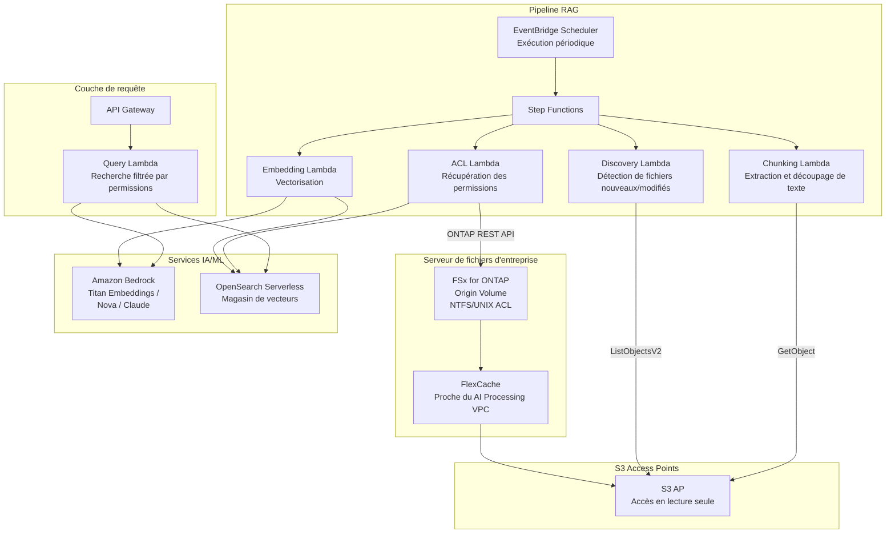

# GenAI RAG over Enterprise Files

🌐 **Language / 言語**: [日本語](README.md) | [English](README.en.md) | [한국어](README.ko.md) | [简体中文](README.zh-CN.md) | [繁體中文](README.zh-TW.md) | [Français](README.fr.md) | [Deutsch](README.de.md) | [Español](README.es.md)

## Présentation

Un modèle qui fournit en toute sécurité les documents confidentiels d'un serveur de fichiers d'entreprise (FSx for ONTAP) aux pipelines Amazon Bedrock / RAG via S3 Access Points, **sans les copier vers S3**. Il réalise un RAG basé sur les permissions (Permission-aware RAG) tout en préservant les permissions de fichiers (ACL/NTFS).

## Problèmes résolus

| Problème | Solution avec ce modèle |
|------|-------------------|
| Dispersion des données due à la copie de fichiers confidentiels vers S3 | Lecture directe via S3 AP, aucune copie nécessaire |
| Perte des permissions de fichiers | Récupération des ACL via l'API REST ONTAP, filtrage lors de la réponse RAG |
| Problèmes de fraîcheur des données | FlexCache + S3 AP fournissent les données les plus récentes |
| Traitement en masse de serveurs de fichiers volumineux | EventBridge Scheduler + détection différentielle pour plus d'efficacité |
| Distance entre l'environnement de traitement IA et les données | FlexCache place les données à proximité du VPC de traitement IA |

## Architecture



## Concept du Permission-aware RAG

1. **Au moment de l'indexation** : Récupérer les informations ACL/permissions de chaque document via l'API REST ONTAP et les stocker comme métadonnées dans le magasin de vecteurs
2. **Au moment de la requête** : Selon le SID AD / l'appartenance aux groupes de l'utilisateur, filtrer le périmètre de recherche aux seuls documents accessibles par l'utilisateur
3. **Au moment de la réponse** : Ne transmettre que les documents filtrés à Bedrock pour la génération de la réponse

```
Requête utilisateur → Filtre de permissions → Recherche vectorielle → Génération de réponse Bedrock
                    ↓
            Rechercher uniquement les documents accessibles
            par le SID AD de l'utilisateur
```

## Rôle de FlexCache

- Placer les données à proximité de l'environnement de traitement IA (Lambda VPC)
- Accélérer les lectures en masse lors du traitement d'embedding
- Réduire les transferts WAN vers l'origine
- Fournir aux traitements serverless via S3 AP

## Lien avec les cas d'usage existants

| UC associé | Point de connexion |
|---------|------------|
| [legal-compliance/](../legal-compliance/) | Partage du modèle de récupération des ACL |
| [financial-idp/](../financial-idp/) | Partage du pipeline de traitement de documents |
| [healthcare-dicom/](../healthcare-dicom/) | Contrôle d'accès basé sur les permissions |
| [FlexCache AnyCast/DR](../flexcache-anycast-dr/) | Modèle de placement FlexCache |

## Structure des répertoires

```
genai-rag-enterprise-files/
├── README.md
├── template.yaml
├── functions/
│   ├── discovery/handler.py
│   ├── chunking/handler.py
│   ├── embedding/handler.py
│   ├── acl_extraction/handler.py
│   └── query/handler.py
├── tests/
│   └── test_handlers.py
├── events/
│   └── sample-input.json
└── docs/
    ├── architecture.md
    ├── demo-guide.md
    ├── poc-checklist.md
    └── use-case-mapping.md
```

## Conception de la sécurité

- **Aucun déplacement de données** : Les fichiers restent sur FSx for ONTAP, en lecture seule via S3 AP
- **Préservation des permissions** : Récupération des ACL via l'API REST ONTAP, filtrage lors de la réponse RAG
- **Chiffrement** : SSE-FSX (stockage), TLS (en transit), KMS (sortie)
- **Moindre privilège** : Lambda n'est autorisé qu'aux opérations S3 AP nécessaires
- **Audit** : CloudTrail + journaux d'audit ONTAP

## Secteurs cibles

- Finance (contrats, documents réglementaires)
- Juridique (jurisprudence, contrats, documents de conformité)
- Santé (articles de recherche, données cliniques)
- Fabrication (documents de conception, documents de gestion de la qualité)
- Gouvernement (documents officiels, documents de politique)

## Liens connexes

- [Dynamic FlexCache Render Workflow](../dynamic-flexcache-render-workflow/README.md)
- [FlexCache AnyCast / DR](../flexcache-anycast-dr/README.md)
- [Mappage secteurs et charges de travail](../docs/industry-workload-mapping.md)


## Success Metrics

### Outcome
Connecter les fichiers d'entreprise à l'IA/ML sans copie de données, grâce au prétraitement RAG basé sur les permissions.

### Metrics
| Métrique | Valeur cible (exemple) |
|-----------|------------|
| Fichiers traités par découpage / exécution | > 200 files |
| Taux de réussite de l'extraction des ACL | > 95% |
| Temps de génération d'embedding | < 5 min / 100 files |
| Précision du filtrage Permission-aware | > 99% |
| Taux de revue Human Review | < 10% (chunks à faible confiance) |

### Measurement Method
Historique d'exécution Step Functions, réponses Bedrock Embedding, journaux d'extraction ACL, CloudWatch Metrics.


---

## Liens vers la documentation AWS

| Service | Documentation |
|---------|------------|
| FSx for ONTAP | [Guide de l'utilisateur](https://docs.aws.amazon.com/fsx/latest/ONTAPGuide/what-is-fsx-ontap.html) |
| S3 Access Points for FSx for ONTAP | [Guide S3 AP](https://docs.aws.amazon.com/fsx/latest/ONTAPGuide/s3-access-points.html) |
| Amazon Bedrock | [Guide de l'utilisateur](https://docs.aws.amazon.com/bedrock/latest/userguide/what-is-bedrock.html) |
| Amazon Bedrock Knowledge Bases | [Bases de connaissances](https://docs.aws.amazon.com/bedrock/latest/userguide/knowledge-base.html) |
| Amazon OpenSearch Serverless | [Guide du développeur](https://docs.aws.amazon.com/opensearch-service/latest/developerguide/serverless.html) |
| Amazon Titan Embeddings | [Modèles Titan](https://docs.aws.amazon.com/bedrock/latest/userguide/titan-embedding-models.html) |
| Step Functions | [Guide du développeur](https://docs.aws.amazon.com/step-functions/latest/dg/welcome.html) |

### Alignement avec le Well-Architected Framework

| Pilier | Alignement |
|----|------|
| Excellence opérationnelle | Journaux structurés, CloudWatch Metrics, suivi de progression des embeddings |
| Sécurité | Filtrage Permission-aware, moindre privilège IAM, chiffrement KMS |
| Fiabilité | Step Functions Retry/Catch, réessai par chunk |
| Efficacité des performances | Embedding par lots, découpage parallèle, optimisation de la mémoire Lambda |
| Optimisation des coûts | Serverless, embedding différentiel (retraitement des seuls fichiers modifiés) |
| Durabilité | Exécution à la demande, mise à l'échelle automatique des OCU OpenSearch Serverless |

### Blogs et exemples AWS associés

- [RAG with Amazon Bedrock](https://aws.amazon.com/blogs/machine-learning/question-answering-using-retrieval-augmented-generation-with-foundation-models-in-amazon-sagemaker-jumpstart/)
- [aws-samples/amazon-bedrock-rag-workshop](https://github.com/aws-samples/amazon-bedrock-rag-workshop)


---

## Estimation des coûts (estimation mensuelle)

> **Remarque** : Les valeurs ci-dessous sont des estimations pour la région ap-northeast-1 ; les coûts réels varient selon l'utilisation. Vérifiez les tarifs les plus récents avec l'[AWS Pricing Calculator](https://calculator.aws/).

### Composants serverless (facturation à l'usage)

| Service | Prix unitaire | Utilisation supposée | Estimation mensuelle |
|---------|------|-----------|---------|
| Lambda | $0.0000166667/GB-sec | 5 fonctions × 50 docs/jour | ~$1-5 |
| S3 API (GetObject/ListObjects) | $0.0047/10K requests | ~10K requests/jour | ~$1.5 |
| Step Functions | $0.025/1K state transitions | ~1K transitions/jour | ~$0.75 |
| Bedrock (Nova Lite) | $0.00006/1K input tokens | ~200K tokens/exécution (embedding + query) | ~$3-10 |
| Athena | $5/TB scanned | N/A | ~$0.5-2 |
| SNS | $0.50/100K notifications | ~100 notifications/jour | ~$0.15 |
| CloudWatch Logs | $0.76/GB ingested | ~1 GB/mois | ~$0.76 |
| OpenSearch Serverless | $0.24/OCU-hour |


### Coûts fixes (FSx for ONTAP — environnement existant supposé)

| Composant | Mensuel |
|--------------|------|
| FSx for ONTAP (128 MBps, 1 TB) | ~$230 (environnement existant partagé) |
| S3 Access Point | Aucun frais supplémentaire (frais S3 API uniquement) |

### Estimation totale

| Configuration | Estimation mensuelle |
|------|---------|
| Configuration minimale (1 exécution par jour) | ~$5-15 |
| Configuration standard (exécution horaire) | ~$15-50 |
| Configuration à grande échelle (haute fréquence + alarmes) | ~$50-150 |

> **Governance Caveat** : Les estimations de coûts sont approximatives et non garanties. Le montant facturé réel varie selon les modèles d'utilisation, le volume de données et la région.

---

## Tests locaux

### Vérification des prérequis

```bash
# Vérifier les prérequis
aws --version          # AWS CLI v2
sam --version          # SAM CLI
python3 --version      # Python 3.9+
docker --version       # Docker (pour sam local)
aws sts get-caller-identity  # Identifiants AWS
```

### sam local invoke

```bash
# Build
# Prérequis : AWS SAM CLI est requis. « sam build » package le code et la couche partagée automatiquement.
sam build

# Exécution locale de la fonction Discovery Lambda
sam local invoke DiscoveryFunction --event events/discovery-event.json

# Avec surcharge des variables d'environnement
sam local invoke DiscoveryFunction \
  --event events/discovery-event.json \
  --env-vars env.json
```

### Tests unitaires

```bash
python3 -m pytest tests/ -v
```

Pour plus de détails, consultez le [démarrage rapide des tests locaux](../docs/local-testing-quick-start.md).

---

## Exemple de sortie (Output Sample)

Exemple de sortie du pipeline Permission-aware RAG :

```json
{
  "embedding_pipeline": {
    "files_processed": 50,
    "chunks_generated": 320,
    "embeddings_stored": 320,
    "vector_db": "opensearch_serverless"
  },
  "query_result": {
    "query": "Parlez-moi du plan budgétaire de l'exercice 2026",
    "user_id": "user-001",
    "permitted_files": 35,
    "filtered_files": 15,
    "relevant_chunks": 5,
    "answer": "Dans le plan budgétaire de l'exercice 2026, les investissements informatiques augmentent de 15 % par rapport à l'année précédente...",
    "sources": [
      {"file": "budget/2026-plan.pdf", "chunk_id": 12, "score": 0.94},
      {"file": "budget/2026-summary.docx", "chunk_id": 3, "score": 0.89}
    ],
    "confidence": 0.91
  }
}
```

> **Remarque** : Ce qui précède est un exemple de sortie ; les valeurs réelles varient selon l'environnement et les données d'entrée. Les chiffres de référence sont un sizing reference, pas un service limit.

---

## Performance Considerations

- La capacité de débit de FSx for ONTAP est partagée entre NFS/SMB/S3AP
- L'accès via un S3 Access Point entraîne une surcharge de latence de plusieurs dizaines de millisecondes
- Pour le traitement de grands volumes de fichiers, contrôlez le parallélisme avec le MaxConcurrency de l'état Map de Step Functions
- L'augmentation de la taille de mémoire Lambda améliore également la bande passante réseau

> **Remarque** : Les chiffres de performance de ce modèle sont un sizing reference, pas un service limit. Les performances en environnement réel varient selon la capacité de débit de FSx for ONTAP, la configuration réseau et les charges de travail concurrentes.

---

## Déploiement

Déployez avec l'AWS SAM CLI (remplacez les espaces réservés selon votre environnement) :

```bash
# Prérequis : AWS SAM CLI est requis. « sam build » package le code et la couche partagée automatiquement.
sam build

sam deploy \
  --stack-name fsxn-rag-enterprise-files \
  --parameter-overrides \
    S3AccessPointAlias=<your-s3ap-alias> \
    S3AccessPointName=<your-s3ap-name> \
    NotificationEmail=<your-email@example.com> \
  --capabilities CAPABILITY_NAMED_IAM \
  --resolve-s3 \
  --region <your-region>
```

> **Note** : `template.yaml` s'utilise avec le SAM CLI (`sam build` + `sam deploy`).
> Pour un déploiement direct avec la commande `aws cloudformation deploy`, utilisez `template-deploy.yaml` à la place (nécessite le pré-packaging des fichiers zip Lambda et leur téléversement vers S3).

> **À propos de l'extraction des ACL au niveau fichier** : Par défaut, l'extraction des ACL s'exécute en mode simulation (aucun ONTAP requis). Pour récupérer les ACL réelles, spécifiez `OntapManagementIp` / `OntapSecretName`. Notez toutefois que ce modèle n'inclut pas de `VpcConfig` ; atteindre un LIF de gestion ONTAP privé nécessite donc une configuration réseau supplémentaire.

## Governance Note

> Ce modèle fournit des recommandations d'architecture technique. Il ne constitue pas un avis juridique, de conformité ou réglementaire. Les organisations doivent consulter des professionnels qualifiés.
