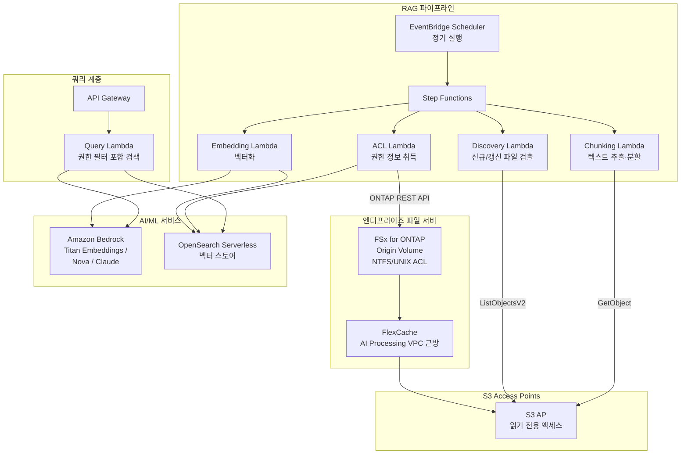

# GenAI RAG over Enterprise Files

🌐 **Language / 言語**: [日本語](README.md) | [English](README.en.md) | [한국어](README.ko.md) | [简体中文](README.zh-CN.md) | [繁體中文](README.zh-TW.md) | [Français](README.fr.md) | [Deutsch](README.de.md) | [Español](README.es.md)

## 개요

엔터프라이즈 파일 서버(FSx for ONTAP)의 기밀 문서를 **S3로 복사하지 않고** S3 Access Points를 통해 Amazon Bedrock / RAG 파이프라인에 안전하게 제공하는 패턴. 파일 권한(ACL/NTFS)을 유지한 채 권한 기반 RAG(Permission-aware RAG)를 실현한다.

## 해결하는 과제

| 과제 | 본 패턴을 통한 해결 |
|------|-------------------|
| 기밀 파일의 S3 복사로 인한 데이터 확산 | S3 AP를 통한 직접 읽기, 복사 불필요 |
| 파일 권한의 손실 | ONTAP REST API로 ACL을 취득하여 RAG 응답 시 필터링 |
| 데이터 신선도 문제 | FlexCache + S3 AP로 최신 데이터 제공 |
| 대규모 파일 서버의 전량 처리 | EventBridge Scheduler + 증분 검출로 효율화 |
| AI 처리 환경과 데이터의 거리 | FlexCache로 AI 처리 VPC 근방에 데이터 배치 |

## 아키텍처



## Permission-aware RAG의 사고방식

1. **인덱스 시점**: 각 문서의 ACL/권한 정보를 ONTAP REST API로 취득하여 벡터 스토어에 메타데이터로 저장
2. **쿼리 시점**: 사용자의 AD SID / 그룹 정보에 기반하여 액세스 가능한 문서만 검색 대상으로 필터링
3. **응답 시점**: 필터링된 문서만 Bedrock에 전달하여 답변 생성

```
사용자 쿼리 → 권한 필터 → 벡터 검색 → Bedrock 답변 생성
                    ↓
            사용자의 AD SID로
            액세스 가능한 문서만 검색
```

## FlexCache의 역할

- AI 처리 환경(Lambda VPC) 근방에 데이터 배치
- Embedding 처리 시 대량 읽기 고속화
- Origin으로의 WAN 전송 감소
- S3 AP를 통해 서버리스 처리에 제공

## 기존 유스케이스와의 관련성

| 관련 UC | 관련 포인트 |
|---------|------------|
| [legal-compliance/](../legal-compliance/) | ACL 취득 패턴 공유 |
| [financial-idp/](../financial-idp/) | 문서 처리 파이프라인 공유 |
| [healthcare-dicom/](../healthcare-dicom/) | 권한 기반 액세스 제어 |
| [FlexCache AnyCast/DR](../flexcache-anycast-dr/) | FlexCache 배치 패턴 |

## 디렉터리 구성

```
genai-rag-enterprise-files/
├── README.md
├── template.yaml
├── functions/
│   ├── discovery/handler.py
│   ├── chunking/handler.py
│   ├── embedding/handler.py
│   ├── acl_extraction/handler.py
│   └── query/handler.py
├── tests/
│   └── test_handlers.py
├── events/
│   └── sample-input.json
└── docs/
    ├── architecture.md
    ├── demo-guide.md
    ├── poc-checklist.md
    └── use-case-mapping.md
```

## 보안 설계

- **데이터 이동 없음**: 파일은 FSx for ONTAP 상에 머무르며 S3 AP를 통해 읽기 전용
- **권한 유지**: ONTAP REST API로 ACL을 취득하여 RAG 응답 시 필터링
- **암호화**: SSE-FSX(스토리지), TLS(전송 중), KMS(출력)
- **최소 권한**: Lambda는 필요한 S3 AP 작업만 허용
- **감사**: CloudTrail + ONTAP 감사 로그

## 대상 산업

- 금융(계약서, 규제 문서)
- 법무(판례, 계약서, 컴플라이언스 문서)
- 의료(연구 논문, 임상 데이터)
- 제조(설계 문서, 품질 관리 문서)
- 정부(공문서, 정책 문서)

## 관련 링크

- [Dynamic FlexCache Render Workflow](../dynamic-flexcache-render-workflow/README.md)
- [FlexCache AnyCast / DR](../flexcache-anycast-dr/README.md)
- [산업·워크로드 매핑](../docs/industry-workload-mapping.md)


## Success Metrics

### Outcome
권한 기반 RAG 전처리를 통해 데이터 복사 없이 엔터프라이즈 파일을 AI/ML에 연결한다.

### Metrics
| 메트릭 | 목표값(예) |
|-----------|------------|
| 청킹 처리 파일 수 / 실행 | > 200 files |
| ACL 추출 성공률 | > 95% |
| Embedding 생성 시간 | < 5 분 / 100 files |
| Permission-aware 필터링 정확도 | > 99% |
| Human Review 대상률 | < 10%(저신뢰도 청크) |

### Measurement Method
Step Functions 실행 이력, Bedrock Embedding 응답, ACL 추출 로그, CloudWatch Metrics.


---

## AWS 문서 링크

| 서비스 | 문서 |
|---------|------------|
| FSx for ONTAP | [사용자 가이드](https://docs.aws.amazon.com/fsx/latest/ONTAPGuide/what-is-fsx-ontap.html) |
| S3 Access Points for FSx for ONTAP | [S3 AP 가이드](https://docs.aws.amazon.com/fsx/latest/ONTAPGuide/s3-access-points.html) |
| Amazon Bedrock | [사용자 가이드](https://docs.aws.amazon.com/bedrock/latest/userguide/what-is-bedrock.html) |
| Amazon Bedrock Knowledge Bases | [지식 기반](https://docs.aws.amazon.com/bedrock/latest/userguide/knowledge-base.html) |
| Amazon OpenSearch Serverless | [개발자 가이드](https://docs.aws.amazon.com/opensearch-service/latest/developerguide/serverless.html) |
| Amazon Titan Embeddings | [Titan 모델](https://docs.aws.amazon.com/bedrock/latest/userguide/titan-embedding-models.html) |
| Step Functions | [개발자 가이드](https://docs.aws.amazon.com/step-functions/latest/dg/welcome.html) |

### Well-Architected Framework 대응

| 기둥 | 대응 |
|----|------|
| 운영 우수성 | 구조화 로그, CloudWatch Metrics, 임베딩 진행 추적 |
| 보안 | Permission-aware 필터링, IAM 최소 권한, KMS 암호화 |
| 신뢰성 | Step Functions Retry/Catch, 청크 단위 재시도 |
| 성능 효율성 | 배치 임베딩, 병렬 청킹, Lambda 메모리 최적화 |
| 비용 최적화 | 서버리스, 증분 임베딩(변경 파일만 재처리) |
| 지속 가능성 | 온디맨드 실행, OpenSearch Serverless OCU 자동 스케일링 |

### 관련 AWS 블로그·샘플

- [RAG with Amazon Bedrock](https://aws.amazon.com/blogs/machine-learning/question-answering-using-retrieval-augmented-generation-with-foundation-models-in-amazon-sagemaker-jumpstart/)
- [aws-samples/amazon-bedrock-rag-workshop](https://github.com/aws-samples/amazon-bedrock-rag-workshop)


---

## 비용 견적(월간 개산)

> **비고**: 아래는 ap-northeast-1 리전의 개산이며 실제 비용은 사용량에 따라 다릅니다. 최신 요금은 [AWS Pricing Calculator](https://calculator.aws/)에서 확인하세요.

### 서버리스 구성 요소(종량 과금)

| 서비스 | 단가 | 상정 사용량 | 월간 개산 |
|---------|------|-----------|---------|
| Lambda | $0.0000166667/GB-sec | 5 함수 × 50 docs/일 | ~$1-5 |
| S3 API (GetObject/ListObjects) | $0.0047/10K requests | ~10K requests/일 | ~$1.5 |
| Step Functions | $0.025/1K state transitions | ~1K transitions/일 | ~$0.75 |
| Bedrock (Nova Lite) | $0.00006/1K input tokens | ~200K tokens/실행 (embedding + query) | ~$3-10 |
| Athena | $5/TB scanned | N/A | ~$0.5-2 |
| SNS | $0.50/100K notifications | ~100 notifications/일 | ~$0.15 |
| CloudWatch Logs | $0.76/GB ingested | ~1 GB/월 | ~$0.76 |
| OpenSearch Serverless | $0.24/OCU-hour |


### 고정 비용(FSx for ONTAP — 기존 환경 전제)

| 구성 요소 | 월간 |
|--------------|------|
| FSx for ONTAP (128 MBps, 1 TB) | ~$230 (기존 환경을 공유) |
| S3 Access Point | 추가 요금 없음(S3 API 요금만) |

### 합계 개산

| 구성 | 월간 개산 |
|------|---------|
| 최소 구성(일 1회 실행) | ~$5-15 |
| 표준 구성(시간별 실행) | ~$15-50 |
| 대규모 구성(고빈도 + 알람) | ~$50-150 |

> **Governance Caveat**: 비용 견적은 개산이며 보증값이 아닙니다. 실제 청구액은 사용 패턴, 데이터양, 리전에 따라 다릅니다.

---

## 로컬 테스트

### Prerequisites 체크

```bash
# 전제 조건 확인
aws --version          # AWS CLI v2
sam --version          # SAM CLI
python3 --version      # Python 3.9+
docker --version       # Docker (sam local 용)
aws sts get-caller-identity  # AWS 자격 증명
```

### sam local invoke

```bash
# 빌드
# 전제: AWS SAM CLI가 필요합니다. sam build가 코드와 공유 레이어를 자동으로 패키징합니다.
sam build

# Discovery Lambda의 로컬 실행
sam local invoke DiscoveryFunction --event events/discovery-event.json

# 환경 변수 오버라이드 포함
sam local invoke DiscoveryFunction \
  --event events/discovery-event.json \
  --env-vars env.json
```

### 유닛 테스트

```bash
python3 -m pytest tests/ -v
```

자세한 내용은 [로컬 테스트 퀵 스타트](../docs/local-testing-quick-start.md)를 참조하세요.

---

## 출력 샘플 (Output Sample)

Permission-aware RAG 파이프라인의 출력 예:

```json
{
  "embedding_pipeline": {
    "files_processed": 50,
    "chunks_generated": 320,
    "embeddings_stored": 320,
    "vector_db": "opensearch_serverless"
  },
  "query_result": {
    "query": "2026년도 예산 계획에 대해 알려주세요",
    "user_id": "user-001",
    "permitted_files": 35,
    "filtered_files": 15,
    "relevant_chunks": 5,
    "answer": "2026년도 예산 계획에서는 IT 투자로 전년 대비 15% 증가한...",
    "sources": [
      {"file": "budget/2026-plan.pdf", "chunk_id": 12, "score": 0.94},
      {"file": "budget/2026-summary.docx", "chunk_id": 3, "score": 0.89}
    ],
    "confidence": 0.91
  }
}
```

> **비고**: 위는 샘플 출력이며 실제 값은 환경·입력 데이터에 따라 다릅니다. 벤치마크 수치는 sizing reference이며 service limit이 아닙니다.

---

## Performance Considerations

- FSx for ONTAP의 스루풋 용량은 NFS/SMB/S3AP에서 공유됩니다
- S3 Access Point를 통한 레이턴시는 수십 밀리초의 오버헤드가 발생합니다
- 대량 파일 처리 시에는 Step Functions Map state의 MaxConcurrency로 병렬도를 제어하세요
- Lambda 메모리 크기 증가는 네트워크 대역폭 향상에도 기여합니다

> **비고**: 본 패턴의 성능 수치는 sizing reference이며 service limit이 아닙니다. 실제 환경에서의 성능은 FSx for ONTAP 스루풋 용량, 네트워크 구성, 동시 실행 워크로드에 따라 다릅니다.

---

## 배포

AWS SAM CLI로 배포합니다(플레이스홀더는 환경에 맞게 교체하세요):

```bash
# 전제: AWS SAM CLI가 필요합니다. sam build가 코드와 공유 레이어를 자동으로 패키징합니다.
sam build

sam deploy \
  --stack-name fsxn-rag-enterprise-files \
  --parameter-overrides \
    S3AccessPointAlias=<your-s3ap-alias> \
    S3AccessPointName=<your-s3ap-name> \
    NotificationEmail=<your-email@example.com> \
  --capabilities CAPABILITY_NAMED_IAM \
  --resolve-s3 \
  --region <your-region>
```

> **주의**: `template.yaml`은 SAM CLI(`sam build` + `sam deploy`)로 사용합니다.
> `aws cloudformation deploy` 명령으로 직접 배포하는 경우 `template-deploy.yaml`을 사용하세요(Lambda zip 파일의 사전 패키징과 S3 업로드가 필요합니다).

> **파일 레벨 ACL 추출에 대하여**: 기본적으로 ACL 추출은 시뮬레이션 모드로 동작합니다(ONTAP 불필요). 실제 ACL을 취득하려면 `OntapManagementIp` / `OntapSecretName`을 지정합니다. 다만 본 템플릿은 `VpcConfig`를 포함하지 않으므로 프라이빗 ONTAP 관리 LIF에 도달하려면 추가 네트워크 구성이 필요합니다.

## Governance Note

> 본 패턴은 기술 아키텍처 가이던스를 제공합니다. 법적·컴플라이언스·규제상의 조언이 아닙니다. 조직은 적격한 전문가와 상담하세요.
