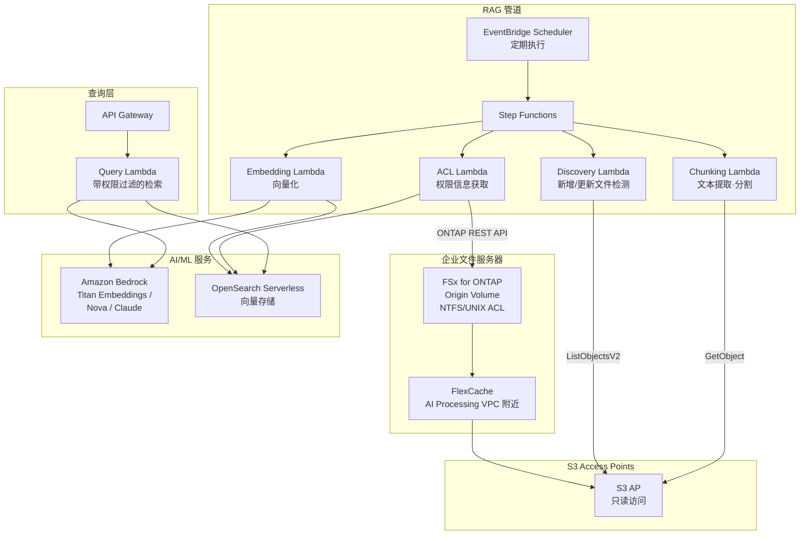

# GenAI RAG over Enterprise Files

🌐 **Language / 言語**: [日本語](README.md) | [English](README.en.md) | [한국어](README.ko.md) | [简体中文](README.zh-CN.md) | [繁體中文](README.zh-TW.md) | [Français](README.fr.md) | [Deutsch](README.de.md) | [Español](README.es.md)

## 概述

一种无需将企业文件服务器（FSx for ONTAP）上的机密文档**复制到 S3**，即可通过 S3 Access Points 安全地提供给 Amazon Bedrock / RAG 管道的模式。在保持文件权限（ACL/NTFS）的同时，实现基于权限的 RAG（Permission-aware RAG）。

## 解决的问题

| 问题 | 本模式的解决方案 |
|------|-------------------|
| 机密文件复制到 S3 导致的数据扩散 | 通过 S3 AP 直接读取，无需复制 |
| 文件权限的丢失 | 通过 ONTAP REST API 获取 ACL，在 RAG 响应时过滤 |
| 数据新鲜度问题 | FlexCache + S3 AP 提供最新数据 |
| 大规模文件服务器的全量处理 | EventBridge Scheduler + 增量检测提升效率 |
| AI 处理环境与数据的距离 | 通过 FlexCache 将数据放置在 AI 处理 VPC 附近 |

## 架构



## Permission-aware RAG 的思路

1. **索引时**: 通过 ONTAP REST API 获取各文档的 ACL/权限信息，并作为元数据存储到向量存储中
2. **查询时**: 根据用户的 AD SID / 组信息，将检索范围过滤为仅用户可访问的文档
3. **响应时**: 仅将过滤后的文档传递给 Bedrock 以生成回答

```
用户查询 → 权限过滤 → 向量检索 → Bedrock 回答生成
                    ↓
            仅检索用户的 AD SID
            可访问的文档
```

## FlexCache 的作用

- 将数据放置在 AI 处理环境（Lambda VPC）附近
- 加速 Embedding 处理时的大量读取
- 减少到 Origin 的 WAN 传输
- 通过 S3 AP 提供给无服务器处理

## 与现有用例的关联

| 相关 UC | 相关要点 |
|---------|------------|
| [legal-compliance/](../legal-compliance/) | ACL 获取模式共享 |
| [financial-idp/](../financial-idp/) | 文档处理管道共享 |
| [healthcare-dicom/](../healthcare-dicom/) | 基于权限的访问控制 |
| [FlexCache AnyCast/DR](../flexcache-anycast-dr/) | FlexCache 放置模式 |

## 目录结构

```
genai-rag-enterprise-files/
├── README.md
├── template.yaml
├── functions/
│   ├── discovery/handler.py
│   ├── chunking/handler.py
│   ├── embedding/handler.py
│   ├── acl_extraction/handler.py
│   └── query/handler.py
├── tests/
│   └── test_handlers.py
├── events/
│   └── sample-input.json
└── docs/
    ├── architecture.md
    ├── demo-guide.md
    ├── poc-checklist.md
    └── use-case-mapping.md
```

## 安全设计

- **无数据移动**: 文件保留在 FSx for ONTAP 上，通过 S3 AP 仅读取
- **权限保持**: 通过 ONTAP REST API 获取 ACL，在 RAG 响应时过滤
- **加密**: SSE-FSX（存储）、TLS（传输中）、KMS（输出）
- **最小权限**: Lambda 仅允许必要的 S3 AP 操作
- **审计**: CloudTrail + ONTAP 审计日志

## 目标行业

- 金融（合同、监管文档）
- 法务（判例、合同、合规文档）
- 医疗（研究论文、临床数据）
- 制造（设计文档、质量管理文档）
- 政府（公文、政策文档）

## 相关链接

- [Dynamic FlexCache Render Workflow](../dynamic-flexcache-render-workflow/README.md)
- [FlexCache AnyCast / DR](../flexcache-anycast-dr/README.md)
- [行业·工作负载映射](../docs/industry-workload-mapping.md)


## Success Metrics

### Outcome
通过基于权限的 RAG 预处理，在无需复制数据的情况下将企业文件连接到 AI/ML。

### Metrics
| 指标 | 目标值（示例） |
|-----------|------------|
| 分块处理文件数 / 执行 | > 200 files |
| ACL 提取成功率 | > 95% |
| Embedding 生成时间 | < 5 分钟 / 100 files |
| Permission-aware 过滤精度 | > 99% |
| Human Review 对象率 | < 10%（低置信度分块） |

### Measurement Method
Step Functions 执行历史、Bedrock Embedding 响应、ACL 提取日志、CloudWatch Metrics。


---

## AWS 文档链接

| 服务 | 文档 |
|---------|------------|
| FSx for ONTAP | [用户指南](https://docs.aws.amazon.com/fsx/latest/ONTAPGuide/what-is-fsx-ontap.html) |
| S3 Access Points for FSx for ONTAP | [S3 AP 指南](https://docs.aws.amazon.com/fsx/latest/ONTAPGuide/s3-access-points.html) |
| Amazon Bedrock | [用户指南](https://docs.aws.amazon.com/bedrock/latest/userguide/what-is-bedrock.html) |
| Amazon Bedrock Knowledge Bases | [知识库](https://docs.aws.amazon.com/bedrock/latest/userguide/knowledge-base.html) |
| Amazon OpenSearch Serverless | [开发者指南](https://docs.aws.amazon.com/opensearch-service/latest/developerguide/serverless.html) |
| Amazon Titan Embeddings | [Titan 模型](https://docs.aws.amazon.com/bedrock/latest/userguide/titan-embedding-models.html) |
| Step Functions | [开发者指南](https://docs.aws.amazon.com/step-functions/latest/dg/welcome.html) |

### Well-Architected Framework 对应

| 支柱 | 对应 |
|----|------|
| 卓越运营 | 结构化日志、CloudWatch Metrics、嵌入进度跟踪 |
| 安全性 | Permission-aware 过滤、IAM 最小权限、KMS 加密 |
| 可靠性 | Step Functions Retry/Catch、分块级重试 |
| 性能效率 | 批量嵌入、并行分块、Lambda 内存优化 |
| 成本优化 | 无服务器、增量嵌入（仅重新处理变更文件） |
| 可持续性 | 按需执行、OpenSearch Serverless OCU 自动扩缩 |

### 相关 AWS 博客·示例

- [RAG with Amazon Bedrock](https://aws.amazon.com/blogs/machine-learning/question-answering-using-retrieval-augmented-generation-with-foundation-models-in-amazon-sagemaker-jumpstart/)
- [aws-samples/amazon-bedrock-rag-workshop](https://github.com/aws-samples/amazon-bedrock-rag-workshop)


---

## 成本估算（月度概算）

> **备注**: 以下为 ap-northeast-1 区域的概算，实际成本因使用量而异。最新价格请在 [AWS Pricing Calculator](https://calculator.aws/) 确认。

### 无服务器组件（按量计费）

| 服务 | 单价 | 预计使用量 | 月度概算 |
|---------|------|-----------|---------|
| Lambda | $0.0000166667/GB-sec | 5 函数 × 50 docs/天 | ~$1-5 |
| S3 API (GetObject/ListObjects) | $0.0047/10K requests | ~10K requests/天 | ~$1.5 |
| Step Functions | $0.025/1K state transitions | ~1K transitions/天 | ~$0.75 |
| Bedrock (Nova Lite) | $0.00006/1K input tokens | ~200K tokens/执行 (embedding + query) | ~$3-10 |
| Athena | $5/TB scanned | N/A | ~$0.5-2 |
| SNS | $0.50/100K notifications | ~100 notifications/天 | ~$0.15 |
| CloudWatch Logs | $0.76/GB ingested | ~1 GB/月 | ~$0.76 |
| OpenSearch Serverless | $0.24/OCU-hour |


### 固定成本（FSx for ONTAP — 以既有环境为前提）

| 组件 | 月度 |
|--------------|------|
| FSx for ONTAP (128 MBps, 1 TB) | ~$230 (共享既有环境) |
| S3 Access Point | 无额外费用（仅 S3 API 费用） |

### 合计概算

| 配置 | 月度概算 |
|------|---------|
| 最小配置（每日 1 次执行） | ~$5-15 |
| 标准配置（每小时执行） | ~$15-50 |
| 大规模配置（高频 + 告警） | ~$50-150 |

> **Governance Caveat**: 成本估算为概算，并非保证值。实际账单金额因使用模式、数据量、区域而异。

---

## 本地测试

### Prerequisites 检查

```bash
# 确认前提条件
aws --version          # AWS CLI v2
sam --version          # SAM CLI
python3 --version      # Python 3.9+
docker --version       # Docker (用于 sam local)
aws sts get-caller-identity  # AWS 凭证
```

### sam local invoke

```bash
# 构建
# 前提: 需要 AWS SAM CLI。sam build 会自动打包代码和共享层。
sam build

# 本地运行 Discovery Lambda
sam local invoke DiscoveryFunction --event events/discovery-event.json

# 带环境变量覆盖
sam local invoke DiscoveryFunction \
  --event events/discovery-event.json \
  --env-vars env.json
```

### 单元测试

```bash
python3 -m pytest tests/ -v
```

详情请参阅 [本地测试快速入门](../docs/local-testing-quick-start.md)。

---

## 输出示例 (Output Sample)

Permission-aware RAG 管道的输出示例:

```json
{
  "embedding_pipeline": {
    "files_processed": 50,
    "chunks_generated": 320,
    "embeddings_stored": 320,
    "vector_db": "opensearch_serverless"
  },
  "query_result": {
    "query": "请介绍一下 2026 年度的预算计划",
    "user_id": "user-001",
    "permitted_files": 35,
    "filtered_files": 15,
    "relevant_chunks": 5,
    "answer": "在 2026 年度的预算计划中，IT 投资较上年增长 15%……",
    "sources": [
      {"file": "budget/2026-plan.pdf", "chunk_id": 12, "score": 0.94},
      {"file": "budget/2026-summary.docx", "chunk_id": 3, "score": 0.89}
    ],
    "confidence": 0.91
  }
}
```

> **备注**: 上述为示例输出，实际值因环境·输入数据而异。基准数值为 sizing reference，并非 service limit。

---

## Performance Considerations

- FSx for ONTAP 的吞吐容量在 NFS/SMB/S3AP 之间共享
- 通过 S3 Access Point 的延迟会产生数十毫秒的开销
- 大量文件处理时，请通过 Step Functions Map state 的 MaxConcurrency 控制并行度
- 增大 Lambda 内存大小也有助于提升网络带宽

> **备注**: 本模式的性能数值为 sizing reference，并非 service limit。实际环境中的性能因 FSx for ONTAP 吞吐容量、网络配置、并发工作负载而异。

---

## 部署

使用 AWS SAM CLI 部署（请将占位符替换为您的环境值）:

```bash
# 前提: 需要 AWS SAM CLI。sam build 会自动打包代码和共享层。
sam build

sam deploy \
  --stack-name fsxn-rag-enterprise-files \
  --parameter-overrides \
    S3AccessPointAlias=<your-s3ap-alias> \
    S3AccessPointName=<your-s3ap-name> \
    NotificationEmail=<your-email@example.com> \
  --capabilities CAPABILITY_NAMED_IAM \
  --resolve-s3 \
  --region <your-region>
```

> **注意**: `template.yaml` 与 SAM CLI（`sam build` + `sam deploy`）配合使用。
> 若使用 `aws cloudformation deploy` 命令直接部署，请改用 `template-deploy.yaml`（需要预先打包 Lambda zip 文件并上传到 S3）。

> **关于文件级 ACL 提取**: 默认情况下 ACL 提取以模拟模式运行（无需 ONTAP）。要获取实际 ACL，请指定 `OntapManagementIp` / `OntapSecretName`。但本模板不包含 `VpcConfig`，因此要到达私有 ONTAP 管理 LIF 需要额外的网络配置。

## Governance Note

> 本模式提供技术架构指导。这不是法律·合规·监管方面的建议。组织应咨询合格的专业人士。
