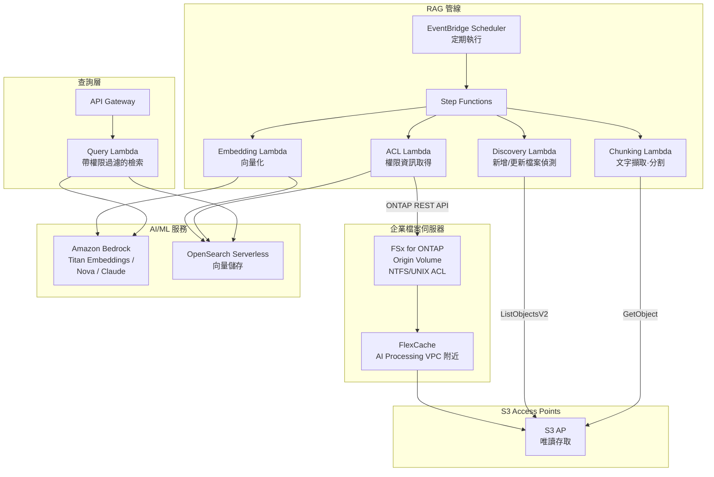

# GenAI RAG over Enterprise Files

🌐 **Language / 言語**: [日本語](README.md) | [English](README.en.md) | [한국어](README.ko.md) | [简体中文](README.zh-CN.md) | [繁體中文](README.zh-TW.md) | [Français](README.fr.md) | [Deutsch](README.de.md) | [Español](README.es.md)

## 概述

一種無需將企業檔案伺服器（FSx for ONTAP）上的機密文件**複製到 S3**，即可透過 S3 Access Points 安全地提供給 Amazon Bedrock / RAG 管線的模式。在保持檔案權限（ACL/NTFS）的同時，實現基於權限的 RAG（Permission-aware RAG）。

## 解決的問題

| 問題 | 本模式的解決方案 |
|------|-------------------|
| 機密檔案複製到 S3 導致的資料擴散 | 透過 S3 AP 直接讀取，無需複製 |
| 檔案權限的遺失 | 透過 ONTAP REST API 取得 ACL，於 RAG 回應時過濾 |
| 資料新鮮度問題 | FlexCache + S3 AP 提供最新資料 |
| 大規模檔案伺服器的全量處理 | EventBridge Scheduler + 增量偵測提升效率 |
| AI 處理環境與資料的距離 | 透過 FlexCache 將資料放置在 AI 處理 VPC 附近 |

## 架構



## Permission-aware RAG 的思路

1. **索引時**: 透過 ONTAP REST API 取得各文件的 ACL/權限資訊，並作為中繼資料儲存到向量儲存中
2. **查詢時**: 根據使用者的 AD SID / 群組資訊，將檢索範圍過濾為僅使用者可存取的文件
3. **回應時**: 僅將過濾後的文件傳遞給 Bedrock 以產生回答

```
使用者查詢 → 權限過濾 → 向量檢索 → Bedrock 回答產生
                    ↓
            僅檢索使用者的 AD SID
            可存取的文件
```

## FlexCache 的作用

- 將資料放置在 AI 處理環境（Lambda VPC）附近
- 加速 Embedding 處理時的大量讀取
- 減少到 Origin 的 WAN 傳輸
- 透過 S3 AP 提供給無伺服器處理

## 與現有用例的關聯

| 相關 UC | 相關要點 |
|---------|------------|
| [legal-compliance/](../legal-compliance/) | ACL 取得模式共享 |
| [financial-idp/](../financial-idp/) | 文件處理管線共享 |
| [healthcare-dicom/](../healthcare-dicom/) | 基於權限的存取控制 |
| [FlexCache AnyCast/DR](../flexcache-anycast-dr/) | FlexCache 放置模式 |

## 目錄結構

```
genai-rag-enterprise-files/
├── README.md
├── template.yaml
├── functions/
│   ├── discovery/handler.py
│   ├── chunking/handler.py
│   ├── embedding/handler.py
│   ├── acl_extraction/handler.py
│   └── query/handler.py
├── tests/
│   └── test_handlers.py
├── events/
│   └── sample-input.json
└── docs/
    ├── architecture.md
    ├── demo-guide.md
    ├── poc-checklist.md
    └── use-case-mapping.md
```

## 安全設計

- **無資料移動**: 檔案保留在 FSx for ONTAP 上，透過 S3 AP 僅讀取
- **權限保持**: 透過 ONTAP REST API 取得 ACL，於 RAG 回應時過濾
- **加密**: SSE-FSX（儲存）、TLS（傳輸中）、KMS（輸出）
- **最小權限**: Lambda 僅允許必要的 S3 AP 操作
- **稽核**: CloudTrail + ONTAP 稽核日誌

## 目標產業

- 金融（合約、法規文件）
- 法務（判例、合約、法遵文件）
- 醫療（研究論文、臨床資料）
- 製造（設計文件、品質管理文件）
- 政府（公文、政策文件）

## 相關連結

- [Dynamic FlexCache Render Workflow](../dynamic-flexcache-render-workflow/README.md)
- [FlexCache AnyCast / DR](../flexcache-anycast-dr/README.md)
- [產業·工作負載對應](../docs/industry-workload-mapping.md)


## Success Metrics

### Outcome
透過基於權限的 RAG 前處理，在無需複製資料的情況下將企業檔案連接到 AI/ML。

### Metrics
| 指標 | 目標值（範例） |
|-----------|------------|
| 分塊處理檔案數 / 執行 | > 200 files |
| ACL 擷取成功率 | > 95% |
| Embedding 產生時間 | < 5 分鐘 / 100 files |
| Permission-aware 過濾精度 | > 99% |
| Human Review 對象率 | < 10%（低信賴度分塊） |

### Measurement Method
Step Functions 執行歷史、Bedrock Embedding 回應、ACL 擷取日誌、CloudWatch Metrics。


---

## AWS 文件連結

| 服務 | 文件 |
|---------|------------|
| FSx for ONTAP | [使用者指南](https://docs.aws.amazon.com/fsx/latest/ONTAPGuide/what-is-fsx-ontap.html) |
| S3 Access Points for FSx for ONTAP | [S3 AP 指南](https://docs.aws.amazon.com/fsx/latest/ONTAPGuide/s3-access-points.html) |
| Amazon Bedrock | [使用者指南](https://docs.aws.amazon.com/bedrock/latest/userguide/what-is-bedrock.html) |
| Amazon Bedrock Knowledge Bases | [知識庫](https://docs.aws.amazon.com/bedrock/latest/userguide/knowledge-base.html) |
| Amazon OpenSearch Serverless | [開發者指南](https://docs.aws.amazon.com/opensearch-service/latest/developerguide/serverless.html) |
| Amazon Titan Embeddings | [Titan 模型](https://docs.aws.amazon.com/bedrock/latest/userguide/titan-embedding-models.html) |
| Step Functions | [開發者指南](https://docs.aws.amazon.com/step-functions/latest/dg/welcome.html) |

### Well-Architected Framework 對應

| 支柱 | 對應 |
|----|------|
| 卓越營運 | 結構化日誌、CloudWatch Metrics、嵌入進度追蹤 |
| 安全性 | Permission-aware 過濾、IAM 最小權限、KMS 加密 |
| 可靠性 | Step Functions Retry/Catch、分塊層級重試 |
| 效能效率 | 批次嵌入、平行分塊、Lambda 記憶體最佳化 |
| 成本最佳化 | 無伺服器、增量嵌入（僅重新處理變更檔案） |
| 永續性 | 隨需執行、OpenSearch Serverless OCU 自動擴縮 |

### 相關 AWS 部落格·範例

- [RAG with Amazon Bedrock](https://aws.amazon.com/blogs/machine-learning/question-answering-using-retrieval-augmented-generation-with-foundation-models-in-amazon-sagemaker-jumpstart/)
- [aws-samples/amazon-bedrock-rag-workshop](https://github.com/aws-samples/amazon-bedrock-rag-workshop)


---

## 成本估算（月度概算）

> **備註**: 以下為 ap-northeast-1 區域的概算，實際成本因使用量而異。最新價格請於 [AWS Pricing Calculator](https://calculator.aws/) 確認。

### 無伺服器元件（按量計費）

| 服務 | 單價 | 預計使用量 | 月度概算 |
|---------|------|-----------|---------|
| Lambda | $0.0000166667/GB-sec | 5 函數 × 50 docs/天 | ~$1-5 |
| S3 API (GetObject/ListObjects) | $0.0047/10K requests | ~10K requests/天 | ~$1.5 |
| Step Functions | $0.025/1K state transitions | ~1K transitions/天 | ~$0.75 |
| Bedrock (Nova Lite) | $0.00006/1K input tokens | ~200K tokens/執行 (embedding + query) | ~$3-10 |
| Athena | $5/TB scanned | N/A | ~$0.5-2 |
| SNS | $0.50/100K notifications | ~100 notifications/天 | ~$0.15 |
| CloudWatch Logs | $0.76/GB ingested | ~1 GB/月 | ~$0.76 |
| OpenSearch Serverless | $0.24/OCU-hour |


### 固定成本（FSx for ONTAP — 以既有環境為前提）

| 元件 | 月度 |
|--------------|------|
| FSx for ONTAP (128 MBps, 1 TB) | ~$230 (共享既有環境) |
| S3 Access Point | 無額外費用（僅 S3 API 費用） |

### 合計概算

| 組態 | 月度概算 |
|------|---------|
| 最小組態（每日 1 次執行） | ~$5-15 |
| 標準組態（每小時執行） | ~$15-50 |
| 大規模組態（高頻 + 警報） | ~$50-150 |

> **Governance Caveat**: 成本估算為概算，並非保證值。實際帳單金額因使用模式、資料量、區域而異。

---

## 本地測試

### Prerequisites 檢查

```bash
# 確認前提條件
aws --version          # AWS CLI v2
sam --version          # SAM CLI
python3 --version      # Python 3.9+
docker --version       # Docker (用於 sam local)
aws sts get-caller-identity  # AWS 憑證
```

### sam local invoke

```bash
# 建置
# 前提: 需要 AWS SAM CLI。sam build 會自動封裝程式碼與共享層。
sam build

# 本地執行 Discovery Lambda
sam local invoke DiscoveryFunction --event events/discovery-event.json

# 帶環境變數覆寫
sam local invoke DiscoveryFunction \
  --event events/discovery-event.json \
  --env-vars env.json
```

### 單元測試

```bash
python3 -m pytest tests/ -v
```

詳情請參閱 [本地測試快速入門](../docs/local-testing-quick-start.md)。

---

## 輸出範例 (Output Sample)

Permission-aware RAG 管線的輸出範例:

```json
{
  "embedding_pipeline": {
    "files_processed": 50,
    "chunks_generated": 320,
    "embeddings_stored": 320,
    "vector_db": "opensearch_serverless"
  },
  "query_result": {
    "query": "請介紹一下 2026 年度的預算計畫",
    "user_id": "user-001",
    "permitted_files": 35,
    "filtered_files": 15,
    "relevant_chunks": 5,
    "answer": "在 2026 年度的預算計畫中，IT 投資較上年增長 15%……",
    "sources": [
      {"file": "budget/2026-plan.pdf", "chunk_id": 12, "score": 0.94},
      {"file": "budget/2026-summary.docx", "chunk_id": 3, "score": 0.89}
    ],
    "confidence": 0.91
  }
}
```

> **備註**: 上述為範例輸出，實際值因環境·輸入資料而異。基準數值為 sizing reference，並非 service limit。

---

## Performance Considerations

- FSx for ONTAP 的吞吐容量在 NFS/SMB/S3AP 之間共享
- 透過 S3 Access Point 的延遲會產生數十毫秒的開銷
- 大量檔案處理時，請透過 Step Functions Map state 的 MaxConcurrency 控制平行度
- 增大 Lambda 記憶體大小也有助於提升網路頻寬

> **備註**: 本模式的效能數值為 sizing reference，並非 service limit。實際環境中的效能因 FSx for ONTAP 吞吐容量、網路組態、並行工作負載而異。

---

## 部署

使用 AWS SAM CLI 部署（請將預留位置替換為您的環境值）:

```bash
# 前提: 需要 AWS SAM CLI。sam build 會自動封裝程式碼與共享層。
sam build

sam deploy \
  --stack-name fsxn-rag-enterprise-files \
  --parameter-overrides \
    S3AccessPointAlias=<your-s3ap-alias> \
    S3AccessPointName=<your-s3ap-name> \
    NotificationEmail=<your-email@example.com> \
  --capabilities CAPABILITY_NAMED_IAM \
  --resolve-s3 \
  --region <your-region>
```

> **注意**: `template.yaml` 與 SAM CLI（`sam build` + `sam deploy`）搭配使用。
> 若使用 `aws cloudformation deploy` 命令直接部署，請改用 `template-deploy.yaml`（需要預先封裝 Lambda zip 檔案並上傳到 S3）。

> **關於檔案層級 ACL 擷取**: 預設情況下 ACL 擷取以模擬模式運行（無需 ONTAP）。要取得實際 ACL，請指定 `OntapManagementIp` / `OntapSecretName`。但本範本不包含 `VpcConfig`，因此要到達私有 ONTAP 管理 LIF 需要額外的網路組態。

## Governance Note

> 本模式提供技術架構指導。這不是法律·法遵·法規方面的建議。組織應諮詢合格的專業人士。
