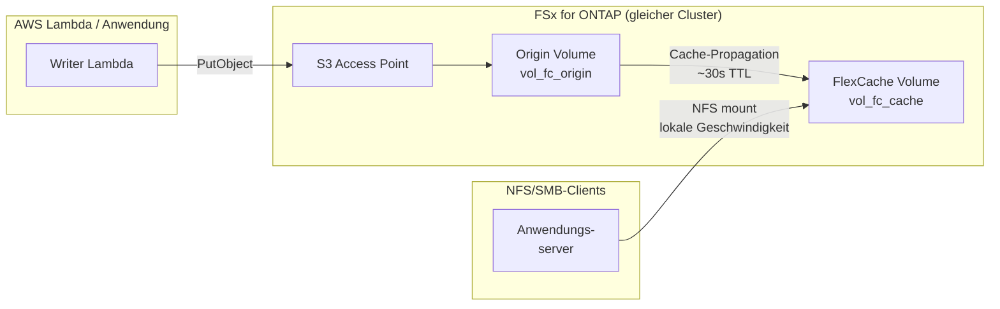

# FlexCache Same-Region + S3 Access Points — Muster

🌐 **Language / 言語**: [日本語](README.md) | [English](README.en.md) | [한국어](README.ko.md) | [简体中文](README.zh-CN.md) | [繁體中文](README.zh-TW.md) | [Français](README.fr.md) | [Deutsch](README.de.md) | [Español](README.es.md)

## Überblick

Ein Muster zur Beschleunigung des Lesezugriffs auf über S3 Access Points gesammelte Daten mittels FlexCache innerhalb desselben FSx for ONTAP Clusters in einer einzelnen Region.

Über S3 AP geschriebene Daten werden auf dem Origin Volume gespeichert und sind über ein FlexCache Volume für NFS/SMB-Clients mit lokaler Cache-Geschwindigkeit lesbar.

## Architektur



## Hauptkomponenten

| Komponente | Beschreibung |
|-----------|--------------|
| Origin Volume | FlexVol mit angehängtem S3 AP. Maßgebliche Datenquelle |
| S3 Access Point | S3 API Schreib-Endpunkt für Lambda / Anwendungen |
| FlexCache Volume | Cached Hot-Data vom Origin. NFS/SMB-Clients mounten hier |
| SVM Peering | Erforderlich für FlexCache auch innerhalb desselben Clusters |

## Voraussetzungen

- FSx for ONTAP Dateisystem (ONTAP 9.12.1 oder höher)
- 2 SVMs (eine für Origin, eine für Cache; gleiche SVM möglich, Trennung empfohlen)
- fsxadmin-Anmeldedaten in Secrets Manager gespeichert
- AWS CLI v2 mit `fsx`-Unterbefehl verfügbar

## Bereitstellung

```bash
# 1. CloudFormation-Stack bereitstellen (erstellt Origin Volume + IAM Role)
aws cloudformation deploy \
  --template-file template.yaml \
  --stack-name fsxn-fc-same-region \
  --parameter-overrides file://params.example.json \
  --capabilities CAPABILITY_NAMED_IAM

# 2. S3 Access Point erstellen (siehe PostDeployInstructions in Stack-Ausgaben)
aws fsx create-and-attach-s3-access-point \
  --cli-input-json file://create-ap.json

# 3. SVM Peering erstellen (ONTAP REST API)
# POST https://<management-ip>/api/svm/peers

# 4. FlexCache Volume erstellen (ONTAP REST API)
# POST https://<management-ip>/api/storage/flexcache/flexcaches
# Hinweis: Mindestgröße 50 GB, use_tiered_aggregate: true erforderlich
```

## Überprüfung

```bash
# Über S3 AP schreiben
aws s3api put-object \
  --bucket <s3-ap-alias> \
  --key test/sample.txt \
  --body /tmp/sample.txt

# Über FlexCache (NFS) lesen — Propagation innerhalb ~30 Sekunden
cat /mnt/fc_cache/test/sample.txt
```

## Leistungsmerkmale (validierte Daten)

| Metrik | Wert | Bedingungen |
|--------|:----:|-------------|
| S3 AP Schreiben → FlexCache NFS lesbar | ~6 Sek | Gleicher Cluster, Standard-Cache-TTL |
| FlexCache Cache-Hit-Latenz | <1 ms | Entspricht lokalem Speicher |
| FlexCache Mindestgröße | 50 GB | FSx for ONTAP Einschränkung |

## Technische Einschränkungen

| Einschränkung | Details |
|--------------|---------|
| S3 AP auf FlexCache Cache Volume | Erfordert ONTAP 9.18.1+. Auf 9.17.1 und früher unterstützt nur Origin Volume S3 AP |
| FlexCache Schreibmodus | Unterstützt write-around (synchron, Standard) und write-back (asynchron, ONTAP 9.15.1+). NICHT schreibgeschützt |
| S3 AP + write-back gleiche Datei Konflikt | Bei gleichzeitiger S3 AP- und write-back-Aktualisierung derselben Datei werden Cache-Dirty-Daten verworfen (XLD revoke) |
| SVM-DR nicht unterstützt | SVMs mit S3 NAS Bucket können SVM-DR nicht verwenden. Nur Volume-level SnapMirror |

## Bereinigung

```bash
# 1. FlexCache Volume löschen (ONTAP REST API)
# DELETE https://<management-ip>/api/storage/flexcache/flexcaches/<uuid>

# 2. SVM Peering löschen (ONTAP REST API)

# 3. S3 Access Point trennen und löschen
aws fsx detach-and-delete-s3-access-point --s3-access-point-arn <arn>

# 4. CloudFormation-Stack löschen
aws cloudformation delete-stack --stack-name fsxn-fc-same-region
```

## Referenzen

- [NetApp Docs: FlexCache supported features](https://docs.netapp.com/us-en/ontap/flexcache/supported-unsupported-features-concept.html)
- [NetApp Docs: S3 multiprotocol](https://docs.netapp.com/us-en/ontap/s3-multiprotocol/index.html)
- [AWS Docs: FSx for ONTAP FlexCache](https://docs.aws.amazon.com/fsx/latest/ONTAPGuide/using-flexcache.html)
- [AWS Docs: FSx for ONTAP S3 Access Points](https://docs.aws.amazon.com/fsx/latest/ONTAPGuide/accessing-data-via-s3-access-points.html)
