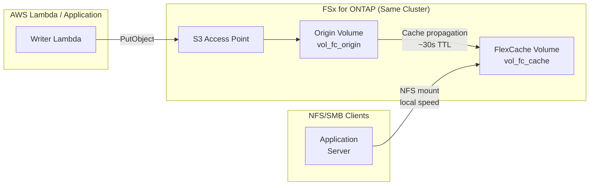

# FlexCache Same-Region + S3 Access Points Pattern

🌐 **Language / 言語**: [日本語](README.md) | [English](README.en.md) | [한국어](README.ko.md) | [简体中文](README.zh-CN.md) | [繁體中文](README.zh-TW.md) | [Français](README.fr.md) | [Deutsch](README.de.md) | [Español](README.es.md)

## Overview

A pattern that accelerates read access to data collected via S3 Access Points using FlexCache within the same FSx for ONTAP cluster in a single region.

Data written via S3 AP is stored on the Origin Volume and becomes readable at local cache speed from NFS/SMB clients through a FlexCache Volume.

## Architecture



## Key Components

| Component | Description |
|-----------|-------------|
| Origin Volume | FlexVol with S3 AP attached. Source of truth for data |
| S3 Access Point | S3 API write entry point for Lambda / applications |
| FlexCache Volume | Caches hot data from Origin. NFS/SMB clients mount here |
| SVM Peering | Required for FlexCache even within the same cluster |

## Prerequisites

> 📐 **Design Guide**: For S3 AP directory design, performance characteristics, and PoC checklist, see [Design Considerations](../../docs/design-considerations-en.md).

- FSx for ONTAP file system (ONTAP 9.12.1 or later)
- 2 SVMs (one for Origin, one for Cache; same SVM possible but separation recommended)
- fsxadmin credentials stored in Secrets Manager
- AWS CLI v2 with `fsx` subcommand available

## Deploy

```bash
# 1. Deploy CloudFormation stack (creates Origin Volume + IAM Role)
aws cloudformation deploy \
  --template-file template.yaml \
  --stack-name fsxn-fc-same-region \
  --parameter-overrides file://params.example.json \
  --capabilities CAPABILITY_NAMED_IAM

# 2. Create S3 Access Point (see PostDeployInstructions in stack outputs)
aws fsx create-and-attach-s3-access-point \
  --cli-input-json file://create-ap.json

# 3. Create SVM Peering (ONTAP REST API)
# POST https://<management-ip>/api/svm/peers

# 4. Create FlexCache Volume (ONTAP REST API)
# POST https://<management-ip>/api/storage/flexcache/flexcaches
# Note: Minimum size 50 GB, use_tiered_aggregate: true required
```

## Verify

```bash
# Write via S3 AP
aws s3api put-object \
  --bucket <s3-ap-alias> \
  --key test/sample.txt \
  --body /tmp/sample.txt

# Read via FlexCache (NFS) — should appear within ~30 seconds
cat /mnt/fc_cache/test/sample.txt
```

## Performance Characteristics (Validated)

| Metric | Value | Conditions |
|--------|:-----:|------------|
| S3 AP write → FlexCache NFS readable | ~6 sec | Same cluster, default cache TTL |
| FlexCache cache-hit latency | <1 ms | Equivalent to local storage |
| FlexCache minimum size | 50 GB | FSx for ONTAP constraint |

## Technical Constraints

| Constraint | Details |
|-----------|---------|
| S3 AP on FlexCache Cache Volume | Requires ONTAP 9.18.1+. On 9.17.1 and earlier, only Origin Volume supports S3 AP |
| FlexCache write mode | Supports both write-around (synchronous, default) and write-back (asynchronous, ONTAP 9.15.1+). FlexCache is NOT read-only |
| S3 AP + write-back same-file conflict | When S3 AP write and FlexCache write-back update the same file, Cache dirty data is discarded (XLD revoke) |
| SVM-DR unsupported | SVM-DR cannot be used on SVMs containing S3 NAS buckets. Volume-level SnapMirror only |

## Clean Up

```bash
# 1. Delete FlexCache Volume (ONTAP REST API)
# DELETE https://<management-ip>/api/storage/flexcache/flexcaches/<uuid>

# 2. Delete SVM Peering (ONTAP REST API)

# 3. Detach and delete S3 Access Point
aws fsx detach-and-delete-s3-access-point --s3-access-point-arn <arn>

# 4. Delete CloudFormation stack
aws cloudformation delete-stack --stack-name fsxn-fc-same-region
```

## References

- [NetApp Docs: FlexCache supported features](https://docs.netapp.com/us-en/ontap/flexcache/supported-unsupported-features-concept.html)
- [NetApp Docs: S3 multiprotocol](https://docs.netapp.com/us-en/ontap/s3-multiprotocol/index.html)
- [AWS Docs: FSx for ONTAP FlexCache](https://docs.aws.amazon.com/fsx/latest/ONTAPGuide/using-flexcache.html)
- [AWS Docs: FSx for ONTAP S3 Access Points](https://docs.aws.amazon.com/fsx/latest/ONTAPGuide/accessing-data-via-s3-access-points.html)
