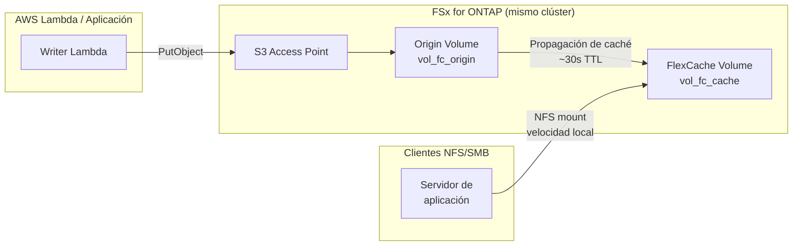

# FlexCache Same-Region + S3 Access Points — Patrón

🌐 **Language / 言語**: [日本語](README.md) | [English](README.en.md) | [한국어](README.ko.md) | [简体中文](README.zh-CN.md) | [繁體中文](README.zh-TW.md) | [Français](README.fr.md) | [Deutsch](README.de.md) | [Español](README.es.md)

## Descripción general

Un patrón que acelera el acceso de lectura a datos recopilados a través de S3 Access Points utilizando FlexCache dentro del mismo clúster FSx for ONTAP en una sola región.

Los datos escritos a través de S3 AP se almacenan en el Origin Volume y se vuelven legibles a velocidad de caché local desde clientes NFS/SMB a través de un FlexCache Volume.

## Arquitectura



## Componentes principales

| Componente | Descripción |
|-----------|-------------|
| Origin Volume | FlexVol con S3 AP adjunto. Fuente de verdad de los datos |
| S3 Access Point | Punto de entrada de escritura S3 API para Lambda / aplicaciones |
| FlexCache Volume | Almacena en caché datos calientes del Origin. Los clientes NFS/SMB montan aquí |
| SVM Peering | Requerido para FlexCache incluso dentro del mismo clúster |

## Prerrequisitos

- Sistema de archivos FSx for ONTAP (ONTAP 9.12.1 o superior)
- 2 SVM (una para Origin, una para Cache; misma SVM posible pero se recomienda separación)
- Credenciales fsxadmin almacenadas en Secrets Manager
- AWS CLI v2 con subcomando `fsx` disponible

## Despliegue

```bash
# 1. Desplegar pila CloudFormation (crea Origin Volume + IAM Role)
aws cloudformation deploy \
  --template-file template.yaml \
  --stack-name fsxn-fc-same-region \
  --parameter-overrides file://params.example.json \
  --capabilities CAPABILITY_NAMED_IAM

# 2. Crear S3 Access Point (ver PostDeployInstructions en salidas de pila)
aws fsx create-and-attach-s3-access-point \
  --cli-input-json file://create-ap.json

# 3. Crear SVM Peering (ONTAP REST API)
# POST https://<management-ip>/api/svm/peers

# 4. Crear FlexCache Volume (ONTAP REST API)
# POST https://<management-ip>/api/storage/flexcache/flexcaches
# Nota: Tamaño mínimo 50 GB, use_tiered_aggregate: true requerido
```

## Verificación

```bash
# Escribir a través de S3 AP
aws s3api put-object \
  --bucket <s3-ap-alias> \
  --key test/sample.txt \
  --body /tmp/sample.txt

# Leer a través de FlexCache (NFS) — propagación en ~30 segundos
cat /mnt/fc_cache/test/sample.txt
```

## Características de rendimiento (datos validados)

| Métrica | Valor | Condiciones |
|---------|:-----:|-------------|
| Escritura S3 AP → FlexCache NFS legible | ~6 seg | Mismo clúster, TTL de caché por defecto |
| Latencia cache hit FlexCache | <1 ms | Equivalente a almacenamiento local |
| Tamaño mínimo FlexCache | 50 GB | Restricción de FSx for ONTAP |

## Restricciones técnicas

| Restricción | Detalles |
|------------|---------|
| S3 AP en FlexCache Cache Volume | Requiere ONTAP 9.18.1+. En 9.17.1 y anteriores, solo Origin Volume soporta S3 AP |
| Modo de escritura FlexCache | Soporta write-around (síncrono, por defecto) y write-back (asíncrono, ONTAP 9.15.1+). NO es solo lectura |
| Conflicto S3 AP + write-back mismo archivo | Cuando S3 AP y write-back actualizan el mismo archivo, los datos sucios del Cache se descartan (XLD revoke) |
| SVM-DR no soportado | Las SVM que contienen S3 NAS bucket no pueden usar SVM-DR. Solo Volume-level SnapMirror |

## Limpieza

```bash
# 1. Eliminar FlexCache Volume (ONTAP REST API)
# DELETE https://<management-ip>/api/storage/flexcache/flexcaches/<uuid>

# 2. Eliminar SVM Peering (ONTAP REST API)

# 3. Separar y eliminar S3 Access Point
aws fsx detach-and-delete-s3-access-point --s3-access-point-arn <arn>

# 4. Eliminar pila CloudFormation
aws cloudformation delete-stack --stack-name fsxn-fc-same-region
```

## Referencias

- [NetApp Docs: FlexCache supported features](https://docs.netapp.com/us-en/ontap/flexcache/supported-unsupported-features-concept.html)
- [NetApp Docs: S3 multiprotocol](https://docs.netapp.com/us-en/ontap/s3-multiprotocol/index.html)
- [AWS Docs: FSx for ONTAP FlexCache](https://docs.aws.amazon.com/fsx/latest/ONTAPGuide/using-flexcache.html)
- [AWS Docs: FSx for ONTAP S3 Access Points](https://docs.aws.amazon.com/fsx/latest/ONTAPGuide/accessing-data-via-s3-access-points.html)
