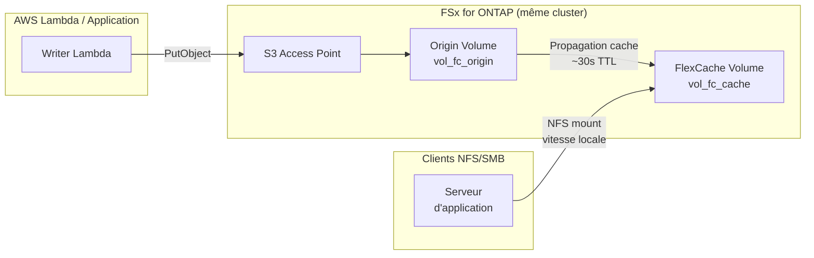

# FlexCache Same-Region + S3 Access Points — Modèle

🌐 **Language / 言語**: [日本語](README.md) | [English](README.en.md) | [한국어](README.ko.md) | [简体中文](README.zh-CN.md) | [繁體中文](README.zh-TW.md) | [Français](README.fr.md) | [Deutsch](README.de.md) | [Español](README.es.md)

## Présentation

Un modèle qui accélère l'accès en lecture aux données collectées via S3 Access Points en utilisant FlexCache au sein du même cluster FSx for ONTAP dans une seule région.

Les données écrites via S3 AP sont stockées sur le Origin Volume et deviennent lisibles à la vitesse du cache local depuis les clients NFS/SMB via un FlexCache Volume.

## Architecture



## Composants principaux

| Composant | Description |
|-----------|-------------|
| Origin Volume | FlexVol avec S3 AP attaché. Source de vérité des données |
| S3 Access Point | Point d'entrée d'écriture S3 API pour Lambda / applications |
| FlexCache Volume | Met en cache les données chaudes de l'Origin. Les clients NFS/SMB montent ici |
| SVM Peering | Requis pour FlexCache même au sein du même cluster |

## Prérequis

- Système de fichiers FSx for ONTAP (ONTAP 9.12.1 ou supérieur)
- 2 SVM (un pour Origin, un pour Cache ; même SVM possible mais séparation recommandée)
- Identifiants fsxadmin stockés dans Secrets Manager
- AWS CLI v2 avec sous-commande `fsx` disponible

## Déploiement

```bash
# 1. Déployer la pile CloudFormation (crée Origin Volume + IAM Role)
aws cloudformation deploy \
  --template-file template.yaml \
  --stack-name fsxn-fc-same-region \
  --parameter-overrides file://params.example.json \
  --capabilities CAPABILITY_NAMED_IAM

# 2. Créer le S3 Access Point (voir PostDeployInstructions dans les sorties)
aws fsx create-and-attach-s3-access-point \
  --cli-input-json file://create-ap.json

# 3. Créer le SVM Peering (ONTAP REST API)
# POST https://<management-ip>/api/svm/peers

# 4. Créer le FlexCache Volume (ONTAP REST API)
# POST https://<management-ip>/api/storage/flexcache/flexcaches
# Note : Taille minimale 50 Go, use_tiered_aggregate: true requis
```

## Vérification

```bash
# Écriture via S3 AP
aws s3api put-object \
  --bucket <s3-ap-alias> \
  --key test/sample.txt \
  --body /tmp/sample.txt

# Lecture via FlexCache (NFS) — propagation sous ~30 secondes
cat /mnt/fc_cache/test/sample.txt
```

## Caractéristiques de performance (données validées)

| Métrique | Valeur | Conditions |
|----------|:------:|------------|
| Écriture S3 AP → FlexCache NFS lisible | ~6 sec | Même cluster, TTL cache par défaut |
| Latence cache hit FlexCache | <1 ms | Équivalent stockage local |
| Taille minimale FlexCache | 50 Go | Contrainte FSx for ONTAP |

## Contraintes techniques

| Contrainte | Détails |
|-----------|---------|
| S3 AP sur FlexCache Cache Volume | Nécessite ONTAP 9.18.1+. Sur 9.17.1 et antérieur, seul Origin Volume supporte S3 AP |
| Mode d'écriture FlexCache | Supporte write-around (synchrone, par défaut) et write-back (asynchrone, ONTAP 9.15.1+). N'est PAS en lecture seule |
| Conflit S3 AP + write-back même fichier | Lorsque S3 AP et write-back modifient le même fichier, les données sales du Cache sont écartées (XLD revoke) |
| SVM-DR non supporté | Les SVM contenant un S3 NAS bucket ne peuvent pas utiliser SVM-DR. Volume-level SnapMirror uniquement |

## Nettoyage

```bash
# 1. Supprimer FlexCache Volume (ONTAP REST API)
# DELETE https://<management-ip>/api/storage/flexcache/flexcaches/<uuid>

# 2. Supprimer SVM Peering (ONTAP REST API)

# 3. Détacher et supprimer le S3 Access Point
aws fsx detach-and-delete-s3-access-point --s3-access-point-arn <arn>

# 4. Supprimer la pile CloudFormation
aws cloudformation delete-stack --stack-name fsxn-fc-same-region
```

## Références

- [NetApp Docs: FlexCache supported features](https://docs.netapp.com/us-en/ontap/flexcache/supported-unsupported-features-concept.html)
- [NetApp Docs: S3 multiprotocol](https://docs.netapp.com/us-en/ontap/s3-multiprotocol/index.html)
- [AWS Docs: FSx for ONTAP FlexCache](https://docs.aws.amazon.com/fsx/latest/ONTAPGuide/using-flexcache.html)
- [AWS Docs: FSx for ONTAP S3 Access Points](https://docs.aws.amazon.com/fsx/latest/ONTAPGuide/accessing-data-via-s3-access-points.html)
