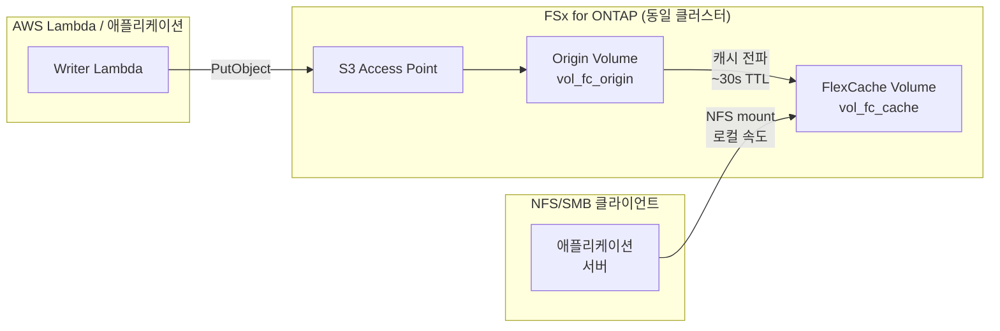

# FlexCache Same-Region + S3 Access Points 패턴

🌐 **Language / 言語**: [日本語](README.md) | [English](README.en.md) | [한국어](README.ko.md) | [简体中文](README.zh-CN.md) | [繁體中文](README.zh-TW.md) | [Français](README.fr.md) | [Deutsch](README.de.md) | [Español](README.es.md)

## 개요

동일 리전 내 FSx for ONTAP 클러스터에서 S3 Access Points를 통해 수집한 데이터를 FlexCache로 읽기 가속하는 패턴입니다.

S3 AP로 기록된 데이터는 Origin Volume에 저장되며, FlexCache Volume을 통해 NFS/SMB 클라이언트에서 로컬 캐시 속도로 읽을 수 있습니다.

## 아키텍처



## 주요 구성 요소

| 구성 요소 | 설명 |
|-----------|------|
| Origin Volume | S3 AP가 연결된 FlexVol. 데이터의 원본 |
| S3 Access Point | Lambda / 애플리케이션의 S3 API 쓰기 진입점 |
| FlexCache Volume | Origin의 핫 데이터를 캐시. NFS/SMB 클라이언트가 마운트하는 대상 |
| SVM Peering | 동일 클러스터 내에서도 FlexCache에 SVM 간 피어링 필요 |

## 사전 요구 사항

- FSx for ONTAP 파일 시스템 (ONTAP 9.12.1 이상)
- SVM 2개 (Origin용 / Cache용. 동일 SVM 가능하나 분리 권장)
- Secrets Manager에 fsxadmin 자격 증명 저장 완료
- AWS CLI v2 + `fsx` 하위 명령 사용 가능

## 배포

```bash
# 1. CloudFormation 스택 배포 (Origin Volume + IAM Role 생성)
aws cloudformation deploy \
  --template-file template.yaml \
  --stack-name fsxn-fc-same-region \
  --parameter-overrides file://params.example.json \
  --capabilities CAPABILITY_NAMED_IAM

# 2. S3 Access Point 생성 (스택 출력의 PostDeployInstructions 참조)
aws fsx create-and-attach-s3-access-point \
  --cli-input-json file://create-ap.json

# 3. SVM Peering 생성 (ONTAP REST API)
# POST https://<management-ip>/api/svm/peers

# 4. FlexCache Volume 생성 (ONTAP REST API)
# POST https://<management-ip>/api/storage/flexcache/flexcaches
# 참고: 최소 크기 50 GB, use_tiered_aggregate: true 필수
```

## 검증

```bash
# S3 AP를 통해 쓰기
aws s3api put-object \
  --bucket <s3-ap-alias> \
  --key test/sample.txt \
  --body /tmp/sample.txt

# FlexCache (NFS)를 통해 읽기 확인 (~30초 이내 전파)
cat /mnt/fc_cache/test/sample.txt
```

## 성능 특성 (검증 데이터)

| 메트릭 | 값 | 조건 |
|--------|:---:|------|
| S3 AP 쓰기 → FlexCache NFS 읽기 가능 | ~6초 | 동일 클러스터, 캐시 TTL 기본값 |
| FlexCache 캐시 히트 레이턴시 | <1 ms | 로컬 스토리지 동등 |
| FlexCache 최소 크기 | 50 GB | FSx for ONTAP 제약 |

## 기술적 제약

| 제약 | 상세 |
|------|------|
| FlexCache Cache Volume에 S3 AP 연결 | ONTAP 9.18.1 이상 필요. 9.17.1 이하에서는 Origin Volume만 S3 AP 지원 |
| FlexCache 쓰기 모드 | write-around(동기, 기본) 및 write-back(비동기, ONTAP 9.15.1+) 모두 지원. 읽기 전용이 아님 |
| S3 AP + write-back 동일 파일 충돌 | S3 AP 쓰기와 FlexCache write-back이 동일 파일 업데이트 시 Cache 더티 데이터 폐기 (XLD revoke) |
| SVM-DR 미지원 | S3 NAS bucket을 포함하는 SVM에서는 SVM-DR 사용 불가. Volume-level SnapMirror만 가능 |

## 정리

```bash
# 1. FlexCache Volume 삭제 (ONTAP REST API)
# DELETE https://<management-ip>/api/storage/flexcache/flexcaches/<uuid>

# 2. SVM Peering 삭제 (ONTAP REST API)

# 3. S3 Access Point 분리 및 삭제
aws fsx detach-and-delete-s3-access-point --s3-access-point-arn <arn>

# 4. CloudFormation 스택 삭제
aws cloudformation delete-stack --stack-name fsxn-fc-same-region
```

## 참고 자료

- [NetApp Docs: FlexCache supported features](https://docs.netapp.com/us-en/ontap/flexcache/supported-unsupported-features-concept.html)
- [NetApp Docs: S3 multiprotocol](https://docs.netapp.com/us-en/ontap/s3-multiprotocol/index.html)
- [AWS Docs: FSx for ONTAP FlexCache](https://docs.aws.amazon.com/fsx/latest/ONTAPGuide/using-flexcache.html)
- [AWS Docs: FSx for ONTAP S3 Access Points](https://docs.aws.amazon.com/fsx/latest/ONTAPGuide/accessing-data-via-s3-access-points.html)
