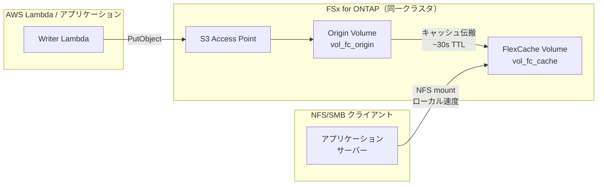

# FlexCache Same-Region + S3 Access Points パターン

🌐 **Language / 言語**: [日本語](README.md) | [English](README.en.md) | [한국어](README.ko.md) | [简体中文](README.zh-CN.md) | [繁體中文](README.zh-TW.md) | [Français](README.fr.md) | [Deutsch](README.de.md) | [Español](README.es.md)

## 概要

同一リージョン内の FSx for ONTAP クラスタで、S3 Access Points 経由で収集したデータを FlexCache で読み取り加速するパターン。

S3 AP で書き込まれたデータは Origin Volume に格納され、FlexCache Volume を経由して NFS/SMB クライアントからローカルキャッシュ速度で読み取り可能になる。

## アーキテクチャ



## 主要コンポーネント

| コンポーネント | 説明 |
|--------------|------|
| Origin Volume | S3 AP がアタッチされた FlexVol。データの正本 |
| S3 Access Point | Lambda / アプリケーションからの S3 API 書き込み窓口 |
| FlexCache Volume | Origin のホットデータをキャッシュ。NFS/SMB クライアントはここをマウント |
| SVM Peering | 同一クラスタ内でも FlexCache には SVM 間ピアリングが必要 |

## 前提条件

> 📐 **設計ガイド**: S3 AP のディレクトリ設計、性能特性、PoC チェックリストは [設計考慮事項](../../docs/design-considerations.md) を参照。

- FSx for ONTAP ファイルシステム（ONTAP 9.12.1 以上）
- 2 つの SVM（Origin 用 / Cache 用。同一 SVM でも可だが分離を推奨）
- Secrets Manager に fsxadmin 認証情報が格納済み
- AWS CLI v2 + `fsx` サブコマンドが利用可能

## デプロイ

```bash
# 1. CloudFormation スタックのデプロイ（Origin Volume + IAM Role 作成）
aws cloudformation deploy \
  --template-file template.yaml \
  --stack-name fsxn-fc-same-region \
  --parameter-overrides file://params.example.json \
  --capabilities CAPABILITY_NAMED_IAM

# 2. S3 Access Point の作成（スタック出力の PostDeployInstructions を参照）
aws fsx create-and-attach-s3-access-point \
  --cli-input-json file://create-ap.json

# 3. SVM Peering の作成（ONTAP REST API）
# POST https://<management-ip>/api/svm/peers

# 4. FlexCache Volume の作成（ONTAP REST API）
# POST https://<management-ip>/api/storage/flexcache/flexcaches
# Note: 最小サイズ 50 GB、use_tiered_aggregate: true が必須
```

## 検証

```bash
# S3 AP 経由で書き込み
aws s3api put-object \
  --bucket <s3-ap-alias> \
  --key test/sample.txt \
  --body /tmp/sample.txt

# FlexCache (NFS) 経由で読み取り確認（~30 秒以内に伝搬）
cat /mnt/fc_cache/test/sample.txt
```

## 性能特性（検証データ）

| メトリクス | 値 | 条件 |
|-----------|:---:|------|
| S3 AP 書き込み → FlexCache NFS 読み取り可能 | ~6 秒 | 同一クラスタ、キャッシュ TTL デフォルト |
| FlexCache キャッシュヒット時レイテンシ | <1 ms | ローカルストレージ相当 |
| FlexCache 最小サイズ | 50 GB | FSx for ONTAP 制約 |

## 技術的制約

| 制約 | 詳細 |
|------|------|
| FlexCache Cache Volume への S3 AP アタッチ | ONTAP 9.18.1 以上が必要。9.17.1 以下では Origin Volume のみ S3 AP 対応 |
| FlexCache 書き込みモード | write-around（同期、デフォルト）と write-back（非同期、ONTAP 9.15.1+）の両方をサポート。「read-only」ではない |
| S3 AP + write-back 同一ファイル競合 | S3 AP 書き込みと FlexCache write-back が同一ファイルを更新すると、Cache 側のダーティデータが破棄される（XLD revoke） |
| SVM-DR 非対応 | S3 NAS bucket を含む SVM では SVM-DR は使用不可。Volume-level SnapMirror のみ |

## クリーンアップ

```bash
# 1. FlexCache Volume 削除（ONTAP REST API）
# DELETE https://<management-ip>/api/storage/flexcache/flexcaches/<uuid>

# 2. SVM Peering 削除（ONTAP REST API）

# 3. S3 Access Point のデタッチ・削除
aws fsx detach-and-delete-s3-access-point --s3-access-point-arn <arn>

# 4. CloudFormation スタック削除
aws cloudformation delete-stack --stack-name fsxn-fc-same-region
```

## 参考資料

- [NetApp Docs: FlexCache supported features](https://docs.netapp.com/us-en/ontap/flexcache/supported-unsupported-features-concept.html)
- [NetApp Docs: S3 multiprotocol](https://docs.netapp.com/us-en/ontap/s3-multiprotocol/index.html)
- [AWS Docs: FSx for ONTAP FlexCache](https://docs.aws.amazon.com/fsx/latest/ONTAPGuide/using-flexcache.html)
- [AWS Docs: FSx for ONTAP S3 Access Points](https://docs.aws.amazon.com/fsx/latest/ONTAPGuide/accessing-data-via-s3-access-points.html)
