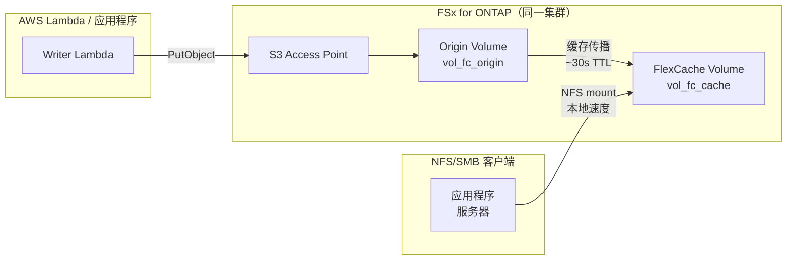

# FlexCache Same-Region + S3 Access Points 模式

🌐 **Language / 言語**: [日本語](README.md) | [English](README.en.md) | [한국어](README.ko.md) | [简体中文](README.zh-CN.md) | [繁體中文](README.zh-TW.md) | [Français](README.fr.md) | [Deutsch](README.de.md) | [Español](README.es.md)

## 概述

在同一区域内的 FSx for ONTAP 集群中，通过 S3 Access Points 收集的数据使用 FlexCache 加速读取的模式。

通过 S3 AP 写入的数据存储在 Origin Volume 中，NFS/SMB 客户端可以通过 FlexCache Volume 以本地缓存速度读取。

## 架构



## 主要组件

| 组件 | 说明 |
|------|------|
| Origin Volume | 挂载 S3 AP 的 FlexVol。数据的权威来源 |
| S3 Access Point | Lambda / 应用程序的 S3 API 写入入口 |
| FlexCache Volume | 缓存 Origin 的热点数据。NFS/SMB 客户端挂载此卷 |
| SVM Peering | 即使在同一集群内，FlexCache 也需要 SVM 间对等连接 |

## 前提条件

- FSx for ONTAP 文件系统（ONTAP 9.12.1 或更高版本）
- 2 个 SVM（Origin 用 / Cache 用。可使用同一 SVM，但建议分离）
- fsxadmin 凭证已存储在 Secrets Manager 中
- AWS CLI v2 + `fsx` 子命令可用

## 部署

```bash
# 1. 部署 CloudFormation 堆栈（创建 Origin Volume + IAM Role）
aws cloudformation deploy \
  --template-file template.yaml \
  --stack-name fsxn-fc-same-region \
  --parameter-overrides file://params.example.json \
  --capabilities CAPABILITY_NAMED_IAM

# 2. 创建 S3 Access Point（参见堆栈输出的 PostDeployInstructions）
aws fsx create-and-attach-s3-access-point \
  --cli-input-json file://create-ap.json

# 3. 创建 SVM Peering（ONTAP REST API）
# POST https://<management-ip>/api/svm/peers

# 4. 创建 FlexCache Volume（ONTAP REST API）
# POST https://<management-ip>/api/storage/flexcache/flexcaches
# 注意：最小大小 50 GB，use_tiered_aggregate: true 必需
```

## 验证

```bash
# 通过 S3 AP 写入
aws s3api put-object \
  --bucket <s3-ap-alias> \
  --key test/sample.txt \
  --body /tmp/sample.txt

# 通过 FlexCache (NFS) 读取确认（~30 秒内传播）
cat /mnt/fc_cache/test/sample.txt
```

## 性能特性（验证数据）

| 指标 | 值 | 条件 |
|------|:---:|------|
| S3 AP 写入 → FlexCache NFS 可读 | ~6 秒 | 同一集群，缓存 TTL 默认值 |
| FlexCache 缓存命中延迟 | <1 ms | 等同本地存储 |
| FlexCache 最小大小 | 50 GB | FSx for ONTAP 限制 |

## 技术限制

| 限制 | 详情 |
|------|------|
| FlexCache Cache Volume 的 S3 AP 挂载 | 需要 ONTAP 9.18.1 以上。9.17.1 及以下仅 Origin Volume 支持 S3 AP |
| FlexCache 写入模式 | 支持 write-around（同步，默认）和 write-back（异步，ONTAP 9.15.1+）。非只读 |
| S3 AP + write-back 同一文件冲突 | S3 AP 写入与 FlexCache write-back 更新同一文件时，Cache 脏数据被丢弃（XLD revoke） |
| SVM-DR 不支持 | 包含 S3 NAS bucket 的 SVM 无法使用 SVM-DR。仅支持 Volume-level SnapMirror |

## 清理

```bash
# 1. 删除 FlexCache Volume（ONTAP REST API）
# DELETE https://<management-ip>/api/storage/flexcache/flexcaches/<uuid>

# 2. 删除 SVM Peering（ONTAP REST API）

# 3. 分离并删除 S3 Access Point
aws fsx detach-and-delete-s3-access-point --s3-access-point-arn <arn>

# 4. 删除 CloudFormation 堆栈
aws cloudformation delete-stack --stack-name fsxn-fc-same-region
```

## 参考资料

- [NetApp Docs: FlexCache supported features](https://docs.netapp.com/us-en/ontap/flexcache/supported-unsupported-features-concept.html)
- [NetApp Docs: S3 multiprotocol](https://docs.netapp.com/us-en/ontap/s3-multiprotocol/index.html)
- [AWS Docs: FSx for ONTAP FlexCache](https://docs.aws.amazon.com/fsx/latest/ONTAPGuide/using-flexcache.html)
- [AWS Docs: FSx for ONTAP S3 Access Points](https://docs.aws.amazon.com/fsx/latest/ONTAPGuide/accessing-data-via-s3-access-points.html)
