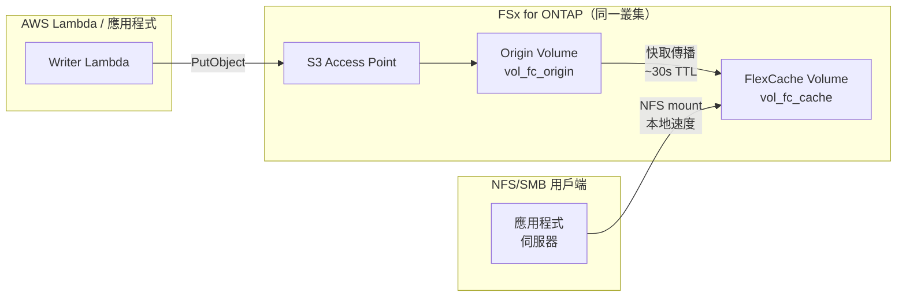

# FlexCache Same-Region + S3 Access Points 模式

🌐 **Language / 言語**: [日本語](README.md) | [English](README.en.md) | [한국어](README.ko.md) | [简体中文](README.zh-CN.md) | [繁體中文](README.zh-TW.md) | [Français](README.fr.md) | [Deutsch](README.de.md) | [Español](README.es.md)

## 概述

在同一區域內的 FSx for ONTAP 叢集中，透過 S3 Access Points 收集的資料使用 FlexCache 加速讀取的模式。

透過 S3 AP 寫入的資料存儲在 Origin Volume 中，NFS/SMB 用戶端可透過 FlexCache Volume 以本地快取速度讀取。

## 架構



## 主要元件

| 元件 | 說明 |
|------|------|
| Origin Volume | 掛載 S3 AP 的 FlexVol。資料的權威來源 |
| S3 Access Point | Lambda / 應用程式的 S3 API 寫入入口 |
| FlexCache Volume | 快取 Origin 的熱點資料。NFS/SMB 用戶端掛載此卷 |
| SVM Peering | 即使在同一叢集內，FlexCache 也需要 SVM 間對等連線 |

## 先決條件

- FSx for ONTAP 檔案系統（ONTAP 9.12.1 或更高版本）
- 2 個 SVM（Origin 用 / Cache 用。可使用同一 SVM，但建議分離）
- fsxadmin 認證資訊已存儲在 Secrets Manager 中
- AWS CLI v2 + `fsx` 子命令可用

## 部署

```bash
# 1. 部署 CloudFormation 堆疊（建立 Origin Volume + IAM Role）
aws cloudformation deploy \
  --template-file template.yaml \
  --stack-name fsxn-fc-same-region \
  --parameter-overrides file://params.example.json \
  --capabilities CAPABILITY_NAMED_IAM

# 2. 建立 S3 Access Point（參見堆疊輸出的 PostDeployInstructions）
aws fsx create-and-attach-s3-access-point \
  --cli-input-json file://create-ap.json

# 3. 建立 SVM Peering（ONTAP REST API）
# POST https://<management-ip>/api/svm/peers

# 4. 建立 FlexCache Volume（ONTAP REST API）
# POST https://<management-ip>/api/storage/flexcache/flexcaches
# 注意：最小大小 50 GB，use_tiered_aggregate: true 必需
```

## 驗證

```bash
# 透過 S3 AP 寫入
aws s3api put-object \
  --bucket <s3-ap-alias> \
  --key test/sample.txt \
  --body /tmp/sample.txt

# 透過 FlexCache (NFS) 讀取確認（~30 秒內傳播）
cat /mnt/fc_cache/test/sample.txt
```

## 效能特性（驗證資料）

| 指標 | 值 | 條件 |
|------|:---:|------|
| S3 AP 寫入 → FlexCache NFS 可讀 | ~6 秒 | 同一叢集，快取 TTL 預設值 |
| FlexCache 快取命中延遲 | <1 ms | 等同本地儲存 |
| FlexCache 最小大小 | 50 GB | FSx for ONTAP 限制 |

## 技術限制

| 限制 | 詳情 |
|------|------|
| FlexCache Cache Volume 的 S3 AP 掛載 | 需要 ONTAP 9.18.1 以上。9.17.1 及以下僅 Origin Volume 支援 S3 AP |
| FlexCache 寫入模式 | 支援 write-around（同步，預設）和 write-back（非同步，ONTAP 9.15.1+）。非唯讀 |
| S3 AP + write-back 同一檔案衝突 | S3 AP 寫入與 FlexCache write-back 更新同一檔案時，Cache 髒資料被丟棄（XLD revoke） |
| SVM-DR 不支援 | 包含 S3 NAS bucket 的 SVM 無法使用 SVM-DR。僅支援 Volume-level SnapMirror |

## 清理

```bash
# 1. 刪除 FlexCache Volume（ONTAP REST API）
# DELETE https://<management-ip>/api/storage/flexcache/flexcaches/<uuid>

# 2. 刪除 SVM Peering（ONTAP REST API）

# 3. 分離並刪除 S3 Access Point
aws fsx detach-and-delete-s3-access-point --s3-access-point-arn <arn>

# 4. 刪除 CloudFormation 堆疊
aws cloudformation delete-stack --stack-name fsxn-fc-same-region
```

## 參考資料

- [NetApp Docs: FlexCache supported features](https://docs.netapp.com/us-en/ontap/flexcache/supported-unsupported-features-concept.html)
- [NetApp Docs: S3 multiprotocol](https://docs.netapp.com/us-en/ontap/s3-multiprotocol/index.html)
- [AWS Docs: FSx for ONTAP FlexCache](https://docs.aws.amazon.com/fsx/latest/ONTAPGuide/using-flexcache.html)
- [AWS Docs: FSx for ONTAP S3 Access Points](https://docs.aws.amazon.com/fsx/latest/ONTAPGuide/accessing-data-via-s3-access-points.html)
