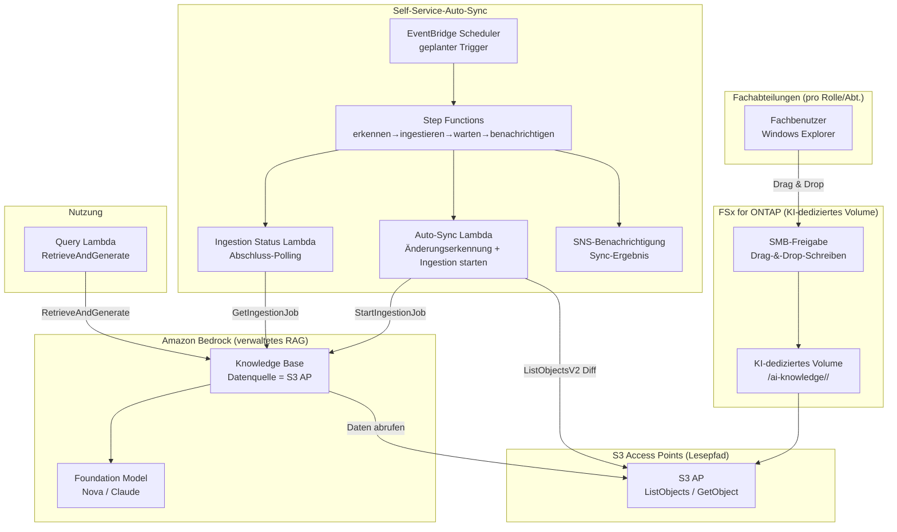

# Self-Service Knowledge Base Curation (Demokratisierter KI-Wissensbetrieb)

🌐 **Language / 言語**: [日本語](README.md) | [English](README.en.md) | [한국어](README.ko.md) | [简体中文](README.zh-CN.md) | [繁體中文](README.zh-TW.md) | [Français](README.fr.md) | [Deutsch](README.de.md) | [Español](README.es.md)

## Überblick

Ein Muster, das es Mitgliedern der Fachabteilungen ermöglicht, eine Amazon Bedrock Knowledge Base-Datenquelle **allein mit dem vertrauten Drag & Drop des Windows Explorers** zu pflegen.

Auf FSx for ONTAP wird ein **KI-dediziertes Volume / Ordner** bereitgestellt und über SMB (Windows-Freigabe) für jede Rolle/Abteilung veröffentlicht. Dieselben Daten werden **über S3 Access Points (den Lesepfad)** als Datenquelle mit einer Amazon Bedrock Knowledge Base verbunden, und Dateizugänge werden erkannt, um die **Ingestion automatisch auszuführen**.

Dies verlagert den Betrieb von einem Modell, in dem die IT-Abteilung manuelles ETL / Kopieren / Ingestion auf Anfrage durchführt, zu einem **demokratisierten Modell, in dem das Fachpersonal sein eigenes Wissen pflegt**.

## Before / After (Betriebstransformation)

> **Hinweis**: Das Folgende ist eine verallgemeinerte Betriebsgeschichte mit maskierten spezifischen Kunden- und Personennamen.

### Before — Abhängig von der manuellen Arbeit des IT-Teams

```
Fachabteilung: „Ein neues Produkt ist erschienen, bitte legt die Unterlagen
                aus diesem Windows-Teamordner in das KI-Wissen (der Vertrieb
                nutzt es in einer Demo)."
   ↓ Anforderungsticket
IT-Abteilung → kopiert Dateien manuell von einem Windows Server auf EC2
        → lädt in einen S3-Bucket hoch
        → führt die Ingestion in die Bedrock Knowledge Base manuell aus
        → sendet Abschlussmeldung
```

- Die IT-Abteilung greift bei jeder Anfrage ein → Engpass und Zeitverzögerung
- **Doppelte Datenverwaltung** durch Kopierarbeit sowie verpasste Aktualisierungen
- „Wer hat wann was eingestellt" wird personenabhängig

### After — Vom Fachpersonal geführter Self-Service

```
IT-Abteilung: „Legt die Daten, die die KI nutzen soll, in diesen Windows-Ordner
               und pflegt sie selbst. Die KI referenziert diese Daten."
   ↓
Fachabteilung → zieht wie gewohnt per Windows Explorer per Drag & Drop in den
                KI-dedizierten Ordner (hinzufügen / aktualisieren / löschen)
   ↓ (automatisch)
Die Bedrock Knowledge Base synchronisiert über S3 Access Point → sofort durchsuchbar
```

- Keine Anfragebearbeitung durch die IT-Abteilung nötig → kürzere Durchlaufzeit
- Dateien bleiben die **Masterkopie auf FSx for ONTAP** (keine Kopie nach S3)
- Die Datenverantwortung ist auf jede Rolle/Abteilung verteilt (Demokratisierung)

## Gelöste Probleme

| Problem | Wie dieses Muster es löst |
|------|-------------------|
| Wissensaktualisierungen warten auf manuelle Arbeit der IT-Abteilung | Das Fachpersonal pflegt sie direkt mit Windows-Operationen; automatische Ingestion |
| Doppelte Datenverwaltung durch Kopieren nach S3 | Die FSx for ONTAP-Masterkopie wird über S3 AP direkt zur Datenquelle |
| Verpasste Ingestion / veraltete Aktualisierungen | Dateizugänge werden erkannt und automatisch ingestiert |
| Erfordert Spezialkenntnisse (ETL/S3/Bedrock) | Nur Drag & Drop im Windows Explorer |
| Unklare Datenverantwortung | Ordnerlayout nach Rolle/Abteilung aufgeteilt für klare Verantwortung |

## Architektur



## Zwei Betriebsszenarien (Demo)

Auf derselben Basis können Sie je nach Betriebsreife zwei Stufen erleben. Siehe [Demo-Leitfaden](docs/demo-guide.md) für Details.

| Szenario | Zusammenfassung | Ingestion-Trigger |
|---------|------|----------------|
| **A: Manuelle Pflege zum Anfassen** | KI-Daten mit Windows-Dateioperationen pflegen (hinzufügen/aktualisieren/löschen); Ingestion manuell (Konsole „Sync" / CLI) | Manuell |
| **B: Automatisierung** | Die manuelle Synchronisation von A mit Lambda + Step Functions + EventBridge automatisieren (erkennen→ingestieren→warten→benachrichtigen) | Automatisch |

> Die Aktion des Fachbenutzers (Drag & Drop) ist in beiden Szenarien unverändert. Es ändert sich nur, ob eine Person oder Serverless alles ab der Ingestion übernimmt.

## Hybrides RAG: interne Dokumente + Websuche (opt-in, NEW)

> Integriert das **AgentCore Web Search Tool**, das auf dem AWS Summit NYC 2026 (2026-06-17) GA wurde.

Wenn Sie `EnableWebSearch=true` setzen, erzeugt die Query Lambda eine einheitliche Antwort, die die interne KB-Antwort mit Echtzeit-Websuchergebnissen anreichert.

| Modus | Antwortquelle | Anwendungsfall |
|--------|-----------|-------------|
| `EnableWebSearch=false` (Standard) | Nur interne Dokumente (FSx for ONTAP → S3 Vectors) | Interne Wissens-QA |
| `EnableWebSearch=true` | Interne Dokumente + Websuchergebnisse | Aktuelle Vorschriften, Markttrends, Produktvergleich |

- Graceful Degradation: Selbst wenn Web Search fehlschlägt, antwortet es nur mit der internen KB
- Zitattrennung: `[Intern: Dateiname]` + `[Web: Titel](URL)`
- Sicherheit: Web-Ergebnisse sind nicht vertrauenswürdige Daten, mit vorhandener Prompt-Injection-Abwehr

Details: [docs/investigations/agentcore-web-search-fsxn-integration.md](../../docs/investigations/agentcore-web-search-fsxn-integration.md)

## Self-Service-Betriebsmodell (Demokratisierung)

### Ordnergestaltung des KI-dedizierten Volumes (an den von Amazon Quick angenommenen Rollen ausgerichtet)

Die Geschäftsrollen (Abteilungen) werden breit bereitgestellt, um den Rollen zu entsprechen, die **Amazon Quick** anspricht.
Die Quick-FAQ nennt ausdrücklich „sales, marketing, IT, operations, finance, legal" als Ziele,
und developers hat eine dedizierte Seite.

```
/ai-knowledge/                     ← KI-dediziertes Volume (SMB-Freigabe)
├── sales/                         ← Vertrieb (Account-Pläne, Produktinfos, Playbooks)
├── marketing/                     ← Marketing (Marke, Kampagnen, Inhalte)
├── finance/                       ← Finanzen & Buchhaltung (Budgets, Ausgaben, Prognosen)
├── information-technology/        ← IT (Runbooks, IT-FAQ, Sicherheit)
├── operations/                    ← Operations (SOPs, Geschäftsprozesse)
├── legal/                         ← Recht (Verträge, NDA, Compliance)
└── developers/                    ← Entwicklung (Standards, Onboarding, Servicekatalog)
```

| Ordner | Rolle | Angenommen in Amazon Quick (Referenz, time-sensitive) |
|-----------|--------|--------------------------------|
| `sales/` | Vertrieb | Lead scoring / Sales forecasting / CRM ([/quick/sales/](https://aws.amazon.com/quick/sales/)) |
| `marketing/` | Marketing | Kampagnen, Marke, Inhalte (Quick FAQ) |
| `finance/` | Finanzen & Buchhaltung | Budgets, Ausgaben, Prognosen (Quick FAQ) |
| `information-technology/` | IT | Incident Response, IT-FAQ, Sicherheit ([/quick/information-technology/](https://aws.amazon.com/quick/information-technology/)) |
| `operations/` | Operations | SOPs, Geschäftsprozesse (Quick FAQ) |
| `legal/` | Recht | Verträge, Compliance (Quick FAQ) |
| `developers/` | Entwicklung | Coding-Standards, Onboarding ([/quick/developers/](https://aws.amazon.com/quick/developers/)) |

- Jeder Ordner gewährt der zuständigen Rolle/Abteilung Schreibrechte über **NTFS ACLs**
- Fachbenutzer fügen im Ordner ihrer eigenen Abteilung per **Drag & Drop** hinzu/aktualisieren/löschen
- Die IT-Abteilung ist nur für die Pflege des Ordnerlayouts und der Ingestion-Automatisierung zuständig
- **Beispieldaten** für jede Rolle liegen in [`sample-data/ai-knowledge/`](sample-data/) bei (zum Laden der Demo)

> Diese UC richtet ihr Rollenlayout an der danach geplanten **Amazon Quick UC** aus und kann die
> Ordner/Testdaten desselben KI-dedizierten Volumes gemeinsam nutzen/wiederverwenden.

### Automatischer Ingestion-Ablauf (Szenario B)

1. **EventBridge Scheduler** startet die Step Functions periodisch (z. B. `rate(15 minutes)`)
2. **Auto-Sync Lambda** **erkennt den Diff (neu/aktualisiert)** mit `ListObjectsV2` auf dem S3 AP
3. Bei einem Diff startet er `StartIngestionJob` der Bedrock Knowledge Base (ohne Diff endet er sofort)
4. **Ingestion Status Lambda** pollt mit `GetIngestionJob` auf Abschluss
5. Er **benachrichtigt über das Ingestion-Ergebnis per SNS** (geladene Anzahl / Fehleranzahl)

> In Szenario A (manuell) führt eine Person die Schritte 2–5 in der Konsole/CLI aus. Szenario B ersetzt dies durch Step Functions.

> **Designentscheidung**: Dieses Muster verwendet eine **verwaltete Bedrock Knowledge Base** (Pattern C), um die Betriebslast zu minimieren. Wenn eine strikte ACL-Steuerung auf Dateiebene zur Suchzeit erforderlich ist, wählen Sie ein benutzerdefiniertes berechtigungsbewusstes RAG ([FC3 genai-rag-enterprise-files](../genai-rag-enterprise-files/), Pattern A).

### Berechtigungs-/Rolleneingrenzung (Metadatenfilter-Option)

Auch bei einer verwalteten KB ermöglicht **Metadatenfilterung** eine Eingrenzung zur Suchzeit nach „Rolle/Abteilung/Vertraulichkeitsstufe".
Legen Sie neben jede Datei eine `<file>.metadata.json` und übergeben Sie `role` oder einen beliebigen `filter` zur Abfragezeit.

```jsonc
// Beispiel: product-x-spec.md.metadata.json
{ "metadataAttributes": { "role": "sales", "classification": "internal" } }
```

```bash
# Suche auf die Vertriebsrolle eingegrenzt
aws lambda invoke --function-name <QueryFn> \
  --payload '{"query":"Was sind die Spezifikationen von Produkt X?","role":"sales"}' \
  --cli-binary-format raw-in-base64-out out.json
```

> **Wichtige Einschränkungen (KB, die S3 Vectors als Vektorspeicher verwendet)**:
> - **Filterbare Metadaten müssen pro Dokument innerhalb von 2048 Bytes bleiben** (bei Überschreitung schlägt die Ingestion fehl). Halten Sie `metadataAttributes` klein
> - Metadatendateien sind maximal 10 KB pro Datei
> - Zu selektive Filter können den Recall der approximativen Nächste-Nachbarn-Suche verringern (bewerten Sie die Filtergranularität, bevor Sie entscheiden)
> - Dies ist **Sucheingrenzung**, keine Zugriffssteuerung auf AWS-Seite. Wenn eine strikte Zugriffssteuerung pro einzelnem Benutzer erforderlich ist, ziehen Sie
>   die Dokumentebenen-ACL der S3-Wissensbasis von Amazon Quick (siehe [UC30](../genai-quick-agentic-workspace/)) oder
>   ein benutzerdefiniertes berechtigungsbewusstes RAG (FC3) in Betracht

## Wahl zwischen verwalteter KB und benutzerdefiniertem RAG

| Aspekt | Diese UC: verwaltete KB (Pattern C) | FC3: benutzerdefiniertes RAG (Pattern A) |
|------|------------------------------|------------------------------|
| Hauptziel | Datenbetrieb demokratisieren, Betriebslast reduzieren | Berechtigungsfilter auf Dateiebene zur Suchzeit |
| RAG-Implementierung | Bedrock Knowledge Bases (verwaltet) | OpenSearch + benutzerdefinierte Suche + ACL-Extraktion |
| Zugriffssteuerung | Ordner-/Freigabeebene (SMB ACL) + KB-Datenquellengrenze | AD-SID-Metadatenfilter pro Chunk |
| Betriebslast | Niedrig (verwaltet) | Mittel bis hoch (selbst gebaute Pipeline) |
| Am besten geeignet für | Abteilungsinternes gemeinsames Wissen, interne FAQ, Produktinfos | Regulierte Branchen, vertrauliche Dokumente, benutzerabhängige Sichtbarkeit |

## Verzeichnisstruktur

```
genai-kb-selfservice-curation/
├── README.md / README.en.md
├── template.yaml                 # SAM: Self-Service-Auto-Sync-Schicht
├── samconfig.toml.example
├── functions/
│   ├── auto_sync/handler.py      # Änderungserkennung + Ingestion starten
│   ├── ingestion_status/handler.py  # Ingestion-Abschluss-Polling (Szenario B)
│   └── query/handler.py          # RetrieveAndGenerate (Demo-Q&A)
├── sample-data/                  # rollenspezifische Seed-Daten (zum Laden der Demo)
│   └── ai-knowledge/<role>/...   # sales / marketing / finance / it / operations / legal / developers
├── tests/
│   └── test_handlers.py
└── docs/
    ├── architecture.md
    └── demo-guide.md             # Szenario A (manuell) / B (Automatisierung) (maskiert)
```

> **Bereitstellungsvoraussetzung**: Erstellen Sie die Knowledge Base selbst und ihre Datenquelle (S3 AP) mit dem verifizierten Skript [`scripts/create_bedrock_kb.py`](../scripts/create_bedrock_kb.py) oder der Bedrock-Konsole und übergeben Sie deren `KnowledgeBaseId` / `DataSourceId` an die Parameter dieses Templates. Da die Erstellung des OpenSearch-Serverless-Vektorindex nicht CloudFormation-nativ ist, wird diese getrennte Konfiguration verwendet.

## Sicherheitsdesign

- **Keine Datenbewegung**: Dateien bleiben die Masterkopie auf FSx for ONTAP, nur lesend über S3 AP
- **Schreiben nur über SMB/NFS**: Der KI-Ingestion-Pfad (S3 AP) ist ein Lesezugriff. Das Schreiben erfolgt über die Windows-Freigabe
- **Verantwortungstrennung auf Ordnerebene**: NTFS ACLs trennen Schreibrechte pro Abteilung
- **Minimale Rechte**: Lambda darf nur List/Get auf dem Ziel-S3 AP und Ingestion auf dieser KB
- **Audit**: CloudTrail (API-Operationen) + ONTAP-Auditprotokolle (Dateioperationen) + Ingestion-Job-Verlauf
- **Verschlüsselung**: SSE-FSX (Speicher), TLS (bei der Übertragung), KMS (SNS / Protokolle)

> **Hinweis**: Die S3-AP-Datenquellengrenze liegt auf Volume-/Präfixebene. Wenn Sie die Sichtbarkeit pro Benutzer variieren möchten, ziehen Sie statt dieser UC ein benutzerdefiniertes berechtigungsbewusstes RAG in Betracht.

## Zielbranchen / Anwendungsfälle

- Fertigung & Engineering (internes gemeinsames Wissen zu Produktinfos / Spezifikationsblättern)
- Vertrieb & Kundensupport (Angebotsunterlagen / FAQ / Fehlerbehebung)
- Backoffice (interne Vorschriften / Verfahrenshandbücher)
- Internes Wissen allgemein, das innerhalb einer Abteilung abgeschlossen ist

## Success Metrics

### Outcome
Demokratisierten KI-Datenbetrieb realisieren, bei dem Fachabteilungen ihr Wissen ohne manuelle Arbeit der IT-Abteilung selbst pflegen.

### Metrics

| Metrik | Ziel (Beispiel) |
|-----------|------------|
| Durchlaufzeit der Wissensaktualisierung (Ablage → durchsuchbar) | < 15 Min (abhängig vom Planungsintervall) |
| Manuelle Ingestion-Anfragen der IT-Abteilung | 0 / Monat (nach Migration) |
| Erfolgsrate der automatischen Ingestion | > 98 % |
| Verpassungsrate der Änderungserkennung | 0 % (vollständiger List-Scan) |
| Aktion des Fachbenutzers | Nur Windows-Drag & Drop |

### Measurement Method
EventBridge-Scheduler-Ausführungsverlauf, Bedrock-Ingestion-Job-Statistiken (scanned / indexed / failed), CloudWatch Metrics, SNS-Benachrichtigungsprotokolle.

---

## Data Classification

| Ausgabe | Klassifizierung | Begründung |
|------|------|------|
| Bedrock-KB-Ingestion-Ergebnis (Vektoren + Metadaten) | INTERNAL | Erbt dieselbe Klassifizierung wie die Quelldateien. Nicht zur externen Offenlegung |
| Ingestion-Job-Status / SNS-Benachrichtigung | INTERNAL | Betriebsmetadaten. Enthält keine vertraulichen Daten |
| CloudWatch Metrics / Logs | INTERNAL | Aggregierte Metriken. Enthalten keinen Dateiinhalt |

> In regulierten Branchen ist zusätzlich eine CUI-/FISC-/HIPAA-Klassifizierung erforderlich. Erweitern Sie das Label-System in `shared/data_classification.py` passend zu Ihrem Anwendungsfall.
> `dataDeletionPolicy=DELETE` löscht Vektoren sofort, wenn Dateien gelöscht werden, aber bei einer Aufbewahrungsanforderung verwenden Sie `RETAIN` und entwerfen ein separates Purge-Verfahren.

---

## AWS-Dokumentationslinks

| Service | Dokumentation |
|---------|------------|
| FSx for ONTAP | [Benutzerhandbuch](https://docs.aws.amazon.com/fsx/latest/ONTAPGuide/what-is-fsx-ontap.html) |
| S3 Access Points for FSx for ONTAP | [S3-AP-Leitfaden](https://docs.aws.amazon.com/fsx/latest/ONTAPGuide/s3-access-points.html) |
| FSx for ONTAP + Bedrock RAG-Tutorial | [Build RAG with Bedrock](https://docs.aws.amazon.com/fsx/latest/ONTAPGuide/tutorial-build-rag-with-bedrock.html) |
| Amazon Bedrock Knowledge Bases | [Knowledge Bases](https://docs.aws.amazon.com/bedrock/latest/userguide/knowledge-base.html) |
| Bedrock-KB-Datenaufnahme | [Ingest your data](https://docs.aws.amazon.com/bedrock/latest/userguide/kb-data-source.html) |
| RetrieveAndGenerate API | [API-Referenz](https://docs.aws.amazon.com/bedrock/latest/APIReference/API_agent-runtime_RetrieveAndGenerate.html) |
| EventBridge Scheduler | [Benutzerhandbuch](https://docs.aws.amazon.com/scheduler/latest/UserGuide/what-is-scheduler.html) |

### Well-Architected-Framework-Zuordnung

| Säule | Zuordnung |
|----|------|
| Operative Exzellenz | Self-Service-Betrieb, automatische Ingestion, SNS-Benachrichtigung, strukturierte Protokolle |
| Sicherheit | ACL auf Ordnerebene, IAM-minimale Rechte, keine Datenbewegung, Auditprotokolle |
| Zuverlässigkeit | Änderungserkennung per vollständigem List-Scan, Überwachung des Ingestion-Job-Status |
| Leistungseffizienz | Ingestion nur bei Diff gestartet, Skalierung der verwalteten KB |
| Kostenoptimierung | Serverless, differenzielle Synchronisation, Nutzung verwalteter Services |
| Nachhaltigkeit | On-Demand-Ausführung, Vermeidung unnötiger Re-Ingestion |

---

## Kostenschätzung (monatliche Näherung)

> **Hinweis**: Das Folgende ist eine Näherung für die Region ap-northeast-1; die tatsächlichen Kosten variieren je nach Nutzung. Prüfen Sie die aktuellen Preise im [AWS Pricing Calculator](https://calculator.aws/). Benchmarks und Preise sind time-sensitive.

### Serverless-Komponenten (nutzungsbasiert)

| Service | Stückpreis | Angenommene Nutzung | Monatliche Näherung |
|---------|------|-----------|---------|
| Lambda (Auto-Sync) | $0.0000166667/GB-sec | 15-Min-Intervall × 512MB | ~$1-3 |
| S3 API (ListObjects/GetObject) | $0.0047/10K requests | ~30K requests/Tag | ~$4 |
| EventBridge Scheduler | $1.00/1 Mio. invocations | ~3K invocations/Monat | ~$0.01 |
| Bedrock Ingestion (Embeddings) | Modell nutzungsbasiert | nur Diff-Dateien | ~$2-10 |
| Bedrock-Antwortgenerierung (Nova/Claude) | Modell nutzungsbasiert | abhängig von der Abfrageanzahl | ~$3-20 |
| SNS | $0.50/100K notifications | ~3K/Monat | ~$0.02 |
| CloudWatch Logs | $0.76/GB ingested | ~1 GB/Monat | ~$0.76 |
| OpenSearch Serverless (KB-Vektorspeicher) | $0.24/OCU-hour | min. 2 OCU ~ | separat (abhängig von KB-Konfiguration) |

### Fixkosten (setzt bestehende Umgebung voraus)

| Komponente | Monatlich |
|--------------|------|
| FSx for ONTAP (teilt sich das bestehende KI-dedizierte Volume) | teilt sich die bestehende Umgebung |
| S3 Access Point | keine zusätzlichen Gebühren (nur S3-API-Gebühren) |

> **Governance Caveat**: Kostenschätzungen sind Näherungen, keine garantierten Werte. Die tatsächliche Abrechnung variiert je nach Nutzungsmuster, Datenvolumen, Region und der Vektorspeicherkonfiguration der KB.

---

## Lokales Testen

### Prüfung der Voraussetzungen

```bash
aws --version          # AWS CLI v2
sam --version          # SAM CLI
python3 --version      # Python 3.12+
aws sts get-caller-identity  # AWS-Anmeldeinformationen
```

### Unit-Tests

```bash
python3 -m pytest tests/ -v
```

### sam local invoke

```bash
# Voraussetzung: AWS SAM CLI erforderlich. „sam build" paketiert den Code und die gemeinsame Schicht automatisch.
sam build
sam local invoke AutoSyncFunction --event events/auto-sync-event.json
```

---

## Ausgabebeispiel (Output Sample)

### Auto-Sync Lambda (Änderungserkennung + Ingestion starten)

```json
{
  "status": "ingestion_started",
  "changed_files_detected": 4,
  "knowledge_base_id": "XXXXXXXXXX",
  "data_source_id": "YYYYYYYYYY",
  "ingestion_job_id": "ZZZZZZZZZZ",
  "scanned_prefix": "sales/product-catalog/",
  "timestamp": 1760000000
}
```

### Query Lambda (RetrieveAndGenerate)

```json
{
  "query": "Nenne mir die wichtigsten Spezifikationen des neuen Produkts X",
  "answer": "Die wichtigsten Spezifikationen des neuen Produkts X sind der Wägebereich... (basierend auf den ingestierten Dokumenten)",
  "citations": [
    {"source": "sales/product-catalog/product-x-spec.pdf", "score": 0.93}
  ]
}
```

> **Hinweis**: Das Obige ist eine Beispielausgabe; die tatsächlichen Werte variieren je nach Umgebung und Eingabedaten. Die Zahlen sind eine Sizing-Referenz, kein Service-Limit.

---

## Performance Considerations

- Die Durchsatzkapazität von FSx for ONTAP wird zwischen NFS/SMB/S3AP geteilt. Beachten Sie, dass die SMB-Schreibvorgänge der Fachbenutzer und die KI-Ingestion-Lesevorgänge sich dieselbe Kapazität teilen
- Die Latenz über den S3 Access Point verursacht einen Overhead von einigen zehn Millisekunden
- Beim Laden vieler Dateien brauchen Ingestion-Jobs Zeit bis zum Abschluss. Setzen Sie das Planungsintervall länger als die Ingestion-Dauer
- Da die Änderungserkennung ein vollständiger List-Scan ist, sollten Sie bei sehr vielen Dateien eine Präfixaufteilung in Betracht ziehen

> **Hinweis**: Die Leistungszahlen dieses Musters sind eine Sizing-Referenz, kein Service-Limit. Die reale Leistung variiert je nach FSx-for-ONTAP-Durchsatzkapazität, Dateianzahl und gleichzeitigen Workloads.

---

## Verwandte UCs / Links

| Verwandt | Relevanter Punkt |
|---------|------------|
| [PoC-Voraussetzungs-Checkliste](docs/poc-checklist.md) | Prüfpunkte vor der Bereitstellung (S3-Vectors-Einschränkungen, Inferenzprofile usw.) |
| [Cleanup-Runbook](../docs/uc29-uc30-cleanup-runbook.md) | Abbauverfahren einschließlich manueller Artefakte (von 2 UCs geteilt) |
| [FC3 genai-rag-enterprise-files](../genai-rag-enterprise-files/) | Benutzerdefiniertes RAG, wenn strikte Berechtigungsfilterung erforderlich ist (Pattern A) |
| [Erweiterungsmuster: Bedrock-KB-Integration](../docs/extension-patterns.md) | Generisches Muster verwaltete KB + S3 AP |
| [KB-Erstellungsskript](../scripts/create_bedrock_kb.py) | KB-/Datenquellen-Erstellung (Bereitstellungsvoraussetzung für diese UC) |
| [Branchen-/Workload-Zuordnung](../docs/industry-workload-mapping.md) | UC-Auswahlleitfaden |

## Betriebshärtung (implementiert)

- **Verhinderung gleichzeitiger Ausführung**: Auto-Sync überspringt einen Neustart, wenn ein laufender Ingestion-Job existiert (`ingestion_in_progress`)
- **Retry/Catch der Step Functions**: Wiederholungen auf Lambda-Tasks (exponentielles Backoff) und ein `NotifyFailure`-Zweig bei Fehler
- **Metadatenfilter**: Query kann mit `role`/einem beliebigen `filter` nach Rolle/Abteilung eingrenzen

---

## Bereitstellung

Stellen Sie mit der AWS SAM CLI bereit (ersetzen Sie die Platzhalter für Ihre Umgebung):

> **Bereitstellungsvoraussetzung**: Dieses Template setzt eine bestehende Amazon Bedrock Knowledge Base und Datenquelle (S3-AP-Verbindung) voraus. Da die Erstellung des OpenSearch-Serverless-Vektorindex nicht CloudFormation-nativ ist, erstellen Sie die Knowledge Base selbst vor der Bereitstellung und übergeben deren `KnowledgeBaseId` / `DataSourceId` als Parameter (mit `scripts/create_bedrock_kb.py` im Repository-Root oder der Bedrock-Konsole erstellen).

```bash
# Voraussetzung: AWS SAM CLI erforderlich. „sam build" paketiert den Code und die gemeinsame Schicht automatisch.
sam build

sam deploy \
  --stack-name fsxn-kb-selfservice-curation \
  --parameter-overrides \
    S3AccessPointAlias=<your-s3ap-alias> \
    S3AccessPointName=<your-s3ap-name> \
    KnowledgeBaseId=<your-kb-id> \
    DataSourceId=<your-datasource-id> \
    NotificationEmail=<your-email@example.com> \
  --capabilities CAPABILITY_NAMED_IAM \
  --resolve-s3 \
  --region <your-region>
```

> **Hinweis**: `template.yaml` wird mit der SAM CLI (`sam build` + `sam deploy`) verwendet.
> Um direkt mit dem Befehl `aws cloudformation deploy` bereitzustellen, verwenden Sie `template-deploy.yaml` (erfordert das Vorpaketieren der Lambda-Zip-Dateien und das Hochladen in einen S3-Bucket).

## Governance Note

> Dieses Muster bietet technische Architekturleitlinien. Es ist keine rechtliche, Compliance- oder regulatorische Beratung. Organisationen sollten qualifizierte Fachleute konsultieren. Die S3-AP-Datenquellengrenze liegt auf Volume-/Präfixebene; wenn eine Sichtbarkeitssteuerung pro einzelnem Benutzer erforderlich ist, liegt dies außerhalb des Umfangs dieser UC.
>
> **Drei Schichten der Zugriffssteuerung (je nach Anwendungsfall wählen)**: ① Sucheingrenzung = Bedrock-KB-Metadatenfilter (diese UC, keine AWS-Autorisierung) / ② ACL auf Dokumentebene = Amazon Quick S3-Wissensbasis ([UC30](../genai-quick-agentic-workspace/), pro Benutzer/Gruppe) / ③ Berechtigungsfilter pro Chunk = benutzerdefiniertes berechtigungsbewusstes RAG ([FC3](../genai-rag-enterprise-files/), AD SID/NTFS ACL, für regulierte Branchen)
