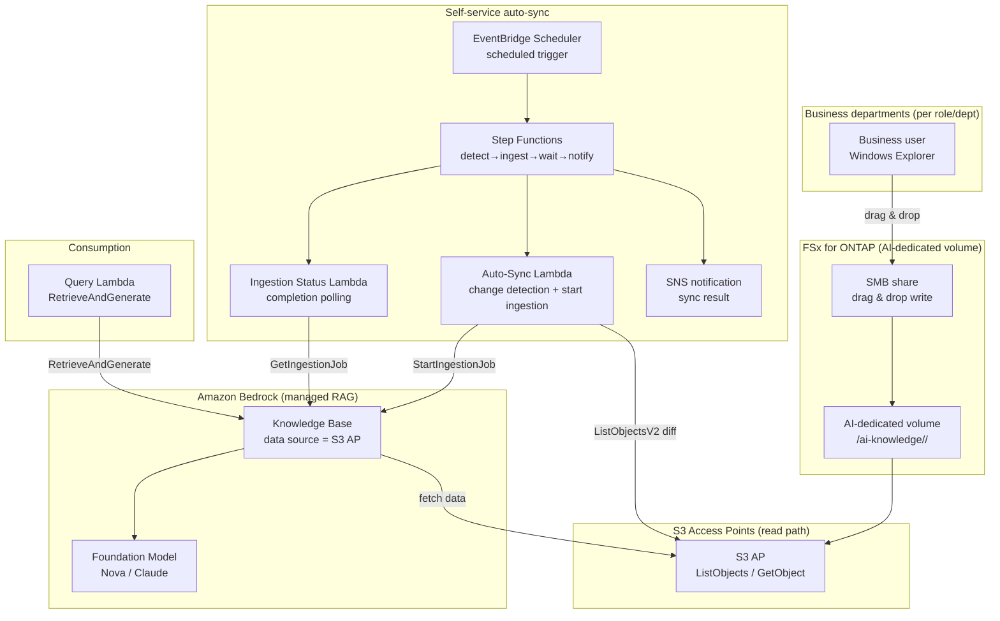

# Self-Service Knowledge Base Curation (Democratized AI Knowledge Operations)

🌐 **Language / 言語**: [日本語](README.md) | [English](README.en.md) | [한국어](README.ko.md) | [简体中文](README.zh-CN.md) | [繁體中文](README.zh-TW.md) | [Français](README.fr.md) | [Deutsch](README.de.md) | [Español](README.es.md)

## Overview

A pattern that lets business-department members maintain an Amazon Bedrock Knowledge Base data source **using only the familiar Windows Explorer drag & drop operation**.

An **AI-dedicated volume / folder** is prepared on FSx for ONTAP and published to each role/department over SMB (Windows share). The same data is connected to an Amazon Bedrock Knowledge Base data source **via S3 Access Points (the read path)**, and file additions are detected to run **ingestion automatically**.

This shifts operations from a model where the IT department performs manual ETL / copy / ingestion on a request basis to a **democratized model in which the field maintains its own knowledge**.

## Before / After (Operational Transformation)

> **Note**: The following is a generalized operational story with specific customer names and individual names masked.

### Before — Dependent on IT team manual work

```
Business dept: "A new product launched, so please put the materials in this
                Windows team folder into the AI knowledge (Sales will use it in a demo)."
   ↓ request ticket
IT dept → manually copies files from a Windows Server on EC2
        → uploads to an S3 bucket
        → manually runs ingestion into the Bedrock Knowledge Base
        → sends completion notice
```

- IT department intervenes on every request → bottleneck and time lag
- **Double management of data** from copy work, plus missed updates
- "Who put what in, and when" becomes dependent on individuals

### After — Field-led self-service

```
IT dept: "Put the data you want the AI to use into this Windows folder and
          maintain it yourselves. The AI will reference this data."
   ↓
Business dept → drags & drops into the AI-dedicated folder with Windows Explorer
                as usual (add / update / delete)
   ↓ (automatic)
Bedrock Knowledge Base syncs via S3 Access Point → immediately searchable
```

- No IT department request handling needed → shorter lead time
- Files stay as the **master copy on FSx for ONTAP** (no copy to S3)
- Data ownership is distributed to each role/department (democratization)

## Problems Solved

| Problem | How this pattern solves it |
|------|-------------------|
| Knowledge updates wait on IT department manual work | The field maintains it directly with Windows operations; automatic ingestion |
| Double data management from copying to S3 | The FSx for ONTAP master becomes the data source directly via S3 AP |
| Missed ingestion / stale updates | File additions are detected and ingested automatically |
| Requires specialist skills (ETL/S3/Bedrock) | Windows Explorer drag & drop only |
| Unclear data owner | Folder layout split per role/department for clear responsibility |

## Architecture



## Two operational scenarios (demo)

On the same foundation, you can experience two stages according to operational maturity. See the [demo guide](docs/demo-guide.md) for details.

| Scenario | Summary | Ingestion trigger |
|---------|------|----------------|
| **A: Manual maintenance hands-on** | Maintain AI data with Windows file operations (add/update/delete); ingestion is manual (console "Sync" / CLI) | Manual |
| **B: Automation** | Automate A's manual sync with Lambda + Step Functions + EventBridge (detect→ingest→wait→notify) | Automatic |

> The business user's operation (drag & drop) is unchanged in both scenarios. Only whether a person or serverless handles everything from ingestion onward changes.

## Hybrid RAG: internal documents + web search (opt-in, NEW)

> Integrates the **AgentCore Web Search Tool** that became GA at AWS Summit NYC 2026 (2026-06-17).

When you set `EnableWebSearch=true`, the Query Lambda generates a unified answer that augments the internal KB answer with real-time web search results.

| Mode | Answer source | Use case |
|--------|-----------|-------------|
| `EnableWebSearch=false` (default) | Internal documents only (FSx for ONTAP → S3 Vectors) | Internal knowledge QA |
| `EnableWebSearch=true` | Internal documents + web search results | Latest regulations, market trends, product comparison |

- Graceful degradation: even if Web Search fails, it answers with the internal KB only
- Citation separation: `[Internal: filename]` + `[Web: title](URL)`
- Security: web results are untrusted data, with prompt injection defense in place

Details: [docs/investigations/agentcore-web-search-fsxn-integration.md](../../docs/investigations/agentcore-web-search-fsxn-integration.md)

## Self-service operational model (democratization)

### Folder design of the AI-dedicated volume (aligned with Amazon Quick target roles)

Business roles (departments) are provided broadly to match the roles that **Amazon Quick** targets.
The Quick FAQ explicitly lists "sales, marketing, IT, operations, finance, legal" as targets,
and developers has a dedicated page.

```
/ai-knowledge/                     ← AI-dedicated volume (SMB share)
├── sales/                         ← Sales (account plans, product info, playbooks)
├── marketing/                     ← Marketing (brand, campaigns, content)
├── finance/                       ← Finance & accounting (budgets, expenses, forecasts)
├── information-technology/        ← IT (runbooks, IT FAQ, security)
├── operations/                    ← Operations (SOPs, business processes)
├── legal/                         ← Legal (contracts, NDA, compliance)
└── developers/                    ← Development (standards, onboarding, service catalog)
```

| Folder | Role | Assumed in Amazon Quick (reference, time-sensitive) |
|-----------|--------|--------------------------------|
| `sales/` | Sales | Lead scoring / Sales forecasting / CRM ([/quick/sales/](https://aws.amazon.com/quick/sales/)) |
| `marketing/` | Marketing | Campaigns, brand, content (Quick FAQ) |
| `finance/` | Finance & accounting | Budgets, expenses, forecasts (Quick FAQ) |
| `information-technology/` | IT | Incident response, IT FAQ, security ([/quick/information-technology/](https://aws.amazon.com/quick/information-technology/)) |
| `operations/` | Operations | SOPs, business processes (Quick FAQ) |
| `legal/` | Legal | Contracts, compliance (Quick FAQ) |
| `developers/` | Development | Coding standards, onboarding ([/quick/developers/](https://aws.amazon.com/quick/developers/)) |

- Each folder grants write permission to the responsible role/department with **NTFS ACLs**
- Business users add/update/delete in their own department folder via **drag & drop**
- The IT department is responsible only for maintaining the folder layout and ingestion automation
- **Sample data** for each role ships in [`sample-data/ai-knowledge/`](sample-data/) (for demo loading)

> This UC aligns its role layout with the **Amazon Quick UC** planned to be created afterward, and can
> share/reuse the folders/test data of the same AI-dedicated volume.

### Automatic ingestion flow (Scenario B)

1. **EventBridge Scheduler** periodically starts the Step Functions (e.g., `rate(15 minutes)`)
2. **Auto-Sync Lambda** **detects the diff (new/updated)** with `ListObjectsV2` on the S3 AP
3. If there is a diff, it starts `StartIngestionJob` of the Bedrock Knowledge Base (if none, it ends immediately)
4. **Ingestion Status Lambda** polls for completion with `GetIngestionJob`
5. It **notifies the ingestion result via SNS** (loaded count / failure count)

> In Scenario A (manual), a person does steps 2–5 in the console/CLI. Scenario B replaces that with Step Functions.

> **Design decision**: This pattern adopts a **managed Bedrock Knowledge Base** (Pattern C) to minimize operational load. If strict file-level query-time ACL control is required, choose a custom permission-aware RAG ([FC3 genai-rag-enterprise-files](../genai-rag-enterprise-files/), Pattern A).

### Permission / role narrowing (metadata filter option)

Even with a managed KB, **metadata filtering** enables query-time narrowing by "role/department/classification".
Place a `<file>.metadata.json` alongside each file and pass `role` or an arbitrary `filter` at query time.

```jsonc
// Example: product-x-spec.md.metadata.json
{ "metadataAttributes": { "role": "sales", "classification": "internal" } }
```

```bash
# Search narrowed to the sales role
aws lambda invoke --function-name <QueryFn> \
  --payload '{"query":"What are the specs of Product X?","role":"sales"}' \
  --cli-binary-format raw-in-base64-out out.json
```

> **Important constraints (KB using S3 Vectors as the vector store)**:
> - **Filterable metadata must be within 2048 bytes per document** (ingestion fails if exceeded). Keep `metadataAttributes` small
> - Metadata files are at most 10 KB per file
> - Overly selective filters can reduce approximate nearest neighbor recall (evaluate filter granularity before deciding)
> - This is **search narrowing**, not AWS-side access control. If strict per-individual-user access control is required, consider
>   Amazon Quick's S3 knowledge base document-level ACL (see [UC30](../genai-quick-agentic-workspace/)) or
>   a custom permission-aware RAG (FC3)

## Managed KB vs Custom RAG choice

| Aspect | This UC: Managed KB (Pattern C) | FC3: Custom RAG (Pattern A) |
|------|------------------------------|------------------------------|
| Primary goal | Democratize data operations, reduce operational load | File-level permission filter at query time |
| RAG implementation | Bedrock Knowledge Bases (managed) | OpenSearch + custom retrieval + ACL extraction |
| Access control | Folder/share level (SMB ACL) + KB data source boundary | Per-chunk AD SID metadata filter |
| Operational load | Low (managed) | Medium–high (self-built pipeline) |
| Best fit | Intra-department shared knowledge, internal FAQ, product info | Regulated industries, confidential documents, per-user visibility differs |

## Directory structure

```
genai-kb-selfservice-curation/
├── README.md / README.en.md
├── template.yaml                 # SAM: self-service auto-sync layer
├── samconfig.toml.example
├── functions/
│   ├── auto_sync/handler.py      # change detection + start ingestion
│   ├── ingestion_status/handler.py  # ingestion completion polling (Scenario B)
│   └── query/handler.py          # RetrieveAndGenerate (demo Q&A)
├── sample-data/                  # per-role seed data (for demo loading)
│   └── ai-knowledge/<role>/...   # sales / marketing / finance / it / operations / legal / developers
├── tests/
│   └── test_handlers.py
└── docs/
    ├── architecture.md
    └── demo-guide.md             # Scenario A (manual) / B (automation) (masked)
```

> **Deployment prerequisite**: Create the Knowledge Base itself and its data source (S3 AP) with the verified script [`scripts/create_bedrock_kb.py`](../scripts/create_bedrock_kb.py) or the Bedrock console, and pass its `KnowledgeBaseId` / `DataSourceId` to this template's parameters. Because OpenSearch Serverless vector index creation is not CloudFormation-native, this split configuration is adopted.

## Security design

- **No data movement**: files stay as the master copy on FSx for ONTAP, read-only via S3 AP
- **Writes via SMB/NFS only**: the AI ingestion path (S3 AP) is read access. Writes go via the Windows share
- **Folder-level responsibility separation**: NTFS ACLs separate write permission per department
- **Least privilege**: Lambda is only allowed List/Get on the target S3 AP and Ingestion on that KB
- **Audit**: CloudTrail (API operations) + ONTAP audit logs (file operations) + ingestion job history
- **Encryption**: SSE-FSX (storage), TLS (in transit), KMS (SNS / logs)

> **Note**: The S3 AP data source boundary is at the volume/prefix level. If you want to vary visibility per user, consider a custom permission-aware RAG instead of this UC.

## Target industries / use cases

- Manufacturing & engineering (internal shared knowledge of product info / spec sheets)
- Sales & customer support (proposal materials / FAQ / troubleshooting)
- Back office (internal regulations / procedure manuals)
- Internal knowledge in general that is self-contained within a department

## Success Metrics

### Outcome
Realize democratized AI data operations where business departments maintain knowledge themselves without IT department manual work.

### Metrics

| Metric | Target (example) |
|-----------|------------|
| Knowledge update lead time (drop → searchable) | < 15 min (depends on schedule interval) |
| IT department manual ingestion requests | 0 / month (after migration) |
| Auto-ingestion success rate | > 98% |
| Change-detection miss rate | 0% (full list scan) |
| Business user operation | Windows drag & drop only |

### Measurement Method
EventBridge Scheduler execution history, Bedrock ingestion job statistics (scanned / indexed / failed), CloudWatch Metrics, SNS notification logs.

---

## Data Classification

| Output | Classification | Rationale |
|------|------|------|
| Bedrock KB ingestion result (vectors + metadata) | INTERNAL | Inherits the same classification as the source files. Not for external disclosure |
| Ingestion job status / SNS notification | INTERNAL | Operational metadata. Contains no confidential data |
| CloudWatch Metrics / Logs | INTERNAL | Aggregate metrics. Contain no file content |

> In regulated industries, CUI / FISC / HIPAA classification is additionally required. Extend the label system in `shared/data_classification.py` to fit your use case.
> `dataDeletionPolicy=DELETE` immediately deletes vectors when files are deleted, but if there is a retention requirement, use `RETAIN` and design a separate purge procedure.

---

## AWS documentation links

| Service | Documentation |
|---------|------------|
| FSx for ONTAP | [User Guide](https://docs.aws.amazon.com/fsx/latest/ONTAPGuide/what-is-fsx-ontap.html) |
| S3 Access Points for FSx for ONTAP | [S3 AP Guide](https://docs.aws.amazon.com/fsx/latest/ONTAPGuide/s3-access-points.html) |
| FSx for ONTAP + Bedrock RAG tutorial | [Build RAG with Bedrock](https://docs.aws.amazon.com/fsx/latest/ONTAPGuide/tutorial-build-rag-with-bedrock.html) |
| Amazon Bedrock Knowledge Bases | [Knowledge Bases](https://docs.aws.amazon.com/bedrock/latest/userguide/knowledge-base.html) |
| Bedrock KB data ingestion | [Ingest your data](https://docs.aws.amazon.com/bedrock/latest/userguide/kb-data-source.html) |
| RetrieveAndGenerate API | [API Reference](https://docs.aws.amazon.com/bedrock/latest/APIReference/API_agent-runtime_RetrieveAndGenerate.html) |
| EventBridge Scheduler | [User Guide](https://docs.aws.amazon.com/scheduler/latest/UserGuide/what-is-scheduler.html) |

### Well-Architected Framework alignment

| Pillar | Alignment |
|----|------|
| Operational Excellence | Self-service operations, automatic ingestion, SNS notification, structured logs |
| Security | Folder-level ACL, IAM least privilege, no data movement, audit logs |
| Reliability | Change detection via full list scan, ingestion job status monitoring |
| Performance Efficiency | Ingestion started only on diff, managed KB scaling |
| Cost Optimization | Serverless, differential sync, use of managed services |
| Sustainability | On-demand execution, avoidance of unnecessary re-ingestion |

---

## Cost estimate (monthly approximate)

> **Note**: The following is an approximation for the ap-northeast-1 region; actual cost varies by usage. Check the latest pricing at the [AWS Pricing Calculator](https://calculator.aws/). Benchmarks and prices are time-sensitive.

### Serverless components (pay-as-you-go)

| Service | Unit price | Assumed usage | Monthly approximate |
|---------|------|-----------|---------|
| Lambda (Auto-Sync) | $0.0000166667/GB-sec | 15-min interval × 512MB | ~$1-3 |
| S3 API (ListObjects/GetObject) | $0.0047/10K requests | ~30K requests/day | ~$4 |
| EventBridge Scheduler | $1.00/1M invocations | ~3K invocations/month | ~$0.01 |
| Bedrock Ingestion (Embeddings) | model pay-per-use | diff files only | ~$2-10 |
| Bedrock answer generation (Nova/Claude) | model pay-per-use | depends on query count | ~$3-20 |
| SNS | $0.50/100K notifications | ~3K/month | ~$0.02 |
| CloudWatch Logs | $0.76/GB ingested | ~1 GB/month | ~$0.76 |
| OpenSearch Serverless (KB vector store) | $0.24/OCU-hour | min 2 OCU ~ | separate (depends on KB config) |

### Fixed cost (assumes existing environment)

| Component | Monthly |
|--------------|------|
| FSx for ONTAP (shares the existing AI-dedicated volume) | shares existing environment |
| S3 Access Point | no additional charge (S3 API charges only) |

> **Governance Caveat**: Cost estimates are approximate, not guaranteed values. Actual billing varies by usage pattern, data volume, region, and the KB's vector store configuration.

---

## Local testing

### Prerequisites check

```bash
aws --version          # AWS CLI v2
sam --version          # SAM CLI
python3 --version      # Python 3.12+
aws sts get-caller-identity  # AWS credentials
```

### Unit tests

```bash
python3 -m pytest tests/ -v
```

### sam local invoke

```bash
# Prerequisite: AWS SAM CLI required. 'sam build' packages the code and shared layer automatically.
sam build
sam local invoke AutoSyncFunction --event events/auto-sync-event.json
```

---

## Output Sample

### Auto-Sync Lambda (change detection + start ingestion)

```json
{
  "status": "ingestion_started",
  "changed_files_detected": 4,
  "knowledge_base_id": "XXXXXXXXXX",
  "data_source_id": "YYYYYYYYYY",
  "ingestion_job_id": "ZZZZZZZZZZ",
  "scanned_prefix": "sales/product-catalog/",
  "timestamp": 1760000000
}
```

### Query Lambda (RetrieveAndGenerate)

```json
{
  "query": "Tell me the main specs of new Product X",
  "answer": "The main specs of new Product X are the weighing range... (based on ingested documents)",
  "citations": [
    {"source": "sales/product-catalog/product-x-spec.pdf", "score": 0.93}
  ]
}
```

> **Note**: The above is sample output; actual values vary by environment and input data. The numbers are a sizing reference, not a service limit.

---

## Performance Considerations

- The FSx for ONTAP throughput capacity is shared across NFS/SMB/S3AP. Note that business users' SMB writes and AI ingestion reads share the same capacity
- Latency via the S3 Access Point incurs an overhead of tens of milliseconds
- When loading many files, ingestion jobs take time to complete. Set the schedule interval longer than the ingestion time
- Because change detection is a full list scan, consider prefix splitting when the file count is very large

> **Note**: The performance numbers in this pattern are a sizing reference, not a service limit. Real-world performance varies by FSx for ONTAP throughput capacity, file count, and concurrent workloads.

---

## Related UCs / links

| Related | Relevance |
|---------|------------|
| [PoC prerequisites checklist](docs/poc-checklist.md) | Pre-deployment checks (S3 Vectors constraints, inference profiles, etc.) |
| [Cleanup runbook](../docs/uc29-uc30-cleanup-runbook.md) | Teardown procedure including manual artifacts (shared by 2 UCs) |
| [FC3 genai-rag-enterprise-files](../genai-rag-enterprise-files/) | Custom RAG when strict permission filtering is required (Pattern A) |
| [Extension pattern: Bedrock KB integration](../docs/extension-patterns.md) | Generic managed KB + S3 AP pattern |
| [KB creation script](../scripts/create_bedrock_kb.py) | KB / data source creation (deployment prerequisite for this UC) |
| [Industry / workload mapping](../docs/industry-workload-mapping.md) | UC selection guide |

## Operational hardening (implemented)

- **Concurrent-run prevention**: Auto-Sync skips a new start if there is an in-progress ingestion job (`ingestion_in_progress`)
- **Step Functions Retry/Catch**: retries on Lambda tasks (exponential backoff) and a `NotifyFailure` branch on failure
- **Metadata filter**: Query can narrow by role/department with `role`/an arbitrary `filter`

---

## Deployment

Deploy with the AWS SAM CLI (replace the placeholders for your environment):

> **Deployment prerequisite**: This template assumes an existing Amazon Bedrock Knowledge Base and data source (S3 AP connection). Because OpenSearch Serverless vector index creation is not CloudFormation-native, create the Knowledge Base itself before deployment and pass its `KnowledgeBaseId` / `DataSourceId` as parameters (create with `scripts/create_bedrock_kb.py` at the repo root, or the Bedrock console).

```bash
# Prerequisite: AWS SAM CLI required. 'sam build' packages the code and shared layer automatically.
sam build

sam deploy \
  --stack-name fsxn-kb-selfservice-curation \
  --parameter-overrides \
    S3AccessPointAlias=<your-s3ap-alias> \
    S3AccessPointName=<your-s3ap-name> \
    KnowledgeBaseId=<your-kb-id> \
    DataSourceId=<your-datasource-id> \
    NotificationEmail=<your-email@example.com> \
  --capabilities CAPABILITY_NAMED_IAM \
  --resolve-s3 \
  --region <your-region>
```

> **Note**: `template.yaml` is used with SAM CLI (`sam build` + `sam deploy`).
> To deploy directly with the `aws cloudformation deploy` command, use `template-deploy.yaml` (requires pre-packaging Lambda zip files and uploading to an S3 bucket).

## Governance Note

> This pattern provides technical architecture guidance. It is not legal, compliance, or regulatory advice. Organizations should consult qualified professionals. The S3 AP data source boundary is at the volume/prefix level; if per-individual-user visibility control is required, it is out of scope for this UC.
>
> **Three layers of access control (choose per use case)**: ① Search narrowing = Bedrock KB metadata filter (this UC, not AWS authorization) / ② Document-level ACL = Amazon Quick S3 knowledge base ([UC30](../genai-quick-agentic-workspace/), per user/group) / ③ Per-chunk permission filter = custom permission-aware RAG ([FC3](../genai-rag-enterprise-files/), AD SID/NTFS ACL, for regulated industries)
