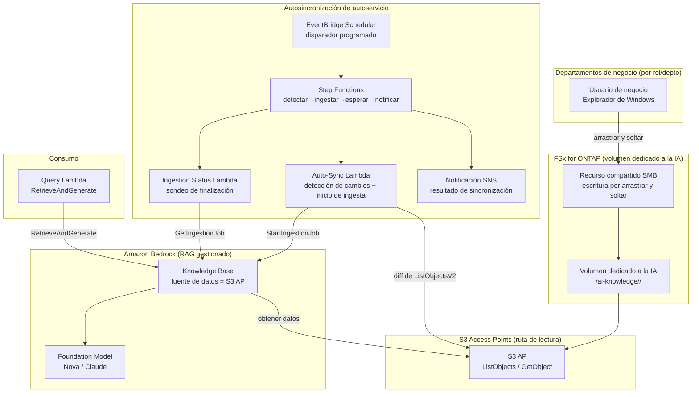

# Self-Service Knowledge Base Curation (Operación de conocimiento de IA democratizada)

🌐 **Language / 言語**: [日本語](README.md) | [English](README.en.md) | [한국어](README.ko.md) | [简体中文](README.zh-CN.md) | [繁體中文](README.zh-TW.md) | [Français](README.fr.md) | [Deutsch](README.de.md) | [Español](README.es.md)

## Descripción general

Un patrón que permite a los miembros de los departamentos de negocio mantener una fuente de datos de Amazon Bedrock Knowledge Base **usando únicamente la conocida operación de arrastrar y soltar del Explorador de Windows**.

En FSx for ONTAP se prepara un **volumen / carpeta dedicado a la IA** y se publica a cada rol/departamento mediante SMB (recurso compartido de Windows). Los mismos datos se conectan a una fuente de datos de Amazon Bedrock Knowledge Base **a través de S3 Access Points (la ruta de lectura)**, y las incorporaciones de archivos se detectan para ejecutar la **ingesta automáticamente**.

Esto cambia la operación de un modelo en el que el departamento de TI realiza ETL / copia / ingesta manuales por solicitud a un **modelo democratizado en el que el personal de campo mantiene su propio conocimiento**.

## Before / After (transformación operativa)

> **Nota**: Lo siguiente es una historia operativa generalizada con nombres específicos de clientes y personas enmascarados.

### Before — Dependiente del trabajo manual del equipo de TI

```
Departamento de negocio: «Salió un producto nuevo, pongan los materiales de
                          esta carpeta de equipo de Windows en el conocimiento
                          de IA (ventas lo usará en una demo).»
   ↓ ticket de solicitud
Departamento de TI → copia manualmente los archivos desde un Windows Server en EC2
        → sube a un bucket S3
        → ejecuta manualmente la ingesta en el Bedrock Knowledge Base
        → notifica la finalización
```

- El departamento de TI interviene en cada solicitud → cuello de botella y desfase temporal
- **Doble gestión de datos** por el trabajo de copia, más actualizaciones omitidas
- «Quién puso qué, y cuándo» se vuelve dependiente de las personas

### After — Autoservicio liderado por el campo

```
Departamento de TI: «Pongan en esta carpeta de Windows los datos que quieren que
                     use la IA y manténganlos ustedes mismos. La IA referenciará
                     estos datos.»
   ↓
Departamento de negocio → arrastra y suelta en la carpeta dedicada a la IA con el
                          Explorador de Windows como de costumbre (agregar / actualizar / eliminar)
   ↓ (automático)
El Bedrock Knowledge Base se sincroniza a través de S3 Access Point → buscable de inmediato
```

- No se necesita gestión de solicitudes del departamento de TI → menor tiempo de entrega
- Los archivos permanecen como la **copia maestra en FSx for ONTAP** (sin copia a S3)
- La propiedad de los datos se distribuye a cada rol/departamento (democratización)

## Problemas resueltos

| Problema | Cómo lo resuelve este patrón |
|------|-------------------|
| Las actualizaciones de conocimiento esperan el trabajo manual del departamento de TI | El campo lo mantiene directamente con operaciones de Windows; ingesta automática |
| Doble gestión de datos por copiar a S3 | La copia maestra de FSx for ONTAP se convierte en la fuente de datos directamente a través de S3 AP |
| Ingesta omitida / actualizaciones obsoletas | Las incorporaciones de archivos se detectan e ingestan automáticamente |
| Requiere habilidades especializadas (ETL/S3/Bedrock) | Solo arrastrar y soltar del Explorador de Windows |
| Propietario de datos poco claro | Diseño de carpetas dividido por rol/departamento para una responsabilidad clara |

## Arquitectura



## Dos escenarios operativos (demo)

Sobre la misma base, puede experimentar dos etapas según la madurez operativa. Consulte la [guía de demo](docs/demo-guide.md) para más detalles.

| Escenario | Resumen | Disparador de ingesta |
|---------|------|----------------|
| **A: Mantenimiento manual práctico** | Mantener los datos de IA con operaciones de archivos de Windows (agregar/actualizar/eliminar); la ingesta es manual (consola «Sync» / CLI) | Manual |
| **B: Automatización** | Automatizar la sincronización manual de A con Lambda + Step Functions + EventBridge (detectar→ingestar→esperar→notificar) | Automático |

> La operación del usuario de negocio (arrastrar y soltar) es la misma en ambos escenarios. Lo único que cambia es si una persona o el serverless se encarga de todo a partir de la ingesta.

## RAG híbrido: documentos internos + búsqueda web (opt-in, NEW)

> Integra la **AgentCore Web Search Tool** que pasó a GA en AWS Summit NYC 2026 (2026-06-17).

Cuando establece `EnableWebSearch=true`, la Query Lambda genera una respuesta unificada que enriquece la respuesta del KB interno con resultados de búsqueda web en tiempo real.

| Modo | Fuente de la respuesta | Caso de uso |
|--------|-----------|-------------|
| `EnableWebSearch=false` (predeterminado) | Solo documentos internos (FSx for ONTAP → S3 Vectors) | QA de conocimiento interno |
| `EnableWebSearch=true` | Documentos internos + resultados de búsqueda web | Regulaciones recientes, tendencias del mercado, comparación de productos |

- Graceful degradation: aunque falle Web Search, responde solo con el KB interno
- Separación de citas: `[Interno: nombre de archivo]` + `[Web: título](URL)`
- Seguridad: los resultados web son datos no confiables, con defensa contra inyección de prompts implementada

Detalles: [docs/investigations/agentcore-web-search-fsxn-integration.md](../../docs/investigations/agentcore-web-search-fsxn-integration.md)

## Modelo operativo de autoservicio (democratización)

### Diseño de carpetas del volumen dedicado a la IA (alineado con los roles previstos por Amazon Quick)

Los roles de negocio (departamentos) se proporcionan de forma amplia para coincidir con los roles a los que se dirige **Amazon Quick**.
La FAQ de Quick indica explícitamente «sales, marketing, IT, operations, finance, legal» como objetivos,
y developers tiene una página dedicada.

```
/ai-knowledge/                     ← Volumen dedicado a la IA (recurso compartido SMB)
├── sales/                         ← Ventas (planes de cuenta, info de producto, playbooks)
├── marketing/                     ← Marketing (marca, campañas, contenido)
├── finance/                       ← Finanzas y contabilidad (presupuestos, gastos, previsiones)
├── information-technology/        ← TI (runbooks, IT FAQ, seguridad)
├── operations/                    ← Operaciones (SOP, procesos de negocio)
├── legal/                         ← Legal (contratos, NDA, cumplimiento)
└── developers/                    ← Desarrollo (normas, onboarding, catálogo de servicios)
```

| Carpeta | Rol | Previsto en Amazon Quick (referencia, time-sensitive) |
|-----------|--------|--------------------------------|
| `sales/` | Ventas | Lead scoring / Sales forecasting / CRM ([/quick/sales/](https://aws.amazon.com/quick/sales/)) |
| `marketing/` | Marketing | Campañas, marca, contenido (Quick FAQ) |
| `finance/` | Finanzas y contabilidad | Presupuestos, gastos, previsiones (Quick FAQ) |
| `information-technology/` | TI | Respuesta a incidentes, IT FAQ, seguridad ([/quick/information-technology/](https://aws.amazon.com/quick/information-technology/)) |
| `operations/` | Operaciones | SOP, procesos de negocio (Quick FAQ) |
| `legal/` | Legal | Contratos, cumplimiento (Quick FAQ) |
| `developers/` | Desarrollo | Normas de codificación, onboarding ([/quick/developers/](https://aws.amazon.com/quick/developers/)) |

- Cada carpeta otorga permiso de escritura al rol/departamento responsable mediante **NTFS ACL**
- Los usuarios de negocio agregan/actualizan/eliminan en la carpeta de su propio departamento mediante **arrastrar y soltar**
- El departamento de TI solo se encarga de mantener el diseño de carpetas y la automatización de la ingesta
- Los **datos de muestra** de cada rol se incluyen en [`sample-data/ai-knowledge/`](sample-data/) (para la carga de demo)

> Este UC alinea su diseño de roles con el **Amazon Quick UC** que se planea crear después, y puede
> compartir/reutilizar las carpetas/datos de prueba del mismo volumen dedicado a la IA.

### Flujo de ingesta automática (Escenario B)

1. **EventBridge Scheduler** inicia periódicamente las Step Functions (p. ej. `rate(15 minutes)`)
2. **Auto-Sync Lambda** **detecta el diff (nuevo/actualizado)** con `ListObjectsV2` en el S3 AP
3. Si hay un diff, inicia `StartIngestionJob` del Bedrock Knowledge Base (si no hay, termina de inmediato)
4. **Ingestion Status Lambda** sondea la finalización con `GetIngestionJob`
5. **Notifica el resultado de la ingesta mediante SNS** (número cargado / número de fallos)

> En el Escenario A (manual), una persona realiza los pasos 2 a 5 en la consola/CLI. El Escenario B lo reemplaza por Step Functions.

> **Decisión de diseño**: Este patrón adopta un **Bedrock Knowledge Base gestionado** (Pattern C) para minimizar la carga operativa. Si se requiere un control estricto de ACL en tiempo de búsqueda a nivel de archivo, elija un RAG personalizado consciente de permisos ([FC3 genai-rag-enterprise-files](../genai-rag-enterprise-files/), Pattern A).

### Restricción por permiso/rol (opción de filtro de metadatos)

Incluso con un KB gestionado, el **filtrado de metadatos** permite restringir en tiempo de búsqueda por «rol/departamento/clasificación».
Coloque un `<file>.metadata.json` junto a cada archivo y pase `role` o un `filter` arbitrario en el momento de la consulta.

```jsonc
// Ejemplo: product-x-spec.md.metadata.json
{ "metadataAttributes": { "role": "sales", "classification": "internal" } }
```

```bash
# Búsqueda restringida al rol de ventas
aws lambda invoke --function-name <QueryFn> \
  --payload '{"query":"¿Cuáles son las especificaciones del producto X?","role":"sales"}' \
  --cli-binary-format raw-in-base64-out out.json
```

> **Restricciones importantes (KB que usa S3 Vectors como almacén de vectores)**:
> - **Los metadatos filtrables deben estar dentro de 2048 bytes por documento** (la ingesta falla si se supera). Mantenga `metadataAttributes` pequeño
> - Los archivos de metadatos son de 10 KB como máximo por archivo
> - Los filtros demasiado selectivos pueden reducir el recall de la búsqueda de vecinos más cercanos aproximados (evalúe la granularidad del filtro antes de decidir)
> - Esto es **restricción de búsqueda**, no control de acceso del lado de AWS. Si se requiere un control de acceso estricto por usuario individual, considere
>   la ACL a nivel de documento de la base de conocimiento S3 de Amazon Quick (véase [UC30](../genai-quick-agentic-workspace/)) o
>   un RAG personalizado consciente de permisos (FC3)

## Elección entre KB gestionado y RAG personalizado

| Aspecto | Este UC: KB gestionado (Pattern C) | FC3: RAG personalizado (Pattern A) |
|------|------------------------------|------------------------------|
| Objetivo principal | Democratizar la operación de datos, reducir la carga operativa | Filtro de permisos a nivel de archivo en tiempo de búsqueda |
| Implementación de RAG | Bedrock Knowledge Bases (gestionado) | OpenSearch + búsqueda propia + extracción de ACL |
| Control de acceso | Nivel de carpeta/recurso compartido (SMB ACL) + límite de fuente de datos del KB | Filtro de metadatos AD SID por chunk |
| Carga operativa | Baja (gestionado) | Media a alta (canalización propia) |
| Mejor para | Conocimiento compartido intradepartamental, FAQ interna, info de producto | Sectores regulados, documentos confidenciales, visibilidad distinta por usuario |

## Estructura de directorios

```
genai-kb-selfservice-curation/
├── README.md / README.en.md
├── template.yaml                 # SAM: capa de autosincronización de autoservicio
├── samconfig.toml.example
├── functions/
│   ├── auto_sync/handler.py      # detección de cambios + inicio de ingesta
│   ├── ingestion_status/handler.py  # sondeo de finalización de la ingesta (Escenario B)
│   └── query/handler.py          # RetrieveAndGenerate (Q&A de demo)
├── sample-data/                  # datos semilla por rol (para la carga de demo)
│   └── ai-knowledge/<role>/...   # sales / marketing / finance / it / operations / legal / developers
├── tests/
│   └── test_handlers.py
└── docs/
    ├── architecture.md
    └── demo-guide.md             # Escenario A (manual) / B (automatización) (enmascarado)
```

> **Requisito previo de despliegue**: Cree el propio Knowledge Base y su fuente de datos (S3 AP) con el script verificado [`scripts/create_bedrock_kb.py`](../scripts/create_bedrock_kb.py) o la consola de Bedrock, y pase sus `KnowledgeBaseId` / `DataSourceId` a los parámetros de esta plantilla. Dado que la creación del índice vectorial de OpenSearch Serverless no es nativa de CloudFormation, se adopta esta configuración separada.

## Diseño de seguridad

- **Sin movimiento de datos**: los archivos permanecen como la copia maestra en FSx for ONTAP, solo lectura a través de S3 AP
- **Escrituras solo mediante SMB/NFS**: la ruta de ingesta de IA (S3 AP) es un acceso de lectura. Las escrituras pasan por el recurso compartido de Windows
- **Separación de responsabilidades a nivel de carpeta**: las NTFS ACL separan el permiso de escritura por departamento
- **Privilegio mínimo**: Lambda solo tiene permitido List/Get en el S3 AP objetivo e Ingestion en ese KB
- **Auditoría**: CloudTrail (operaciones de API) + registros de auditoría de ONTAP (operaciones de archivos) + historial de trabajos de ingesta
- **Cifrado**: SSE-FSX (almacenamiento), TLS (en tránsito), KMS (SNS / registros)

> **Nota**: El límite de la fuente de datos del S3 AP es a nivel de volumen/prefijo. Si desea variar la visibilidad por usuario, considere un RAG personalizado consciente de permisos en lugar de este UC.

## Sectores objetivo / casos de uso

- Fabricación e ingeniería (conocimiento compartido interno de info de producto / hojas de especificaciones)
- Ventas y soporte al cliente (materiales de propuesta / FAQ / resolución de problemas)
- Back office (reglamentos internos / manuales de procedimientos)
- Conocimiento interno en general que se resuelve dentro de un departamento

## Success Metrics

### Outcome
Lograr una operación de datos de IA democratizada donde los departamentos de negocio mantienen el conocimiento por sí mismos sin trabajo manual del departamento de TI.

### Metrics

| Métrica | Objetivo (ejemplo) |
|-----------|------------|
| Tiempo de entrega de actualización de conocimiento (depósito → buscable) | < 15 min (depende del intervalo de programación) |
| Solicitudes de ingesta manual del departamento de TI | 0 / mes (tras la migración) |
| Tasa de éxito de la ingesta automática | > 98 % |
| Tasa de omisión de la detección de cambios | 0 % (escaneo de lista completo) |
| Operación del usuario de negocio | Solo arrastrar y soltar de Windows |

### Measurement Method
Historial de ejecución de EventBridge Scheduler, estadísticas de trabajos de ingesta de Bedrock (scanned / indexed / failed), CloudWatch Metrics, registros de notificación de SNS.

---

## Data Classification

| Salida | Clasificación | Fundamento |
|------|------|------|
| Resultado de ingesta de Bedrock KB (vectores + metadatos) | INTERNAL | Hereda la misma clasificación que los archivos de origen. No divulgable externamente |
| Estado del trabajo de ingesta / notificación SNS | INTERNAL | Metadatos operativos. No contiene datos confidenciales |
| CloudWatch Metrics / Logs | INTERNAL | Métricas agregadas. No contienen contenido de archivos |

> En sectores regulados se requiere adicionalmente la clasificación CUI / FISC / HIPAA. Extienda el sistema de etiquetas de `shared/data_classification.py` según su caso de uso.
> `dataDeletionPolicy=DELETE` elimina los vectores de inmediato cuando se eliminan los archivos, pero si hay un requisito de retención, use `RETAIN` y diseñe un procedimiento de purga aparte.

---

## Enlaces a la documentación de AWS

| Servicio | Documentación |
|---------|------------|
| FSx for ONTAP | [Guía del usuario](https://docs.aws.amazon.com/fsx/latest/ONTAPGuide/what-is-fsx-ontap.html) |
| S3 Access Points for FSx for ONTAP | [Guía de S3 AP](https://docs.aws.amazon.com/fsx/latest/ONTAPGuide/s3-access-points.html) |
| Tutorial FSx for ONTAP + Bedrock RAG | [Build RAG with Bedrock](https://docs.aws.amazon.com/fsx/latest/ONTAPGuide/tutorial-build-rag-with-bedrock.html) |
| Amazon Bedrock Knowledge Bases | [Knowledge Bases](https://docs.aws.amazon.com/bedrock/latest/userguide/knowledge-base.html) |
| Ingesta de datos de Bedrock KB | [Ingest your data](https://docs.aws.amazon.com/bedrock/latest/userguide/kb-data-source.html) |
| RetrieveAndGenerate API | [Referencia de la API](https://docs.aws.amazon.com/bedrock/latest/APIReference/API_agent-runtime_RetrieveAndGenerate.html) |
| EventBridge Scheduler | [Guía del usuario](https://docs.aws.amazon.com/scheduler/latest/UserGuide/what-is-scheduler.html) |

### Alineación con el Well-Architected Framework

| Pilar | Alineación |
|----|------|
| Excelencia operativa | Operación de autoservicio, ingesta automática, notificación SNS, registros estructurados |
| Seguridad | ACL a nivel de carpeta, privilegio mínimo de IAM, sin movimiento de datos, registros de auditoría |
| Fiabilidad | Detección de cambios mediante escaneo de lista completo, monitoreo del estado del trabajo de ingesta |
| Eficiencia del rendimiento | Ingesta iniciada solo con diff, escalado del KB gestionado |
| Optimización de costos | Serverless, sincronización diferencial, uso de servicios gestionados |
| Sostenibilidad | Ejecución bajo demanda, evitar la re-ingesta innecesaria |

---

## Estimación de costos (aproximación mensual)

> **Nota**: Lo siguiente es una aproximación para la región ap-northeast-1; el costo real varía según el uso. Consulte los precios más recientes en la [AWS Pricing Calculator](https://calculator.aws/). Los benchmarks y precios son time-sensitive.

### Componentes serverless (pago por uso)

| Servicio | Precio unitario | Uso previsto | Aproximación mensual |
|---------|------|-----------|---------|
| Lambda (Auto-Sync) | $0.0000166667/GB-sec | intervalo de 15 min × 512MB | ~$1-3 |
| S3 API (ListObjects/GetObject) | $0.0047/10K requests | ~30K requests/día | ~$4 |
| EventBridge Scheduler | $1.00/1M invocations | ~3K invocations/mes | ~$0.01 |
| Bedrock Ingestion (Embeddings) | pago por uso del modelo | solo archivos en diff | ~$2-10 |
| Generación de respuestas de Bedrock (Nova/Claude) | pago por uso del modelo | depende del número de consultas | ~$3-20 |
| SNS | $0.50/100K notifications | ~3K/mes | ~$0.02 |
| CloudWatch Logs | $0.76/GB ingested | ~1 GB/mes | ~$0.76 |
| OpenSearch Serverless (almacén de vectores del KB) | $0.24/OCU-hour | mín. 2 OCU ~ | aparte (depende de la config del KB) |

### Costo fijo (supone un entorno existente)

| Componente | Mensual |
|--------------|------|
| FSx for ONTAP (comparte el volumen dedicado a la IA existente) | comparte el entorno existente |
| S3 Access Point | sin cargo adicional (solo cargos de S3 API) |

> **Governance Caveat**: Las estimaciones de costos son aproximadas, no valores garantizados. La facturación real varía según el patrón de uso, el volumen de datos, la región y la configuración del almacén de vectores del KB.

---

## Pruebas locales

### Comprobación de requisitos previos

```bash
aws --version          # AWS CLI v2
sam --version          # SAM CLI
python3 --version      # Python 3.12+
aws sts get-caller-identity  # credenciales de AWS
```

### Pruebas unitarias

```bash
python3 -m pytest tests/ -v
```

### sam local invoke

```bash
# Requisito previo: se requiere AWS SAM CLI. «sam build» empaqueta el código y la capa compartida automáticamente.
sam build
sam local invoke AutoSyncFunction --event events/auto-sync-event.json
```

---

## Muestra de salida (Output Sample)

### Auto-Sync Lambda (detección de cambios + inicio de ingesta)

```json
{
  "status": "ingestion_started",
  "changed_files_detected": 4,
  "knowledge_base_id": "XXXXXXXXXX",
  "data_source_id": "YYYYYYYYYY",
  "ingestion_job_id": "ZZZZZZZZZZ",
  "scanned_prefix": "sales/product-catalog/",
  "timestamp": 1760000000
}
```

### Query Lambda (RetrieveAndGenerate)

```json
{
  "query": "Dime las principales especificaciones del nuevo producto X",
  "answer": "Las principales especificaciones del nuevo producto X son el rango de pesaje... (basado en los documentos ingestados)",
  "citations": [
    {"source": "sales/product-catalog/product-x-spec.pdf", "score": 0.93}
  ]
}
```

> **Nota**: Lo anterior es una salida de muestra; los valores reales varían según el entorno y los datos de entrada. Los números son una referencia de dimensionamiento, no un límite de servicio.

---

## Performance Considerations

- La capacidad de rendimiento de FSx for ONTAP se comparte entre NFS/SMB/S3AP. Tenga en cuenta que las escrituras SMB de los usuarios de negocio y las lecturas de ingesta de IA comparten la misma capacidad
- La latencia a través del S3 Access Point implica una sobrecarga de decenas de milisegundos
- Al cargar muchos archivos, los trabajos de ingesta tardan en completarse. Establezca el intervalo de programación más largo que el tiempo de ingesta
- Como la detección de cambios es un escaneo de lista completo, considere dividir por prefijo cuando el número de archivos sea muy elevado

> **Nota**: Los números de rendimiento de este patrón son una referencia de dimensionamiento, no un límite de servicio. El rendimiento en el mundo real varía según la capacidad de rendimiento de FSx for ONTAP, el número de archivos y las cargas de trabajo concurrentes.

---

## UC relacionados / enlaces

| Relacionado | Punto relevante |
|---------|------------|
| [Lista de verificación de requisitos previos de PoC](docs/poc-checklist.md) | Comprobaciones previas al despliegue (restricciones de S3 Vectors, perfiles de inferencia, etc.) |
| [Runbook de limpieza](../docs/uc29-uc30-cleanup-runbook.md) | Procedimiento de desmantelamiento que incluye artefactos manuales (compartido por 2 UC) |
| [FC3 genai-rag-enterprise-files](../genai-rag-enterprise-files/) | RAG personalizado cuando se requiere un filtrado estricto de permisos (Pattern A) |
| [Patrón de extensión: integración de Bedrock KB](../docs/extension-patterns.md) | Patrón genérico de KB gestionado + S3 AP |
| [Script de creación de KB](../scripts/create_bedrock_kb.py) | Creación de KB / fuente de datos (requisito previo de despliegue para este UC) |
| [Mapeo de sector / carga de trabajo](../docs/industry-workload-mapping.md) | Guía de selección de UC |

## Endurecimiento operativo (implementado)

- **Prevención de ejecuciones concurrentes**: Auto-Sync omite un nuevo inicio si hay un trabajo de ingesta en curso (`ingestion_in_progress`)
- **Retry/Catch de Step Functions**: reintentos en las tareas de Lambda (backoff exponencial) y una rama `NotifyFailure` en caso de fallo
- **Filtro de metadatos**: Query puede restringir por rol/departamento con `role`/un `filter` arbitrario

---

## Despliegue

Despliegue con la AWS SAM CLI (reemplace los marcadores de posición para su entorno):

> **Requisito previo de despliegue**: Esta plantilla supone una Amazon Bedrock Knowledge Base y una fuente de datos (conexión S3 AP) existentes. Dado que la creación del índice vectorial de OpenSearch Serverless no es nativa de CloudFormation, cree el propio Knowledge Base antes del despliegue y pase sus `KnowledgeBaseId` / `DataSourceId` como parámetros (créelos con `scripts/create_bedrock_kb.py` en la raíz del repositorio, o la consola de Bedrock).

```bash
# Requisito previo: se requiere AWS SAM CLI. «sam build» empaqueta el código y la capa compartida automáticamente.
sam build

sam deploy \
  --stack-name fsxn-kb-selfservice-curation \
  --parameter-overrides \
    S3AccessPointAlias=<your-s3ap-alias> \
    S3AccessPointName=<your-s3ap-name> \
    KnowledgeBaseId=<your-kb-id> \
    DataSourceId=<your-datasource-id> \
    NotificationEmail=<your-email@example.com> \
  --capabilities CAPABILITY_NAMED_IAM \
  --resolve-s3 \
  --region <your-region>
```

> **Nota**: `template.yaml` se usa con la SAM CLI (`sam build` + `sam deploy`).
> Para desplegar directamente con el comando `aws cloudformation deploy`, use `template-deploy.yaml` (requiere empaquetar previamente los archivos zip de Lambda y subirlos a un bucket S3).

## Governance Note

> Este patrón proporciona orientación de arquitectura técnica. No es asesoramiento legal, de cumplimiento ni regulatorio. Las organizaciones deben consultar a profesionales cualificados. El límite de la fuente de datos del S3 AP es a nivel de volumen/prefijo; si se requiere control de visibilidad por usuario individual, queda fuera del alcance de este UC.
>
> **Tres capas de control de acceso (elegir según el caso de uso)**: ① Restricción de búsqueda = filtro de metadatos de Bedrock KB (este UC, no es autorización de AWS) / ② ACL a nivel de documento = base de conocimiento S3 de Amazon Quick ([UC30](../genai-quick-agentic-workspace/), por usuario/grupo) / ③ Filtro de permisos por chunk = RAG personalizado consciente de permisos ([FC3](../genai-rag-enterprise-files/), AD SID/NTFS ACL, para sectores regulados)
