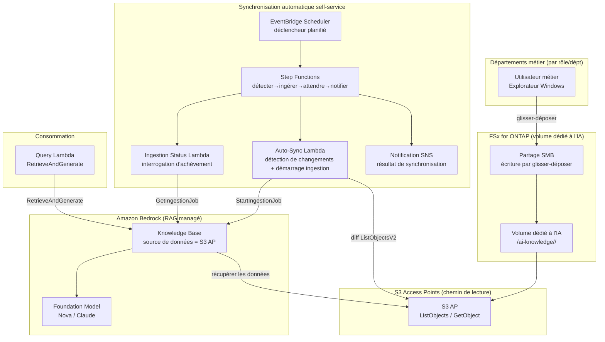

# Self-Service Knowledge Base Curation (Gestion de connaissances IA démocratisée)

🌐 **Language / 言語**: [日本語](README.md) | [English](README.en.md) | [한국어](README.ko.md) | [简体中文](README.zh-CN.md) | [繁體中文](README.zh-TW.md) | [Français](README.fr.md) | [Deutsch](README.de.md) | [Español](README.es.md)

## Vue d'ensemble

Un modèle qui permet aux membres des départements métier de maintenir une source de données Amazon Bedrock Knowledge Base **en utilisant uniquement le glisser-déposer familier de l'Explorateur Windows**.

Un **volume / dossier dédié à l'IA** est préparé sur FSx for ONTAP et publié auprès de chaque rôle/département via SMB (partage Windows). Les mêmes données sont connectées à une source de données Amazon Bedrock Knowledge Base **via S3 Access Points (le chemin de lecture)**, et les ajouts de fichiers sont détectés pour exécuter l'**ingestion automatiquement**.

Cela fait passer d'un modèle où le département informatique effectue l'ETL / la copie / l'ingestion manuels sur demande à un **modèle démocratisé dans lequel le terrain maintient ses propres connaissances**.

## Before / After (transformation opérationnelle)

> **Note** : Ce qui suit est une histoire opérationnelle généralisée avec les noms de clients et de personnes spécifiques masqués.

### Before — Dépendant du travail manuel de l'équipe informatique

```
Département métier : « Un nouveau produit est sorti, veuillez mettre les
                       documents de ce dossier d'équipe Windows dans la
                       connaissance IA (les ventes l'utiliseront en démo). »
   ↓ ticket de demande
Département informatique → copie manuellement les fichiers depuis un
                           Windows Server sur EC2
        → téléverse dans un bucket S3
        → exécute manuellement l'ingestion dans le Bedrock Knowledge Base
        → notifie l'achèvement
```

- Le département informatique intervient à chaque demande → goulot d'étranglement et latence
- **Double gestion des données** due au travail de copie, plus les mises à jour manquées
- « Qui a mis quoi, et quand » devient dépendant des individus

### After — Self-service piloté par le terrain

```
Département informatique : « Mettez les données que vous voulez faire utiliser
                             par l'IA dans ce dossier Windows et maintenez-les
                             vous-mêmes. L'IA référencera ces données. »
   ↓
Département métier → glisse-dépose dans le dossier dédié à l'IA avec
                     l'Explorateur Windows comme d'habitude (ajout / mise à jour / suppression)
   ↓ (automatique)
Le Bedrock Knowledge Base se synchronise via S3 Access Point → immédiatement interrogeable
```

- Aucun traitement de demande du département informatique nécessaire → délai réduit
- Les fichiers restent la **copie maîtresse sur FSx for ONTAP** (aucune copie vers S3)
- La propriété des données est distribuée à chaque rôle/département (démocratisation)

## Problèmes résolus

| Problème | Comment ce modèle le résout |
|------|-------------------|
| Les mises à jour des connaissances attendent le travail manuel du département informatique | Le terrain les maintient directement avec des opérations Windows ; ingestion automatique |
| Double gestion des données due à la copie vers S3 | La copie maîtresse FSx for ONTAP devient la source de données directement via S3 AP |
| Ingestion manquée / mises à jour obsolètes | Les ajouts de fichiers sont détectés et ingérés automatiquement |
| Nécessite des compétences spécialisées (ETL/S3/Bedrock) | Glisser-déposer de l'Explorateur Windows uniquement |
| Propriétaire des données peu clair | Disposition des dossiers répartie par rôle/département pour une responsabilité claire |

## Architecture



## Deux scénarios opérationnels (démo)

Sur la même base, vous pouvez expérimenter deux étapes selon la maturité opérationnelle. Voir le [guide de démo](docs/demo-guide.md) pour plus de détails.

| Scénario | Résumé | Déclencheur d'ingestion |
|---------|------|----------------|
| **A : Maintenance manuelle pratique** | Maintenir les données IA avec des opérations de fichiers Windows (ajout/mise à jour/suppression) ; l'ingestion est manuelle (console « Sync » / CLI) | Manuel |
| **B : Automatisation** | Automatiser la synchronisation manuelle de A avec Lambda + Step Functions + EventBridge (détecter→ingérer→attendre→notifier) | Automatique |

> L'opération de l'utilisateur métier (glisser-déposer) est inchangée dans les deux scénarios. Seul change le fait que ce soit une personne ou le serverless qui gère tout à partir de l'ingestion.

## RAG hybride : documents internes + recherche Web (opt-in, NEW)

> Intègre l'**AgentCore Web Search Tool** devenu GA à l'AWS Summit NYC 2026 (2026-06-17).

Lorsque vous définissez `EnableWebSearch=true`, la Query Lambda génère une réponse unifiée qui enrichit la réponse du KB interne avec des résultats de recherche Web en temps réel.

| Mode | Source de réponse | Cas d'usage |
|--------|-----------|-------------|
| `EnableWebSearch=false` (par défaut) | Documents internes uniquement (FSx for ONTAP → S3 Vectors) | QA de connaissances internes |
| `EnableWebSearch=true` | Documents internes + résultats de recherche Web | Réglementations récentes, tendances du marché, comparaison de produits |

- Graceful degradation : même si Web Search échoue, il répond avec le KB interne uniquement
- Séparation des citations : `[Interne : nom de fichier]` + `[Web : titre](URL)`
- Sécurité : les résultats Web sont des données non fiables, avec une défense contre l'injection de prompt en place

Détails : [docs/investigations/agentcore-web-search-fsxn-integration.md](../../docs/investigations/agentcore-web-search-fsxn-integration.md)

## Modèle opérationnel self-service (démocratisation)

### Conception des dossiers du volume dédié à l'IA (aligné sur les rôles ciblés par Amazon Quick)

Les rôles métier (départements) sont fournis largement pour correspondre aux rôles que **Amazon Quick** cible.
La FAQ Quick liste explicitement « sales, marketing, IT, operations, finance, legal » comme cibles,
et developers dispose d'une page dédiée.

```
/ai-knowledge/                     ← Volume dédié à l'IA (partage SMB)
├── sales/                         ← Ventes (plans de compte, infos produit, playbooks)
├── marketing/                     ← Marketing (marque, campagnes, contenu)
├── finance/                       ← Finance et comptabilité (budgets, dépenses, prévisions)
├── information-technology/        ← Informatique (runbooks, IT FAQ, sécurité)
├── operations/                    ← Opérations (SOP, processus métier)
├── legal/                         ← Juridique (contrats, NDA, conformité)
└── developers/                    ← Développement (normes, onboarding, catalogue de services)
```

| Dossier | Rôle | Supposé dans Amazon Quick (référence, time-sensitive) |
|-----------|--------|--------------------------------|
| `sales/` | Ventes | Lead scoring / Sales forecasting / CRM ([/quick/sales/](https://aws.amazon.com/quick/sales/)) |
| `marketing/` | Marketing | Campagnes, marque, contenu (Quick FAQ) |
| `finance/` | Finance et comptabilité | Budgets, dépenses, prévisions (Quick FAQ) |
| `information-technology/` | Informatique | Réponse aux incidents, IT FAQ, sécurité ([/quick/information-technology/](https://aws.amazon.com/quick/information-technology/)) |
| `operations/` | Opérations | SOP, processus métier (Quick FAQ) |
| `legal/` | Juridique | Contrats, conformité (Quick FAQ) |
| `developers/` | Développement | Normes de codage, onboarding ([/quick/developers/](https://aws.amazon.com/quick/developers/)) |

- Chaque dossier accorde le droit d'écriture au rôle/département responsable via des **NTFS ACL**
- Les utilisateurs métier ajoutent/mettent à jour/suppriment dans le dossier de leur propre département via **glisser-déposer**
- Le département informatique n'est responsable que de la maintenance de la disposition des dossiers et de l'automatisation de l'ingestion
- Les **données d'exemple** de chaque rôle sont fournies dans [`sample-data/ai-knowledge/`](sample-data/) (pour le chargement de démo)

> Ce UC aligne sa disposition de rôles sur le **Amazon Quick UC** prévu pour être créé par la suite, et peut
> partager/réutiliser les dossiers/données de test du même volume dédié à l'IA.

### Flux d'ingestion automatique (Scénario B)

1. **EventBridge Scheduler** démarre périodiquement les Step Functions (p. ex. `rate(15 minutes)`)
2. **Auto-Sync Lambda** **détecte le diff (nouveau/mis à jour)** avec `ListObjectsV2` sur le S3 AP
3. S'il y a un diff, il démarre `StartIngestionJob` du Bedrock Knowledge Base (s'il n'y en a pas, il se termine immédiatement)
4. **Ingestion Status Lambda** interroge l'achèvement avec `GetIngestionJob`
5. Il **notifie le résultat de l'ingestion via SNS** (nombre chargé / nombre d'échecs)

> Dans le Scénario A (manuel), une personne effectue les étapes 2 à 5 dans la console/CLI. Le Scénario B remplace cela par des Step Functions.

> **Décision de conception** : Ce modèle adopte un **Bedrock Knowledge Base managé** (Pattern C) pour minimiser la charge opérationnelle. Si un contrôle ACL strict au moment de la recherche au niveau fichier est requis, choisissez un RAG personnalisé sensible aux permissions ([FC3 genai-rag-enterprise-files](../genai-rag-enterprise-files/), Pattern A).

### Restriction par permission/rôle (option de filtre de métadonnées)

Même avec un KB managé, le **filtrage de métadonnées** permet une restriction au moment de la recherche par « rôle/département/classification ».
Placez un `<file>.metadata.json` à côté de chaque fichier et transmettez `role` ou un `filter` arbitraire au moment de la requête.

```jsonc
// Exemple : product-x-spec.md.metadata.json
{ "metadataAttributes": { "role": "sales", "classification": "internal" } }
```

```bash
# Recherche restreinte au rôle ventes
aws lambda invoke --function-name <QueryFn> \
  --payload '{"query":"Quelles sont les spécifications du produit X ?","role":"sales"}' \
  --cli-binary-format raw-in-base64-out out.json
```

> **Contraintes importantes (KB utilisant S3 Vectors comme magasin de vecteurs)** :
> - **Les métadonnées filtrables doivent tenir dans 2048 octets par document** (l'ingestion échoue si dépassé). Gardez `metadataAttributes` petit
> - Les fichiers de métadonnées font au maximum 10 Ko par fichier
> - Des filtres trop sélectifs peuvent réduire le recall de la recherche par plus proches voisins approximatifs (évaluez la granularité du filtre avant de décider)
> - Il s'agit d'une **restriction de recherche**, pas d'un contrôle d'accès côté AWS. Si un contrôle d'accès strict par utilisateur individuel est requis, envisagez
>   l'ACL au niveau document de la base de connaissances S3 d'Amazon Quick (voir [UC30](../genai-quick-agentic-workspace/)) ou
>   un RAG personnalisé sensible aux permissions (FC3)

## Choix entre KB managé et RAG personnalisé

| Aspect | Ce UC : KB managé (Pattern C) | FC3 : RAG personnalisé (Pattern A) |
|------|------------------------------|------------------------------|
| Objectif principal | Démocratiser les opérations de données, réduire la charge opérationnelle | Filtre de permission au niveau fichier au moment de la recherche |
| Implémentation RAG | Bedrock Knowledge Bases (managé) | OpenSearch + recherche personnalisée + extraction d'ACL |
| Contrôle d'accès | Niveau dossier/partage (SMB ACL) + limite de source de données KB | Filtre de métadonnées AD SID par chunk |
| Charge opérationnelle | Faible (managé) | Moyenne à élevée (pipeline auto-construit) |
| Convient le mieux | Connaissances partagées intra-département, FAQ interne, infos produit | Secteurs réglementés, documents confidentiels, visibilité différente par utilisateur |

## Structure des répertoires

```
genai-kb-selfservice-curation/
├── README.md / README.en.md
├── template.yaml                 # SAM : couche de synchronisation automatique self-service
├── samconfig.toml.example
├── functions/
│   ├── auto_sync/handler.py      # détection de changements + démarrage ingestion
│   ├── ingestion_status/handler.py  # interrogation d'achèvement de l'ingestion (Scénario B)
│   └── query/handler.py          # RetrieveAndGenerate (Q&A de démo)
├── sample-data/                  # données de graine par rôle (pour le chargement de démo)
│   └── ai-knowledge/<role>/...   # sales / marketing / finance / it / operations / legal / developers
├── tests/
│   └── test_handlers.py
└── docs/
    ├── architecture.md
    └── demo-guide.md             # Scénario A (manuel) / B (automatisation) (masqué)
```

> **Prérequis de déploiement** : Créez le Knowledge Base lui-même et sa source de données (S3 AP) avec le script vérifié [`scripts/create_bedrock_kb.py`](../scripts/create_bedrock_kb.py) ou la console Bedrock, et transmettez ses `KnowledgeBaseId` / `DataSourceId` aux paramètres de ce modèle. Comme la création de l'index vectoriel OpenSearch Serverless n'est pas native de CloudFormation, cette configuration séparée est adoptée.

## Conception de la sécurité

- **Aucun déplacement de données** : les fichiers restent la copie maîtresse sur FSx for ONTAP, en lecture seule via S3 AP
- **Écritures via SMB/NFS uniquement** : le chemin d'ingestion IA (S3 AP) est un accès en lecture. Les écritures passent par le partage Windows
- **Séparation des responsabilités au niveau dossier** : les NTFS ACL séparent le droit d'écriture par département
- **Moindre privilège** : Lambda n'est autorisé que sur List/Get du S3 AP cible et Ingestion sur ce KB
- **Audit** : CloudTrail (opérations API) + journaux d'audit ONTAP (opérations de fichiers) + historique des jobs d'ingestion
- **Chiffrement** : SSE-FSX (stockage), TLS (en transit), KMS (SNS / journaux)

> **Note** : La limite de source de données S3 AP est au niveau volume/préfixe. Si vous voulez faire varier la visibilité par utilisateur, envisagez un RAG personnalisé sensible aux permissions au lieu de ce UC.

## Secteurs cibles / cas d'usage

- Fabrication et ingénierie (connaissances partagées internes d'infos produit / fiches techniques)
- Ventes et support client (documents de proposition / FAQ / dépannage)
- Back-office (règlements internes / manuels de procédures)
- Connaissances internes en général qui restent autonomes au sein d'un département

## Success Metrics

### Outcome
Réaliser des opérations de données IA démocratisées où les départements métier maintiennent eux-mêmes les connaissances sans travail manuel du département informatique.

### Metrics

| Métrique | Cible (exemple) |
|-----------|------------|
| Délai de mise à jour des connaissances (dépôt → interrogeable) | < 15 min (dépend de l'intervalle de planification) |
| Demandes d'ingestion manuelle du département informatique | 0 / mois (après migration) |
| Taux de réussite de l'ingestion automatique | > 98 % |
| Taux d'omission de la détection de changements | 0 % (scan de liste complet) |
| Opération de l'utilisateur métier | Glisser-déposer Windows uniquement |

### Measurement Method
Historique d'exécution d'EventBridge Scheduler, statistiques des jobs d'ingestion Bedrock (scanned / indexed / failed), CloudWatch Metrics, journaux de notification SNS.

---

## Data Classification

| Sortie | Classification | Justification |
|------|------|------|
| Résultat de l'ingestion Bedrock KB (vecteurs + métadonnées) | INTERNAL | Hérite de la même classification que les fichiers sources. Non divulgable à l'extérieur |
| Statut du job d'ingestion / notification SNS | INTERNAL | Métadonnées opérationnelles. Ne contient aucune donnée confidentielle |
| CloudWatch Metrics / Logs | INTERNAL | Métriques agrégées. Ne contiennent aucun contenu de fichier |

> Dans les secteurs réglementés, une classification CUI / FISC / HIPAA est requise en plus. Étendez le système d'étiquettes de `shared/data_classification.py` selon votre cas d'usage.
> `dataDeletionPolicy=DELETE` supprime immédiatement les vecteurs lorsque les fichiers sont supprimés, mais s'il y a une exigence de rétention, utilisez `RETAIN` et concevez une procédure de purge séparée.

---

## Liens vers la documentation AWS

| Service | Documentation |
|---------|------------|
| FSx for ONTAP | [Guide de l'utilisateur](https://docs.aws.amazon.com/fsx/latest/ONTAPGuide/what-is-fsx-ontap.html) |
| S3 Access Points for FSx for ONTAP | [Guide S3 AP](https://docs.aws.amazon.com/fsx/latest/ONTAPGuide/s3-access-points.html) |
| Tutoriel FSx for ONTAP + Bedrock RAG | [Build RAG with Bedrock](https://docs.aws.amazon.com/fsx/latest/ONTAPGuide/tutorial-build-rag-with-bedrock.html) |
| Amazon Bedrock Knowledge Bases | [Knowledge Bases](https://docs.aws.amazon.com/bedrock/latest/userguide/knowledge-base.html) |
| Ingestion de données Bedrock KB | [Ingest your data](https://docs.aws.amazon.com/bedrock/latest/userguide/kb-data-source.html) |
| RetrieveAndGenerate API | [Référence API](https://docs.aws.amazon.com/bedrock/latest/APIReference/API_agent-runtime_RetrieveAndGenerate.html) |
| EventBridge Scheduler | [Guide de l'utilisateur](https://docs.aws.amazon.com/scheduler/latest/UserGuide/what-is-scheduler.html) |

### Alignement du Well-Architected Framework

| Pilier | Alignement |
|----|------|
| Excellence opérationnelle | Opérations self-service, ingestion automatique, notification SNS, journaux structurés |
| Sécurité | ACL au niveau dossier, moindre privilège IAM, aucun déplacement de données, journaux d'audit |
| Fiabilité | Détection de changements via scan de liste complet, surveillance du statut des jobs d'ingestion |
| Efficacité des performances | Ingestion démarrée uniquement en cas de diff, mise à l'échelle du KB managé |
| Optimisation des coûts | Serverless, synchronisation différentielle, utilisation de services managés |
| Durabilité | Exécution à la demande, évitement de la ré-ingestion inutile |

---

## Estimation des coûts (approximation mensuelle)

> **Note** : Ce qui suit est une approximation pour la région ap-northeast-1 ; le coût réel varie selon l'utilisation. Vérifiez les tarifs les plus récents dans le [AWS Pricing Calculator](https://calculator.aws/). Les benchmarks et tarifs sont time-sensitive.

### Composants serverless (paiement à l'usage)

| Service | Prix unitaire | Utilisation supposée | Approximation mensuelle |
|---------|------|-----------|---------|
| Lambda (Auto-Sync) | $0.0000166667/GB-sec | intervalle de 15 min × 512MB | ~$1-3 |
| S3 API (ListObjects/GetObject) | $0.0047/10K requests | ~30K requests/jour | ~$4 |
| EventBridge Scheduler | $1.00/1M invocations | ~3K invocations/mois | ~$0.01 |
| Bedrock Ingestion (Embeddings) | paiement à l'usage du modèle | fichiers en diff uniquement | ~$2-10 |
| Génération de réponse Bedrock (Nova/Claude) | paiement à l'usage du modèle | dépend du nombre de requêtes | ~$3-20 |
| SNS | $0.50/100K notifications | ~3K/mois | ~$0.02 |
| CloudWatch Logs | $0.76/GB ingested | ~1 GB/mois | ~$0.76 |
| OpenSearch Serverless (magasin de vecteurs KB) | $0.24/OCU-hour | min 2 OCU ~ | séparé (dépend de la config KB) |

### Coût fixe (suppose un environnement existant)

| Composant | Mensuel |
|--------------|------|
| FSx for ONTAP (partage le volume dédié à l'IA existant) | partage l'environnement existant |
| S3 Access Point | aucun frais supplémentaire (frais S3 API uniquement) |

> **Governance Caveat** : Les estimations de coûts sont approximatives, pas des valeurs garanties. La facturation réelle varie selon le modèle d'utilisation, le volume de données, la région et la configuration du magasin de vecteurs du KB.

---

## Test local

### Vérification des prérequis

```bash
aws --version          # AWS CLI v2
sam --version          # SAM CLI
python3 --version      # Python 3.12+
aws sts get-caller-identity  # informations d'identification AWS
```

### Tests unitaires

```bash
python3 -m pytest tests/ -v
```

### sam local invoke

```bash
# Prérequis : AWS SAM CLI requis. « sam build » empaquette le code et la couche partagée automatiquement.
sam build
sam local invoke AutoSyncFunction --event events/auto-sync-event.json
```

---

## Échantillon de sortie (Output Sample)

### Auto-Sync Lambda (détection de changements + démarrage ingestion)

```json
{
  "status": "ingestion_started",
  "changed_files_detected": 4,
  "knowledge_base_id": "XXXXXXXXXX",
  "data_source_id": "YYYYYYYYYY",
  "ingestion_job_id": "ZZZZZZZZZZ",
  "scanned_prefix": "sales/product-catalog/",
  "timestamp": 1760000000
}
```

### Query Lambda (RetrieveAndGenerate)

```json
{
  "query": "Donne-moi les principales spécifications du nouveau produit X",
  "answer": "Les principales spécifications du nouveau produit X sont la plage de pesée... (d'après les documents ingérés)",
  "citations": [
    {"source": "sales/product-catalog/product-x-spec.pdf", "score": 0.93}
  ]
}
```

> **Note** : Ce qui précède est un exemple de sortie ; les valeurs réelles varient selon l'environnement et les données d'entrée. Les nombres sont une référence de dimensionnement, pas une limite de service.

---

## Performance Considerations

- La capacité de débit de FSx for ONTAP est partagée entre NFS/SMB/S3AP. Notez que les écritures SMB des utilisateurs métier et les lectures d'ingestion IA partagent la même capacité
- La latence via le S3 Access Point entraîne une surcharge de quelques dizaines de millisecondes
- Lors du chargement de nombreux fichiers, les jobs d'ingestion prennent du temps à se terminer. Réglez l'intervalle de planification plus long que le temps d'ingestion
- Comme la détection de changements est un scan de liste complet, envisagez de découper par préfixe lorsque le nombre de fichiers est très élevé

> **Note** : Les chiffres de performance de ce modèle sont une référence de dimensionnement, pas une limite de service. Les performances réelles varient selon la capacité de débit de FSx for ONTAP, le nombre de fichiers et les charges de travail concurrentes.

---

## UC connexes / liens

| Connexe | Point pertinent |
|---------|------------|
| [Liste de contrôle des prérequis PoC](docs/poc-checklist.md) | Vérifications avant déploiement (contraintes S3 Vectors, profils d'inférence, etc.) |
| [Runbook de nettoyage](../docs/uc29-uc30-cleanup-runbook.md) | Procédure de démantèlement incluant les artefacts manuels (partagée par 2 UC) |
| [FC3 genai-rag-enterprise-files](../genai-rag-enterprise-files/) | RAG personnalisé lorsqu'un filtrage strict des permissions est requis (Pattern A) |
| [Modèle d'extension : intégration Bedrock KB](../docs/extension-patterns.md) | Modèle générique KB managé + S3 AP |
| [Script de création de KB](../scripts/create_bedrock_kb.py) | Création de KB / source de données (prérequis de déploiement pour ce UC) |
| [Cartographie secteur / charge de travail](../docs/industry-workload-mapping.md) | Guide de sélection de UC |

## Renforcement opérationnel (implémenté)

- **Prévention des exécutions concurrentes** : Auto-Sync saute un nouveau démarrage s'il y a un job d'ingestion en cours (`ingestion_in_progress`)
- **Retry/Catch de Step Functions** : tentatives sur les tâches Lambda (backoff exponentiel) et une branche `NotifyFailure` en cas d'échec
- **Filtre de métadonnées** : Query peut restreindre par rôle/département avec `role`/un `filter` arbitraire

---

## Déploiement

Déployez avec l'AWS SAM CLI (remplacez les espaces réservés pour votre environnement) :

> **Prérequis de déploiement** : Ce modèle suppose un Amazon Bedrock Knowledge Base et une source de données (connexion S3 AP) existants. Comme la création de l'index vectoriel OpenSearch Serverless n'est pas native de CloudFormation, créez le Knowledge Base lui-même avant le déploiement et transmettez ses `KnowledgeBaseId` / `DataSourceId` comme paramètres (créez avec `scripts/create_bedrock_kb.py` à la racine du dépôt, ou la console Bedrock).

```bash
# Prérequis : AWS SAM CLI requis. « sam build » empaquette le code et la couche partagée automatiquement.
sam build

sam deploy \
  --stack-name fsxn-kb-selfservice-curation \
  --parameter-overrides \
    S3AccessPointAlias=<your-s3ap-alias> \
    S3AccessPointName=<your-s3ap-name> \
    KnowledgeBaseId=<your-kb-id> \
    DataSourceId=<your-datasource-id> \
    NotificationEmail=<your-email@example.com> \
  --capabilities CAPABILITY_NAMED_IAM \
  --resolve-s3 \
  --region <your-region>
```

> **Note** : `template.yaml` est utilisé avec la SAM CLI (`sam build` + `sam deploy`).
> Pour déployer directement avec la commande `aws cloudformation deploy`, utilisez `template-deploy.yaml` (nécessite le pré-empaquetage des fichiers zip Lambda et leur téléversement vers un bucket S3).

## Governance Note

> Ce modèle fournit des orientations d'architecture technique. Ce ne sont pas des conseils juridiques, de conformité ou réglementaires. Les organisations doivent consulter des professionnels qualifiés. La limite de source de données S3 AP est au niveau volume/préfixe ; si un contrôle de visibilité par utilisateur individuel est requis, cela est hors du périmètre de ce UC.
>
> **Trois couches de contrôle d'accès (à choisir selon le cas d'usage)** : ① Restriction de recherche = filtre de métadonnées Bedrock KB (ce UC, pas une autorisation AWS) / ② ACL au niveau document = base de connaissances S3 d'Amazon Quick ([UC30](../genai-quick-agentic-workspace/), par utilisateur/groupe) / ③ Filtre de permission par chunk = RAG personnalisé sensible aux permissions ([FC3](../genai-rag-enterprise-files/), AD SID/NTFS ACL, pour les secteurs réglementés)
