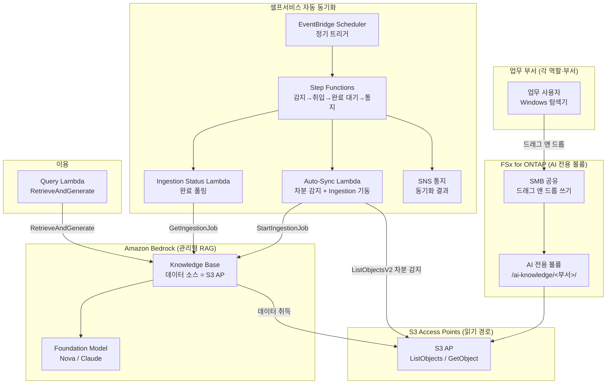

# Self-Service Knowledge Base Curation (민주화된 AI 지식 운영)

🌐 **Language / 言語**: [日本語](README.md) | [English](README.en.md) | [한국어](README.ko.md) | [简体中文](README.zh-CN.md) | [繁體中文](README.zh-TW.md) | [Français](README.fr.md) | [Deutsch](README.de.md) | [Español](README.es.md)

## 개요

업무 부서 구성원이 **익숙한 Windows 탐색기의 드래그 앤 드롭 조작만으로** Amazon Bedrock Knowledge Base의 데이터 소스를 유지할 수 있도록 하는 패턴입니다.

FSx for ONTAP 위에 **AI 전용 볼륨 / 폴더**를 마련하고 SMB(Windows 공유)로 각 역할·부서에 공개합니다. 동일한 데이터를 **S3 Access Points 경유(읽기 경로)**로 Amazon Bedrock Knowledge Base의 데이터 소스에 연결하고, 파일 투입을 감지하여 **자동으로 취입(Ingestion)**을 실행합니다.

이를 통해 IT 부서가 요청 기반으로 수작업 ETL / 복사 / 취입을 수행하는 운영에서, **현장이 스스로 지식을 유지하는 민주화된 운영**으로 전환합니다.

## Before / After (운영 변혁)

> **주기**: 아래는 특정 고객명·담당자명을 마스킹한, 일반화된 운영 스토리입니다.

### Before — IT 부서의 수작업에 의존

```
업무 부서 "신제품이 나왔으니 이 Windows 팀 폴더의 자료를
          AI 지식에 넣어 주세요 (영업이 데모에서 사용합니다)"
   ↓ 요청 티켓
IT 부서 → EC2의 Windows Server에서 수동으로 파일 복사
        → S3 버킷에 업로드
        → Bedrock Knowledge Base에 수동으로 취입 실행
        → 완료 연락
```

- 요청마다 IT 부서가 개입 → 병목·시차
- 복사 작업으로 인한 **데이터 이중 관리**와 갱신 누락
- "누가·언제·무엇을 넣었는지"가 담당자에 종속됨

### After — 현장 주도 셀프서비스

```
IT 부서 "이 Windows 폴더에 AI에게 사용하게 하고 싶은 데이터를 넣고,
         직접 유지 관리하세요. AI는 이 데이터를 참조합니다"
   ↓
업무 부서 → 평소대로 Windows 탐색기로
          AI 전용 폴더에 드래그 앤 드롭 (추가·갱신·삭제)
   ↓ (자동)
S3 Access Point 경유로 Bedrock Knowledge Base가 동기화 → 즉시 검색 대상으로
```

- IT 부서의 요청 대응 불필요 → 리드타임 단축
- 파일은 FSx for ONTAP 위의 **정본 그대로** (S3로 복사 불필요)
- 데이터 오너십이 각 역할·부서로 분산 (민주화)

## 해결하는 과제

| 과제 | 본 패턴에 의한 해결 |
|------|-------------------|
| 지식 갱신이 IT 부서의 수작업 대기 | 현장이 Windows 조작으로 직접 유지, 자동 취입 |
| S3로의 복사에 의한 데이터 이중 관리 | S3 AP 경유로 FSx for ONTAP의 정본을 직접 데이터 소스화 |
| 취입 누락·갱신 누락 | 파일 투입을 감지하여 자동 Ingestion |
| 전문 스킬(ETL/S3/Bedrock)이 필요 | Windows 탐색기의 드래그 앤 드롭만 |
| 데이터 오너가 불명확 | 폴더 구성을 역할·부서 단위로 분할해 책임 분계 |

## 아키텍처



## 2가지 운영 시나리오 (데모)

동일한 기반 위에서 운영 성숙도에 따른 2단계를 체험할 수 있습니다. 자세한 내용은 [데모 가이드](docs/demo-guide.md)를 참조하세요.

| 시나리오 | 개요 | 취입 트리거 |
|---------|------|----------------|
| **A: 수동 유지 관리 체험** | Windows 파일 조작(추가/갱신/삭제)으로 AI 데이터를 유지. 취입은 사람이 수동(콘솔 "동기화" / CLI) | 수동 |
| **B: 자동화** | A의 수동 동기화를 Lambda + Step Functions + EventBridge로 자동화(감지→취입→완료 대기→통지) | 자동 |

> 업무 사용자의 조작(드래그 앤 드롭)은 두 시나리오에서 동일합니다. 달라지는 것은 취입 이후를 사람이 하느냐, 서버리스가 하느냐뿐입니다.

## 하이브리드 RAG: 내부 문서 + Web 검색 (opt-in, NEW)

> AWS Summit NYC 2026 (2026-06-17)에서 GA된 **AgentCore Web Search Tool**을 통합했습니다.

`EnableWebSearch=true`를 설정하면 Query Lambda가 내부 KB 답변에 더해 실시간 Web 검색 결과로 보강한 통합 답변을 생성합니다.

| 모드 | 답변 소스 | 사용 사례 |
|--------|-----------|-------------|
| `EnableWebSearch=false` (기본값) | 내부 문서만 (FSx for ONTAP → S3 Vectors) | 사내 지식 QA |
| `EnableWebSearch=true` | 내부 문서 + Web 검색 결과 | 최신 법규·시장 동향·제품 비교 |

- Graceful degradation: Web Search가 실패해도 내부 KB만으로 답변
- 인용 분리: `[내부: 파일명]` + `[Web: 제목](URL)`
- 보안: Web 결과는 비신뢰 데이터, 프롬프트 인젝션 방어 완료

자세한 내용: [docs/investigations/agentcore-web-search-fsxn-integration.md](../../docs/investigations/agentcore-web-search-fsxn-integration.md)

## 셀프서비스 운영 모델 (민주화)

### AI 전용 볼륨의 폴더 설계 (Amazon Quick 상정 역할에 준거)

업무 역할(부서)은 **Amazon Quick**이 대상으로 하는 역할에 맞춰 넓게 마련합니다.
Quick FAQ는 "sales, marketing, IT, operations, finance, legal"을 대상으로 명기하고,
developers에는 전용 페이지가 있습니다.

```
/ai-knowledge/                     ← AI 전용 볼륨 (SMB 공유)
├── sales/                         ← 영업 (어카운트 플랜·제품 정보·플레이북)
├── marketing/                     ← 마케팅 (브랜드·캠페인·콘텐츠)
├── finance/                       ← 재무·경리 (예산·경비·포캐스트)
├── information-technology/        ← 정보 시스템 (런북·IT FAQ·보안)
├── operations/                    ← 오퍼레이션 (SOP·업무 프로세스)
├── legal/                         ← 법무 (계약·NDA·컴플라이언스)
└── developers/                    ← 개발 (규약·온보딩·서비스 카탈로그)
```

| 폴더 | 역할 | Amazon Quick에서의 상정 (참고·time-sensitive) |
|-----------|--------|--------------------------------|
| `sales/` | 영업 | Lead scoring / Sales forecasting / CRM ([/quick/sales/](https://aws.amazon.com/quick/sales/)) |
| `marketing/` | 마케팅 | 캠페인·브랜드·콘텐츠 (Quick FAQ) |
| `finance/` | 재무·경리 | 예산·경비·포캐스트 (Quick FAQ) |
| `information-technology/` | 정보 시스템 | 인시던트 대응·IT FAQ·보안 ([/quick/information-technology/](https://aws.amazon.com/quick/information-technology/)) |
| `operations/` | 오퍼레이션 | SOP·업무 프로세스 (Quick FAQ) |
| `legal/` | 법무 | 계약·컴플라이언스 (Quick FAQ) |
| `developers/` | 개발 | 코딩 규약·온보딩 ([/quick/developers/](https://aws.amazon.com/quick/developers/)) |

- 각 폴더는 **NTFS ACL**로 담당 역할·부서에 쓰기 권한을 부여
- 업무 사용자는 자기 부서 폴더에 **드래그 앤 드롭**으로 추가·갱신·삭제
- IT 부서는 폴더 구성과 취입 자동화의 유지만 담당
- 각 역할의 **샘플 데이터**는 [`sample-data/ai-knowledge/`](sample-data/)에 동봉 (데모 투입용)

> 본 UC는 이후 작성 예정인 **Amazon Quick UC**와 역할 구성을 맞추고 있어, 동일한 AI 전용 볼륨의
> 폴더/테스트 데이터를 공유·재활용할 수 있습니다.

### 자동 취입 플로우 (시나리오 B)

1. **EventBridge Scheduler**가 정기적으로 Step Functions를 기동 (예: `rate(15 minutes)`)
2. **Auto-Sync Lambda**가 S3 AP의 `ListObjectsV2`로 **차분(신규·갱신)을 감지**
3. 차분이 있으면 Bedrock Knowledge Base의 `StartIngestionJob`을 기동 (없으면 즉시 종료)
4. **Ingestion Status Lambda**가 `GetIngestionJob`으로 완료를 폴링
5. 취입 결과를 **SNS로 통지** (투입 건수·실패 건수)

> 시나리오 A(수동)에서는 이 2~5를 사람이 콘솔/CLI로 수행합니다. 시나리오 B는 그것을 Step Functions로 치환합니다.

> **설계 판단**: 본 패턴은 **관리형 Bedrock Knowledge Base**(Pattern C)를 채택하여 운영 부하를 최소화합니다. 파일 레벨의 엄격한 검색 시 ACL 제어가 필요한 경우에는 커스텀 Permission-aware RAG([FC3 genai-rag-enterprise-files](../genai-rag-enterprise-files/), Pattern A)를 선택하세요.

### 권한·역할 좁히기 (메타데이터 필터 옵션)

관리형 KB인 채로도 **메타데이터 필터링**으로 "역할/부서/기밀 구분"에 의한 검색 시 좁히기가 가능합니다.
각 파일에 `<file>.metadata.json`을 병치하고, Query 시에 `role`이나 임의의 `filter`를 전달합니다.

```jsonc
// 예: product-x-spec.md.metadata.json
{ "metadataAttributes": { "role": "sales", "classification": "internal" } }
```

```bash
# 영업 역할로 좁혀서 검색
aws lambda invoke --function-name <QueryFn> \
  --payload '{"query":"제품 X의 사양은?","role":"sales"}' \
  --cli-binary-format raw-in-base64-out out.json
```

> **중요한 제약 (S3 Vectors를 벡터 스토어로 사용하는 KB)**:
> - **필터 가능한 메타데이터는 1 문서당 2048 바이트 이내** (초과하면 ingestion이 실패). `metadataAttributes`는 작게 유지
> - 메타데이터 파일은 1 파일당 최대 10 KB
> - 필터가 과도하게 선택적이면 근사 최근접 이웃 검색의 recall이 저하될 수 있음 (필터 입도는 평가하여 결정)
> - 이는 AWS 측 접근 제어가 아닌 **검색 좁히기**입니다. 이용자 개인별 엄격한 접근 제어가 필요하다면,
>   Amazon Quick의 S3 지식 베이스 문서 레벨 ACL([UC30](../genai-quick-agentic-workspace/) 참조)이나
>   커스텀 Permission-aware RAG(FC3)를 검토하세요

## 관리형 KB vs 커스텀 RAG의 선택

| 관점 | 본 UC: 관리형 KB (Pattern C) | FC3: 커스텀 RAG (Pattern A) |
|------|------------------------------|------------------------------|
| 주목적 | 데이터 운영의 민주화·운영 부하 삭감 | 검색 시 파일 레벨 권한 필터 |
| RAG 구현 | Bedrock Knowledge Bases(관리형) | OpenSearch + 자체 검색 + ACL 추출 |
| 접근 제어 | 폴더/공유 레벨(SMB ACL) + KB 데이터 소스 경계 | 청크 단위 AD SID 메타데이터 필터 |
| 운영 부하 | 낮음(관리형) | 중~높음(자체 파이프라인) |
| 적합한 케이스 | 부서 내 공유 지식, 사내 FAQ, 제품 정보 | 규제 업종, 기밀 문서, 이용자별로 보이는 범위가 다름 |

## 디렉터리 구성

```
genai-kb-selfservice-curation/
├── README.md / README.en.md
├── template.yaml                 # SAM: 셀프서비스 자동 동기화 레이어
├── samconfig.toml.example
├── functions/
│   ├── auto_sync/handler.py      # 차분 감지 + Ingestion 기동
│   ├── ingestion_status/handler.py  # Ingestion 완료 폴링 (시나리오 B)
│   └── query/handler.py          # RetrieveAndGenerate (데모용 Q&A)
├── sample-data/                  # 역할별 시드 데이터 (데모 투입용)
│   └── ai-knowledge/<role>/...   # sales / marketing / finance / it / operations / legal / developers
├── tests/
│   └── test_handlers.py
└── docs/
    ├── architecture.md
    └── demo-guide.md             # 시나리오 A(수동) / B(자동화) (마스킹 완료)
```

> **배포 전제**: Knowledge Base 본체와 데이터 소스(S3 AP)는 검증된 스크립트 [`scripts/create_bedrock_kb.py`](../scripts/create_bedrock_kb.py) 또는 Bedrock 콘솔에서 작성하고, 그 `KnowledgeBaseId` / `DataSourceId`를 본 템플릿의 파라미터에 전달합니다. OpenSearch Serverless의 벡터 인덱스 작성이 CloudFormation 네이티브가 아니기 때문에 이 분리 구성을 채택하고 있습니다.

## 보안 설계

- **데이터 이동 없음**: 파일은 FSx for ONTAP 위의 정본 그대로, S3 AP 경유로 읽기만
- **쓰기는 SMB/NFS만**: AI 취입 경로(S3 AP)는 읽기 이용. 쓰기는 Windows 공유 경유
- **폴더 단위 책임 분계**: NTFS ACL로 부서별 쓰기 권한을 분리
- **최소 권한**: Lambda는 대상 S3 AP의 List/Get과 해당 KB의 Ingestion만 허가
- **감사**: CloudTrail(API 조작) + ONTAP 감사 로그(파일 조작) + Ingestion 잡 이력
- **암호화**: SSE-FSX(스토리지), TLS(전송 중), KMS(SNS / 로그)

> **주기**: S3 AP의 데이터 소스 경계는 볼륨/프리픽스 단위입니다. 이용자별로 보이는 범위를 바꾸고 싶은 경우에는, 본 UC가 아닌 커스텀 Permission-aware RAG를 검토하세요.

## 대상 업계·사용 사례

- 제조·엔지니어링 (제품 정보·사양서의 사내 공유 지식)
- 영업·고객 지원 (제안 자료·FAQ·트러블슈트)
- 백오피스 (사내 규정·절차서)
- 부서 내에서 완결되는 사내 지식 전반

## Success Metrics

### Outcome
IT 부서의 수작업을 거치지 않고, 업무 부서가 스스로 지식을 유지할 수 있는 민주화된 AI 데이터 운영을 실현합니다.

### Metrics

| 메트릭 | 목표값 (예) |
|-----------|------------|
| 지식 갱신 리드타임 (투입→검색 가능) | < 15분 (스케줄 간격 의존) |
| IT 부서의 수동 취입 요청 건수 | 0건 / 월 (이행 후) |
| 자동 Ingestion 성공률 | > 98% |
| 차분 감지의 놓침 비율 | 0% (전체 List 주사) |
| 업무 사용자의 조작 | Windows 드래그 앤 드롭만 |

### Measurement Method
EventBridge Scheduler 실행 이력, Bedrock Ingestion 잡 통계(scanned / indexed / failed), CloudWatch Metrics, SNS 통지 로그.

---

## Data Classification

| 출력 | 분류 | 근거 |
|------|------|------|
| Bedrock KB Ingestion 결과 (벡터 + 메타데이터) | INTERNAL | 소스 파일과 동일한 분류를 계승. 외부 공개 불가 |
| Ingestion 잡 스테이터스 / SNS 통지 | INTERNAL | 운영 메타데이터. 기밀 데이터를 포함하지 않음 |
| CloudWatch Metrics / Logs | INTERNAL | 집계 지표. 파일 내용을 포함하지 않음 |

> 규제 업종에서는 CUI / FISC / HIPAA 분류가 추가로 필요합니다. `shared/data_classification.py`의 라벨 체계를 용도에 맞게 확장하세요.
> `dataDeletionPolicy=DELETE`는 파일 삭제 시 벡터도 즉시 삭제하지만, 보존 기간 요건이 있는 경우에는 `RETAIN`을 사용하고 별도의 퍼지 절차를 설계하세요.

---

## AWS 문서 링크

| 서비스 | 문서 |
|---------|------------|
| FSx for ONTAP | [사용자 가이드](https://docs.aws.amazon.com/fsx/latest/ONTAPGuide/what-is-fsx-ontap.html) |
| S3 Access Points for FSx for ONTAP | [S3 AP 가이드](https://docs.aws.amazon.com/fsx/latest/ONTAPGuide/s3-access-points.html) |
| FSx for ONTAP + Bedrock RAG 튜토리얼 | [Build RAG with Bedrock](https://docs.aws.amazon.com/fsx/latest/ONTAPGuide/tutorial-build-rag-with-bedrock.html) |
| Amazon Bedrock Knowledge Bases | [지식 베이스](https://docs.aws.amazon.com/bedrock/latest/userguide/knowledge-base.html) |
| Bedrock KB 데이터 취입 | [Ingest your data](https://docs.aws.amazon.com/bedrock/latest/userguide/kb-data-source.html) |
| RetrieveAndGenerate API | [API 레퍼런스](https://docs.aws.amazon.com/bedrock/latest/APIReference/API_agent-runtime_RetrieveAndGenerate.html) |
| EventBridge Scheduler | [사용자 가이드](https://docs.aws.amazon.com/scheduler/latest/UserGuide/what-is-scheduler.html) |

### Well-Architected Framework 대응

| 기둥 | 대응 |
|----|------|
| 운영 우수성 | 셀프서비스 운영, 자동 Ingestion, SNS 통지, 구조화 로그 |
| 보안 | 폴더 단위 ACL, IAM 최소 권한, 데이터 이동 없음, 감사 로그 |
| 신뢰성 | 전체 List 주사에 의한 차분 감지, Ingestion 잡 스테이터스 감시 |
| 성능 효율 | 차분 시에만 Ingestion 기동, 관리형 KB 스케일링 |
| 비용 최적화 | 서버리스, 차분 동기화, 관리형 서비스 활용 |
| 지속 가능성 | 온디맨드 실행, 불필요한 재취입 회피 |

---

## 비용 견적 (월액 개산)

> **주기**: 아래는 ap-northeast-1 리전의 개산이며, 실제 비용은 사용량에 따라 다릅니다. 최신 요금은 [AWS Pricing Calculator](https://calculator.aws/)에서 확인하세요. 벤치마크·요금은 time-sensitive합니다.

### 서버리스 컴포넌트 (종량 과금)

| 서비스 | 단가 | 상정 사용량 | 월액 개산 |
|---------|------|-----------|---------|
| Lambda(Auto-Sync) | $0.0000166667/GB-sec | 15분 간격 × 512MB | ~$1-3 |
| S3 API (ListObjects/GetObject) | $0.0047/10K requests | ~30K requests/일 | ~$4 |
| EventBridge Scheduler | $1.00/100만 invocations | ~3K invocations/월 | ~$0.01 |
| Bedrock Ingestion(Embeddings) | 모델 종량 | 차분 파일분만 | ~$2-10 |
| Bedrock 답변 생성(Nova/Claude) | 모델 종량 | 쿼리 수 의존 | ~$3-20 |
| SNS | $0.50/100K notifications | ~3K/월 | ~$0.02 |
| CloudWatch Logs | $0.76/GB ingested | ~1 GB/월 | ~$0.76 |
| OpenSearch Serverless(KB 벡터 스토어) | $0.24/OCU-hour | 최소 2 OCU ~ | 별도(KB 구성 의존) |

### 고정 비용 (기존 환경 전제)

| 컴포넌트 | 월액 |
|--------------|------|
| FSx for ONTAP(기존 AI 전용 볼륨을 공유) | 기존 환경을 공유 |
| S3 Access Point | 추가 요금 없음(S3 API 요금만) |

> **Governance Caveat**: 비용 견적은 개산이며 보증값이 아닙니다. 실제 청구액은 사용 패턴, 데이터 양, 리전, KB의 벡터 스토어 구성에 따라 다릅니다.

---

## 로컬 테스트

### Prerequisites 체크

```bash
aws --version          # AWS CLI v2
sam --version          # SAM CLI
python3 --version      # Python 3.12+
aws sts get-caller-identity  # AWS 인증 정보
```

### 유닛 테스트

```bash
python3 -m pytest tests/ -v
```

### sam local invoke

```bash
# 전제: AWS SAM CLI가 필요합니다. sam build가 코드와 공유 레이어를 자동으로 패키징합니다.
sam build
sam local invoke AutoSyncFunction --event events/auto-sync-event.json
```

---

## 출력 샘플 (Output Sample)

### Auto-Sync Lambda (차분 감지 + Ingestion 기동)

```json
{
  "status": "ingestion_started",
  "changed_files_detected": 4,
  "knowledge_base_id": "XXXXXXXXXX",
  "data_source_id": "YYYYYYYYYY",
  "ingestion_job_id": "ZZZZZZZZZZ",
  "scanned_prefix": "sales/product-catalog/",
  "timestamp": 1760000000
}
```

### Query Lambda (RetrieveAndGenerate)

```json
{
  "query": "신제품 X의 주요 사양을 알려줘",
  "answer": "신제품 X의 주요 사양은, 계량 범위...(취입 완료된 문서에 근거)",
  "citations": [
    {"source": "sales/product-catalog/product-x-spec.pdf", "score": 0.93}
  ]
}
```

> **주기**: 위는 샘플 출력이며, 실제 값은 환경·입력 데이터에 따라 다릅니다. 수치는 sizing reference이며 service limit이 아닙니다.

---

## Performance Considerations

- FSx for ONTAP의 스루풋 캐패시티는 NFS/SMB/S3AP에서 공유됩니다. 업무 사용자의 SMB 쓰기와 AI 취입의 읽기가 동일한 캐패시티를 공유하는 점에 주의하세요
- S3 Access Point 경유의 레이턴시는 수십 밀리초의 오버헤드가 발생합니다
- 대량 파일 투입 시에는 Ingestion 잡의 완료에 시간이 걸립니다. 스케줄 간격은 취입 소요 시간보다 길게 설정하세요
- 차분 감지는 전체 List 주사이므로, 파일 수가 매우 많은 경우에는 프리픽스 분할을 검토하세요

> **주기**: 본 패턴의 성능 수치는 sizing reference이며, service limit이 아닙니다. 실환경에서의 성능은 FSx for ONTAP 스루풋 캐패시티, 파일 수, 동시 실행 워크로드에 따라 다릅니다.

---

## 관련 UC·링크

| 관련 | 관련 포인트 |
|---------|------------|
| [PoC 전제조건 체크리스트](docs/poc-checklist.md) | 배포 전 확인 사항(S3 Vectors 제약·추론 프로파일 등) |
| [클린업 runbook](../docs/uc29-uc30-cleanup-runbook.md) | 수동 성과물을 포함한 철거 절차(2UC 공통) |
| [FC3 genai-rag-enterprise-files](../genai-rag-enterprise-files/) | 엄격한 권한 필터가 필요한 경우의 커스텀 RAG(Pattern A) |
| [확장 패턴: Bedrock KB 통합](../docs/extension-patterns.md) | 관리형 KB + S3 AP의 범용 패턴 |
| [KB 작성 스크립트](../scripts/create_bedrock_kb.py) | KB / 데이터 소스 작성(본 UC의 배포 전제) |
| [업계·워크로드 매핑](../docs/industry-workload-mapping.md) | UC 선택 가이드 |

## 운영 견고화 (구현 완료)

- **다중 기동 방지**: Auto-Sync는 진행 중인 Ingestion 잡이 있으면 신규 기동을 스킵(`ingestion_in_progress`)
- **Step Functions의 Retry/Catch**: Lambda 태스크에 리트라이(지수 백오프)와 실패 시의 `NotifyFailure` 분기
- **메타데이터 필터**: Query는 `role`/임의 `filter`로 역할·부서 좁히기가 가능

---

## 배포

AWS SAM CLI로 배포합니다(플레이스홀더는 환경에 맞게 치환하세요):

> **배포 전제**: 본 템플릿은 기존의 Amazon Bedrock Knowledge Base와 데이터 소스(S3 AP 접속)를 전제로 합니다. OpenSearch Serverless의 벡터 인덱스 작성이 CloudFormation 네이티브가 아니기 때문에, Knowledge Base 본체는 배포 전에 작성하고, 그 `KnowledgeBaseId` / `DataSourceId`를 파라미터에 전달합니다(리포지토리 루트의 `scripts/create_bedrock_kb.py` 또는 Bedrock 콘솔에서 작성).

```bash
# 전제: AWS SAM CLI가 필요합니다. sam build가 코드와 공유 레이어를 자동으로 패키징합니다.
sam build

sam deploy \
  --stack-name fsxn-kb-selfservice-curation \
  --parameter-overrides \
    S3AccessPointAlias=<your-s3ap-alias> \
    S3AccessPointName=<your-s3ap-name> \
    KnowledgeBaseId=<your-kb-id> \
    DataSourceId=<your-datasource-id> \
    NotificationEmail=<your-email@example.com> \
  --capabilities CAPABILITY_NAMED_IAM \
  --resolve-s3 \
  --region <your-region>
```

> **주의**: `template.yaml`은 SAM CLI(`sam build` + `sam deploy`)로 사용합니다.
> `aws cloudformation deploy` 명령으로 직접 배포하는 경우에는 `template-deploy.yaml`을 사용하세요(Lambda zip 파일의 사전 패키징과 S3 업로드가 필요합니다).

## Governance Note

> 본 패턴은 기술 아키텍처 가이던스를 제공합니다. 법적·컴플라이언스·규제상의 조언이 아닙니다. 조직은 적격한 전문가에게 상담하세요. S3 AP의 데이터 소스 경계는 볼륨/프리픽스 단위이며, 이용자 개인별 가시 범위 제어가 필요한 경우에는 본 UC의 적용 범위 밖입니다.
>
> **접근 제어의 3계층 (용도에 따라 선택)**: ① 검색 좁히기 = Bedrock KB 메타데이터 필터(본 UC, AWS 인가가 아님) / ② 문서 레벨 ACL = Amazon Quick S3 지식 베이스([UC30](../genai-quick-agentic-workspace/), 이용자·그룹 단위) / ③ 청크 단위의 권한 필터 = 커스텀 Permission-aware RAG([FC3](../genai-rag-enterprise-files/), AD SID/NTFS ACL, 규제 업종용)
