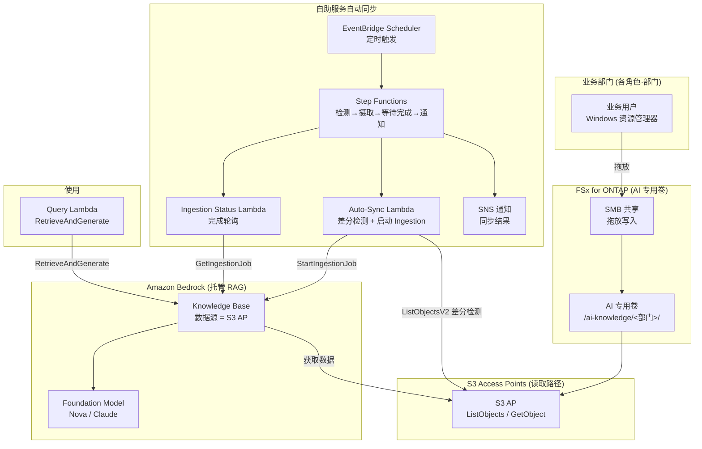

# Self-Service Knowledge Base Curation (民主化的 AI 知识运营)

🌐 **Language / 言語**: [日本語](README.md) | [English](README.en.md) | [한국어](README.ko.md) | [简体中文](README.zh-CN.md) | [繁體中文](README.zh-TW.md) | [Français](README.fr.md) | [Deutsch](README.de.md) | [Español](README.es.md)

## 概述

一种让业务部门成员**仅通过熟悉的 Windows 资源管理器拖放操作**即可维护 Amazon Bedrock Knowledge Base 数据源的模式。

在 FSx for ONTAP 上准备 **AI 专用卷 / 文件夹**，并通过 SMB（Windows 共享）向各角色·部门公开。将相同的数据**经由 S3 Access Points（读取路径）**连接到 Amazon Bedrock Knowledge Base 数据源，检测到文件投入后**自动执行摄取（Ingestion）**。

由此，从 IT 部门基于请求进行手动 ETL / 复制 / 摄取的运营，转变为**由现场自行维护知识的民主化运营**。

## Before / After（运营变革）

> **注记**: 以下是屏蔽了特定客户名·负责人名的、一般化的运营故事。

### Before — 依赖 IT 部门的手动作业

```
业务部门"有新产品上市，请把这个 Windows 团队文件夹里的资料
          放入 AI 知识（销售要在演示中使用）"
   ↓ 请求工单
IT 部门 → 从 EC2 上的 Windows Server 手动复制文件
        → 上传到 S3 存储桶
        → 手动向 Bedrock Knowledge Base 执行摄取
        → 完成通知
```

- 每次请求都需 IT 部门介入 → 瓶颈·时间滞后
- 复制作业导致的**数据双重管理**与更新遗漏
- "谁·何时·放入了什么"依赖于个人

### After — 现场主导的自助服务

```
IT 部门"请把想让 AI 使用的数据放入这个 Windows 文件夹，
         并自行维护。AI 将参照这些数据"
   ↓
业务部门 → 像平常一样用 Windows 资源管理器
          向 AI 专用文件夹拖放（添加·更新·删除）
   ↓ （自动）
经由 S3 Access Point，Bedrock Knowledge Base 同步 → 立即成为检索对象
```

- 无需 IT 部门的请求处理 → 缩短前置时间
- 文件保持为 FSx for ONTAP 上的**正本原样**（无需复制到 S3）
- 数据所有权分散到各角色·部门（民主化）

## 解决的课题

| 课题 | 本模式的解决方案 |
|------|-------------------|
| 知识更新等待 IT 部门的手动作业 | 现场以 Windows 操作直接维护，自动摄取 |
| 因复制到 S3 导致的数据双重管理 | 经由 S3 AP 将 FSx for ONTAP 的正本直接作为数据源 |
| 摄取遗漏·更新遗漏 | 检测文件投入并自动 Ingestion |
| 需要专业技能（ETL/S3/Bedrock） | 仅 Windows 资源管理器的拖放 |
| 数据所有者不明确 | 将文件夹结构按角色·部门单位划分以明确责任分界 |

## 架构



## 两种运营场景（演示）

在相同的基础上，可以体验根据运营成熟度的两个阶段。详情请参阅[演示指南](docs/demo-guide.md)。

| 场景 | 概要 | 摄取触发 |
|---------|------|----------------|
| **A: 手动维护体验** | 以 Windows 文件操作（添加/更新/删除）维护 AI 数据。摄取由人手动进行（控制台"同步" / CLI） | 手动 |
| **B: 自动化** | 用 Lambda + Step Functions + EventBridge 将 A 的手动同步自动化（检测→摄取→等待完成→通知） | 自动 |

> 业务用户的操作（拖放）在两种场景中不变。变化的只是摄取之后由人来做，还是由无服务器来做。

## 混合 RAG: 内部文档 + Web 检索 (opt-in, NEW)

> 集成了在 AWS Summit NYC 2026 (2026-06-17) 上 GA 的 **AgentCore Web Search Tool**。

设置 `EnableWebSearch=true` 后，Query Lambda 会在内部 KB 答案之外，生成用实时 Web 检索结果补强的整合答案。

| 模式 | 答案来源 | 使用场景 |
|--------|-----------|-------------|
| `EnableWebSearch=false`（默认） | 仅内部文档 (FSx for ONTAP → S3 Vectors) | 公司内知识 QA |
| `EnableWebSearch=true` | 内部文档 + Web 检索结果 | 最新法规·市场动向·产品比较 |

- Graceful degradation: 即使 Web Search 失败，也仅用内部 KB 回答
- 引用分离: `[内部: 文件名]` + `[Web: 标题](URL)`
- 安全: Web 结果为非可信数据，已完成提示注入防御

详情: [docs/investigations/agentcore-web-search-fsxn-integration.md](../../docs/investigations/agentcore-web-search-fsxn-integration.md)

## 自助服务运营模型（民主化）

### AI 专用卷的文件夹设计（遵循 Amazon Quick 设想的角色）

业务角色（部门）按照 **Amazon Quick** 所面向的角色广泛准备。
Quick FAQ 明确以 "sales, marketing, IT, operations, finance, legal" 为对象，
developers 则有专用页面。

```
/ai-knowledge/                     ← AI 专用卷（SMB 共享）
├── sales/                         ← 销售（客户计划·产品信息·手册）
├── marketing/                     ← 市场营销（品牌·活动·内容）
├── finance/                       ← 财务·会计（预算·费用·预测）
├── information-technology/        ← 信息系统（运行手册·IT FAQ·安全）
├── operations/                    ← 运营（SOP·业务流程）
├── legal/                         ← 法务（合同·NDA·合规）
└── developers/                    ← 开发（规范·入职·服务目录）
```

| 文件夹 | 角色 | 在 Amazon Quick 中的设想（参考·time-sensitive） |
|-----------|--------|--------------------------------|
| `sales/` | 销售 | Lead scoring / Sales forecasting / CRM ([/quick/sales/](https://aws.amazon.com/quick/sales/)) |
| `marketing/` | 市场营销 | 活动·品牌·内容 (Quick FAQ) |
| `finance/` | 财务·会计 | 预算·费用·预测 (Quick FAQ) |
| `information-technology/` | 信息系统 | 事件响应·IT FAQ·安全 ([/quick/information-technology/](https://aws.amazon.com/quick/information-technology/)) |
| `operations/` | 运营 | SOP·业务流程 (Quick FAQ) |
| `legal/` | 法务 | 合同·合规 (Quick FAQ) |
| `developers/` | 开发 | 编码规范·入职 ([/quick/developers/](https://aws.amazon.com/quick/developers/)) |

- 各文件夹以 **NTFS ACL** 向负责的角色·部门授予写入权限
- 业务用户通过**拖放**在本部门文件夹中添加·更新·删除
- IT 部门仅负责维护文件夹结构和摄取自动化
- 各角色的**示例数据**随附于 [`sample-data/ai-knowledge/`](sample-data/)（供演示投入）

> 本 UC 与此后计划创建的 **Amazon Quick UC** 保持角色结构一致，可以共享·复用同一 AI 专用卷的
> 文件夹/测试数据。

### 自动摄取流程（场景 B）

1. **EventBridge Scheduler** 定期启动 Step Functions（例: `rate(15 minutes)`）
2. **Auto-Sync Lambda** 用 S3 AP 的 `ListObjectsV2` **检测差分（新增·更新）**
3. 若有差分则启动 Bedrock Knowledge Base 的 `StartIngestionJob`（若无则立即结束）
4. **Ingestion Status Lambda** 用 `GetIngestionJob` 轮询完成
5. 将摄取结果**通过 SNS 通知**（投入件数·失败件数）

> 在场景 A（手动）中由人在控制台/CLI 执行这 2~5 步。场景 B 将其替换为 Step Functions。

> **设计判断**: 本模式采用**托管的 Bedrock Knowledge Base**（Pattern C），将运营负荷降至最低。若需要文件级别的严格检索时 ACL 控制，请选择自定义 Permission-aware RAG（[FC3 genai-rag-enterprise-files](../genai-rag-enterprise-files/), Pattern A）。

### 权限·角色收窄（元数据过滤选项）

即使保持托管 KB，也可通过**元数据过滤**按"角色/部门/机密区分"进行检索时收窄。
在每个文件旁并置 `<file>.metadata.json`，在 Query 时传递 `role` 或任意 `filter`。

```jsonc
// 例: product-x-spec.md.metadata.json
{ "metadataAttributes": { "role": "sales", "classification": "internal" } }
```

```bash
# 收窄到销售角色进行检索
aws lambda invoke --function-name <QueryFn> \
  --payload '{"query":"产品 X 的规格是什么？","role":"sales"}' \
  --cli-binary-format raw-in-base64-out out.json
```

> **重要约束（使用 S3 Vectors 作为向量存储的 KB）**:
> - **可过滤的元数据每个文档需在 2048 字节以内**（超出则 ingestion 失败）。`metadataAttributes` 请保持小
> - 元数据文件每个文件最大 10 KB
> - 过滤过于选择性时，近似最近邻检索的 recall 可能下降（过滤粒度请评估后决定）
> - 这是**检索收窄**，而非 AWS 侧的访问控制。若需要针对每个使用者个人的严格访问控制，
>   请考虑 Amazon Quick 的 S3 知识库文档级别 ACL（参阅 [UC30](../genai-quick-agentic-workspace/)）或
>   自定义 Permission-aware RAG（FC3）

## 托管 KB vs 自定义 RAG 的选择

| 观点 | 本 UC: 托管 KB (Pattern C) | FC3: 自定义 RAG (Pattern A) |
|------|------------------------------|------------------------------|
| 主要目的 | 数据运营的民主化·削减运营负荷 | 检索时的文件级别权限过滤 |
| RAG 实现 | Bedrock Knowledge Bases（托管） | OpenSearch + 自建检索 + ACL 抽取 |
| 访问控制 | 文件夹/共享级别（SMB ACL）+ KB 数据源边界 | 分块单位的 AD SID 元数据过滤 |
| 运营负荷 | 低（托管） | 中~高（自建管道） |
| 适合场景 | 部门内共享知识、公司内 FAQ、产品信息 | 受监管行业、机密文档、每个使用者可见范围不同 |

## 目录结构

```
genai-kb-selfservice-curation/
├── README.md / README.en.md
├── template.yaml                 # SAM: 自助服务自动同步层
├── samconfig.toml.example
├── functions/
│   ├── auto_sync/handler.py      # 差分检测 + 启动 Ingestion
│   ├── ingestion_status/handler.py  # Ingestion 完成轮询（场景 B）
│   └── query/handler.py          # RetrieveAndGenerate（演示用 Q&A）
├── sample-data/                  # 按角色的种子数据（供演示投入）
│   └── ai-knowledge/<role>/...   # sales / marketing / finance / it / operations / legal / developers
├── tests/
│   └── test_handlers.py
└── docs/
    ├── architecture.md
    └── demo-guide.md             # 场景 A（手动） / B（自动化）（已屏蔽）
```

> **部署前提**: Knowledge Base 本体和数据源（S3 AP）通过已验证的脚本 [`scripts/create_bedrock_kb.py`](../scripts/create_bedrock_kb.py) 或 Bedrock 控制台创建，并将其 `KnowledgeBaseId` / `DataSourceId` 传递给本模板的参数。由于 OpenSearch Serverless 的向量索引创建并非 CloudFormation 原生，因此采用这种分离构成。

## 安全设计

- **无数据移动**: 文件保持为 FSx for ONTAP 上的正本原样，经由 S3 AP 仅读取
- **写入仅 SMB/NFS**: AI 摄取路径（S3 AP）为读取使用。写入经由 Windows 共享
- **文件夹单位的责任分界**: 以 NTFS ACL 按部门分离写入权限
- **最小权限**: Lambda 仅允许对目标 S3 AP 的 List/Get 和该 KB 的 Ingestion
- **审计**: CloudTrail（API 操作）+ ONTAP 审计日志（文件操作）+ Ingestion 作业历史
- **加密**: SSE-FSX（存储）、TLS（传输中）、KMS（SNS / 日志）

> **注记**: S3 AP 的数据源边界为卷/前缀单位。若想按使用者改变可见范围，请考虑自定义 Permission-aware RAG 而非本 UC。

## 目标行业·使用场景

- 制造·工程（产品信息·规格书的公司内共享知识）
- 销售·客户支持（提案资料·FAQ·故障排除）
- 后台（公司内规程·操作手册）
- 在部门内闭环的公司内知识总体

## Success Metrics

### Outcome
实现无需 IT 部门手动介入、业务部门自行维护知识的民主化 AI 数据运营。

### Metrics

| 指标 | 目标值（例） |
|-----------|------------|
| 知识更新前置时间（投入→可检索） | < 15 分钟（依赖调度间隔） |
| IT 部门的手动摄取请求件数 | 0 件 / 月（迁移后） |
| 自动 Ingestion 成功率 | > 98% |
| 差分检测的漏检率 | 0%（全量 List 扫描） |
| 业务用户的操作 | 仅 Windows 拖放 |

### Measurement Method
EventBridge Scheduler 执行历史、Bedrock Ingestion 作业统计（scanned / indexed / failed）、CloudWatch Metrics、SNS 通知日志。

---

## Data Classification

| 输出 | 分类 | 依据 |
|------|------|------|
| Bedrock KB Ingestion 结果（向量 + 元数据） | INTERNAL | 继承与源文件相同的分类。不可对外公开 |
| Ingestion 作业状态 / SNS 通知 | INTERNAL | 运营元数据。不含机密数据 |
| CloudWatch Metrics / Logs | INTERNAL | 汇总指标。不含文件内容 |

> 在受监管行业中，还需额外的 CUI / FISC / HIPAA 分类。请将 `shared/data_classification.py` 的标签体系按用途扩展。
> `dataDeletionPolicy=DELETE` 在文件删除时立即删除向量，但若有保留期限要求，请使用 `RETAIN` 并另行设计清除流程。

---

## AWS 文档链接

| 服务 | 文档 |
|---------|------------|
| FSx for ONTAP | [用户指南](https://docs.aws.amazon.com/fsx/latest/ONTAPGuide/what-is-fsx-ontap.html) |
| S3 Access Points for FSx for ONTAP | [S3 AP 指南](https://docs.aws.amazon.com/fsx/latest/ONTAPGuide/s3-access-points.html) |
| FSx for ONTAP + Bedrock RAG 教程 | [Build RAG with Bedrock](https://docs.aws.amazon.com/fsx/latest/ONTAPGuide/tutorial-build-rag-with-bedrock.html) |
| Amazon Bedrock Knowledge Bases | [知识库](https://docs.aws.amazon.com/bedrock/latest/userguide/knowledge-base.html) |
| Bedrock KB 数据摄取 | [Ingest your data](https://docs.aws.amazon.com/bedrock/latest/userguide/kb-data-source.html) |
| RetrieveAndGenerate API | [API 参考](https://docs.aws.amazon.com/bedrock/latest/APIReference/API_agent-runtime_RetrieveAndGenerate.html) |
| EventBridge Scheduler | [用户指南](https://docs.aws.amazon.com/scheduler/latest/UserGuide/what-is-scheduler.html) |

### Well-Architected Framework 对应

| 支柱 | 对应 |
|----|------|
| 卓越运营 | 自助服务运营、自动 Ingestion、SNS 通知、结构化日志 |
| 安全 | 文件夹单位 ACL、IAM 最小权限、无数据移动、审计日志 |
| 可靠性 | 全量 List 扫描的差分检测、Ingestion 作业状态监控 |
| 性能效率 | 仅在有差分时启动 Ingestion、托管 KB 的扩展 |
| 成本优化 | 无服务器、差分同步、活用托管服务 |
| 可持续性 | 按需执行、避免不必要的重新摄取 |

---

## 成本估算（月度概算）

> **注记**: 以下为 ap-northeast-1 区域的概算，实际成本因使用量而异。最新价格请在 [AWS Pricing Calculator](https://calculator.aws/) 确认。基准·价格均为 time-sensitive。

### 无服务器组件（按量计费）

| 服务 | 单价 | 设想使用量 | 月度概算 |
|---------|------|-----------|---------|
| Lambda（Auto-Sync） | $0.0000166667/GB-sec | 15 分钟间隔 × 512MB | ~$1-3 |
| S3 API (ListObjects/GetObject) | $0.0047/10K requests | ~30K requests/日 | ~$4 |
| EventBridge Scheduler | $1.00/100万 invocations | ~3K invocations/月 | ~$0.01 |
| Bedrock Ingestion（Embeddings） | 模型按量 | 仅差分文件部分 | ~$2-10 |
| Bedrock 答案生成（Nova/Claude） | 模型按量 | 依赖查询数 | ~$3-20 |
| SNS | $0.50/100K notifications | ~3K/月 | ~$0.02 |
| CloudWatch Logs | $0.76/GB ingested | ~1 GB/月 | ~$0.76 |
| OpenSearch Serverless（KB 向量存储） | $0.24/OCU-hour | 最小 2 OCU ~ | 另计（依赖 KB 构成） |

### 固定成本（以现有环境为前提）

| 组件 | 月度 |
|--------------|------|
| FSx for ONTAP（共享现有的 AI 专用卷） | 共享现有环境 |
| S3 Access Point | 无额外费用（仅 S3 API 费用） |

> **Governance Caveat**: 成本估算为概算，并非保证值。实际账单因使用模式、数据量、区域、KB 的向量存储构成而异。

---

## 本地测试

### Prerequisites 检查

```bash
aws --version          # AWS CLI v2
sam --version          # SAM CLI
python3 --version      # Python 3.12+
aws sts get-caller-identity  # AWS 凭证
```

### 单元测试

```bash
python3 -m pytest tests/ -v
```

### sam local invoke

```bash
# 前提: 需要 AWS SAM CLI。sam build 会自动打包代码和共享层。
sam build
sam local invoke AutoSyncFunction --event events/auto-sync-event.json
```

---

## 输出示例 (Output Sample)

### Auto-Sync Lambda（差分检测 + 启动 Ingestion）

```json
{
  "status": "ingestion_started",
  "changed_files_detected": 4,
  "knowledge_base_id": "XXXXXXXXXX",
  "data_source_id": "YYYYYYYYYY",
  "ingestion_job_id": "ZZZZZZZZZZ",
  "scanned_prefix": "sales/product-catalog/",
  "timestamp": 1760000000
}
```

### Query Lambda（RetrieveAndGenerate）

```json
{
  "query": "请告诉我新产品 X 的主要规格",
  "answer": "新产品 X 的主要规格是，计量范围...（基于已摄取的文档）",
  "citations": [
    {"source": "sales/product-catalog/product-x-spec.pdf", "score": 0.93}
  ]
}
```

> **注记**: 以上为示例输出，实际值因环境·输入数据而异。数值为 sizing reference，而非 service limit。

---

## Performance Considerations

- FSx for ONTAP 的吞吐容量在 NFS/SMB/S3AP 之间共享。请注意业务用户的 SMB 写入与 AI 摄取的读取共享同一容量
- 经由 S3 Access Point 的延迟会产生数十毫秒的开销
- 大量文件投入时，Ingestion 作业的完成需要时间。调度间隔请设置为长于摄取所需时间
- 差分检测为全量 List 扫描，文件数非常多时请考虑前缀分割

> **注记**: 本模式的性能数值为 sizing reference，而非 service limit。实际环境的性能因 FSx for ONTAP 吞吐容量、文件数、并发执行的工作负载而异。

---

## 相关 UC·链接

| 相关 | 相关要点 |
|---------|------------|
| [PoC 前提条件检查清单](docs/poc-checklist.md) | 部署前的确认事项（S3 Vectors 约束·推理配置文件等） |
| [清理 runbook](../docs/uc29-uc30-cleanup-runbook.md) | 含手动成果物的拆除流程（2UC 共通） |
| [FC3 genai-rag-enterprise-files](../genai-rag-enterprise-files/) | 需要严格权限过滤时的自定义 RAG（Pattern A） |
| [扩展模式: Bedrock KB 集成](../docs/extension-patterns.md) | 托管 KB + S3 AP 的通用模式 |
| [KB 创建脚本](../scripts/create_bedrock_kb.py) | KB / 数据源创建（本 UC 的部署前提） |
| [行业·工作负载映射](../docs/industry-workload-mapping.md) | UC 选择指南 |

## 运营健壮化（已实现）

- **防止多重启动**: Auto-Sync 若有进行中的 Ingestion 作业则跳过新启动（`ingestion_in_progress`）
- **Step Functions 的 Retry/Catch**: 对 Lambda 任务的重试（指数退避）与失败时的 `NotifyFailure` 分支
- **元数据过滤**: Query 可用 `role`/任意 `filter` 进行角色·部门收窄

---

## 部署

使用 AWS SAM CLI 部署（占位符请按环境替换）:

> **部署前提**: 本模板以现有的 Amazon Bedrock Knowledge Base 和数据源（S3 AP 连接）为前提。由于 OpenSearch Serverless 的向量索引创建并非 CloudFormation 原生，请在部署前创建 Knowledge Base 本体，并将其 `KnowledgeBaseId` / `DataSourceId` 传递给参数（用仓库根目录的 `scripts/create_bedrock_kb.py` 或 Bedrock 控制台创建）。

```bash
# 前提: 需要 AWS SAM CLI。sam build 会自动打包代码和共享层。
sam build

sam deploy \
  --stack-name fsxn-kb-selfservice-curation \
  --parameter-overrides \
    S3AccessPointAlias=<your-s3ap-alias> \
    S3AccessPointName=<your-s3ap-name> \
    KnowledgeBaseId=<your-kb-id> \
    DataSourceId=<your-datasource-id> \
    NotificationEmail=<your-email@example.com> \
  --capabilities CAPABILITY_NAMED_IAM \
  --resolve-s3 \
  --region <your-region>
```

> **注意**: `template.yaml` 用于 SAM CLI（`sam build` + `sam deploy`）。
> 若使用 `aws cloudformation deploy` 命令直接部署，请使用 `template-deploy.yaml`（需要预先打包 Lambda zip 文件并上传到 S3）。

## Governance Note

> 本模式提供技术架构指导。并非法律·合规·监管方面的建议。组织应咨询合格的专业人士。S3 AP 的数据源边界为卷/前缀单位，若需要针对每个使用者个人的可见范围控制，则超出本 UC 的适用范围。
>
> **访问控制的 3 层（按用途选择）**: ① 检索收窄 = Bedrock KB 元数据过滤（本 UC，非 AWS 授权） / ② 文档级别 ACL = Amazon Quick S3 知识库（[UC30](../genai-quick-agentic-workspace/)，按使用者·组单位） / ③ 分块单位的权限过滤 = 自定义 Permission-aware RAG（[FC3](../genai-rag-enterprise-files/)，AD SID/NTFS ACL，面向受监管行业）
