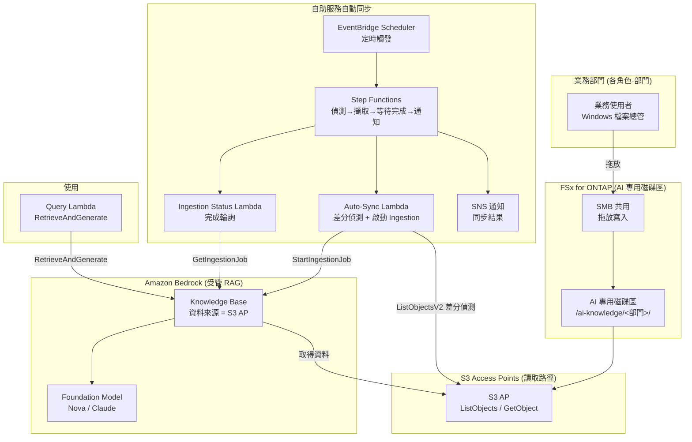

# Self-Service Knowledge Base Curation (民主化的 AI 知識運營)

🌐 **Language / 言語**: [日本語](README.md) | [English](README.en.md) | [한국어](README.ko.md) | [简体中文](README.zh-CN.md) | [繁體中文](README.zh-TW.md) | [Français](README.fr.md) | [Deutsch](README.de.md) | [Español](README.es.md)

## 概述

一種讓業務部門成員**僅透過熟悉的 Windows 檔案總管拖放操作**即可維護 Amazon Bedrock Knowledge Base 資料來源的模式。

在 FSx for ONTAP 上準備 **AI 專用磁碟區 / 資料夾**，並透過 SMB（Windows 共用）向各角色·部門公開。將相同的資料**經由 S3 Access Points（讀取路徑）**連接到 Amazon Bedrock Knowledge Base 資料來源，偵測到檔案投入後**自動執行擷取（Ingestion）**。

由此，從 IT 部門基於請求進行手動 ETL / 複製 / 擷取的運營，轉變為**由現場自行維護知識的民主化運營**。

## Before / After（運營變革）

> **註記**: 以下是遮蔽了特定客戶名·負責人名的、一般化的運營故事。

### Before — 依賴 IT 部門的手動作業

```
業務部門「有新產品上市，請把這個 Windows 團隊資料夾裡的資料
          放入 AI 知識（銷售要在示範中使用）」
   ↓ 請求工單
IT 部門 → 從 EC2 上的 Windows Server 手動複製檔案
        → 上傳到 S3 儲存貯體
        → 手動向 Bedrock Knowledge Base 執行擷取
        → 完成通知
```

- 每次請求都需 IT 部門介入 → 瓶頸·時間滯後
- 複製作業導致的**資料雙重管理**與更新遺漏
- 「誰·何時·放入了什麼」依賴於個人

### After — 現場主導的自助服務

```
IT 部門「請把想讓 AI 使用的資料放入這個 Windows 資料夾，
         並自行維護。AI 將參照這些資料」
   ↓
業務部門 → 像平常一樣用 Windows 檔案總管
          向 AI 專用資料夾拖放（新增·更新·刪除）
   ↓ （自動）
經由 S3 Access Point，Bedrock Knowledge Base 同步 → 立即成為檢索對象
```

- 無需 IT 部門的請求處理 → 縮短前置時間
- 檔案保持為 FSx for ONTAP 上的**正本原樣**（無需複製到 S3）
- 資料所有權分散到各角色·部門（民主化）

## 解決的課題

| 課題 | 本模式的解決方案 |
|------|-------------------|
| 知識更新等待 IT 部門的手動作業 | 現場以 Windows 操作直接維護，自動擷取 |
| 因複製到 S3 導致的資料雙重管理 | 經由 S3 AP 將 FSx for ONTAP 的正本直接作為資料來源 |
| 擷取遺漏·更新遺漏 | 偵測檔案投入並自動 Ingestion |
| 需要專業技能（ETL/S3/Bedrock） | 僅 Windows 檔案總管的拖放 |
| 資料所有者不明確 | 將資料夾結構按角色·部門單位劃分以明確責任分界 |

## 架構



## 兩種運營情境（示範）

在相同的基礎上，可以體驗根據運營成熟度的兩個階段。詳情請參閱[示範指南](docs/demo-guide.md)。

| 情境 | 概要 | 擷取觸發 |
|---------|------|----------------|
| **A: 手動維護體驗** | 以 Windows 檔案操作（新增/更新/刪除）維護 AI 資料。擷取由人手動進行（主控台「同步」/ CLI） | 手動 |
| **B: 自動化** | 用 Lambda + Step Functions + EventBridge 將 A 的手動同步自動化（偵測→擷取→等待完成→通知） | 自動 |

> 業務使用者的操作（拖放）在兩種情境中不變。變化的只是擷取之後由人來做，還是由無伺服器來做。

## 混合 RAG: 內部文件 + Web 檢索 (opt-in, NEW)

> 整合了在 AWS Summit NYC 2026 (2026-06-17) 上 GA 的 **AgentCore Web Search Tool**。

設定 `EnableWebSearch=true` 後，Query Lambda 會在內部 KB 答案之外，產生用即時 Web 檢索結果補強的整合答案。

| 模式 | 答案來源 | 使用情境 |
|--------|-----------|-------------|
| `EnableWebSearch=false`（預設） | 僅內部文件 (FSx for ONTAP → S3 Vectors) | 公司內知識 QA |
| `EnableWebSearch=true` | 內部文件 + Web 檢索結果 | 最新法規·市場動向·產品比較 |

- Graceful degradation: 即使 Web Search 失敗，也僅用內部 KB 回答
- 引用分離: `[內部: 檔案名]` + `[Web: 標題](URL)`
- 安全: Web 結果為非可信資料，已完成提示注入防禦

詳情: [docs/investigations/agentcore-web-search-fsxn-integration.md](../../docs/investigations/agentcore-web-search-fsxn-integration.md)

## 自助服務運營模型（民主化）

### AI 專用磁碟區的資料夾設計（遵循 Amazon Quick 設想的角色）

業務角色（部門）按照 **Amazon Quick** 所面向的角色廣泛準備。
Quick FAQ 明確以 "sales, marketing, IT, operations, finance, legal" 為對象，
developers 則有專用頁面。

```
/ai-knowledge/                     ← AI 專用磁碟區（SMB 共用）
├── sales/                         ← 銷售（客戶計畫·產品資訊·手冊）
├── marketing/                     ← 行銷（品牌·活動·內容）
├── finance/                       ← 財務·會計（預算·費用·預測）
├── information-technology/        ← 資訊系統（執行手冊·IT FAQ·安全）
├── operations/                    ← 營運（SOP·業務流程）
├── legal/                         ← 法務（合約·NDA·合規）
└── developers/                    ← 開發（規範·入職·服務目錄）
```

| 資料夾 | 角色 | 在 Amazon Quick 中的設想（參考·time-sensitive） |
|-----------|--------|--------------------------------|
| `sales/` | 銷售 | Lead scoring / Sales forecasting / CRM ([/quick/sales/](https://aws.amazon.com/quick/sales/)) |
| `marketing/` | 行銷 | 活動·品牌·內容 (Quick FAQ) |
| `finance/` | 財務·會計 | 預算·費用·預測 (Quick FAQ) |
| `information-technology/` | 資訊系統 | 事件回應·IT FAQ·安全 ([/quick/information-technology/](https://aws.amazon.com/quick/information-technology/)) |
| `operations/` | 營運 | SOP·業務流程 (Quick FAQ) |
| `legal/` | 法務 | 合約·合規 (Quick FAQ) |
| `developers/` | 開發 | 編碼規範·入職 ([/quick/developers/](https://aws.amazon.com/quick/developers/)) |

- 各資料夾以 **NTFS ACL** 向負責的角色·部門授予寫入權限
- 業務使用者透過**拖放**在本部門資料夾中新增·更新·刪除
- IT 部門僅負責維護資料夾結構和擷取自動化
- 各角色的**範例資料**隨附於 [`sample-data/ai-knowledge/`](sample-data/)（供示範投入）

> 本 UC 與此後計畫建立的 **Amazon Quick UC** 保持角色結構一致，可以共享·複用同一 AI 專用磁碟區的
> 資料夾/測試資料。

### 自動擷取流程（情境 B）

1. **EventBridge Scheduler** 定期啟動 Step Functions（例: `rate(15 minutes)`）
2. **Auto-Sync Lambda** 用 S3 AP 的 `ListObjectsV2` **偵測差分（新增·更新）**
3. 若有差分則啟動 Bedrock Knowledge Base 的 `StartIngestionJob`（若無則立即結束）
4. **Ingestion Status Lambda** 用 `GetIngestionJob` 輪詢完成
5. 將擷取結果**透過 SNS 通知**（投入件數·失敗件數）

> 在情境 A（手動）中由人在主控台/CLI 執行這 2~5 步。情境 B 將其替換為 Step Functions。

> **設計判斷**: 本模式採用**受管的 Bedrock Knowledge Base**（Pattern C），將運營負荷降至最低。若需要檔案級別的嚴格檢索時 ACL 控制，請選擇自訂 Permission-aware RAG（[FC3 genai-rag-enterprise-files](../genai-rag-enterprise-files/), Pattern A）。

### 權限·角色收窄（中繼資料篩選選項）

即使保持受管 KB，也可透過**中繼資料篩選**按「角色/部門/機密區分」進行檢索時收窄。
在每個檔案旁並置 `<file>.metadata.json`，在 Query 時傳遞 `role` 或任意 `filter`。

```jsonc
// 例: product-x-spec.md.metadata.json
{ "metadataAttributes": { "role": "sales", "classification": "internal" } }
```

```bash
# 收窄到銷售角色進行檢索
aws lambda invoke --function-name <QueryFn> \
  --payload '{"query":"產品 X 的規格是什麼？","role":"sales"}' \
  --cli-binary-format raw-in-base64-out out.json
```

> **重要限制（使用 S3 Vectors 作為向量存放區的 KB）**:
> - **可篩選的中繼資料每個文件需在 2048 位元組以內**（超出則 ingestion 失敗）。`metadataAttributes` 請保持小
> - 中繼資料檔案每個檔案最大 10 KB
> - 篩選過於選擇性時，近似最近鄰檢索的 recall 可能下降（篩選粒度請評估後決定）
> - 這是**檢索收窄**，而非 AWS 側的存取控制。若需要針對每個使用者個人的嚴格存取控制，
>   請考慮 Amazon Quick 的 S3 知識庫文件級別 ACL（參閱 [UC30](../genai-quick-agentic-workspace/)）或
>   自訂 Permission-aware RAG（FC3）

## 受管 KB vs 自訂 RAG 的選擇

| 觀點 | 本 UC: 受管 KB (Pattern C) | FC3: 自訂 RAG (Pattern A) |
|------|------------------------------|------------------------------|
| 主要目的 | 資料運營的民主化·削減運營負荷 | 檢索時的檔案級別權限篩選 |
| RAG 實作 | Bedrock Knowledge Bases（受管） | OpenSearch + 自建檢索 + ACL 擷取 |
| 存取控制 | 資料夾/共用級別（SMB ACL）+ KB 資料來源邊界 | 分塊單位的 AD SID 中繼資料篩選 |
| 運營負荷 | 低（受管） | 中~高（自建管線） |
| 適合情境 | 部門內共享知識、公司內 FAQ、產品資訊 | 受監管產業、機密文件、每個使用者可見範圍不同 |

## 目錄結構

```
genai-kb-selfservice-curation/
├── README.md / README.en.md
├── template.yaml                 # SAM: 自助服務自動同步層
├── samconfig.toml.example
├── functions/
│   ├── auto_sync/handler.py      # 差分偵測 + 啟動 Ingestion
│   ├── ingestion_status/handler.py  # Ingestion 完成輪詢（情境 B）
│   └── query/handler.py          # RetrieveAndGenerate（示範用 Q&A）
├── sample-data/                  # 按角色的種子資料（供示範投入）
│   └── ai-knowledge/<role>/...   # sales / marketing / finance / it / operations / legal / developers
├── tests/
│   └── test_handlers.py
└── docs/
    ├── architecture.md
    └── demo-guide.md             # 情境 A（手動） / B（自動化）（已遮蔽）
```

> **部署前提**: Knowledge Base 本體和資料來源（S3 AP）透過已驗證的指令碼 [`scripts/create_bedrock_kb.py`](../scripts/create_bedrock_kb.py) 或 Bedrock 主控台建立，並將其 `KnowledgeBaseId` / `DataSourceId` 傳遞給本範本的參數。由於 OpenSearch Serverless 的向量索引建立並非 CloudFormation 原生，因此採用這種分離構成。

## 安全設計

- **無資料移動**: 檔案保持為 FSx for ONTAP 上的正本原樣，經由 S3 AP 僅讀取
- **寫入僅 SMB/NFS**: AI 擷取路徑（S3 AP）為讀取使用。寫入經由 Windows 共用
- **資料夾單位的責任分界**: 以 NTFS ACL 按部門分離寫入權限
- **最小權限**: Lambda 僅允許對目標 S3 AP 的 List/Get 和該 KB 的 Ingestion
- **稽核**: CloudTrail（API 操作）+ ONTAP 稽核日誌（檔案操作）+ Ingestion 作業歷史
- **加密**: SSE-FSX（儲存）、TLS（傳輸中）、KMS（SNS / 日誌）

> **註記**: S3 AP 的資料來源邊界為磁碟區/前綴單位。若想按使用者改變可見範圍，請考慮自訂 Permission-aware RAG 而非本 UC。

## 目標產業·使用情境

- 製造·工程（產品資訊·規格書的公司內共享知識）
- 銷售·客戶支援（提案資料·FAQ·故障排除）
- 後台（公司內規程·操作手冊）
- 在部門內閉環的公司內知識總體

## Success Metrics

### Outcome
實現無需 IT 部門手動介入、業務部門自行維護知識的民主化 AI 資料運營。

### Metrics

| 指標 | 目標值（例） |
|-----------|------------|
| 知識更新前置時間（投入→可檢索） | < 15 分鐘（依賴排程間隔） |
| IT 部門的手動擷取請求件數 | 0 件 / 月（遷移後） |
| 自動 Ingestion 成功率 | > 98% |
| 差分偵測的漏檢率 | 0%（全量 List 掃描） |
| 業務使用者的操作 | 僅 Windows 拖放 |

### Measurement Method
EventBridge Scheduler 執行歷史、Bedrock Ingestion 作業統計（scanned / indexed / failed）、CloudWatch Metrics、SNS 通知日誌。

---

## Data Classification

| 輸出 | 分類 | 依據 |
|------|------|------|
| Bedrock KB Ingestion 結果（向量 + 中繼資料） | INTERNAL | 繼承與來源檔案相同的分類。不可對外公開 |
| Ingestion 作業狀態 / SNS 通知 | INTERNAL | 運營中繼資料。不含機密資料 |
| CloudWatch Metrics / Logs | INTERNAL | 彙總指標。不含檔案內容 |

> 在受監管產業中，還需額外的 CUI / FISC / HIPAA 分類。請將 `shared/data_classification.py` 的標籤體系按用途擴充。
> `dataDeletionPolicy=DELETE` 在檔案刪除時立即刪除向量，但若有保留期限要求，請使用 `RETAIN` 並另行設計清除流程。

---

## AWS 文件連結

| 服務 | 文件 |
|---------|------------|
| FSx for ONTAP | [使用者指南](https://docs.aws.amazon.com/fsx/latest/ONTAPGuide/what-is-fsx-ontap.html) |
| S3 Access Points for FSx for ONTAP | [S3 AP 指南](https://docs.aws.amazon.com/fsx/latest/ONTAPGuide/s3-access-points.html) |
| FSx for ONTAP + Bedrock RAG 教學 | [Build RAG with Bedrock](https://docs.aws.amazon.com/fsx/latest/ONTAPGuide/tutorial-build-rag-with-bedrock.html) |
| Amazon Bedrock Knowledge Bases | [知識庫](https://docs.aws.amazon.com/bedrock/latest/userguide/knowledge-base.html) |
| Bedrock KB 資料擷取 | [Ingest your data](https://docs.aws.amazon.com/bedrock/latest/userguide/kb-data-source.html) |
| RetrieveAndGenerate API | [API 參考](https://docs.aws.amazon.com/bedrock/latest/APIReference/API_agent-runtime_RetrieveAndGenerate.html) |
| EventBridge Scheduler | [使用者指南](https://docs.aws.amazon.com/scheduler/latest/UserGuide/what-is-scheduler.html) |

### Well-Architected Framework 對應

| 支柱 | 對應 |
|----|------|
| 卓越運營 | 自助服務運營、自動 Ingestion、SNS 通知、結構化日誌 |
| 安全 | 資料夾單位 ACL、IAM 最小權限、無資料移動、稽核日誌 |
| 可靠性 | 全量 List 掃描的差分偵測、Ingestion 作業狀態監控 |
| 效能效率 | 僅在有差分時啟動 Ingestion、受管 KB 的擴展 |
| 成本最佳化 | 無伺服器、差分同步、活用受管服務 |
| 永續性 | 隨需執行、避免不必要的重新擷取 |

---

## 成本估算（月度概算）

> **註記**: 以下為 ap-northeast-1 區域的概算，實際成本因使用量而異。最新價格請在 [AWS Pricing Calculator](https://calculator.aws/) 確認。基準·價格均為 time-sensitive。

### 無伺服器元件（按量計費）

| 服務 | 單價 | 設想使用量 | 月度概算 |
|---------|------|-----------|---------|
| Lambda（Auto-Sync） | $0.0000166667/GB-sec | 15 分鐘間隔 × 512MB | ~$1-3 |
| S3 API (ListObjects/GetObject) | $0.0047/10K requests | ~30K requests/日 | ~$4 |
| EventBridge Scheduler | $1.00/100萬 invocations | ~3K invocations/月 | ~$0.01 |
| Bedrock Ingestion（Embeddings） | 模型按量 | 僅差分檔案部分 | ~$2-10 |
| Bedrock 答案產生（Nova/Claude） | 模型按量 | 依賴查詢數 | ~$3-20 |
| SNS | $0.50/100K notifications | ~3K/月 | ~$0.02 |
| CloudWatch Logs | $0.76/GB ingested | ~1 GB/月 | ~$0.76 |
| OpenSearch Serverless（KB 向量存放區） | $0.24/OCU-hour | 最小 2 OCU ~ | 另計（依賴 KB 構成） |

### 固定成本（以現有環境為前提）

| 元件 | 月度 |
|--------------|------|
| FSx for ONTAP（共享現有的 AI 專用磁碟區） | 共享現有環境 |
| S3 Access Point | 無額外費用（僅 S3 API 費用） |

> **Governance Caveat**: 成本估算為概算，並非保證值。實際帳單因使用模式、資料量、區域、KB 的向量存放區構成而異。

---

## 本機測試

### Prerequisites 檢查

```bash
aws --version          # AWS CLI v2
sam --version          # SAM CLI
python3 --version      # Python 3.12+
aws sts get-caller-identity  # AWS 憑證
```

### 單元測試

```bash
python3 -m pytest tests/ -v
```

### sam local invoke

```bash
# 前提: 需要 AWS SAM CLI。sam build 會自動打包程式碼和共用層。
sam build
sam local invoke AutoSyncFunction --event events/auto-sync-event.json
```

---

## 輸出範例 (Output Sample)

### Auto-Sync Lambda（差分偵測 + 啟動 Ingestion）

```json
{
  "status": "ingestion_started",
  "changed_files_detected": 4,
  "knowledge_base_id": "XXXXXXXXXX",
  "data_source_id": "YYYYYYYYYY",
  "ingestion_job_id": "ZZZZZZZZZZ",
  "scanned_prefix": "sales/product-catalog/",
  "timestamp": 1760000000
}
```

### Query Lambda（RetrieveAndGenerate）

```json
{
  "query": "請告訴我新產品 X 的主要規格",
  "answer": "新產品 X 的主要規格是，計量範圍...（基於已擷取的文件）",
  "citations": [
    {"source": "sales/product-catalog/product-x-spec.pdf", "score": 0.93}
  ]
}
```

> **註記**: 以上為範例輸出，實際值因環境·輸入資料而異。數值為 sizing reference，而非 service limit。

---

## Performance Considerations

- FSx for ONTAP 的輸送量容量在 NFS/SMB/S3AP 之間共享。請注意業務使用者的 SMB 寫入與 AI 擷取的讀取共享同一容量
- 經由 S3 Access Point 的延遲會產生數十毫秒的額外負擔
- 大量檔案投入時，Ingestion 作業的完成需要時間。排程間隔請設定為長於擷取所需時間
- 差分偵測為全量 List 掃描，檔案數非常多時請考慮前綴分割

> **註記**: 本模式的效能數值為 sizing reference，而非 service limit。實際環境的效能因 FSx for ONTAP 輸送量容量、檔案數、並行執行的工作負載而異。

---

## 相關 UC·連結

| 相關 | 相關要點 |
|---------|------------|
| [PoC 前提條件檢查清單](docs/poc-checklist.md) | 部署前的確認事項（S3 Vectors 限制·推論設定檔等） |
| [清理 runbook](../docs/uc29-uc30-cleanup-runbook.md) | 含手動成果物的拆除流程（2UC 共通） |
| [FC3 genai-rag-enterprise-files](../genai-rag-enterprise-files/) | 需要嚴格權限篩選時的自訂 RAG（Pattern A） |
| [擴充模式: Bedrock KB 整合](../docs/extension-patterns.md) | 受管 KB + S3 AP 的通用模式 |
| [KB 建立指令碼](../scripts/create_bedrock_kb.py) | KB / 資料來源建立（本 UC 的部署前提） |
| [產業·工作負載對應](../docs/industry-workload-mapping.md) | UC 選擇指南 |

## 運營穩健化（已實作）

- **防止多重啟動**: Auto-Sync 若有進行中的 Ingestion 作業則跳過新啟動（`ingestion_in_progress`）
- **Step Functions 的 Retry/Catch**: 對 Lambda 任務的重試（指數退避）與失敗時的 `NotifyFailure` 分支
- **中繼資料篩選**: Query 可用 `role`/任意 `filter` 進行角色·部門收窄

---

## 部署

使用 AWS SAM CLI 部署（預留位置請按環境替換）:

> **部署前提**: 本範本以現有的 Amazon Bedrock Knowledge Base 和資料來源（S3 AP 連接）為前提。由於 OpenSearch Serverless 的向量索引建立並非 CloudFormation 原生，請在部署前建立 Knowledge Base 本體，並將其 `KnowledgeBaseId` / `DataSourceId` 傳遞給參數（用儲存庫根目錄的 `scripts/create_bedrock_kb.py` 或 Bedrock 主控台建立）。

```bash
# 前提: 需要 AWS SAM CLI。sam build 會自動打包程式碼和共用層。
sam build

sam deploy \
  --stack-name fsxn-kb-selfservice-curation \
  --parameter-overrides \
    S3AccessPointAlias=<your-s3ap-alias> \
    S3AccessPointName=<your-s3ap-name> \
    KnowledgeBaseId=<your-kb-id> \
    DataSourceId=<your-datasource-id> \
    NotificationEmail=<your-email@example.com> \
  --capabilities CAPABILITY_NAMED_IAM \
  --resolve-s3 \
  --region <your-region>
```

> **注意**: `template.yaml` 用於 SAM CLI（`sam build` + `sam deploy`）。
> 若使用 `aws cloudformation deploy` 命令直接部署，請使用 `template-deploy.yaml`（需要預先打包 Lambda zip 檔案並上傳到 S3）。

## Governance Note

> 本模式提供技術架構指導。並非法律·合規·監管方面的建議。組織應諮詢合格的專業人士。S3 AP 的資料來源邊界為磁碟區/前綴單位，若需要針對每個使用者個人的可見範圍控制，則超出本 UC 的適用範圍。
>
> **存取控制的 3 層（按用途選擇）**: ① 檢索收窄 = Bedrock KB 中繼資料篩選（本 UC，非 AWS 授權） / ② 文件級別 ACL = Amazon Quick S3 知識庫（[UC30](../genai-quick-agentic-workspace/)，按使用者·群組單位） / ③ 分塊單位的權限篩選 = 自訂 Permission-aware RAG（[FC3](../genai-rag-enterprise-files/)，AD SID/NTFS ACL，面向受監管產業）
