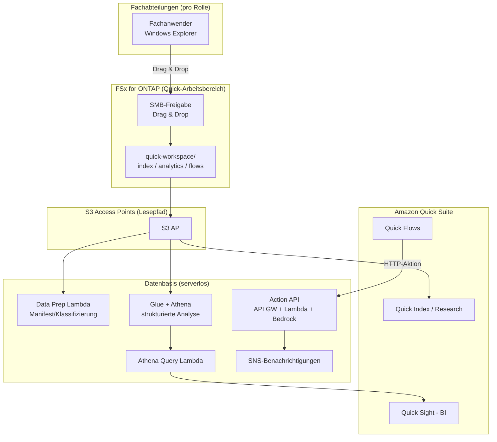

# Amazon Quick Agentic Workspace over FSx for ONTAP

🌐 **Language / 言語**: [日本語](README.md) | [English](README.en.md) | [한국어](README.ko.md) | [简体中文](README.zh-CN.md) | [繁體中文](README.zh-TW.md) | [Français](README.fr.md) | [Deutsch](README.de.md) | [Español](README.es.md)

## Überblick

Ein Muster, das Amazon FSx for NetApp ONTAP **über S3 Access Points** als Datenbasis für **Amazon Quick Suite** (den agentischen KI-Arbeitsbereich) nutzt. Daten, die Fachabteilungen über Windows-Dateioperationen pflegen, werden übergreifend von den Funktionen von Quick (Index / Sight / Flows / Research) genutzt.

Während sich UC29 ([genai-kb-selfservice-curation](../genai-kb-selfservice-curation/)) auf „Self-Service-Ingestion in eine verwaltete Bedrock Knowledge Base" konzentriert, konzentriert sich dieses UC30 auf **einen agentischen Arbeitsbereich mit Amazon Quick Suite als Einstiegspunkt, der unstrukturierte Suche, BI und Aktionsautomatisierung bündelt**.

> **Amazon Quick Suite**: veröffentlicht im Oktober 2025. Als Weiterentwicklung von Amazon Q Business ist es ein agentischer Assistent, der Fragen auf Basis interner Daten beantwortet und bis zur „Aktion" geht: Dashboard-Erzeugung, Terminplanung, Erstellung von Ergebnissen. Informationen / Preise / unterstützte Services sind time-sensitive. Aktuelles siehe [aws.amazon.com/quick](https://aws.amazon.com/quick/).

## Zuordnung der Quick-Funktionen zu FSx for ONTAP S3 AP

| Quick-Funktion | Rolle | Datentyp (auf S3 AP) | Umsetzung in diesem UC |
|-----------|------|---------------------|-----------|
| **Quick Index** | Übergreifende Suche / QA über unstrukturierte Dateien | `index/<role>/` (md/pdf/docx) | S3 AP als Datenquelle anbinden (Lesen) |
| **Quick Research** | Erstellung tiefgehender Recherche-Berichte | `index/<role>/` | Wie oben |
| **Quick Sight** | BI / Visualisierung strukturierter Daten | `analytics/<role>/` (csv) | Analyse über Glue/Athena (Athena Query Lambda) |
| **Quick Flows** | Aktionsautomatisierung | `flows/<role>/` (json) | Action API (API Gateway + Lambda + Bedrock) |

## Gelöste Probleme

| Problem | Lösung durch dieses Muster |
|------|-------------------|
| Geschäftsdaten werden nach S3 kopiert und doppelt verwaltet | Mit S3 AP das FSx for ONTAP-Original direkt als Datenquelle nutzen |
| Unstrukturiert und strukturiert sind getrennt und nicht gemeinsam nutzbar | Quick Index (Dateien) und Quick Sight (Athena) im selben Arbeitsbereich integrieren |
| Eine „Antwort" entsteht, führt aber nicht zur Aktion | Von der Zusammenfassungserzeugung bis zur Aufgabenerstellung über Quick Flows → Action API automatisieren |
| Verschiedene Rollen benötigen unterschiedliche Informationen / Analysen | Ordner und Datenquellen nach Rolle × Service organisieren |
| Datenaufbereitung hängt von Spezialkenntnissen ab | Windows-Dateioperationen + serverlose Datenaufbereitung (Data Prep Lambda) |

## Architektur



## Zwei Betriebsszenarien (Demo)

Wie bei UC29 können Sie zwei Stufen je nach betrieblicher Reife erleben. Details siehe [Demo-Leitfaden](docs/demo-guide.md).

| Szenario | Zusammenfassung | Zentrale Bedienung |
|---------|------|---------------|
| **A: Manuelle Arbeitsbereich-Erfahrung** | Daten in Windows ablegen, dann in der Quick-Konsole Index-Anbindung, Erstellung von Quick Sight-Datensätzen und Ausführung von Quick Flows manuell erleben | Menschen bedienen über die Quick-UI |
| **B: Automatisierung** | Datenaufbereitung (Data Prep), BI-Abfragen (Athena Query) und Aktionen (Action API) serverlos automatisieren, gesteuert aus Quick Flows / Scheduler | Lambda / API / Scheduler |

## Durch Websuche angereicherte Briefing-Erzeugung (opt-in, NEW)

> Integriert das **AgentCore Web Search Tool**, das auf dem AWS Summit NYC 2026 (2026-06-17) GA erreichte.

Fügt der Action API eine neue Aktion `generate_brief_with_web` hinzu. Zusätzlich zum internen Kontext erzeugt sie ein Briefing, das durch Echtzeit-Websuchergebnisse angereichert ist.

```bash
curl -X POST https://<api-id>.execute-api.ap-northeast-1.amazonaws.com/prod/action \
  --aws-sigv4 "aws:amz:ap-northeast-1:execute-api" \
  -H "Content-Type: application/json" \
  -d '{
    "action": "generate_brief_with_web",
    "params": {
      "title": "Trends bei Datenschutzvorschriften im Q3 2026",
      "context": "Intern betreiben wir einen Betrieb konform mit den FISC-Sicherheitsrichtlinien...",
      "web_query": "data protection regulation 2026 Japan"
    }
  }'
```

| Aktion | Antwortquelle | Lesen/Schreiben |
|-----------|-----------|-----------------|
| `generate_brief` | Nur interner Kontext | Nur Lesen |
| `generate_brief_with_web` | Interner Kontext + Websuche | Nur Lesen |

- Aktivieren mit `EnableWebSearch=true` + `AgentCoreGatewayId`
- Graceful degradation: bei Fehlschlag der Websuche verhält es sich wie `generate_brief`
- Zitate: gibt URL + Titel + Veröffentlichungsdatum im Feld `web_citations` zurück

Details: [docs/investigations/agentcore-web-search-fsxn-integration.md](../../docs/investigations/agentcore-web-search-fsxn-integration.md)

## Rolle × Service-Struktur (konform mit den angenommenen Rollen von Amazon Quick)

Die Rollen sind die sieben von Amazon Quick adressierten — **sales / marketing / IT / operations / finance / legal** (FAQ) — plus **developers**, das eine eigene Seite hat. Daten werden nach genutztem Service (Index / Sight / Flows) organisiert.

```
quick-workspace/                       ← KI-dediziertes Volume (SMB-Freigabe)
├── index/<role>/        … Quick Index / Research (unstrukturiertes md)
├── analytics/<role>/    … Quick Sight (strukturiertes csv, über Athena)
└── flows/<role>/        … Quick Flows (Aktions-json)
```

| Rolle | Quick-Annahme (Referenz, time-sensitive) | Beispiel-Analysedaten |
|--------|--------------------------------|------------------|
| sales | Lead scoring / Prognose / CRM ([/quick/sales/](https://aws.amazon.com/quick/sales/)) | Pipeline (Betrag nach stage) |
| marketing | Kampagnen, Inhalte | Kampagnen-Kennzahlen (CPL) |
| finance | Budget, Ausgaben, Prognose | Budget vs Ist |
| information-technology | Incidents, IT-FAQ, Sicherheit ([/quick/information-technology/](https://aws.amazon.com/quick/information-technology/)) | Incidents (MTTR) |
| operations | SOPs, Prozesse | Durchsatz, SLA |
| legal | Verträge, Compliance | Vertragsregister |
| developers | Richtlinien, Onboarding ([/quick/developers/](https://aws.amazon.com/quick/developers/)) | DORA-Kennzahlen |

Die **Beispieldaten** jeder Rolle liegen in [`sample-data/quick-workspace/`](sample-data/) bei. Dieses UC richtet seine Rollenstruktur an **UC29** aus, sodass dasselbe KI-dedizierte Volume gemeinsam genutzt / wiederverwendet werden kann.

## Verzeichnisstruktur

```
genai-quick-agentic-workspace/
├── README.md / README.en.md und 7 weitere Sprachen
├── template.yaml                 # SAM: Action API / Athena / Data Prep / Quick-Datenquellenrolle
├── samconfig.toml.example
├── functions/
│   ├── quick_action/handler.py   # Quick Flows-Aktion (Zusammenfassungserzeugung, Aufgabenerstellung; Bedrock)
│   ├── athena_query/handler.py   # Quick Sight-BI-Basis (Glue/Athena)
│   └── data_prep/handler.py      # Manifest zur Datenquellenaufbereitung
├── sample-data/quick-workspace/  # Seed-Daten nach Rolle × Service
│   ├── index/<role>/*.md
│   ├── analytics/<role>/*.csv
│   └── flows/<role>/*.json
├── tests/test_handlers.py
└── docs/
    ├── architecture.md
    └── demo-guide.md
```

> **Deployment-Voraussetzung**: Die eigenen Datenquellenanbindungen von Amazon Quick Suite (S3 AP-Anbindung an Quick Index, Erstellung von Quick Sight-Datensätzen) werden **in der Quick-Konsole konfiguriert**. Dieses Template stellt die serverlose Datenbasis bereit, die dies unterstützt (Action API / Athena-Analyse / Data Prep / IAM-Rolle für Quick).

## Sicherheitskonzept

- **Keine Datenbewegung**: Dateien bleiben das Original auf FSx for ONTAP und werden über S3 AP gelesen
- **Die Action API nutzt IAM-Auth (SigV4)**: kein nicht authentifizierter öffentlicher Endpunkt. Anmeldeinformationen in der Quick-seitigen Verbindung konfigurieren
- **Least Privilege**: Lambdas sind nur für den Ziel-S3 AP / die Athena-WorkGroup / die betreffende Glue-DB / das Bedrock-Modell zugelassen
- **Quick-Datenquellenrolle**: Der Vertrauensprinzipal ist parametrisiert (Standard ist der Account-Root; eine Beschränkung auf die Quick-Verbindung wird empfohlen)
- **Verschlüsselung**: SSE-FSX (Speicher), SSE-S3/KMS (Athena-Ergebnisse), TLS (bei der Übertragung)
- **Audit**: CloudTrail + ONTAP-Auditprotokolle + Athena-Abfrageverlauf

> **Hinweis**: Die Datenquellengrenze von S3 AP liegt auf Volume-/Präfix-Ebene. Wenn eine Sichtbarkeitskontrolle pro Benutzer erforderlich ist, ziehen Sie ein benutzerdefiniertes, berechtigungsbewusstes RAG in Betracht ([FC3](../genai-rag-enterprise-files/)).

### ACL auf Dokumentebene (Amazon Quick S3-Wissensdatenbank)

Die **S3-Wissensdatenbank von Amazon Quick unterstützt ACLs auf Dokument-/Ordnerebene**. Sie können vertrauliche Dokumente auf die „zum Anzeigen berechtigten Benutzer/Gruppen" beschränken, und in Kombination mit rollenbasierten Ordnern (`index/<role>/`) kann auch UC30 eine **Sichtbarkeitskontrolle pro Benutzer** auf der Quick-Seite realisieren.

- Die Berechtigungen von Quick Suite werden über **drei Ebenen verwaltet: account / role / user** (Priorität: user > role > account)
- Über benutzerdefinierte Berechtigungsprofile ist auch eine Steuerung auf Funktionsebene möglich (z. B. Dashboard-Bearbeitung)
- Details in der Quick-Konsole konfigurieren (außerhalb des Umfangs dieses Templates)

> Quellen sind der offizielle AWS-Blog / die Dokumentation (time-sensitive). Den aktuellen Unterstützungsstand siehe [aws.amazon.com/quick](https://aws.amazon.com/quick/).

## Success Metrics

### Outcome
Die in Windows gepflegten Geschäftsdaten übergreifend mit Suche / BI / Aktionen von Amazon Quick verbinden und alles von der „Frage" bis zur „Aktion" in einem einzigen Arbeitsbereich abschließen.

| Kennzahl | Zielwert (Beispiel) |
|-----------|------------|
| Anzahl der an Quick Index angebundenen Datenquellen | Für 7 Rollen |
| Anzahl der von Quick Sight analysierten Datensätze | Strukturierte Daten pro Rolle |
| Erfolgsrate der Quick Flows-Aktionen | > 98 % |
| Aktualisierung des Datenaufbereitungs-Manifests | Geplante Ausführung (z. B. rate(1 hour)) |
| Bedienung durch Fachanwender | Windows-Dateioperationen + Quick-UI |

### Measurement Method
Data Prep-Manifest, Athena-Abfrageverlauf, Action API (API Gateway / Lambda)-Kennzahlen, SNS-Benachrichtigungen.

---

## Data Classification

| Ausgabe | Klassifizierung | Begründung |
|------|------|------|
| Action API-Antwort (generate_brief) | INTERNAL | Aus Quelldaten abgeleitete Zusammenfassung. Nicht zur externen Weitergabe |
| Action API-Antwort (create_action_item / approve / execute) | INTERNAL | Aufzeichnung von Geschäftsoperationen |
| Athena-Abfrageergebnisse (Ergebnis-Bucket) | INTERNAL | Verschlüsselung + 30-Tage-Lifecycle + erzwungenes TLS. Gleiche Ebene wie analytics/-Daten |
| DynamoDB-Genehmigungsspeicher (ApprovalsTable) | INTERNAL | Genehmigungsstatus. Metadaten wie operation / requested_by |
| SNS-Benachrichtigungsnachricht | INTERNAL | Nur Aktionszusammenfassung. Enthält keine Dateiinhalte |

> In regulierten Branchen ist eine zusätzliche CUI / FISC / HIPAA-Klassifizierung erforderlich. Erweitern Sie `shared/data_classification.py`.
> Wenn `ALLOW_RAW_SQL=false` (Standard) gilt, führt Athena nur Abfragen aus der Zulassungsliste aus, sodass das Risiko einer Überschreitung von Datenklassifizierungsgrenzen gering ist.

---

## AWS-Dokumentationslinks

| Service | Dokumentation |
|---------|------------|
| Amazon Quick Suite | [Produktseite](https://aws.amazon.com/quick/) / [Benutzerhandbuch](https://docs.aws.amazon.com/quick/latest/userguide/) |
| Amazon Quick-Benutzertypen | [user-types](https://docs.aws.amazon.com/quick/latest/userguide/user-types.html) |
| FSx for ONTAP S3 Access Points | [S3 AP-Leitfaden](https://docs.aws.amazon.com/fsx/latest/ONTAPGuide/s3-access-points.html) |
| Amazon Athena | [Benutzerhandbuch](https://docs.aws.amazon.com/athena/latest/ug/what-is.html) |
| AWS Glue Data Catalog | [Entwicklerhandbuch](https://docs.aws.amazon.com/glue/latest/dg/catalog-and-crawler.html) |
| Amazon Bedrock | [Benutzerhandbuch](https://docs.aws.amazon.com/bedrock/latest/userguide/what-is-bedrock.html) |
| API Gateway IAM-Authentifizierung | [IAM-Autorisierung](https://docs.aws.amazon.com/apigateway/latest/developerguide/permissions.html) |

### Well-Architected Framework-Konformität

| Säule | Konformität |
|----|------|
| Operative Exzellenz | Automatisches Datenaufbereitungs-Manifest, strukturierte Protokolle, Benachrichtigungen |
| Sicherheit | Action API mit IAM-Auth, Least Privilege, keine Datenbewegung, Verschlüsselung |
| Zuverlässigkeit | Athena-Statusüberwachung, serverlose Redundanz |
| Leistungseffizienz | Strukturierte Analyse mit Athena, verwaltete Suche mit Index |
| Kostenoptimierung | Serverlose nutzungsbasierte Abrechnung, Abfragen/Aktionen nur bei Bedarf |
| Nachhaltigkeit | On-Demand-Ausführung, Nutzung verwalteter Services |

---

## Kostenschätzung (monatliche Näherung)

> **Hinweis**: Näherung für ap-northeast-1. Die tatsächlichen Kosten variieren mit der Nutzung. Siehe [AWS Pricing Calculator](https://calculator.aws/) und [Amazon Quick-Preise](https://aws.amazon.com/quick/) (time-sensitive).

| Service | Näherung |
|---------|------|
| Amazon Quick Suite | Abrechnung pro Benutzer/Plan (separat; siehe Quick-Preise) |
| Lambda (3 Funktionen) | ~$1-5 |
| API Gateway | ~$1 (pro Anfrage) |
| Athena | $5/TB scanned (~$0.5-2 bei kleinen Daten) |
| Glue Data Catalog | Oft innerhalb des kostenlosen Kontingents |
| S3 (Athena-Ergebnisse) | ~$0.5 |
| Bedrock (Zusammenfassungserzeugung) | Pro Aufruf ~$1-10 |
| SNS / CloudWatch Logs | ~$1 |
| FSx for ONTAP / S3 AP | Teilt sich die bestehende Umgebung (keine zusätzlichen S3 AP-Gebühren) |

> **Governance Caveat**: Die Kosten sind Näherungswerte und keine garantierten Werte. Die eigenen Preise von Amazon Quick sind separat.

---

## Lokales Testen

```bash
python3 -m pytest tests/ -v
# Voraussetzung: AWS SAM CLI erforderlich. „sam build" paketiert Code und Shared Layer automatisch.
sam build
sam local invoke DataPrepFunction --event events/data-prep-event.json
```

---

## Ausgabebeispiele

### Quick Flows-Aktion (Aufgabenerstellung)
```json
{
  "status": "completed",
  "action": "create_action_item",
  "item": {"id": "AI-1760000000", "title": "Den PoC-Zeitplan für Acme Corp abstimmen", "assignee": "sales-a", "status": "open"}
}
```

### Athena Query (Quick Sight-BI-Basis)
```json
{
  "status": "completed",
  "columns": ["stage", "deals", "total_jpy"],
  "rows": [["Negotiation", "2", "3360000"], ["ClosedWon", "1", "1920000"]],
  "row_count": 2
}
```

### Data Prep-Manifest
```json
{
  "status": "completed",
  "total_objects": 21,
  "by_service": {"index": 7, "analytics": 7, "flows": 7, "other": 0},
  "by_role": {"sales": 3, "marketing": 3, "finance": 3, "information-technology": 3, "operations": 3, "legal": 3, "developers": 3}
}
```

> **Hinweis**: Beispielausgabe. Zahlen / Preise sind eine Dimensionierungsreferenz / time-sensitive und keine service limits.

---

## Performance Considerations

- Der Durchsatz von FSx for ONTAP wird über NFS/SMB/S3AP geteilt. SMB-Schreibvorgänge und Quick-Lesevorgänge teilen sich dieselbe Kapazität
- Die Latenz über S3 AP fügt einige zehn Millisekunden Overhead hinzu
- Athena wird nach der gescannten Datenmenge abgerechnet. Bei großem Umfang Partitionierung/Komprimierung (Parquet) in Betracht ziehen
- Die Action API erfordert IAM-Auth. Gestalten Sie die Drosselung der Quick-Verbindung

---

## Verwandte UCs und Links

| Verwandt | Kernpunkt |
|------|---------|
| [Checkliste der PoC-Voraussetzungen](docs/poc-checklist.md) | Quick-Aktivierung, Glue/LF, Inferenzprofile usw. |
| [Einrichtungsschritte der Amazon Quick-Konsole](docs/quick-console-setup.md) | Index/Sight/Flows-Anbindung (mit Screenshot-Hinweisen) |
| [Lake Formation TBAC-Notizen](docs/lake-formation-tbac.md) | Datensichtbarkeit pro Rolle (LF-TBAC + Quick RLS) |
| [Glue-Tabellen-Erstellungsskript](scripts/create_glue_tables.sh) | DDL für Quick Sight/Athena (Parquet empfohlen) |
| [Cleanup-Runbook](../docs/uc29-uc30-cleanup-runbook.md) | Abbau-Schritte einschließlich manueller Artefakte (für beide UCs gemeinsam) |
| [UC29 genai-kb-selfservice-curation](../genai-kb-selfservice-curation/) | Self-Service-Ingestion in eine verwaltete Bedrock-KB (gleiche Rollenstruktur) |
| [FC3 genai-rag-enterprise-files](../genai-rag-enterprise-files/) | Benutzerdefiniertes RAG mit striktem Berechtigungsfilter |
| [Branchen- / Workload-Mapping](../docs/industry-workload-mapping.md) | UC-Auswahlleitfaden |

## Betriebliche Härtung (implementiert)

- **Human-in-the-loop für Quick Flows-Operationen mit hohem Risiko**: `request_approval` wird nicht sofort ausgeführt, sondern wartet auf Genehmigung (`pending_approval`) + SNS-Benachrichtigung
- **Die Action API nutzt IAM-Auth (SigV4)**: kein nicht authentifizierter öffentlicher Endpunkt
- **BI-Optimierung**: Bei großem Umfang analytics als Parquet + partitioniert (reduziert Athena scanned)

---

## Deployment

Mit der AWS SAM CLI bereitstellen (ersetzen Sie die Platzhalter für Ihre Umgebung):

```bash
# Voraussetzung: AWS SAM CLI erforderlich. „sam build" paketiert Code und Shared Layer automatisch.
sam build

sam deploy \
  --stack-name fsxn-quick-agentic-workspace \
  --parameter-overrides \
    S3AccessPointAlias=<your-s3ap-alias> \
    S3AccessPointName=<your-s3ap-name> \
    NotificationEmail=<your-email@example.com> \
  --capabilities CAPABILITY_NAMED_IAM \
  --resolve-s3 \
  --region <your-region>
```

> **Achtung**: `template.yaml` wird mit der SAM CLI (`sam build` + `sam deploy`) verwendet.
> Um direkt mit dem Befehl `aws cloudformation deploy` bereitzustellen, verwenden Sie stattdessen `template-deploy.yaml` (erfordert das vorherige Paketieren der Lambda-Zip-Dateien und deren Upload nach S3).

> **Amazon Quick-Einrichtung**: Das Anbinden eines Index, das Erstellen von Datensätzen und das Ausführen von Flows liegen außerhalb des Umfangs dieses Templates. Konfigurieren Sie diese nach dem Deployment in der Amazon Quick-Konsole (siehe [quick-console-setup](docs/quick-console-setup.md)).

## Governance Note

> Dieses Muster liefert technische Architekturleitlinien. Es ist keine rechtliche, Compliance- oder regulatorische Beratung.
> Funktionen / Preise / unterstützte Regionen von Amazon Quick ändern sich; überprüfen Sie den aktuellen Stand anhand offizieller Informationen.
> Die Datenquellengrenze von S3 AP liegt auf Volume-/Präfix-Ebene, und die Sichtbarkeitskontrolle pro Benutzer liegt außerhalb des Umfangs dieses UC.
