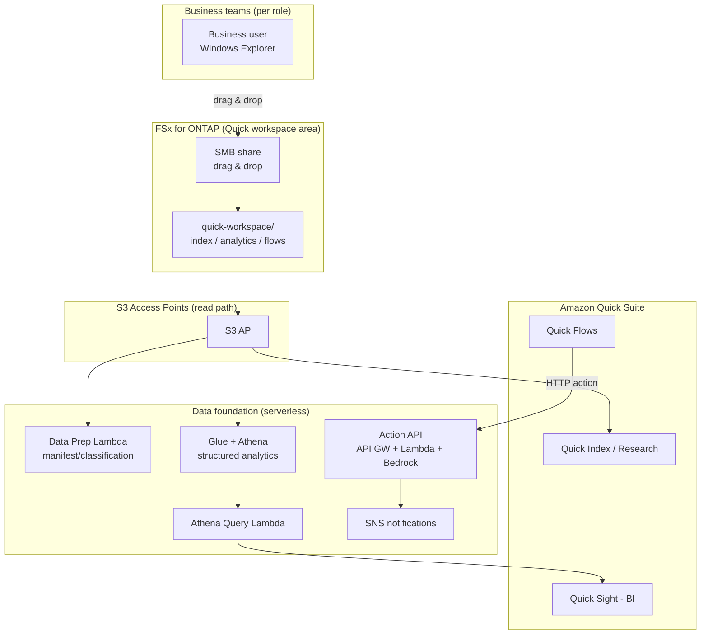

# Amazon Quick Agentic Workspace over FSx for ONTAP

🌐 **Language / 言語**: [日本語](README.md) | [English](README.en.md) | [한국어](README.ko.md) | [简体中文](README.zh-CN.md) | [繁體中文](README.zh-TW.md) | [Français](README.fr.md) | [Deutsch](README.de.md) | [Español](README.es.md)

## Overview

A pattern that uses Amazon FSx for NetApp ONTAP **via S3 Access Points** as the data foundation for **Amazon Quick Suite** (the agentic AI workspace). Data that business teams maintain through Windows file operations is used across Quick's capabilities (Index / Sight / Flows / Research).

While UC29 ([genai-kb-selfservice-curation](../genai-kb-selfservice-curation/)) focuses on self-service ingestion into a managed Bedrock Knowledge Base, this UC30 focuses on **an agentic workspace fronted by Amazon Quick Suite that unifies unstructured search, BI, and action automation**.

> **Amazon Quick Suite**: launched October 2025. The evolution of Amazon Q Business, it is an agentic assistant that answers questions grounded in internal data and takes "action" such as dashboard generation, scheduling, and deliverable creation. Information, pricing, and supported services are time-sensitive. For the latest, see [aws.amazon.com/quick](https://aws.amazon.com/quick/).

## Quick capabilities mapped to FSx for ONTAP S3 AP

| Quick capability | Role | Data type (on S3 AP) | This UC's implementation |
|-----------|------|---------------------|-----------|
| **Quick Index** | Cross-file search and QA of unstructured files | `index/<role>/` (md/pdf/docx) | Connect S3 AP as a data source (read) |
| **Quick Research** | Deep research report generation | `index/<role>/` | Same as above |
| **Quick Sight** | BI and visualization of structured data | `analytics/<role>/` (csv) | Analyze via Glue/Athena (Athena Query Lambda) |
| **Quick Flows** | Action automation | `flows/<role>/` (json) | Action API (API Gateway + Lambda + Bedrock) |

## Problems solved

| Problem | How this pattern solves it |
|------|-------------------|
| Business data is copied into S3 and managed twice | Use S3 AP to make the FSx for ONTAP master copy a direct data source |
| Unstructured and structured data are siloed and cannot be used together | Integrate Quick Index (files) and Quick Sight (Athena) in the same workspace |
| An "answer" appears but does not lead to action | Automate from summary generation to task creation via Quick Flows → Action API |
| Different roles need different information and analytics | Organize folders and data sources by role × service |
| Data preparation depends on specialized skills | Windows file operations plus serverless data prep (Data Prep Lambda) |

## Architecture



## Two operational scenarios (demo)

As with UC29, you can experience two stages according to operational maturity. See the [demo guide](docs/demo-guide.md) for details.

| Scenario | Summary | Central operation |
|---------|------|---------------|
| **A: Manual workspace experience** | Place data in Windows, then manually experience Index connection, Quick Sight dataset creation, and Quick Flows execution in the Quick console | People operate via the Quick UI |
| **B: Automation** | Automate data prep (Data Prep), BI queries (Athena Query), and actions (Action API) with serverless, driven from Quick Flows / Scheduler | Lambda / API / Scheduler |

## Web-search-augmented brief generation (opt-in, NEW)

> Integrates the **AgentCore Web Search Tool**, which reached GA at AWS Summit NYC 2026 (2026-06-17).

Adds a new action `generate_brief_with_web` to the Action API. In addition to internal context, it generates a brief augmented with real-time web search results.

```bash
curl -X POST https://<api-id>.execute-api.ap-northeast-1.amazonaws.com/prod/action \
  --aws-sigv4 "aws:amz:ap-northeast-1:execute-api" \
  -H "Content-Type: application/json" \
  -d '{
    "action": "generate_brief_with_web",
    "params": {
      "title": "Data protection regulation trends for Q3 2026",
      "context": "Internally we operate in compliance with the FISC Security Guidelines...",
      "web_query": "data protection regulation 2026 Japan"
    }
  }'
```

| Action | Answer source | Read/write |
|-----------|-----------|-----------------|
| `generate_brief` | Internal context only | Read-only |
| `generate_brief_with_web` | Internal context + web search | Read-only |

- Enable with `EnableWebSearch=true` plus `AgentCoreGatewayId`
- Graceful degradation: on web search failure, behaves the same as `generate_brief`
- Citations: returns URL + title + publication date in the `web_citations` field

Details: [docs/investigations/agentcore-web-search-fsxn-integration.md](../../docs/investigations/agentcore-web-search-fsxn-integration.md)

## Roles × services (aligned with Amazon Quick target roles)

The roles are the seven that Amazon Quick targets — **sales / marketing / IT / operations / finance / legal** (FAQ) — plus **developers**, which has a dedicated page. Data is organized by the service used (Index / Sight / Flows).

```
quick-workspace/                       ← AI-dedicated volume (SMB share)
├── index/<role>/        … Quick Index / Research (unstructured md)
├── analytics/<role>/    … Quick Sight (structured csv, via Athena)
└── flows/<role>/        … Quick Flows (action json)
```

| Role | Quick target (reference, time-sensitive) | Sample analytics data |
|--------|--------------------------------|------------------|
| sales | Lead scoring / forecasting / CRM ([/quick/sales/](https://aws.amazon.com/quick/sales/)) | Pipeline (amount by stage) |
| marketing | Campaigns, content | Campaign metrics (CPL) |
| finance | Budget, expenses, forecasting | Budget vs actuals |
| information-technology | Incidents, IT FAQ, security ([/quick/information-technology/](https://aws.amazon.com/quick/information-technology/)) | Incidents (MTTR) |
| operations | SOPs, processes | Throughput, SLA |
| legal | Contracts, compliance | Contract register |
| developers | Guidelines, onboarding ([/quick/developers/](https://aws.amazon.com/quick/developers/)) | DORA metrics |

The **sample data** for each role ships in [`sample-data/quick-workspace/`](sample-data/). This UC aligns its role layout with **UC29**, so they can share and reuse the same AI-dedicated volume.

## Directory structure

```
genai-quick-agentic-workspace/
├── README.md / README.en.md and 7 other languages
├── template.yaml                 # SAM: Action API / Athena / Data Prep / Quick data source role
├── samconfig.toml.example
├── functions/
│   ├── quick_action/handler.py   # Quick Flows action (summary generation, task creation; Bedrock)
│   ├── athena_query/handler.py   # Quick Sight BI foundation (Glue/Athena)
│   └── data_prep/handler.py      # Data source preparation manifest
├── sample-data/quick-workspace/  # Seed data by role × service
│   ├── index/<role>/*.md
│   ├── analytics/<role>/*.csv
│   └── flows/<role>/*.json
├── tests/test_handlers.py
└── docs/
    ├── architecture.md
    └── demo-guide.md
```

> **Deployment prerequisite**: Amazon Quick Suite's own data source connections (connecting S3 AP to Quick Index, creating Quick Sight datasets) are **configured in the Quick console**. This template provides the serverless data foundation that supports them (Action API / Athena analytics / Data Prep / IAM role for Quick).

## Security design

- **No data movement**: files remain as the master copy on FSx for ONTAP and are read via S3 AP
- **Action API uses IAM auth (SigV4)**: not an unauthenticated public endpoint. Configure credentials in the Quick-side connection
- **Least privilege**: Lambdas are allowed only the target S3 AP / Athena WorkGroup / the relevant Glue DB / Bedrock model
- **Quick data source role**: the trust principal is parameterized (defaults to account root; restricting it to the Quick connection is recommended)
- **Encryption**: SSE-FSX (storage), SSE-S3/KMS (Athena results), TLS (in transit)
- **Audit**: CloudTrail + ONTAP audit logs + Athena query history

> **Note**: The S3 AP data source boundary is at the volume/prefix level. If per-user visibility control is required, consider a custom permission-aware RAG ([FC3](../genai-rag-enterprise-files/)).

### Document-level ACL (Amazon Quick S3 knowledge base)

Amazon Quick's **S3 knowledge base supports document/folder-level ACLs**. You can restrict confidential documents to the "users/groups allowed to view them," and by combining this with per-role folders (`index/<role>/`), UC30 can also achieve **per-user visibility control** on the Quick side.

- Quick Suite permissions are managed across **three tiers: account / role / user** (priority: user > role > account)
- Custom permission profiles also allow control at the feature level (e.g., dashboard editing)
- Configure details in the Quick console (out of scope for this template)

> Sources are the official AWS blog/documentation (time-sensitive). For the latest support status, see [aws.amazon.com/quick](https://aws.amazon.com/quick/).

## Success Metrics

### Outcome
Connect the business data maintained in Windows across Amazon Quick's search, BI, and actions, completing everything from "question" to "action" in a single workspace.

| Metric | Target (example) |
|-----------|------------|
| Number of Quick Index connected data sources | For 7 roles |
| Number of Quick Sight target datasets | Structured data per role |
| Quick Flows action success rate | > 98% |
| Data prep manifest update | Scheduled execution (e.g., rate(1 hour)) |
| Business user operations | Windows file operations + Quick UI |

### Measurement Method
Data Prep manifest, Athena query history, Action API (API Gateway / Lambda) metrics, SNS notifications.

---

## Data Classification

| Output | Classification | Rationale |
|------|------|------|
| Action API response (generate_brief) | INTERNAL | Summary derived from source data. Not for external disclosure |
| Action API response (create_action_item / approve / execute) | INTERNAL | Business operation record |
| Athena query results (results bucket) | INTERNAL | Encryption + 30-day lifecycle + enforced TLS. Same level as analytics/ data |
| DynamoDB approval store (ApprovalsTable) | INTERNAL | Approval state. Metadata such as operation / requested_by |
| SNS notification message | INTERNAL | Action summary only. Does not include file contents |

> In regulated industries, additional CUI / FISC / HIPAA classification is required. Extend `shared/data_classification.py`.
> When `ALLOW_RAW_SQL=false` (the default), Athena runs only allowlisted queries, so the risk of crossing data-classification boundaries is low.

---

## AWS documentation links

| Service | Documentation |
|---------|------------|
| Amazon Quick Suite | [Product page](https://aws.amazon.com/quick/) / [User guide](https://docs.aws.amazon.com/quick/latest/userguide/) |
| Amazon Quick user types | [user-types](https://docs.aws.amazon.com/quick/latest/userguide/user-types.html) |
| FSx for ONTAP S3 Access Points | [S3 AP guide](https://docs.aws.amazon.com/fsx/latest/ONTAPGuide/s3-access-points.html) |
| Amazon Athena | [User guide](https://docs.aws.amazon.com/athena/latest/ug/what-is.html) |
| AWS Glue Data Catalog | [Developer guide](https://docs.aws.amazon.com/glue/latest/dg/catalog-and-crawler.html) |
| Amazon Bedrock | [User guide](https://docs.aws.amazon.com/bedrock/latest/userguide/what-is-bedrock.html) |
| API Gateway IAM authentication | [IAM authorization](https://docs.aws.amazon.com/apigateway/latest/developerguide/permissions.html) |

### Well-Architected Framework alignment

| Pillar | Alignment |
|----|------|
| Operational Excellence | Automated data prep manifest, structured logs, notifications |
| Security | Action API IAM auth, least privilege, no data movement, encryption |
| Reliability | Athena state monitoring, serverless redundancy |
| Performance Efficiency | Structured analytics with Athena, managed search with Index |
| Cost Optimization | Serverless pay-per-use, queries/actions only when needed |
| Sustainability | On-demand execution, use of managed services |

---

## Cost estimate (monthly approximation)

> **Note**: Approximation for ap-northeast-1. Actual cost varies with usage. See the [AWS Pricing Calculator](https://calculator.aws/) and [Amazon Quick pricing](https://aws.amazon.com/quick/) (time-sensitive).

| Service | Approximate |
|---------|------|
| Amazon Quick Suite | Per-user/plan billing (separate; see Quick pricing) |
| Lambda (3 functions) | ~$1-5 |
| API Gateway | ~$1 (per request) |
| Athena | $5/TB scanned (~$0.5-2 for small data) |
| Glue Data Catalog | Often within the free tier |
| S3 (Athena results) | ~$0.5 |
| Bedrock (summary generation) | Per-invocation ~$1-10 |
| SNS / CloudWatch Logs | ~$1 |
| FSx for ONTAP / S3 AP | Shares the existing environment (no additional S3 AP charge) |

> **Governance Caveat**: Costs are approximate, not guaranteed values. Amazon Quick's own pricing is separate.

---

## Local testing

```bash
python3 -m pytest tests/ -v
# Prerequisite: AWS SAM CLI required. 'sam build' packages the code and shared layer automatically.
sam build
sam local invoke DataPrepFunction --event events/data-prep-event.json
```

---

## Output samples

### Quick Flows action (task creation)
```json
{
  "status": "completed",
  "action": "create_action_item",
  "item": {"id": "AI-1760000000", "title": "Coordinate the PoC schedule for Acme Corp", "assignee": "sales-a", "status": "open"}
}
```

### Athena Query (Quick Sight BI foundation)
```json
{
  "status": "completed",
  "columns": ["stage", "deals", "total_jpy"],
  "rows": [["Negotiation", "2", "3360000"], ["ClosedWon", "1", "1920000"]],
  "row_count": 2
}
```

### Data Prep manifest
```json
{
  "status": "completed",
  "total_objects": 21,
  "by_service": {"index": 7, "analytics": 7, "flows": 7, "other": 0},
  "by_role": {"sales": 3, "marketing": 3, "finance": 3, "information-technology": 3, "operations": 3, "legal": 3, "developers": 3}
}
```

> **Note**: Sample output. Numbers and pricing are a sizing reference / time-sensitive and are not service limits.

---

## Performance Considerations

- FSx for ONTAP throughput is shared across NFS/SMB/S3AP. SMB writes and Quick reads share the same capacity
- Latency via S3 AP adds tens of milliseconds of overhead
- Athena is billed by scanned data volume. For large scale, consider partitioning/compression (Parquet)
- The Action API requires IAM auth. Design throttling for the Quick connection

---

## Related UCs and links

| Related | Point |
|------|---------|
| [PoC prerequisites checklist](docs/poc-checklist.md) | Quick enablement, Glue/LF, inference profiles, etc. |
| [Amazon Quick console setup steps](docs/quick-console-setup.md) | Index/Sight/Flows connection (with screenshot guidance) |
| [Lake Formation TBAC notes](docs/lake-formation-tbac.md) | Per-role data visibility (LF-TBAC + Quick RLS) |
| [Glue table creation script](scripts/create_glue_tables.sh) | DDL for Quick Sight/Athena (Parquet recommended) |
| [Cleanup runbook](../docs/uc29-uc30-cleanup-runbook.md) | Teardown steps including manual artifacts (shared by the 2 UCs) |
| [UC29 genai-kb-selfservice-curation](../genai-kb-selfservice-curation/) | Self-service ingestion into a managed Bedrock KB (same role layout) |
| [FC3 genai-rag-enterprise-files](../genai-rag-enterprise-files/) | Custom RAG requiring strict permission filtering |
| [Industry and workload mapping](../docs/industry-workload-mapping.md) | UC selection guide |

## Operational hardening (implemented)

- **Human-in-the-loop for high-risk Quick Flows operations**: `request_approval` does not run immediately but waits for approval (`pending_approval`) plus an SNS notification
- **Action API uses IAM auth (SigV4)**: not an unauthenticated public endpoint
- **BI optimization**: at large scale, make analytics Parquet + partitioned (reduces Athena scanned)

---

## Deployment

Deploy with the AWS SAM CLI (replace the placeholders for your environment):

```bash
# Prerequisite: AWS SAM CLI required. 'sam build' packages the code and shared layer automatically.
sam build

sam deploy \
  --stack-name fsxn-quick-agentic-workspace \
  --parameter-overrides \
    S3AccessPointAlias=<your-s3ap-alias> \
    S3AccessPointName=<your-s3ap-name> \
    NotificationEmail=<your-email@example.com> \
  --capabilities CAPABILITY_NAMED_IAM \
  --resolve-s3 \
  --region <your-region>
```

> **Note**: `template.yaml` is used with the SAM CLI (`sam build` + `sam deploy`).
> To deploy directly with the `aws cloudformation deploy` command, use `template-deploy.yaml` instead (requires pre-packaging Lambda zip files and uploading them to S3).

> **Amazon Quick setup**: Connecting an Index, creating datasets, and running Flows are out of scope for this template. Configure them in the Amazon Quick console after deployment (see [quick-console-setup](docs/quick-console-setup.md)).

## Governance Note

> This pattern provides technical architecture guidance. It is not legal, compliance, or regulatory advice.
> Amazon Quick's features, pricing, and supported regions change, so verify the latest against official information.
> The S3 AP data source boundary is at the volume/prefix level, and per-user visibility control is out of scope for this UC.
