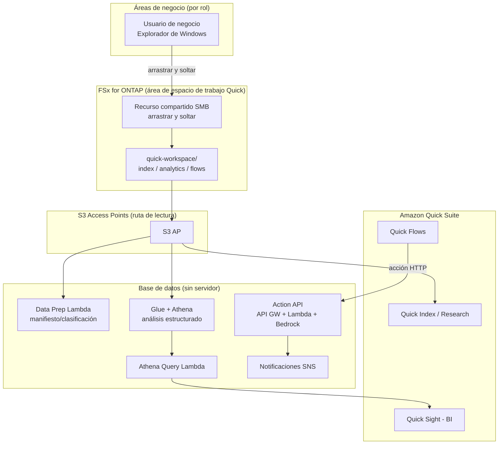

# Amazon Quick Agentic Workspace over FSx for ONTAP

🌐 **Language / 言語**: [日本語](README.md) | [English](README.en.md) | [한국어](README.ko.md) | [简体中文](README.zh-CN.md) | [繁體中文](README.zh-TW.md) | [Français](README.fr.md) | [Deutsch](README.de.md) | [Español](README.es.md)

## Descripción general

Un patrón que utiliza Amazon FSx for NetApp ONTAP **a través de S3 Access Points** como base de datos para **Amazon Quick Suite** (el espacio de trabajo de IA agéntica). Los datos que las áreas de negocio mantienen mediante operaciones de archivos de Windows se aprovechan de forma transversal desde las capacidades de Quick (Index / Sight / Flows / Research).

Mientras que UC29 ([genai-kb-selfservice-curation](../genai-kb-selfservice-curation/)) se centra en «la ingesta de autoservicio en una Bedrock Knowledge Base gestionada», este UC30 se centra en **un espacio de trabajo agéntico con Amazon Quick Suite como puerta de entrada, que reúne búsqueda no estructurada, BI y automatización de acciones**.

> **Amazon Quick Suite**: publicado en octubre de 2025. Como evolución de Amazon Q Business, es un asistente agéntico que responde preguntas basándose en los datos internos y llega hasta la «acción»: generación de paneles, programación y creación de entregables. La información / los precios / los servicios admitidos son time-sensitive. Para lo más reciente, consulte [aws.amazon.com/quick](https://aws.amazon.com/quick/).

## Correspondencia de las capacidades de Quick con FSx for ONTAP S3 AP

| Capacidad de Quick | Rol | Tipo de datos (en S3 AP) | Implementación de este UC |
|-----------|------|---------------------|-----------|
| **Quick Index** | Búsqueda transversal / QA de archivos no estructurados | `index/<role>/` (md/pdf/docx) | Conectar S3 AP como fuente de datos (lectura) |
| **Quick Research** | Generación de informes de investigación profunda | `index/<role>/` | Igual que arriba |
| **Quick Sight** | BI / visualización de datos estructurados | `analytics/<role>/` (csv) | Análisis vía Glue/Athena (Athena Query Lambda) |
| **Quick Flows** | Automatización de acciones | `flows/<role>/` (json) | Action API (API Gateway + Lambda + Bedrock) |

## Problemas que resuelve

| Problema | Solución con este patrón |
|------|-------------------|
| Los datos de negocio se copian a S3 y se gestionan por duplicado | Usar S3 AP para hacer de la copia maestra de FSx for ONTAP una fuente de datos directa |
| Lo no estructurado y lo estructurado están aislados y no pueden aprovecharse juntos | Integrar Quick Index (archivos) y Quick Sight (Athena) en el mismo espacio de trabajo |
| Aparece una «respuesta» pero no lleva a la acción | Automatizar desde la generación de resumen hasta la creación de tareas vía Quick Flows → Action API |
| Cada rol necesita información / análisis diferentes | Organizar carpetas y fuentes de datos por rol × servicio |
| La preparación de datos depende de habilidades especializadas | Operaciones de archivos de Windows + preparación de datos sin servidor (Data Prep Lambda) |

## Arquitectura



## Dos escenarios operativos (demo)

Al igual que UC29, puede experimentar dos etapas según la madurez operativa. Consulte la [guía de demo](docs/demo-guide.md) para más detalles.

| Escenario | Resumen | Operación central |
|---------|------|---------------|
| **A: Experiencia de espacio de trabajo manual** | Colocar datos en Windows y luego experimentar manualmente la conexión de Index, la creación de conjuntos de datos de Quick Sight y la ejecución de Quick Flows en la consola de Quick | Las personas operan a través de la UI de Quick |
| **B: Automatización** | Automatizar la preparación de datos (Data Prep), las consultas de BI (Athena Query) y las acciones (Action API) sin servidor, impulsadas desde Quick Flows / Scheduler | Lambda / API / Scheduler |

## Generación de briefing enriquecida con búsqueda web (opt-in, NEW)

> Integra la **AgentCore Web Search Tool**, que alcanzó GA en el AWS Summit NYC 2026 (2026-06-17).

Añade una nueva acción `generate_brief_with_web` a la Action API. Además del contexto interno, genera un briefing enriquecido con resultados de búsqueda web en tiempo real.

```bash
curl -X POST https://<api-id>.execute-api.ap-northeast-1.amazonaws.com/prod/action \
  --aws-sigv4 "aws:amz:ap-northeast-1:execute-api" \
  -H "Content-Type: application/json" \
  -d '{
    "action": "generate_brief_with_web",
    "params": {
      "title": "Tendencias de la regulación de protección de datos en el T3 de 2026",
      "context": "Internamente operamos conforme a las normas de seguridad FISC...",
      "web_query": "data protection regulation 2026 Japan"
    }
  }'
```

| Acción | Fuente de la respuesta | Lectura/escritura |
|-----------|-----------|-----------------|
| `generate_brief` | Solo contexto interno | Solo lectura |
| `generate_brief_with_web` | Contexto interno + búsqueda web | Solo lectura |

- Habilitar con `EnableWebSearch=true` + `AgentCoreGatewayId`
- Graceful degradation: ante un fallo de la búsqueda web, se comporta igual que `generate_brief`
- Citas: devuelve URL + título + fecha de publicación en el campo `web_citations`

Detalles: [docs/investigations/agentcore-web-search-fsxn-integration.md](../../docs/investigations/agentcore-web-search-fsxn-integration.md)

## Estructura rol × servicio (conforme a los roles previstos por Amazon Quick)

Los roles son los siete a los que se dirige Amazon Quick — **sales / marketing / IT / operations / finance / legal** (FAQ) — más **developers**, que tiene una página dedicada. Los datos se organizan por el servicio utilizado (Index / Sight / Flows).

```
quick-workspace/                       ← volumen dedicado a la IA (recurso compartido SMB)
├── index/<role>/        … Quick Index / Research (md no estructurado)
├── analytics/<role>/    … Quick Sight (csv estructurado, vía Athena)
└── flows/<role>/        … Quick Flows (json de acción)
```

| Rol | Previsión de Quick (referencia, time-sensitive) | Datos de análisis de ejemplo |
|--------|--------------------------------|------------------|
| sales | Lead scoring / previsión / CRM ([/quick/sales/](https://aws.amazon.com/quick/sales/)) | Pipeline (importe por stage) |
| marketing | Campañas, contenidos | Métricas de campaña (CPL) |
| finance | Presupuesto, gastos, previsión | Presupuesto vs real |
| information-technology | Incidentes, FAQ de TI, seguridad ([/quick/information-technology/](https://aws.amazon.com/quick/information-technology/)) | Incidentes (MTTR) |
| operations | SOP, procesos | Rendimiento, SLA |
| legal | Contratos, cumplimiento | Registro de contratos |
| developers | Normas, incorporación ([/quick/developers/](https://aws.amazon.com/quick/developers/)) | Métricas DORA |

Los **datos de ejemplo** de cada rol se incluyen en [`sample-data/quick-workspace/`](sample-data/). Este UC alinea su estructura de roles con **UC29**, de modo que pueden compartir / reutilizar el mismo volumen dedicado a la IA.

## Estructura de directorios

```
genai-quick-agentic-workspace/
├── README.md / README.en.md y otros 7 idiomas
├── template.yaml                 # SAM: Action API / Athena / Data Prep / rol de fuente de datos de Quick
├── samconfig.toml.example
├── functions/
│   ├── quick_action/handler.py   # Acción de Quick Flows (generación de resumen, creación de tareas; Bedrock)
│   ├── athena_query/handler.py   # Base de BI de Quick Sight (Glue/Athena)
│   └── data_prep/handler.py      # Manifiesto de preparación de fuentes de datos
├── sample-data/quick-workspace/  # Datos semilla por rol × servicio
│   ├── index/<role>/*.md
│   ├── analytics/<role>/*.csv
│   └── flows/<role>/*.json
├── tests/test_handlers.py
└── docs/
    ├── architecture.md
    └── demo-guide.md
```

> **Requisito previo de despliegue**: las conexiones de fuentes de datos propias de Amazon Quick Suite (conexión de S3 AP a Quick Index, creación de conjuntos de datos de Quick Sight) se **configuran en la consola de Quick**. Esta plantilla proporciona la base de datos sin servidor que las respalda (Action API / análisis de Athena / Data Prep / rol IAM para Quick).

## Diseño de seguridad

- **Sin movimiento de datos**: los archivos permanecen como copia maestra en FSx for ONTAP y se leen a través de S3 AP
- **La Action API usa autenticación IAM (SigV4)**: no es un endpoint público sin autenticación. Configure las credenciales en la conexión del lado de Quick
- **Mínimo privilegio**: las Lambdas solo tienen permiso sobre el S3 AP objetivo / el WorkGroup de Athena / la DB de Glue correspondiente / el modelo de Bedrock
- **Rol de fuente de datos de Quick**: el principal de confianza está parametrizado (por defecto el root de la cuenta; se recomienda restringirlo a la conexión de Quick)
- **Cifrado**: SSE-FSX (almacenamiento), SSE-S3/KMS (resultados de Athena), TLS (en tránsito)
- **Auditoría**: CloudTrail + registros de auditoría de ONTAP + historial de consultas de Athena

> **Nota**: el límite de la fuente de datos de S3 AP es a nivel de volumen/prefijo. Si se requiere control de visibilidad por usuario, considere un RAG personalizado con reconocimiento de permisos ([FC3](../genai-rag-enterprise-files/)).

### ACL a nivel de documento (base de conocimiento S3 de Amazon Quick)

La **base de conocimiento S3 de Amazon Quick admite ACL a nivel de documento/carpeta**. Puede restringir los documentos confidenciales a los «usuarios/grupos autorizados a verlos», y al combinarlo con carpetas por rol (`index/<role>/`), este UC30 también puede lograr un **control de visibilidad por usuario** en el lado de Quick.

- Los permisos de Quick Suite se gestionan en **tres niveles: account / role / user** (prioridad: user > role > account)
- Con perfiles de permisos personalizados también es posible el control a nivel de funcionalidad (edición de paneles, etc.)
- Configure los detalles en la consola de Quick (fuera del alcance de esta plantilla)

> Las fuentes son el blog / la documentación oficiales de AWS (time-sensitive). Para el estado de compatibilidad más reciente, consulte [aws.amazon.com/quick](https://aws.amazon.com/quick/).

## Success Metrics

### Outcome
Conectar de forma transversal los datos de negocio mantenidos en Windows con la búsqueda / BI / acciones de Amazon Quick, completando todo, desde la «pregunta» hasta la «acción», en un único espacio de trabajo.

| Métrica | Valor objetivo (ejemplo) |
|-----------|------------|
| Número de fuentes de datos conectadas a Quick Index | Para 7 roles |
| Número de conjuntos de datos analizados por Quick Sight | Datos estructurados por rol |
| Tasa de éxito de las acciones de Quick Flows | > 98 % |
| Actualización del manifiesto de preparación de datos | Ejecución programada (p. ej. rate(1 hour)) |
| Operaciones de los usuarios de negocio | Operaciones de archivos de Windows + UI de Quick |

### Measurement Method
Manifiesto de Data Prep, historial de consultas de Athena, métricas de la Action API (API Gateway / Lambda), notificaciones SNS.

---

## Data Classification

| Salida | Clasificación | Fundamento |
|------|------|------|
| Respuesta de Action API (generate_brief) | INTERNAL | Resumen derivado de datos de origen. No divulgable externamente |
| Respuesta de Action API (create_action_item / approve / execute) | INTERNAL | Registro de operaciones de negocio |
| Resultados de consulta de Athena (bucket de resultados) | INTERNAL | Cifrado + lifecycle de 30 días + TLS forzado. Mismo nivel que los datos de analytics/ |
| Almacén de aprobaciones de DynamoDB (ApprovalsTable) | INTERNAL | Estado de aprobación. Metadatos como operation / requested_by |
| Mensaje de notificación SNS | INTERNAL | Solo resumen de la acción. No incluye el contenido de los archivos |

> En sectores regulados se requiere una clasificación adicional CUI / FISC / HIPAA. Amplíe `shared/data_classification.py`.
> Cuando `ALLOW_RAW_SQL=false` (predeterminado), Athena solo ejecuta consultas de la lista de permitidos, por lo que el riesgo de cruzar límites de clasificación de datos es bajo.

---

## Enlaces de documentación de AWS

| Servicio | Documentación |
|---------|------------|
| Amazon Quick Suite | [Página del producto](https://aws.amazon.com/quick/) / [Guía del usuario](https://docs.aws.amazon.com/quick/latest/userguide/) |
| Tipos de usuario de Amazon Quick | [user-types](https://docs.aws.amazon.com/quick/latest/userguide/user-types.html) |
| FSx for ONTAP S3 Access Points | [Guía de S3 AP](https://docs.aws.amazon.com/fsx/latest/ONTAPGuide/s3-access-points.html) |
| Amazon Athena | [Guía del usuario](https://docs.aws.amazon.com/athena/latest/ug/what-is.html) |
| AWS Glue Data Catalog | [Guía del desarrollador](https://docs.aws.amazon.com/glue/latest/dg/catalog-and-crawler.html) |
| Amazon Bedrock | [Guía del usuario](https://docs.aws.amazon.com/bedrock/latest/userguide/what-is-bedrock.html) |
| Autenticación IAM de API Gateway | [Autorización IAM](https://docs.aws.amazon.com/apigateway/latest/developerguide/permissions.html) |

### Conformidad con el Well-Architected Framework

| Pilar | Conformidad |
|----|------|
| Excelencia operativa | Manifiesto automático de preparación de datos, registros estructurados, notificaciones |
| Seguridad | Action API con autenticación IAM, mínimo privilegio, sin movimiento de datos, cifrado |
| Fiabilidad | Supervisión del estado de Athena, redundancia sin servidor |
| Eficiencia del rendimiento | Análisis estructurado con Athena, búsqueda gestionada con Index |
| Optimización de costes | Facturación por uso sin servidor, consultas/acciones solo cuando se necesitan |
| Sostenibilidad | Ejecución bajo demanda, aprovechamiento de servicios gestionados |

---

## Estimación de costes (aproximación mensual)

> **Nota**: aproximación para ap-northeast-1. El coste real varía según el uso. Consulte la [AWS Pricing Calculator](https://calculator.aws/) y los [precios de Amazon Quick](https://aws.amazon.com/quick/) (time-sensitive).

| Servicio | Aproximado |
|---------|------|
| Amazon Quick Suite | Facturación por usuario/plan (aparte; véanse los precios de Quick) |
| Lambda (3 funciones) | ~$1-5 |
| API Gateway | ~$1 (por solicitud) |
| Athena | $5/TB scanned (~$0.5-2 para datos pequeños) |
| Glue Data Catalog | A menudo dentro del nivel gratuito |
| S3 (resultados de Athena) | ~$0.5 |
| Bedrock (generación de resumen) | Por invocación ~$1-10 |
| SNS / CloudWatch Logs | ~$1 |
| FSx for ONTAP / S3 AP | Comparte el entorno existente (sin cargo adicional de S3 AP) |

> **Governance Caveat**: los costes son aproximados y no son valores garantizados. Los precios propios de Amazon Quick son aparte.

---

## Pruebas locales

```bash
python3 -m pytest tests/ -v
# Requisito previo: se necesita AWS SAM CLI. «sam build» empaqueta automáticamente el código y la capa compartida.
sam build
sam local invoke DataPrepFunction --event events/data-prep-event.json
```

---

## Ejemplos de salida

### Acción de Quick Flows (creación de tarea)
```json
{
  "status": "completed",
  "action": "create_action_item",
  "item": {"id": "AI-1760000000", "title": "Coordinar el calendario del PoC para Acme Corp", "assignee": "sales-a", "status": "open"}
}
```

### Athena Query (base de BI de Quick Sight)
```json
{
  "status": "completed",
  "columns": ["stage", "deals", "total_jpy"],
  "rows": [["Negotiation", "2", "3360000"], ["ClosedWon", "1", "1920000"]],
  "row_count": 2
}
```

### Manifiesto de Data Prep
```json
{
  "status": "completed",
  "total_objects": 21,
  "by_service": {"index": 7, "analytics": 7, "flows": 7, "other": 0},
  "by_role": {"sales": 3, "marketing": 3, "finance": 3, "information-technology": 3, "operations": 3, "legal": 3, "developers": 3}
}
```

> **Nota**: salida de ejemplo. Los números / precios son una referencia de dimensionamiento / time-sensitive y no son service limits.

---

## Performance Considerations

- El rendimiento de FSx for ONTAP se comparte entre NFS/SMB/S3AP. Las escrituras SMB y las lecturas de Quick comparten la misma capacidad
- La latencia a través de S3 AP añade una sobrecarga de decenas de milisegundos
- Athena se factura por el volumen de datos escaneado. A gran escala, considere la partición/compresión (Parquet)
- La Action API requiere autenticación IAM. Diseñe la limitación de la conexión de Quick

---

## UC relacionados y enlaces

| Relacionado | Punto clave |
|------|---------|
| [Lista de verificación de requisitos previos de PoC](docs/poc-checklist.md) | Habilitación de Quick, Glue/LF, perfiles de inferencia, etc. |
| [Pasos de configuración de la consola de Amazon Quick](docs/quick-console-setup.md) | Conexión de Index/Sight/Flows (con pautas de captura de pantalla) |
| [Notas de Lake Formation TBAC](docs/lake-formation-tbac.md) | Visibilidad de datos por rol (LF-TBAC + Quick RLS) |
| [Script de creación de tablas de Glue](scripts/create_glue_tables.sh) | DDL para Quick Sight/Athena (Parquet recomendado) |
| [Runbook de limpieza](../docs/uc29-uc30-cleanup-runbook.md) | Pasos de desmontaje incluyendo artefactos manuales (comunes a los 2 UC) |
| [UC29 genai-kb-selfservice-curation](../genai-kb-selfservice-curation/) | Ingesta de autoservicio en una KB de Bedrock gestionada (misma estructura de roles) |
| [FC3 genai-rag-enterprise-files](../genai-rag-enterprise-files/) | RAG personalizado que requiere filtrado estricto de permisos |
| [Mapeo de sector / carga de trabajo](../docs/industry-workload-mapping.md) | Guía de selección de UC |

## Endurecimiento operativo (implementado)

- **Human-in-the-loop para operaciones de Quick Flows de alto riesgo**: `request_approval` no se ejecuta de inmediato, sino que espera la aprobación (`pending_approval`) + una notificación SNS
- **La Action API usa autenticación IAM (SigV4)**: no es un endpoint público sin autenticación
- **Optimización de BI**: a gran escala, hacer analytics en Parquet + particionado (reduce el scanned de Athena)

---

## Despliegue

Despliegue con la AWS SAM CLI (reemplace los marcadores de posición para su entorno):

```bash
# Requisito previo: se necesita AWS SAM CLI. «sam build» empaqueta automáticamente el código y la capa compartida.
sam build

sam deploy \
  --stack-name fsxn-quick-agentic-workspace \
  --parameter-overrides \
    S3AccessPointAlias=<your-s3ap-alias> \
    S3AccessPointName=<your-s3ap-name> \
    NotificationEmail=<your-email@example.com> \
  --capabilities CAPABILITY_NAMED_IAM \
  --resolve-s3 \
  --region <your-region>
```

> **Atención**: `template.yaml` se usa con la SAM CLI (`sam build` + `sam deploy`).
> Para desplegar directamente con el comando `aws cloudformation deploy`, use `template-deploy.yaml` en su lugar (requiere empaquetar previamente los archivos zip de Lambda y subirlos a S3).

> **Configuración de Amazon Quick**: la conexión de un Index, la creación de conjuntos de datos y la ejecución de Flows están fuera del alcance de esta plantilla. Configúrelas en la consola de Amazon Quick después del despliegue (véase [quick-console-setup](docs/quick-console-setup.md)).

## Governance Note

> Este patrón proporciona orientación de arquitectura técnica. No es asesoramiento legal, de cumplimiento ni regulatorio.
> Las funciones / los precios / las regiones admitidas de Amazon Quick cambian; verifique lo más reciente con las fuentes oficiales.
> El límite de la fuente de datos de S3 AP es a nivel de volumen/prefijo, y el control de visibilidad por usuario está fuera del alcance de este UC.
