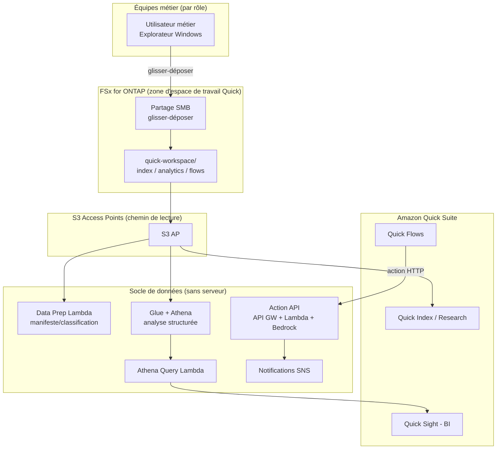

# Amazon Quick Agentic Workspace over FSx for ONTAP

🌐 **Language / 言語**: [日本語](README.md) | [English](README.en.md) | [한국어](README.ko.md) | [简体中文](README.zh-CN.md) | [繁體中文](README.zh-TW.md) | [Français](README.fr.md) | [Deutsch](README.de.md) | [Español](README.es.md)

## Présentation

Un modèle qui utilise Amazon FSx for NetApp ONTAP **via des S3 Access Points** comme socle de données pour **Amazon Quick Suite** (l'espace de travail IA agentique). Les données que les équipes métier maintiennent via des opérations de fichiers Windows sont exploitées de manière transversale par les capacités de Quick (Index / Sight / Flows / Research).

Alors que UC29 ([genai-kb-selfservice-curation](../genai-kb-selfservice-curation/)) se concentre sur « l'ingestion en libre-service vers une Bedrock Knowledge Base managée », ce UC30 se concentre sur **un espace de travail agentique dont l'entrée est Amazon Quick Suite, réunissant recherche non structurée, BI et automatisation d'actions**.

> **Amazon Quick Suite** : lancé en octobre 2025. Évolution d'Amazon Q Business, c'est un assistant agentique qui répond aux questions en s'appuyant sur les données internes et va jusqu'à « l'action » : génération de tableaux de bord, planification, création de livrables. Les informations / tarifs / services pris en charge sont time-sensitive. Pour les dernières informations, voir [aws.amazon.com/quick](https://aws.amazon.com/quick/).

## Correspondance des capacités Quick et de FSx for ONTAP S3 AP

| Capacité Quick | Rôle | Type de données (sur S3 AP) | Implémentation de ce UC |
|-----------|------|---------------------|-----------|
| **Quick Index** | Recherche transversale / QA sur fichiers non structurés | `index/<role>/` (md/pdf/docx) | Connecter S3 AP comme source de données (lecture) |
| **Quick Research** | Génération de rapports d'investigation approfondie | `index/<role>/` | Identique ci-dessus |
| **Quick Sight** | BI / visualisation de données structurées | `analytics/<role>/` (csv) | Analyse via Glue/Athena (Athena Query Lambda) |
| **Quick Flows** | Automatisation d'actions | `flows/<role>/` (json) | Action API (API Gateway + Lambda + Bedrock) |

## Problèmes résolus

| Problème | Résolution par ce modèle |
|------|-------------------|
| Les données métier sont copiées dans S3 et gérées en double | Utiliser S3 AP pour faire de la copie maîtresse FSx for ONTAP une source de données directe |
| Non structuré et structuré sont cloisonnés et ne peuvent pas être exploités ensemble | Intégrer Quick Index (fichiers) et Quick Sight (Athena) dans le même espace de travail |
| Une « réponse » apparaît mais ne mène pas à l'action | Automatiser de la génération de résumé à la création de tâche via Quick Flows → Action API |
| Chaque rôle a besoin d'informations / analyses différentes | Organiser dossiers et sources de données par rôle × service |
| La préparation des données dépend de compétences spécialisées | Opérations de fichiers Windows + préparation de données sans serveur (Data Prep Lambda) |

## Architecture



## Deux scénarios opérationnels (démo)

Comme pour UC29, vous pouvez expérimenter deux étapes selon la maturité opérationnelle. Voir le [guide de démo](docs/demo-guide.md) pour les détails.

| Scénario | Résumé | Opération centrale |
|---------|------|---------------|
| **A : Expérience d'espace de travail manuel** | Déposer des données dans Windows, puis expérimenter manuellement la connexion Index, la création de jeux de données Quick Sight et l'exécution de Quick Flows dans la console Quick | Les personnes opèrent via l'UI Quick |
| **B : Automatisation** | Automatiser la préparation de données (Data Prep), les requêtes BI (Athena Query) et les actions (Action API) en sans serveur, pilotées depuis Quick Flows / Scheduler | Lambda / API / Scheduler |

## Génération de briefing enrichie par recherche Web (opt-in, NEW)

> Intègre l'**AgentCore Web Search Tool**, passé en GA lors de l'AWS Summit NYC 2026 (2026-06-17).

Ajoute une nouvelle action `generate_brief_with_web` à l'Action API. En plus du contexte interne, elle génère un briefing enrichi par des résultats de recherche Web en temps réel.

```bash
curl -X POST https://<api-id>.execute-api.ap-northeast-1.amazonaws.com/prod/action \
  --aws-sigv4 "aws:amz:ap-northeast-1:execute-api" \
  -H "Content-Type: application/json" \
  -d '{
    "action": "generate_brief_with_web",
    "params": {
      "title": "Tendances de la réglementation sur la protection des données au T3 2026",
      "context": "En interne, nous appliquons une exploitation conforme aux normes de sécurité FISC...",
      "web_query": "data protection regulation 2026 Japan"
    }
  }'
```

| Action | Source de la réponse | Lecture/écriture |
|-----------|-----------|-----------------|
| `generate_brief` | Contexte interne uniquement | Lecture seule |
| `generate_brief_with_web` | Contexte interne + recherche Web | Lecture seule |

- Activer avec `EnableWebSearch=true` + `AgentCoreGatewayId`
- Graceful degradation : en cas d'échec de la recherche Web, comportement identique à `generate_brief`
- Citations : renvoie URL + titre + date de publication dans le champ `web_citations`

Détails : [docs/investigations/agentcore-web-search-fsxn-integration.md](../../docs/investigations/agentcore-web-search-fsxn-integration.md)

## Composition rôle × service (conforme aux rôles cibles d'Amazon Quick)

Les rôles sont les sept ciblés par Amazon Quick — **sales / marketing / IT / operations / finance / legal** (FAQ) — auxquels s'ajoute **developers**, qui dispose d'une page dédiée. Les données sont organisées par service utilisé (Index / Sight / Flows).

```
quick-workspace/                       ← volume dédié à l'IA (partage SMB)
├── index/<role>/        … Quick Index / Research (md non structuré)
├── analytics/<role>/    … Quick Sight (csv structuré, via Athena)
└── flows/<role>/        … Quick Flows (json d'action)
```

| Rôle | Cible Quick (référence, time-sensitive) | Données d'analyse d'exemple |
|--------|--------------------------------|------------------|
| sales | Lead scoring / prévision / CRM ([/quick/sales/](https://aws.amazon.com/quick/sales/)) | Pipeline (montant par stage) |
| marketing | Campagnes, contenus | Métriques de campagne (CPL) |
| finance | Budget, dépenses, prévision | Budget vs réel |
| information-technology | Incidents, FAQ IT, sécurité ([/quick/information-technology/](https://aws.amazon.com/quick/information-technology/)) | Incidents (MTTR) |
| operations | SOP, processus | Débit, SLA |
| legal | Contrats, conformité | Registre des contrats |
| developers | Règles, onboarding ([/quick/developers/](https://aws.amazon.com/quick/developers/)) | Métriques DORA |

Les **données d'exemple** de chaque rôle sont incluses dans [`sample-data/quick-workspace/`](sample-data/). Ce UC aligne sa composition de rôles sur **UC29**, ce qui permet de partager / réutiliser le même volume dédié à l'IA.

## Structure des répertoires

```
genai-quick-agentic-workspace/
├── README.md / README.en.md et 7 autres langues
├── template.yaml                 # SAM : Action API / Athena / Data Prep / rôle de source de données Quick
├── samconfig.toml.example
├── functions/
│   ├── quick_action/handler.py   # Action Quick Flows (génération de résumé, création de tâche ; Bedrock)
│   ├── athena_query/handler.py   # Socle BI Quick Sight (Glue/Athena)
│   └── data_prep/handler.py      # Manifeste de préparation de source de données
├── sample-data/quick-workspace/  # Données de départ par rôle × service
│   ├── index/<role>/*.md
│   ├── analytics/<role>/*.csv
│   └── flows/<role>/*.json
├── tests/test_handlers.py
└── docs/
    ├── architecture.md
    └── demo-guide.md
```

> **Prérequis de déploiement** : les connexions de sources de données propres à Amazon Quick Suite (connexion S3 AP à Quick Index, création de jeux de données Quick Sight) sont **configurées dans la console Quick**. Ce modèle fournit le socle de données sans serveur qui les soutient (Action API / analyse Athena / Data Prep / rôle IAM pour Quick).

## Conception de sécurité

- **Aucun déplacement de données** : les fichiers restent la copie maîtresse sur FSx for ONTAP et sont lus via S3 AP
- **L'Action API utilise l'auth IAM (SigV4)** : pas un point de terminaison public non authentifié. Configurer les identifiants dans la connexion côté Quick
- **Moindre privilège** : les Lambdas ne sont autorisées que sur le S3 AP cible / le WorkGroup Athena / la DB Glue concernée / le modèle Bedrock
- **Rôle de source de données Quick** : le principal de confiance est paramétré (par défaut le root du compte ; il est recommandé de le limiter à la connexion Quick)
- **Chiffrement** : SSE-FSX (stockage), SSE-S3/KMS (résultats Athena), TLS (en transit)
- **Audit** : CloudTrail + journaux d'audit ONTAP + historique des requêtes Athena

> **Remarque** : la frontière de source de données S3 AP est au niveau volume/préfixe. Si un contrôle de visibilité par utilisateur est nécessaire, envisagez un RAG personnalisé sensible aux permissions ([FC3](../genai-rag-enterprise-files/)).

### ACL au niveau document (base de connaissances S3 Amazon Quick)

La **base de connaissances S3 d'Amazon Quick prend en charge les ACL au niveau document/dossier**. Vous pouvez limiter les documents confidentiels aux « utilisateurs/groupes autorisés à les consulter », et en combinant cela avec des dossiers par rôle (`index/<role>/`), UC30 peut lui aussi réaliser un **contrôle de visibilité par utilisateur** du côté Quick.

- Les permissions de Quick Suite se gèrent sur **trois niveaux : account / role / user** (priorité : user > role > account)
- Des profils de permissions personnalisés permettent aussi un contrôle au niveau fonctionnalité (édition de tableau de bord, etc.)
- Configurez les détails dans la console Quick (hors périmètre de ce modèle)

> Les sources sont le blog/la documentation officiels AWS (time-sensitive). Pour l'état de prise en charge le plus récent, voir [aws.amazon.com/quick](https://aws.amazon.com/quick/).

## Success Metrics

### Outcome
Connecter de manière transversale les données métier maintenues dans Windows à la recherche / BI / actions d'Amazon Quick, pour boucler tout, de la « question » à l'« action », dans un seul espace de travail.

| Métrique | Valeur cible (exemple) |
|-----------|------------|
| Nombre de sources de données connectées à Quick Index | Pour 7 rôles |
| Nombre de jeux de données ciblés par Quick Sight | Données structurées par rôle |
| Taux de succès des actions Quick Flows | > 98 % |
| Mise à jour du manifeste de préparation de données | Exécution planifiée (ex. rate(1 hour)) |
| Opérations des utilisateurs métier | Opérations de fichiers Windows + UI Quick |

### Measurement Method
Manifeste Data Prep, historique des requêtes Athena, métriques de l'Action API (API Gateway / Lambda), notifications SNS.

---

## Data Classification

| Sortie | Classification | Justification |
|------|------|------|
| Réponse Action API (generate_brief) | INTERNAL | Résumé dérivé des données sources. Non divulgable à l'externe |
| Réponse Action API (create_action_item / approve / execute) | INTERNAL | Enregistrement d'opération métier |
| Résultats de requête Athena (bucket de résultats) | INTERNAL | Chiffrement + lifecycle de 30 jours + TLS imposé. Même niveau que les données analytics/ |
| Magasin d'approbation DynamoDB (ApprovalsTable) | INTERNAL | État d'approbation. Métadonnées telles que operation / requested_by |
| Message de notification SNS | INTERNAL | Résumé d'action uniquement. Ne contient pas le contenu des fichiers |

> Dans les secteurs réglementés, une classification CUI / FISC / HIPAA supplémentaire est requise. Étendez `shared/data_classification.py`.
> Lorsque `ALLOW_RAW_SQL=false` (par défaut), Athena n'exécute que des requêtes de liste d'autorisation, si bien que le risque de franchissement des frontières de classification des données est faible.

---

## Liens vers la documentation AWS

| Service | Documentation |
|---------|------------|
| Amazon Quick Suite | [Page produit](https://aws.amazon.com/quick/) / [Guide utilisateur](https://docs.aws.amazon.com/quick/latest/userguide/) |
| Types d'utilisateurs Amazon Quick | [user-types](https://docs.aws.amazon.com/quick/latest/userguide/user-types.html) |
| FSx for ONTAP S3 Access Points | [Guide S3 AP](https://docs.aws.amazon.com/fsx/latest/ONTAPGuide/s3-access-points.html) |
| Amazon Athena | [Guide utilisateur](https://docs.aws.amazon.com/athena/latest/ug/what-is.html) |
| AWS Glue Data Catalog | [Guide du développeur](https://docs.aws.amazon.com/glue/latest/dg/catalog-and-crawler.html) |
| Amazon Bedrock | [Guide utilisateur](https://docs.aws.amazon.com/bedrock/latest/userguide/what-is-bedrock.html) |
| Authentification IAM API Gateway | [Autorisation IAM](https://docs.aws.amazon.com/apigateway/latest/developerguide/permissions.html) |

### Conformité au Well-Architected Framework

| Pilier | Conformité |
|----|------|
| Excellence opérationnelle | Manifeste automatique de préparation de données, journaux structurés, notifications |
| Sécurité | Action API avec auth IAM, moindre privilège, aucun déplacement de données, chiffrement |
| Fiabilité | Surveillance de l'état Athena, redondance sans serveur |
| Efficacité des performances | Analyse structurée avec Athena, recherche managée avec Index |
| Optimisation des coûts | Facturation à l'usage sans serveur, requêtes/actions uniquement au besoin |
| Durabilité | Exécution à la demande, recours aux services managés |

---

## Estimation des coûts (approximation mensuelle)

> **Remarque** : approximation pour ap-northeast-1. Le coût réel varie selon l'usage. Voir l'[AWS Pricing Calculator](https://calculator.aws/) et les [tarifs Amazon Quick](https://aws.amazon.com/quick/) (time-sensitive).

| Service | Approximation |
|---------|------|
| Amazon Quick Suite | Facturation par utilisateur/plan (à part ; voir les tarifs Quick) |
| Lambda (3 fonctions) | ~$1-5 |
| API Gateway | ~$1 (par requête) |
| Athena | $5/TB scanned (~$0.5-2 pour de petites données) |
| Glue Data Catalog | Souvent dans le niveau gratuit |
| S3 (résultats Athena) | ~$0.5 |
| Bedrock (génération de résumé) | Par invocation ~$1-10 |
| SNS / CloudWatch Logs | ~$1 |
| FSx for ONTAP / S3 AP | Partage l'environnement existant (aucun frais S3 AP supplémentaire) |

> **Governance Caveat** : les coûts sont approximatifs et non des valeurs garanties. Les tarifs propres à Amazon Quick sont à part.

---

## Tests locaux

```bash
python3 -m pytest tests/ -v
# Prérequis : AWS SAM CLI requis. « sam build » empaquette automatiquement le code et la couche partagée.
sam build
sam local invoke DataPrepFunction --event events/data-prep-event.json
```

---

## Exemples de sortie

### Action Quick Flows (création de tâche)
```json
{
  "status": "completed",
  "action": "create_action_item",
  "item": {"id": "AI-1760000000", "title": "Coordonner le calendrier du PoC pour Acme Corp", "assignee": "sales-a", "status": "open"}
}
```

### Athena Query (socle BI Quick Sight)
```json
{
  "status": "completed",
  "columns": ["stage", "deals", "total_jpy"],
  "rows": [["Negotiation", "2", "3360000"], ["ClosedWon", "1", "1920000"]],
  "row_count": 2
}
```

### Manifeste Data Prep
```json
{
  "status": "completed",
  "total_objects": 21,
  "by_service": {"index": 7, "analytics": 7, "flows": 7, "other": 0},
  "by_role": {"sales": 3, "marketing": 3, "finance": 3, "information-technology": 3, "operations": 3, "legal": 3, "developers": 3}
}
```

> **Remarque** : sortie d'exemple. Les nombres / tarifs sont une référence de dimensionnement / time-sensitive et ne sont pas des service limits.

---

## Performance Considerations

- Le débit de FSx for ONTAP est partagé entre NFS/SMB/S3AP. Les écritures SMB et les lectures Quick partagent la même capacité
- La latence via S3 AP ajoute une surcharge de quelques dizaines de millisecondes
- Athena est facturé selon le volume de données scanné. À grande échelle, envisagez le partitionnement/la compression (Parquet)
- L'Action API exige l'auth IAM. Concevez la limitation de débit de la connexion Quick

---

## UC associés et liens

| Associé | Point clé |
|------|---------|
| [Liste de contrôle des prérequis PoC](docs/poc-checklist.md) | Activation de Quick, Glue/LF, profils d'inférence, etc. |
| [Étapes de configuration de la console Amazon Quick](docs/quick-console-setup.md) | Connexion Index/Sight/Flows (avec conseils de capture d'écran) |
| [Notes Lake Formation TBAC](docs/lake-formation-tbac.md) | Visibilité des données par rôle (LF-TBAC + Quick RLS) |
| [Script de création de tables Glue](scripts/create_glue_tables.sh) | DDL pour Quick Sight/Athena (Parquet recommandé) |
| [Runbook de nettoyage](../docs/uc29-uc30-cleanup-runbook.md) | Étapes de démantèlement incluant les artefacts manuels (communes aux 2 UC) |
| [UC29 genai-kb-selfservice-curation](../genai-kb-selfservice-curation/) | Ingestion en libre-service vers une KB Bedrock managée (même composition de rôles) |
| [FC3 genai-rag-enterprise-files](../genai-rag-enterprise-files/) | RAG personnalisé nécessitant un filtrage strict des permissions |
| [Mapping secteur / charge de travail](../docs/industry-workload-mapping.md) | Guide de sélection de UC |

## Renforcement opérationnel (implémenté)

- **Human-in-the-loop pour les opérations Quick Flows à haut risque** : `request_approval` ne s'exécute pas immédiatement mais attend une approbation (`pending_approval`) + une notification SNS
- **L'Action API utilise l'auth IAM (SigV4)** : pas un point de terminaison public non authentifié
- **Optimisation BI** : à grande échelle, rendre analytics en Parquet + partitionné (réduit le scanned Athena)

---

## Déploiement

Déployez avec l'AWS SAM CLI (remplacez les espaces réservés pour votre environnement) :

```bash
# Prérequis : AWS SAM CLI requis. « sam build » empaquette automatiquement le code et la couche partagée.
sam build

sam deploy \
  --stack-name fsxn-quick-agentic-workspace \
  --parameter-overrides \
    S3AccessPointAlias=<your-s3ap-alias> \
    S3AccessPointName=<your-s3ap-name> \
    NotificationEmail=<your-email@example.com> \
  --capabilities CAPABILITY_NAMED_IAM \
  --resolve-s3 \
  --region <your-region>
```

> **Attention** : `template.yaml` s'utilise avec le SAM CLI (`sam build` + `sam deploy`).
> Pour déployer directement avec la commande `aws cloudformation deploy`, utilisez plutôt `template-deploy.yaml` (nécessite d'empaqueter au préalable les fichiers zip Lambda et de les téléverser vers S3).

> **Configuration d'Amazon Quick** : la connexion d'un Index, la création de jeux de données et l'exécution de Flows sont hors périmètre de ce modèle. Configurez-les dans la console Amazon Quick après le déploiement (voir [quick-console-setup](docs/quick-console-setup.md)).

## Governance Note

> Ce modèle fournit des orientations d'architecture technique. Il ne s'agit pas de conseils juridiques, de conformité ou réglementaires.
> Les fonctionnalités / tarifs / régions prises en charge d'Amazon Quick changent ; vérifiez les dernières informations auprès des sources officielles.
> La frontière de source de données S3 AP est au niveau volume/préfixe, et le contrôle de visibilité par utilisateur est hors périmètre de ce UC.
