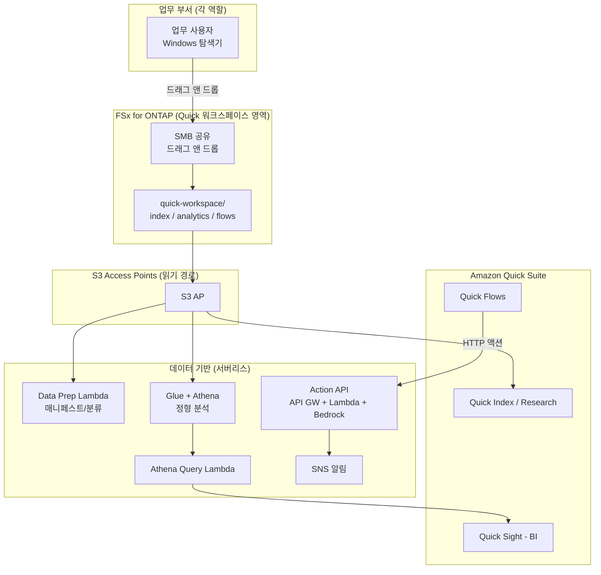

# Amazon Quick Agentic Workspace over FSx for ONTAP

🌐 **Language / 言語**: [日本語](README.md) | [English](README.en.md) | [한국어](README.ko.md) | [简体中文](README.zh-CN.md) | [繁體中文](README.zh-TW.md) | [Français](README.fr.md) | [Deutsch](README.de.md) | [Español](README.es.md)

## 개요

**Amazon Quick Suite**(에이전트형 AI 워크스페이스)의 데이터 기반으로 Amazon FSx for NetApp ONTAP 를 **S3 Access Points 경유** 로 활용하는 패턴입니다. 업무 부서가 Windows 파일 조작으로 유지하는 데이터를 Quick 의 각 기능(Index / Sight / Flows / Research)에서 횡단적으로 활용합니다.

UC29([genai-kb-selfservice-curation](../genai-kb-selfservice-curation/))가 "관리형 Bedrock Knowledge Base 로의 셀프서비스 투입"에 초점을 맞추는 것과 달리, 본 UC30 은 **Amazon Quick Suite 를 입구로 한, 비정형 검색 / BI / 액션 자동화를 묶은 에이전트형 워크스페이스** 에 초점을 맞춥니다.

> **Amazon Quick Suite**: 2025년 10월 공개. Amazon Q Business 의 진화형으로, 사내 데이터에 근거하여 질문에 답하고 대시보드 생성, 스케줄링, 산출물 작성 등의 "행동"까지 수행하는 에이전트형 어시스턴트입니다. 정보 / 요금 / 지원 서비스는 time-sensitive 합니다. 최신 정보는 [aws.amazon.com/quick](https://aws.amazon.com/quick/) 을 참조하세요.

## Quick 각 기능과 FSx for ONTAP S3 AP 의 대응

| Quick 기능 | 역할 | 데이터 종류(S3 AP 상) | 본 UC 의 구현 |
|-----------|------|---------------------|-----------|
| **Quick Index** | 비정형 파일의 횡단 검색 / QA | `index/<role>/`(md/pdf/docx) | S3 AP 를 데이터 소스로 연결(읽기) |
| **Quick Research** | 심층 조사 리포트 생성 | `index/<role>/` | 위와 동일 |
| **Quick Sight** | 정형 데이터의 BI / 시각화 | `analytics/<role>/`(csv) | Glue/Athena 경유로 분석(Athena Query Lambda) |
| **Quick Flows** | 액션 자동화 | `flows/<role>/`(json) | Action API(API Gateway + Lambda + Bedrock) |

## 해결하는 과제

| 과제 | 본 패턴에 의한 해결 |
|------|-------------------|
| 업무 데이터가 S3 로 복사되어 이중 관리 | S3 AP 로 FSx for ONTAP 의 정본을 직접 데이터 소스화 |
| 비정형과 정형이 분단되어 횡단 활용 불가 | Quick Index(파일)와 Quick Sight(Athena)를 동일 워크스페이스에서 통합 |
| "답"이 나와도 행동으로 이어지지 않음 | Quick Flows → Action API 로 요약 생성 / 태스크 발행까지 자동화 |
| 역할마다 필요한 정보 / 분석이 다름 | 역할 × 서비스로 폴더와 데이터 소스를 정리 |
| 전문 스킬 의존의 데이터 준비 | Windows 파일 조작 + 서버리스 데이터 준비(Data Prep Lambda) |

## 아키텍처



## 2 가지 운영 시나리오 (데모)

UC29 와 마찬가지로 운영 성숙도에 따른 2단계를 체험할 수 있습니다. 자세한 내용은 [데모 가이드](docs/demo-guide.md) 를 참조하세요.

| 시나리오 | 개요 | 중심이 되는 조작 |
|---------|------|---------------|
| **A: 수동 워크스페이스 체험** | Windows 로 데이터를 두고, Quick 콘솔에서 Index 연결 / Quick Sight 데이터셋 생성 / Quick Flows 실행을 수동으로 체험 | 사람이 Quick UI 로 조작 |
| **B: 자동화** | 데이터 준비(Data Prep), BI 쿼리(Athena Query), 액션(Action API)을 서버리스로 자동화하고 Quick Flows / Scheduler 에서 구동 | Lambda / API / Scheduler |

## 웹 검색으로 보강된 브리프 생성 (opt-in, NEW)

> AWS Summit NYC 2026 (2026-06-17) 에서 GA 가 된 **AgentCore Web Search Tool** 을 통합했습니다.

Action API 에 새로운 액션 `generate_brief_with_web` 를 추가합니다. 사내 컨텍스트에 더하여 실시간 웹 검색 결과로 보강한 브리프를 생성합니다.

```bash
curl -X POST https://<api-id>.execute-api.ap-northeast-1.amazonaws.com/prod/action \
  --aws-sigv4 "aws:amz:ap-northeast-1:execute-api" \
  -H "Content-Type: application/json" \
  -d '{
    "action": "generate_brief_with_web",
    "params": {
      "title": "2026년 Q3 데이터 보호 규제 동향",
      "context": "사내에서는 FISC 안전 대책 기준에 준거한 운영을 실시 중...",
      "web_query": "data protection regulation 2026 Japan"
    }
  }'
```

| 액션 | 답변 소스 | 읽기/쓰기 |
|-----------|-----------|-----------------|
| `generate_brief` | 내부 컨텍스트만 | 읽기 전용 |
| `generate_brief_with_web` | 내부 컨텍스트 + 웹 검색 | 읽기 전용 |

- `EnableWebSearch=true` + `AgentCoreGatewayId` 설정으로 활성화
- Graceful degradation: 웹 검색 실패 시 `generate_brief` 와 동등하게 동작
- 인용: `web_citations` 필드에 URL + 제목 + 공개일을 반환

자세한 내용: [docs/investigations/agentcore-web-search-fsxn-integration.md](../../docs/investigations/agentcore-web-search-fsxn-integration.md)

## 역할 × 서비스 구성 (Amazon Quick 상정 역할에 준거)

역할은 Amazon Quick 이 대상으로 하는 **sales / marketing / IT / operations / finance / legal**(FAQ)에, 전용 페이지가 있는 **developers** 를 더한 7개 역할입니다. 데이터는 이용 서비스(Index / Sight / Flows)로 정리합니다.

```
quick-workspace/                       ← AI 전용 볼륨(SMB 공유)
├── index/<role>/        … Quick Index / Research(비정형 md)
├── analytics/<role>/    … Quick Sight(정형 csv, Athena 경유)
└── flows/<role>/        … Quick Flows(액션 json)
```

| 역할 | Quick 상정(참고, time-sensitive) | 샘플 분석 데이터 |
|--------|--------------------------------|------------------|
| sales | Lead scoring / 예측 / CRM([/quick/sales/](https://aws.amazon.com/quick/sales/)) | 파이프라인(stage 별 금액) |
| marketing | 캠페인, 콘텐츠 | 캠페인 지표(CPL) |
| finance | 예산, 경비, 예측 | 예산 vs 실적 |
| information-technology | 인시던트, IT FAQ, 보안([/quick/information-technology/](https://aws.amazon.com/quick/information-technology/)) | 인시던트(MTTR) |
| operations | SOP, 프로세스 | 처리량, SLA |
| legal | 계약, 컴플라이언스 | 계약 레지스터 |
| developers | 규약, 온보딩([/quick/developers/](https://aws.amazon.com/quick/developers/)) | DORA 메트릭 |

각 역할의 **샘플 데이터**는 [`sample-data/quick-workspace/`](sample-data/) 에 동봉되어 있습니다. 본 UC 는 역할 구성을 **UC29** 와 맞추고 있어, 동일한 AI 전용 볼륨을 공유 / 재활용할 수 있습니다.

## 디렉터리 구성

```
genai-quick-agentic-workspace/
├── README.md / README.en.md 외 7개 언어
├── template.yaml                 # SAM: Action API / Athena / Data Prep / Quick 데이터 소스 역할
├── samconfig.toml.example
├── functions/
│   ├── quick_action/handler.py   # Quick Flows 액션(요약 생성, 태스크 발행, Bedrock)
│   ├── athena_query/handler.py   # Quick Sight BI 기반(Glue/Athena)
│   └── data_prep/handler.py      # 데이터 소스 준비 매니페스트
├── sample-data/quick-workspace/  # 역할 × 서비스의 시드 데이터
│   ├── index/<role>/*.md
│   ├── analytics/<role>/*.csv
│   └── flows/<role>/*.json
├── tests/test_handlers.py
└── docs/
    ├── architecture.md
    └── demo-guide.md
```

> **배포 전제**: Amazon Quick Suite 본체의 데이터 소스 연결(Quick Index 로의 S3 AP 연결, Quick Sight 데이터셋 생성)은 **Quick 콘솔에서 구성**합니다. 본 템플릿은 그것을 지원하는 서버리스 데이터 기반(Action API / Athena 분석 / Data Prep / Quick 용 IAM 역할)을 제공합니다.

## 보안 설계

- **데이터 이동 없음**: 파일은 FSx for ONTAP 상의 정본 그대로, S3 AP 경유로 읽기
- **Action API 는 IAM 인증(SigV4)**: 인증 없는 공개 엔드포인트로 하지 않음. Quick 측 연결에서 자격 증명을 구성
- **최소 권한**: Lambda 는 대상 S3 AP / Athena WorkGroup / 해당 Glue DB / Bedrock 모델만 허용
- **Quick 데이터 소스 역할**: 신뢰 프린시펄을 파라미터화(기본값은 계정 root, Quick 연결용으로 한정 권장)
- **암호화**: SSE-FSX(스토리지), SSE-S3/KMS(Athena 결과), TLS(전송 중)
- **감사**: CloudTrail + ONTAP 감사 로그 + Athena 쿼리 이력

> **주기**: S3 AP 의 데이터 소스 경계는 볼륨/프리픽스 단위입니다. 이용자 개인별 가시 범위 제어가 필요한 경우에는 커스텀 Permission-aware RAG([FC3](../genai-rag-enterprise-files/))를 검토하세요.

### 문서 레벨 ACL (Amazon Quick S3 나레지 베이스)

Amazon Quick 의 **S3 나레지 베이스는 문서/폴더 레벨의 ACL** 을 지원합니다. 기밀 문서를 "열람해도 되는 사용자/그룹"으로 한정할 수 있으며, 역할별 폴더(`index/<role>/`)와 조합함으로써 본 UC30 에서도 **이용자별 가시 범위 제어**를 Quick 측에서 실현할 수 있습니다.

- Quick Suite 의 권한은 **account / role / user 의 3계층**(user > role > account 의 우선순위)으로 관리
- 커스텀 권한 프로필로 기능 단위(대시보드 편집 등)의 제어도 가능
- 자세한 내용은 Quick 콘솔에서 구성(본 템플릿 대상 외)

> 출처는 AWS 공식 블로그/문서(time-sensitive)입니다. 최신 지원 상황은 [aws.amazon.com/quick](https://aws.amazon.com/quick/) 을 참조하세요.

## Success Metrics

### Outcome
Windows 로 유지하는 업무 데이터를 Amazon Quick 의 검색 / BI / 액션으로 횡단적으로 연결하여, "질문"에서 "행동"까지를 하나의 워크스페이스에서 완결합니다.

| 메트릭 | 목표값(예) |
|-----------|------------|
| Quick Index 연결 데이터 소스 수 | 7개 역할분 |
| Quick Sight 분석 대상 데이터셋 수 | 역할별 정형 데이터 |
| Quick Flows 액션 성공률 | > 98% |
| 데이터 준비 매니페스트 갱신 | 스케줄 실행(예 rate(1 hour)) |
| 업무 사용자의 조작 | Windows 파일 조작 + Quick UI |

### Measurement Method
Data Prep 매니페스트, Athena 쿼리 이력, Action API(API Gateway / Lambda) 메트릭, SNS 알림.

---

## Data Classification

| 출력 | 분류 | 근거 |
|------|------|------|
| Action API 응답(generate_brief) | INTERNAL | 소스 데이터 유래의 요약. 외부 공개 불가 |
| Action API 응답(create_action_item / approve / execute) | INTERNAL | 업무 오퍼레이션 기록 |
| Athena 쿼리 결과(결과 버킷) | INTERNAL | 암호화 + 30 일 lifecycle + TLS 강제. analytics/ 데이터와 동일 레벨 |
| DynamoDB 승인 스토어(ApprovalsTable) | INTERNAL | 승인 상태. operation / requested_by 등의 메타데이터 |
| SNS 알림 메시지 | INTERNAL | 액션 요약만. 파일 본체를 포함하지 않음 |

> 규제 업종에서는 CUI / FISC / HIPAA 분류가 추가로 필요합니다. `shared/data_classification.py` 를 확장하세요.
> `ALLOW_RAW_SQL=false`(기본값)의 경우, Athena 는 허용 목록 쿼리만 실행하므로 데이터 분류의 경계 초과 리스크는 낮습니다.

---

## AWS 문서 링크

| 서비스 | 문서 |
|---------|------------|
| Amazon Quick Suite | [제품 페이지](https://aws.amazon.com/quick/) / [사용자 가이드](https://docs.aws.amazon.com/quick/latest/userguide/) |
| Amazon Quick 사용자 유형 | [user-types](https://docs.aws.amazon.com/quick/latest/userguide/user-types.html) |
| FSx for ONTAP S3 Access Points | [S3 AP 가이드](https://docs.aws.amazon.com/fsx/latest/ONTAPGuide/s3-access-points.html) |
| Amazon Athena | [사용자 가이드](https://docs.aws.amazon.com/athena/latest/ug/what-is.html) |
| AWS Glue Data Catalog | [개발자 가이드](https://docs.aws.amazon.com/glue/latest/dg/catalog-and-crawler.html) |
| Amazon Bedrock | [사용자 가이드](https://docs.aws.amazon.com/bedrock/latest/userguide/what-is-bedrock.html) |
| API Gateway IAM 인증 | [IAM 인가](https://docs.aws.amazon.com/apigateway/latest/developerguide/permissions.html) |

### Well-Architected Framework 대응

| 기둥 | 대응 |
|----|------|
| 운영 우수성 | 데이터 준비의 자동 매니페스트, 정형 로그, 알림 |
| 보안 | Action API 는 IAM 인증, 최소 권한, 데이터 이동 없음, 암호화 |
| 신뢰성 | Athena 상태 감시, 서버리스 이중화 |
| 성능 효율 | Athena 에 의한 정형 분석, Index 의 관리형 검색 |
| 비용 최적화 | 서버리스 종량 과금, 필요 시에만 쿼리/액션 |
| 지속 가능성 | 온디맨드 실행, 관리형 서비스 활용 |

---

## 비용 견적 (월액 개산)

> **주기**: ap-northeast-1 의 개산입니다. 실비는 사용량에 따라 변동합니다. [AWS Pricing Calculator](https://calculator.aws/) 와 [Amazon Quick 요금](https://aws.amazon.com/quick/) 을 참조하세요(time-sensitive).

| 서비스 | 개산 |
|---------|------|
| Amazon Quick Suite | 사용자/플랜 과금(별도, Quick 요금 참조) |
| Lambda(3개 함수) | ~$1-5 |
| API Gateway | ~$1(요청 종량) |
| Athena | $5/TB scanned(소규모 데이터라면 ~$0.5-2) |
| Glue Data Catalog | 무료 범위 내가 많음 |
| S3(Athena 결과) | ~$0.5 |
| Bedrock(요약 생성) | 호출 종량 ~$1-10 |
| SNS / CloudWatch Logs | ~$1 |
| FSx for ONTAP / S3 AP | 기존 환경을 공유(S3 AP 추가 요금 없음) |

> **Governance Caveat**: 비용은 개산이며 보증값이 아닙니다. Amazon Quick 본체의 요금은 별도입니다.

---

## 로컬 테스트

```bash
python3 -m pytest tests/ -v
# 전제: AWS SAM CLI 가 필요합니다. sam build 가 코드와 공유 레이어를 자동으로 패키징합니다.
sam build
sam local invoke DataPrepFunction --event events/data-prep-event.json
```

---

## 출력 샘플

### Quick Flows 액션 (태스크 발행)
```json
{
  "status": "completed",
  "action": "create_action_item",
  "item": {"id": "AI-1760000000", "title": "Acme Corp 대상 PoC 일정을 조정한다", "assignee": "sales-a", "status": "open"}
}
```

### Athena Query (Quick Sight BI 기반)
```json
{
  "status": "completed",
  "columns": ["stage", "deals", "total_jpy"],
  "rows": [["Negotiation", "2", "3360000"], ["ClosedWon", "1", "1920000"]],
  "row_count": 2
}
```

### Data Prep 매니페스트
```json
{
  "status": "completed",
  "total_objects": 21,
  "by_service": {"index": 7, "analytics": 7, "flows": 7, "other": 0},
  "by_role": {"sales": 3, "marketing": 3, "finance": 3, "information-technology": 3, "operations": 3, "legal": 3, "developers": 3}
}
```

> **주기**: 샘플 출력입니다. 수치 / 요금은 sizing reference / time-sensitive 이며 service limit 이 아닙니다.

---

## Performance Considerations

- FSx for ONTAP 의 스루풋은 NFS/SMB/S3AP 로 공유됩니다. SMB 쓰기와 Quick 의 읽기가 동일 용량을 공유합니다
- S3 AP 경유의 레이턴시는 수십 밀리초의 오버헤드입니다
- Athena 는 scanned 데이터량에 과금됩니다. 대규모 시에는 파티션/압축(Parquet)을 검토하세요
- Action API 는 IAM 인증 필수입니다. Quick 연결의 스로틀링 설계를 실시하세요

---

## 관련 UC / 링크

| 관련 | 포인트 |
|------|---------|
| [PoC 전제 조건 체크리스트](docs/poc-checklist.md) | Quick 활성화, Glue/LF, 추론 프로필 등 |
| [Amazon Quick 콘솔 설정 순서](docs/quick-console-setup.md) | Index/Sight/Flows 연결(스크린샷 취득 지침 포함) |
| [Lake Formation TBAC 노트](docs/lake-formation-tbac.md) | 역할별 데이터 가시성(LF-TBAC + Quick RLS) |
| [Glue 테이블 생성 스크립트](scripts/create_glue_tables.sh) | Quick Sight/Athena 용 DDL(Parquet 화 권장) |
| [클린업 runbook](../docs/uc29-uc30-cleanup-runbook.md) | 수동 산출물을 포함한 철거 순서(2UC 공통) |
| [UC29 genai-kb-selfservice-curation](../genai-kb-selfservice-curation/) | 관리형 Bedrock KB 로의 셀프서비스 투입(동일 역할 구성) |
| [FC3 genai-rag-enterprise-files](../genai-rag-enterprise-files/) | 엄밀한 권한 필터가 필요한 커스텀 RAG |
| [업계 / 워크로드 매핑](../docs/industry-workload-mapping.md) | UC 선택 가이드 |

## 운영 견고화 (구현 완료)

- **Quick Flows 고위험 조작의 human-in-the-loop**: `request_approval` 은 즉시 실행하지 않고 승인 대기(`pending_approval`) + SNS 알림
- **Action API 는 IAM 인증(SigV4)**: 미인증 공개 엔드포인트로 하지 않음
- **BI 최적화**: 대규모 시에는 analytics 를 Parquet + 파티션화(Athena scanned 삭감)

---

## 배포

AWS SAM CLI 로 배포합니다(플레이스홀더는 환경에 맞게 치환하세요):

```bash
# 전제: AWS SAM CLI 가 필요합니다. sam build 가 코드와 공유 레이어를 자동으로 패키징합니다.
sam build

sam deploy \
  --stack-name fsxn-quick-agentic-workspace \
  --parameter-overrides \
    S3AccessPointAlias=<your-s3ap-alias> \
    S3AccessPointName=<your-s3ap-name> \
    NotificationEmail=<your-email@example.com> \
  --capabilities CAPABILITY_NAMED_IAM \
  --resolve-s3 \
  --region <your-region>
```

> **주의**: `template.yaml` 은 SAM CLI(`sam build` + `sam deploy`)로 사용합니다.
> `aws cloudformation deploy` 명령으로 직접 배포하는 경우에는 `template-deploy.yaml` 을 사용하세요(Lambda zip 파일의 사전 패키징과 S3 업로드가 필요합니다).

> **Amazon Quick 설정**: Index 연결 / 데이터셋 생성 / Flows 실행은 본 템플릿의 범위 외입니다. 배포 후에 Amazon Quick 콘솔에서 설정하세요([quick-console-setup](docs/quick-console-setup.md) 참조).

## Governance Note

> 본 패턴은 기술 아키텍처 가이던스를 제공합니다. 법적 / 컴플라이언스 / 규제상의 조언이 아닙니다.
> Amazon Quick 의 기능 / 요금 / 지원 리전은 변경되므로 최신 정보는 공식 정보를 확인하세요.
> S3 AP 의 데이터 소스 경계는 볼륨/프리픽스 단위이며, 이용자 개인별 가시 범위 제어는 본 UC 의 대상 외입니다.
