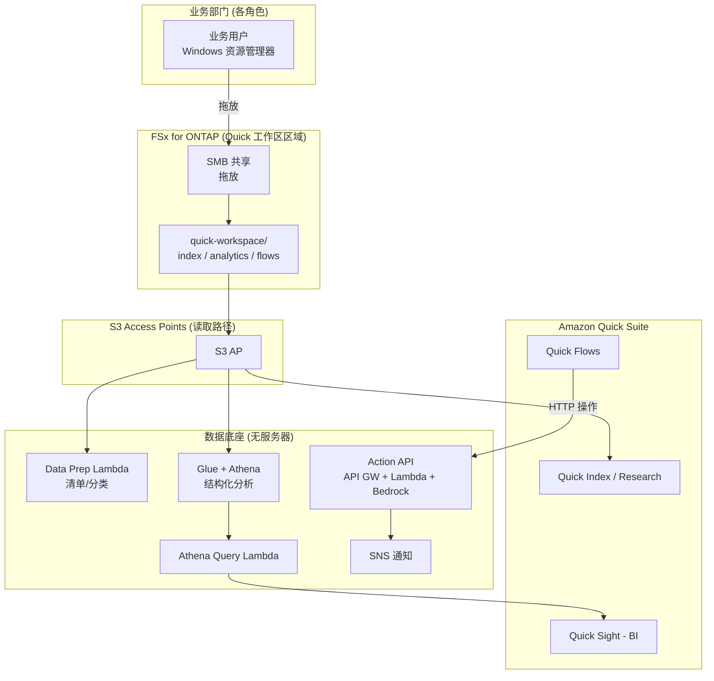

# Amazon Quick Agentic Workspace over FSx for ONTAP

🌐 **Language / 言語**: [日本語](README.md) | [English](README.en.md) | [한국어](README.ko.md) | [简体中文](README.zh-CN.md) | [繁體中文](README.zh-TW.md) | [Français](README.fr.md) | [Deutsch](README.de.md) | [Español](README.es.md)

## 概述

一种将 Amazon FSx for NetApp ONTAP **经由 S3 Access Points** 用作 **Amazon Quick Suite**（智能体式 AI 工作区）数据底座的模式。业务部门通过 Windows 文件操作维护的数据，可从 Quick 的各项能力（Index / Sight / Flows / Research）中横向利用。

与 UC29（[genai-kb-selfservice-curation](../genai-kb-selfservice-curation/)）聚焦于"向托管 Bedrock Knowledge Base 的自助投入"不同，本 UC30 聚焦于 **以 Amazon Quick Suite 为入口、整合非结构化检索 / BI / 操作自动化的智能体式工作区**。

> **Amazon Quick Suite**：2025 年 10 月公开。作为 Amazon Q Business 的演进形态，它基于内部数据回答问题，并执行仪表板生成、调度、成果物制作等"行动"的智能体式助手。信息 / 价格 / 支持的服务均为 time-sensitive。最新信息请参阅 [aws.amazon.com/quick](https://aws.amazon.com/quick/)。

## Quick 各能力与 FSx for ONTAP S3 AP 的对应

| Quick 能力 | 角色 | 数据类型（S3 AP 上） | 本 UC 的实现 |
|-----------|------|---------------------|-----------|
| **Quick Index** | 非结构化文件的横向检索 / QA | `index/<role>/`（md/pdf/docx） | 将 S3 AP 连接为数据源（读取） |
| **Quick Research** | 深度调查报告生成 | `index/<role>/` | 同上 |
| **Quick Sight** | 结构化数据的 BI / 可视化 | `analytics/<role>/`（csv） | 经由 Glue/Athena 分析（Athena Query Lambda） |
| **Quick Flows** | 操作自动化 | `flows/<role>/`（json） | Action API（API Gateway + Lambda + Bedrock） |

## 解决的课题

| 课题 | 本模式的解决方案 |
|------|-------------------|
| 业务数据被复制到 S3 造成双重管理 | 用 S3 AP 将 FSx for ONTAP 的正本直接数据源化 |
| 非结构化与结构化被割裂、无法横向利用 | 将 Quick Index（文件）与 Quick Sight（Athena）在同一工作区整合 |
| 得出"答案"却无法转化为行动 | 通过 Quick Flows → Action API 自动化从摘要生成到任务立项 |
| 各角色所需的信息 / 分析不同 | 按角色 × 服务整理文件夹与数据源 |
| 数据准备依赖专业技能 | Windows 文件操作 + 无服务器数据准备（Data Prep Lambda） |

## 架构



## 两种运营场景 (演示)

与 UC29 一样，可体验按运营成熟度划分的两个阶段。详情请参阅 [演示指南](docs/demo-guide.md)。

| 场景 | 概述 | 核心操作 |
|---------|------|---------------|
| **A: 手动工作区体验** | 在 Windows 放置数据，在 Quick 控制台手动体验 Index 连接 / Quick Sight 数据集创建 / Quick Flows 执行 | 人工在 Quick UI 操作 |
| **B: 自动化** | 用无服务器自动化数据准备（Data Prep）、BI 查询（Athena Query）、操作（Action API），由 Quick Flows / Scheduler 驱动 | Lambda / API / Scheduler |

## 由 Web 检索增强的简报生成 (opt-in, NEW)

> 集成了在 AWS Summit NYC 2026 (2026-06-17) 上 GA 的 **AgentCore Web Search Tool**。

在 Action API 中新增操作 `generate_brief_with_web`。在内部上下文之外，还生成由实时 Web 检索结果增强的简报。

```bash
curl -X POST https://<api-id>.execute-api.ap-northeast-1.amazonaws.com/prod/action \
  --aws-sigv4 "aws:amz:ap-northeast-1:execute-api" \
  -H "Content-Type: application/json" \
  -d '{
    "action": "generate_brief_with_web",
    "params": {
      "title": "2026 年 Q3 数据保护法规动向",
      "context": "内部正在实施符合 FISC 安全对策基准的运营...",
      "web_query": "data protection regulation 2026 Japan"
    }
  }'
```

| 操作 | 回答来源 | 读取/写入 |
|-----------|-----------|-----------------|
| `generate_brief` | 仅内部上下文 | 只读 |
| `generate_brief_with_web` | 内部上下文 + Web 检索 | 只读 |

- 通过 `EnableWebSearch=true` + `AgentCoreGatewayId` 设置启用
- Graceful degradation：Web 检索失败时与 `generate_brief` 行为等同
- 引用：在 `web_citations` 字段返回 URL + 标题 + 公开日期

详情：[docs/investigations/agentcore-web-search-fsxn-integration.md](../../docs/investigations/agentcore-web-search-fsxn-integration.md)

## 角色 × 服务构成 (符合 Amazon Quick 设想角色)

角色是 Amazon Quick 面向的 **sales / marketing / IT / operations / finance / legal**（FAQ），再加上拥有专用页面的 **developers**，共 7 个角色。数据按所用服务（Index / Sight / Flows）整理。

```
quick-workspace/                       ← AI 专用卷（SMB 共享）
├── index/<role>/        … Quick Index / Research（非结构化 md）
├── analytics/<role>/    … Quick Sight（结构化 csv，经由 Athena）
└── flows/<role>/        … Quick Flows（操作 json）
```

| 角色 | Quick 设想（参考，time-sensitive） | 示例分析数据 |
|--------|--------------------------------|------------------|
| sales | Lead scoring / 预测 / CRM（[/quick/sales/](https://aws.amazon.com/quick/sales/)） | 管道（按 stage 金额） |
| marketing | 活动、内容 | 活动指标（CPL） |
| finance | 预算、费用、预测 | 预算 vs 实绩 |
| information-technology | 事件、IT FAQ、安全（[/quick/information-technology/](https://aws.amazon.com/quick/information-technology/)） | 事件（MTTR） |
| operations | SOP、流程 | 吞吐量、SLA |
| legal | 合同、合规 | 合同登记册 |
| developers | 规约、入职（[/quick/developers/](https://aws.amazon.com/quick/developers/)） | DORA 指标 |

各角色的**示例数据**随附于 [`sample-data/quick-workspace/`](sample-data/)。本 UC 的角色构成与 **UC29** 一致，可共享 / 复用同一 AI 专用卷。

## 目录结构

```
genai-quick-agentic-workspace/
├── README.md / README.en.md 及其他 7 种语言
├── template.yaml                 # SAM: Action API / Athena / Data Prep / Quick 数据源角色
├── samconfig.toml.example
├── functions/
│   ├── quick_action/handler.py   # Quick Flows 操作（摘要生成、任务立项，Bedrock）
│   ├── athena_query/handler.py   # Quick Sight BI 底座（Glue/Athena）
│   └── data_prep/handler.py      # 数据源准备清单
├── sample-data/quick-workspace/  # 按角色 × 服务的种子数据
│   ├── index/<role>/*.md
│   ├── analytics/<role>/*.csv
│   └── flows/<role>/*.json
├── tests/test_handlers.py
└── docs/
    ├── architecture.md
    └── demo-guide.md
```

> **部署前提**：Amazon Quick Suite 本体的数据源连接（向 Quick Index 的 S3 AP 连接、Quick Sight 数据集创建）在 **Quick 控制台配置**。本模板提供支撑它的无服务器数据底座（Action API / Athena 分析 / Data Prep / Quick 用 IAM 角色）。

## 安全设计

- **无数据移动**：文件仍为 FSx for ONTAP 上的正本，经由 S3 AP 读取
- **Action API 使用 IAM 认证（SigV4）**：不设为无认证的公开端点。在 Quick 侧连接中配置凭证
- **最小权限**：Lambda 仅允许目标 S3 AP / Athena WorkGroup / 相应 Glue DB / Bedrock 模型
- **Quick 数据源角色**：将信任主体参数化（默认为账户 root，建议限定为 Quick 连接用）
- **加密**：SSE-FSX（存储）、SSE-S3/KMS（Athena 结果）、TLS（传输中）
- **审计**：CloudTrail + ONTAP 审计日志 + Athena 查询历史

> **注记**：S3 AP 的数据源边界为卷/前缀单位。若需要按用户个人的可见范围控制，请考虑自定义 Permission-aware RAG（[FC3](../genai-rag-enterprise-files/)）。

### 文档级 ACL（Amazon Quick S3 知识库）

Amazon Quick 的 **S3 知识库支持文档/文件夹级的 ACL**。可将机密文档限定为"允许阅览的用户/组"，并通过与按角色文件夹（`index/<role>/`）组合，本 UC30 也可在 Quick 侧实现**按用户的可见范围控制**。

- Quick Suite 的权限以 **account / role / user 三层**（user > role > account 的优先级）管理
- 通过自定义权限配置文件也可进行功能单位（仪表板编辑等）的控制
- 详情在 Quick 控制台配置（本模板范围外）

> 出处为 AWS 官方博客/文档（time-sensitive）。最新支持状况请参阅 [aws.amazon.com/quick](https://aws.amazon.com/quick/)。

## Success Metrics

### Outcome
将在 Windows 维护的业务数据横向连接到 Amazon Quick 的检索 / BI / 操作，在一个工作区中完成从"提问"到"行动"的闭环。

| 指标 | 目标值（示例） |
|-----------|------------|
| Quick Index 连接数据源数 | 7 个角色份 |
| Quick Sight 分析对象数据集数 | 按角色的结构化数据 |
| Quick Flows 操作成功率 | > 98% |
| 数据准备清单更新 | 按计划执行（例 rate(1 hour)） |
| 业务用户的操作 | Windows 文件操作 + Quick UI |

### Measurement Method
Data Prep 清单、Athena 查询历史、Action API（API Gateway / Lambda）指标、SNS 通知。

---

## Data Classification

| 输出 | 分类 | 依据 |
|------|------|------|
| Action API 响应（generate_brief） | INTERNAL | 源数据衍生的摘要。不可对外公开 |
| Action API 响应（create_action_item / approve / execute） | INTERNAL | 业务操作记录 |
| Athena 查询结果（结果桶） | INTERNAL | 加密 + 30 天 lifecycle + TLS 强制。与 analytics/ 数据同级 |
| DynamoDB 审批存储（ApprovalsTable） | INTERNAL | 审批状态。operation / requested_by 等元数据 |
| SNS 通知消息 | INTERNAL | 仅操作摘要。不包含文件本体 |

> 在受监管行业还需要 CUI / FISC / HIPAA 分类。请扩展 `shared/data_classification.py`。
> 当 `ALLOW_RAW_SQL=false`（默认）时，Athena 仅执行允许列表查询，因此数据分类的越界风险较低。

---

## AWS 文档链接

| 服务 | 文档 |
|---------|------------|
| Amazon Quick Suite | [产品页](https://aws.amazon.com/quick/) / [用户指南](https://docs.aws.amazon.com/quick/latest/userguide/) |
| Amazon Quick 用户类型 | [user-types](https://docs.aws.amazon.com/quick/latest/userguide/user-types.html) |
| FSx for ONTAP S3 Access Points | [S3 AP 指南](https://docs.aws.amazon.com/fsx/latest/ONTAPGuide/s3-access-points.html) |
| Amazon Athena | [用户指南](https://docs.aws.amazon.com/athena/latest/ug/what-is.html) |
| AWS Glue Data Catalog | [开发者指南](https://docs.aws.amazon.com/glue/latest/dg/catalog-and-crawler.html) |
| Amazon Bedrock | [用户指南](https://docs.aws.amazon.com/bedrock/latest/userguide/what-is-bedrock.html) |
| API Gateway IAM 认证 | [IAM 授权](https://docs.aws.amazon.com/apigateway/latest/developerguide/permissions.html) |

### Well-Architected Framework 对应

| 支柱 | 对应 |
|----|------|
| 卓越运营 | 数据准备的自动清单、结构化日志、通知 |
| 安全 | Action API 使用 IAM 认证、最小权限、无数据移动、加密 |
| 可靠性 | Athena 状态监控、无服务器冗余 |
| 性能效率 | 基于 Athena 的结构化分析、Index 的托管检索 |
| 成本优化 | 无服务器按量计费、仅在需要时查询/操作 |
| 可持续性 | 按需执行、活用托管服务 |

---

## 成本估算 (月度概算)

> **注记**：ap-northeast-1 的概算。实际费用随使用量变动。请参阅 [AWS Pricing Calculator](https://calculator.aws/) 与 [Amazon Quick 价格](https://aws.amazon.com/quick/)（time-sensitive）。

| 服务 | 概算 |
|---------|------|
| Amazon Quick Suite | 按用户/计划计费（另计，参阅 Quick 价格） |
| Lambda（3 个函数） | ~$1-5 |
| API Gateway | ~$1（按请求计量） |
| Athena | $5/TB scanned（小规模数据约 ~$0.5-2） |
| Glue Data Catalog | 多在免费额度内 |
| S3（Athena 结果） | ~$0.5 |
| Bedrock（摘要生成） | 按调用计量 ~$1-10 |
| SNS / CloudWatch Logs | ~$1 |
| FSx for ONTAP / S3 AP | 共享现有环境（S3 AP 无追加费用） |

> **Governance Caveat**：成本为概算而非保证值。Amazon Quick 本体的价格另计。

---

## 本地测试

```bash
python3 -m pytest tests/ -v
# 前提：需要 AWS SAM CLI。sam build 会自动打包代码与共享层。
sam build
sam local invoke DataPrepFunction --event events/data-prep-event.json
```

---

## 输出示例

### Quick Flows 操作 (任务立项)
```json
{
  "status": "completed",
  "action": "create_action_item",
  "item": {"id": "AI-1760000000", "title": "为 Acme Corp 协调 PoC 日程", "assignee": "sales-a", "status": "open"}
}
```

### Athena Query (Quick Sight BI 底座)
```json
{
  "status": "completed",
  "columns": ["stage", "deals", "total_jpy"],
  "rows": [["Negotiation", "2", "3360000"], ["ClosedWon", "1", "1920000"]],
  "row_count": 2
}
```

### Data Prep 清单
```json
{
  "status": "completed",
  "total_objects": 21,
  "by_service": {"index": 7, "analytics": 7, "flows": 7, "other": 0},
  "by_role": {"sales": 3, "marketing": 3, "finance": 3, "information-technology": 3, "operations": 3, "legal": 3, "developers": 3}
}
```

> **注记**：示例输出。数值 / 价格为 sizing reference / time-sensitive，而非 service limit。

---

## Performance Considerations

- FSx for ONTAP 的吞吐量在 NFS/SMB/S3AP 间共享。SMB 写入与 Quick 的读取共享同一容量
- 经由 S3 AP 的延迟有数十毫秒的开销
- Athena 按 scanned 数据量计费。大规模时请考虑分区/压缩（Parquet）
- Action API 必须 IAM 认证。请进行 Quick 连接的限流设计

---

## 相关 UC / 链接

| 相关 | 要点 |
|------|---------|
| [PoC 前提条件检查清单](docs/poc-checklist.md) | Quick 启用、Glue/LF、推理配置文件等 |
| [Amazon Quick 控制台设置步骤](docs/quick-console-setup.md) | Index/Sight/Flows 连接（含截图取得指引） |
| [Lake Formation TBAC 笔记](docs/lake-formation-tbac.md) | 按角色的数据可见性（LF-TBAC + Quick RLS） |
| [Glue 表创建脚本](scripts/create_glue_tables.sh) | Quick Sight/Athena 用 DDL（建议 Parquet 化） |
| [清理 runbook](../docs/uc29-uc30-cleanup-runbook.md) | 含手动成果物的拆除步骤（2UC 通用） |
| [UC29 genai-kb-selfservice-curation](../genai-kb-selfservice-curation/) | 向托管 Bedrock KB 的自助投入（相同角色构成） |
| [FC3 genai-rag-enterprise-files](../genai-rag-enterprise-files/) | 需要严格权限过滤的自定义 RAG |
| [行业 / 工作负载映射](../docs/industry-workload-mapping.md) | UC 选择指南 |

## 运营加固 (已实现)

- **Quick Flows 高风险操作的 human-in-the-loop**：`request_approval` 不立即执行，而是等待审批（`pending_approval`）+ SNS 通知
- **Action API 使用 IAM 认证（SigV4）**：不设为未认证的公开端点
- **BI 优化**：大规模时将 analytics 做成 Parquet + 分区（减少 Athena scanned）

---

## 部署

使用 AWS SAM CLI 部署（请将占位符替换为您的环境）：

```bash
# 前提：需要 AWS SAM CLI。sam build 会自动打包代码与共享层。
sam build

sam deploy \
  --stack-name fsxn-quick-agentic-workspace \
  --parameter-overrides \
    S3AccessPointAlias=<your-s3ap-alias> \
    S3AccessPointName=<your-s3ap-name> \
    NotificationEmail=<your-email@example.com> \
  --capabilities CAPABILITY_NAMED_IAM \
  --resolve-s3 \
  --region <your-region>
```

> **注意**：`template.yaml` 用于 SAM CLI（`sam build` + `sam deploy`）。
> 若用 `aws cloudformation deploy` 命令直接部署，请改用 `template-deploy.yaml`（需要事先打包 Lambda zip 文件并上传到 S3）。

> **Amazon Quick 设置**：Index 连接 / 数据集创建 / Flows 执行不在本模板范围内。请在部署后于 Amazon Quick 控制台设置（参阅 [quick-console-setup](docs/quick-console-setup.md)）。

## Governance Note

> 本模式提供技术架构指导。并非法律 / 合规 / 监管方面的建议。
> Amazon Quick 的功能 / 价格 / 支持区域会变更，最新信息请确认官方信息。
> S3 AP 的数据源边界为卷/前缀单位，按用户个人的可见范围控制不在本 UC 范围内。
