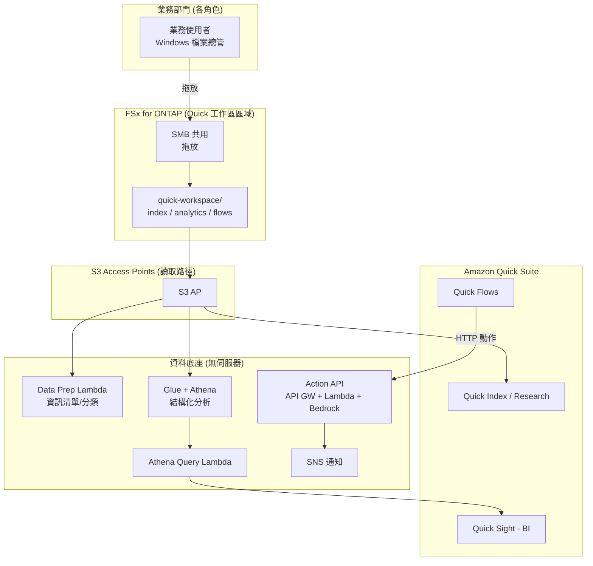

# Amazon Quick Agentic Workspace over FSx for ONTAP

🌐 **Language / 言語**: [日本語](README.md) | [English](README.en.md) | [한국어](README.ko.md) | [简体中文](README.zh-CN.md) | [繁體中文](README.zh-TW.md) | [Français](README.fr.md) | [Deutsch](README.de.md) | [Español](README.es.md)

## 概述

一種將 Amazon FSx for NetApp ONTAP **經由 S3 Access Points** 用作 **Amazon Quick Suite**（代理型 AI 工作區）資料底座的模式。業務部門透過 Windows 檔案操作維護的資料，可從 Quick 的各項能力（Index / Sight / Flows / Research）中橫向運用。

與 UC29（[genai-kb-selfservice-curation](../genai-kb-selfservice-curation/)）聚焦於「向託管 Bedrock Knowledge Base 的自助投入」不同，本 UC30 聚焦於 **以 Amazon Quick Suite 為入口、整合非結構化檢索 / BI / 動作自動化的代理型工作區**。

> **Amazon Quick Suite**：2025 年 10 月公開。作為 Amazon Q Business 的演進形態，它基於內部資料回答問題，並執行儀表板產生、排程、產出物製作等「行動」的代理型助理。資訊 / 價格 / 支援的服務皆為 time-sensitive。最新資訊請參閱 [aws.amazon.com/quick](https://aws.amazon.com/quick/)。

## Quick 各能力與 FSx for ONTAP S3 AP 的對應

| Quick 能力 | 角色 | 資料類型（S3 AP 上） | 本 UC 的實作 |
|-----------|------|---------------------|-----------|
| **Quick Index** | 非結構化檔案的橫向檢索 / QA | `index/<role>/`（md/pdf/docx） | 將 S3 AP 連接為資料來源（讀取） |
| **Quick Research** | 深度調查報告產生 | `index/<role>/` | 同上 |
| **Quick Sight** | 結構化資料的 BI / 視覺化 | `analytics/<role>/`（csv） | 經由 Glue/Athena 分析（Athena Query Lambda） |
| **Quick Flows** | 動作自動化 | `flows/<role>/`（json） | Action API（API Gateway + Lambda + Bedrock） |

## 解決的課題

| 課題 | 本模式的解決方案 |
|------|-------------------|
| 業務資料被複製到 S3 造成雙重管理 | 用 S3 AP 將 FSx for ONTAP 的正本直接資料來源化 |
| 非結構化與結構化被割裂、無法橫向運用 | 將 Quick Index（檔案）與 Quick Sight（Athena）在同一工作區整合 |
| 得出「答案」卻無法轉化為行動 | 透過 Quick Flows → Action API 自動化從摘要產生到任務立案 |
| 各角色所需的資訊 / 分析不同 | 依角色 × 服務整理資料夾與資料來源 |
| 資料準備依賴專業技能 | Windows 檔案操作 + 無伺服器資料準備（Data Prep Lambda） |

## 架構



## 兩種營運情境 (示範)

與 UC29 一樣，可體驗依營運成熟度劃分的兩個階段。詳情請參閱 [示範指南](docs/demo-guide.md)。

| 情境 | 概述 | 核心操作 |
|---------|------|---------------|
| **A: 手動工作區體驗** | 在 Windows 放置資料，在 Quick 主控台手動體驗 Index 連接 / Quick Sight 資料集建立 / Quick Flows 執行 | 人工在 Quick UI 操作 |
| **B: 自動化** | 用無伺服器自動化資料準備（Data Prep）、BI 查詢（Athena Query）、動作（Action API），由 Quick Flows / Scheduler 驅動 | Lambda / API / Scheduler |

## 由 Web 檢索增強的簡報產生 (opt-in, NEW)

> 整合了在 AWS Summit NYC 2026 (2026-06-17) 上 GA 的 **AgentCore Web Search Tool**。

在 Action API 中新增動作 `generate_brief_with_web`。在內部脈絡之外，還產生由即時 Web 檢索結果增強的簡報。

```bash
curl -X POST https://<api-id>.execute-api.ap-northeast-1.amazonaws.com/prod/action \
  --aws-sigv4 "aws:amz:ap-northeast-1:execute-api" \
  -H "Content-Type: application/json" \
  -d '{
    "action": "generate_brief_with_web",
    "params": {
      "title": "2026 年 Q3 資料保護法規動向",
      "context": "內部正在實施符合 FISC 安全對策基準的營運...",
      "web_query": "data protection regulation 2026 Japan"
    }
  }'
```

| 動作 | 回答來源 | 讀取/寫入 |
|-----------|-----------|-----------------|
| `generate_brief` | 僅內部脈絡 | 唯讀 |
| `generate_brief_with_web` | 內部脈絡 + Web 檢索 | 唯讀 |

- 透過 `EnableWebSearch=true` + `AgentCoreGatewayId` 設定啟用
- Graceful degradation：Web 檢索失敗時與 `generate_brief` 行為等同
- 引用：在 `web_citations` 欄位傳回 URL + 標題 + 公開日期

詳情：[docs/investigations/agentcore-web-search-fsxn-integration.md](../../docs/investigations/agentcore-web-search-fsxn-integration.md)

## 角色 × 服務構成 (符合 Amazon Quick 設想角色)

角色是 Amazon Quick 面向的 **sales / marketing / IT / operations / finance / legal**（FAQ），再加上擁有專用頁面的 **developers**，共 7 個角色。資料依所用服務（Index / Sight / Flows）整理。

```
quick-workspace/                       ← AI 專用磁碟區（SMB 共用）
├── index/<role>/        … Quick Index / Research（非結構化 md）
├── analytics/<role>/    … Quick Sight（結構化 csv，經由 Athena）
└── flows/<role>/        … Quick Flows（動作 json）
```

| 角色 | Quick 設想（參考，time-sensitive） | 範例分析資料 |
|--------|--------------------------------|------------------|
| sales | Lead scoring / 預測 / CRM（[/quick/sales/](https://aws.amazon.com/quick/sales/)） | 管線（依 stage 金額） |
| marketing | 行銷活動、內容 | 行銷活動指標（CPL） |
| finance | 預算、費用、預測 | 預算 vs 實績 |
| information-technology | 事件、IT FAQ、安全（[/quick/information-technology/](https://aws.amazon.com/quick/information-technology/)） | 事件（MTTR） |
| operations | SOP、流程 | 輸送量、SLA |
| legal | 合約、法遵 | 合約登記冊 |
| developers | 規約、導入（[/quick/developers/](https://aws.amazon.com/quick/developers/)） | DORA 指標 |

各角色的**範例資料**隨附於 [`sample-data/quick-workspace/`](sample-data/)。本 UC 的角色構成與 **UC29** 一致，可共用 / 重用同一 AI 專用磁碟區。

## 目錄結構

```
genai-quick-agentic-workspace/
├── README.md / README.en.md 及其他 7 種語言
├── template.yaml                 # SAM: Action API / Athena / Data Prep / Quick 資料來源角色
├── samconfig.toml.example
├── functions/
│   ├── quick_action/handler.py   # Quick Flows 動作（摘要產生、任務立案，Bedrock）
│   ├── athena_query/handler.py   # Quick Sight BI 底座（Glue/Athena）
│   └── data_prep/handler.py      # 資料來源準備資訊清單
├── sample-data/quick-workspace/  # 依角色 × 服務的種子資料
│   ├── index/<role>/*.md
│   ├── analytics/<role>/*.csv
│   └── flows/<role>/*.json
├── tests/test_handlers.py
└── docs/
    ├── architecture.md
    └── demo-guide.md
```

> **部署前提**：Amazon Quick Suite 本體的資料來源連接（向 Quick Index 的 S3 AP 連接、Quick Sight 資料集建立）在 **Quick 主控台設定**。本範本提供支撐它的無伺服器資料底座（Action API / Athena 分析 / Data Prep / Quick 用 IAM 角色）。

## 安全設計

- **無資料移動**：檔案仍為 FSx for ONTAP 上的正本，經由 S3 AP 讀取
- **Action API 使用 IAM 認證（SigV4）**：不設為無認證的公開端點。在 Quick 側連接中設定憑證
- **最小權限**：Lambda 僅允許目標 S3 AP / Athena WorkGroup / 相應 Glue DB / Bedrock 模型
- **Quick 資料來源角色**：將信任主體參數化（預設為帳戶 root，建議限定為 Quick 連接用）
- **加密**：SSE-FSX（儲存）、SSE-S3/KMS（Athena 結果）、TLS（傳輸中）
- **稽核**：CloudTrail + ONTAP 稽核日誌 + Athena 查詢歷史

> **註記**：S3 AP 的資料來源邊界為磁碟區/前綴單位。若需要依使用者個人的可見範圍控制，請考慮自訂 Permission-aware RAG（[FC3](../genai-rag-enterprise-files/)）。

### 文件層級 ACL（Amazon Quick S3 知識庫）

Amazon Quick 的 **S3 知識庫支援文件/資料夾層級的 ACL**。可將機密文件限定為「允許閱覽的使用者/群組」，並透過與依角色資料夾（`index/<role>/`）組合，本 UC30 也可在 Quick 側實現**依使用者的可見範圍控制**。

- Quick Suite 的權限以 **account / role / user 三層**（user > role > account 的優先順序）管理
- 透過自訂權限設定檔也可進行功能單位（儀表板編輯等）的控制
- 詳情在 Quick 主控台設定（本範本範圍外）

> 出處為 AWS 官方部落格/文件（time-sensitive）。最新支援狀況請參閱 [aws.amazon.com/quick](https://aws.amazon.com/quick/)。

## Success Metrics

### Outcome
將在 Windows 維護的業務資料橫向連接到 Amazon Quick 的檢索 / BI / 動作，在一個工作區中完成從「提問」到「行動」的閉環。

| 指標 | 目標值（範例） |
|-----------|------------|
| Quick Index 連接資料來源數 | 7 個角色份 |
| Quick Sight 分析對象資料集數 | 依角色的結構化資料 |
| Quick Flows 動作成功率 | > 98% |
| 資料準備資訊清單更新 | 依排程執行（例 rate(1 hour)） |
| 業務使用者的操作 | Windows 檔案操作 + Quick UI |

### Measurement Method
Data Prep 資訊清單、Athena 查詢歷史、Action API（API Gateway / Lambda）指標、SNS 通知。

---

## Data Classification

| 輸出 | 分類 | 依據 |
|------|------|------|
| Action API 回應（generate_brief） | INTERNAL | 源資料衍生的摘要。不可對外公開 |
| Action API 回應（create_action_item / approve / execute） | INTERNAL | 業務操作記錄 |
| Athena 查詢結果（結果儲存貯體） | INTERNAL | 加密 + 30 天 lifecycle + TLS 強制。與 analytics/ 資料同級 |
| DynamoDB 核准儲存（ApprovalsTable） | INTERNAL | 核准狀態。operation / requested_by 等中繼資料 |
| SNS 通知訊息 | INTERNAL | 僅動作摘要。不包含檔案本體 |

> 在受監管行業還需要 CUI / FISC / HIPAA 分類。請擴充 `shared/data_classification.py`。
> 當 `ALLOW_RAW_SQL=false`（預設）時，Athena 僅執行允許清單查詢，因此資料分類的越界風險較低。

---

## AWS 文件連結

| 服務 | 文件 |
|---------|------------|
| Amazon Quick Suite | [產品頁](https://aws.amazon.com/quick/) / [使用者指南](https://docs.aws.amazon.com/quick/latest/userguide/) |
| Amazon Quick 使用者類型 | [user-types](https://docs.aws.amazon.com/quick/latest/userguide/user-types.html) |
| FSx for ONTAP S3 Access Points | [S3 AP 指南](https://docs.aws.amazon.com/fsx/latest/ONTAPGuide/s3-access-points.html) |
| Amazon Athena | [使用者指南](https://docs.aws.amazon.com/athena/latest/ug/what-is.html) |
| AWS Glue Data Catalog | [開發人員指南](https://docs.aws.amazon.com/glue/latest/dg/catalog-and-crawler.html) |
| Amazon Bedrock | [使用者指南](https://docs.aws.amazon.com/bedrock/latest/userguide/what-is-bedrock.html) |
| API Gateway IAM 認證 | [IAM 授權](https://docs.aws.amazon.com/apigateway/latest/developerguide/permissions.html) |

### Well-Architected Framework 對應

| 支柱 | 對應 |
|----|------|
| 卓越營運 | 資料準備的自動資訊清單、結構化日誌、通知 |
| 安全 | Action API 使用 IAM 認證、最小權限、無資料移動、加密 |
| 可靠性 | Athena 狀態監控、無伺服器冗餘 |
| 效能效率 | 基於 Athena 的結構化分析、Index 的託管檢索 |
| 成本最佳化 | 無伺服器按量計費、僅在需要時查詢/動作 |
| 永續性 | 隨需執行、活用託管服務 |

---

## 成本估算 (月度概算)

> **註記**：ap-northeast-1 的概算。實際費用隨使用量變動。請參閱 [AWS Pricing Calculator](https://calculator.aws/) 與 [Amazon Quick 價格](https://aws.amazon.com/quick/)（time-sensitive）。

| 服務 | 概算 |
|---------|------|
| Amazon Quick Suite | 依使用者/方案計費（另計，參閱 Quick 價格） |
| Lambda（3 個函數） | ~$1-5 |
| API Gateway | ~$1（依請求計量） |
| Athena | $5/TB scanned（小規模資料約 ~$0.5-2） |
| Glue Data Catalog | 多在免費額度內 |
| S3（Athena 結果） | ~$0.5 |
| Bedrock（摘要產生） | 依呼叫計量 ~$1-10 |
| SNS / CloudWatch Logs | ~$1 |
| FSx for ONTAP / S3 AP | 共用現有環境（S3 AP 無額外費用） |

> **Governance Caveat**：成本為概算而非保證值。Amazon Quick 本體的價格另計。

---

## 本地測試

```bash
python3 -m pytest tests/ -v
# 前提：需要 AWS SAM CLI。sam build 會自動封裝程式碼與共用層。
sam build
sam local invoke DataPrepFunction --event events/data-prep-event.json
```

---

## 輸出範例

### Quick Flows 動作 (任務立案)
```json
{
  "status": "completed",
  "action": "create_action_item",
  "item": {"id": "AI-1760000000", "title": "為 Acme Corp 協調 PoC 日程", "assignee": "sales-a", "status": "open"}
}
```

### Athena Query (Quick Sight BI 底座)
```json
{
  "status": "completed",
  "columns": ["stage", "deals", "total_jpy"],
  "rows": [["Negotiation", "2", "3360000"], ["ClosedWon", "1", "1920000"]],
  "row_count": 2
}
```

### Data Prep 資訊清單
```json
{
  "status": "completed",
  "total_objects": 21,
  "by_service": {"index": 7, "analytics": 7, "flows": 7, "other": 0},
  "by_role": {"sales": 3, "marketing": 3, "finance": 3, "information-technology": 3, "operations": 3, "legal": 3, "developers": 3}
}
```

> **註記**：範例輸出。數值 / 價格為 sizing reference / time-sensitive，而非 service limit。

---

## Performance Considerations

- FSx for ONTAP 的輸送量在 NFS/SMB/S3AP 間共用。SMB 寫入與 Quick 的讀取共用同一容量
- 經由 S3 AP 的延遲有數十毫秒的額外負擔
- Athena 依 scanned 資料量計費。大規模時請考慮分割/壓縮（Parquet）
- Action API 必須 IAM 認證。請進行 Quick 連接的限流設計

---

## 相關 UC / 連結

| 相關 | 要點 |
|------|---------|
| [PoC 前提條件檢查清單](docs/poc-checklist.md) | Quick 啟用、Glue/LF、推論設定檔等 |
| [Amazon Quick 主控台設定步驟](docs/quick-console-setup.md) | Index/Sight/Flows 連接（含截圖取得指引） |
| [Lake Formation TBAC 筆記](docs/lake-formation-tbac.md) | 依角色的資料可見性（LF-TBAC + Quick RLS） |
| [Glue 資料表建立指令碼](scripts/create_glue_tables.sh) | Quick Sight/Athena 用 DDL（建議 Parquet 化） |
| [清理 runbook](../docs/uc29-uc30-cleanup-runbook.md) | 含手動產出物的拆除步驟（2UC 通用） |
| [UC29 genai-kb-selfservice-curation](../genai-kb-selfservice-curation/) | 向託管 Bedrock KB 的自助投入（相同角色構成） |
| [FC3 genai-rag-enterprise-files](../genai-rag-enterprise-files/) | 需要嚴格權限過濾的自訂 RAG |
| [產業 / 工作負載對應](../docs/industry-workload-mapping.md) | UC 選擇指南 |

## 營運強化 (已實作)

- **Quick Flows 高風險操作的 human-in-the-loop**：`request_approval` 不立即執行，而是等待核准（`pending_approval`）+ SNS 通知
- **Action API 使用 IAM 認證（SigV4）**：不設為未認證的公開端點
- **BI 最佳化**：大規模時將 analytics 做成 Parquet + 分割（減少 Athena scanned）

---

## 部署

使用 AWS SAM CLI 部署（請將預留位置替換為您的環境）：

```bash
# 前提：需要 AWS SAM CLI。sam build 會自動封裝程式碼與共用層。
sam build

sam deploy \
  --stack-name fsxn-quick-agentic-workspace \
  --parameter-overrides \
    S3AccessPointAlias=<your-s3ap-alias> \
    S3AccessPointName=<your-s3ap-name> \
    NotificationEmail=<your-email@example.com> \
  --capabilities CAPABILITY_NAMED_IAM \
  --resolve-s3 \
  --region <your-region>
```

> **注意**：`template.yaml` 用於 SAM CLI（`sam build` + `sam deploy`）。
> 若用 `aws cloudformation deploy` 命令直接部署，請改用 `template-deploy.yaml`（需要事先封裝 Lambda zip 檔案並上傳到 S3）。

> **Amazon Quick 設定**：Index 連接 / 資料集建立 / Flows 執行不在本範本範圍內。請在部署後於 Amazon Quick 主控台設定（參閱 [quick-console-setup](docs/quick-console-setup.md)）。

## Governance Note

> 本模式提供技術架構指導。並非法律 / 法遵 / 監管方面的建議。
> Amazon Quick 的功能 / 價格 / 支援區域會變更，最新資訊請確認官方資訊。
> S3 AP 的資料來源邊界為磁碟區/前綴單位，依使用者個人的可見範圍控制不在本 UC 範圍內。
