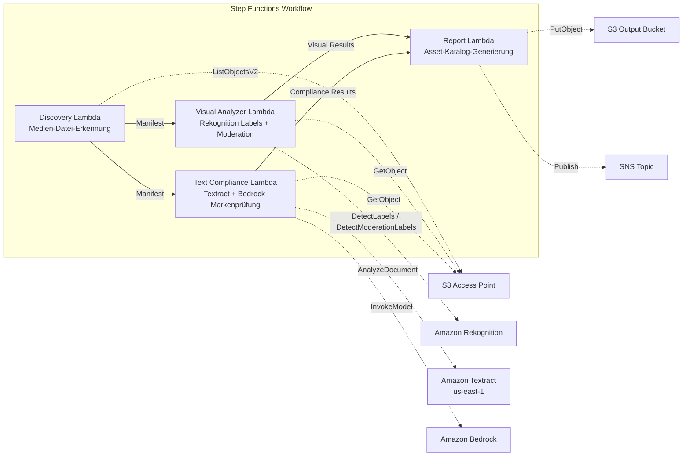

# UC19: Werbung & Marketing / Creative-Asset-Management — Asset-Katalogisierung und Markenkonformitätsprüfung

🌐 **Language / 言語**: [日本語](README.md) | [English](README.en.md) | [한국어](README.ko.md) | [简体中文](README.zh-CN.md) | [繁體中文](README.zh-TW.md) | [Français](README.fr.md) | Deutsch | [Español](README.es.md)

📚 **Dokumentation**: [Architekturdiagramm](docs/architecture.de.md) | [Demo-Leitfaden](docs/demo-guide.de.md)

## Überblick

Ein serverloser Workflow, der die S3 Access Points von FSx for ONTAP nutzt, um die automatische Katalogisierung von Werbe-Creative-Assets (Bilder und Videos), die visuelle Analyse, die Textkonformitätsprüfung und die Validierung der Einhaltung von Markenrichtlinien zu realisieren.

### Wann dieses Muster geeignet ist

- Creative-Assets (JPEG, PNG, TIFF, MP4, MOV, PSD) sind auf FSx for ONTAP angesammelt
- Sie möchten eine Rekognition-basierte Extraktion visueller Metadaten (Labels, Texterkennung, Moderation) durchführen
- Sie möchten die Prüfung der Markenterminologie-Konformität von Text-Overlays über Textract + Bedrock automatisieren
- Sie möchten einen Asset-Katalog (JSON/CSV) automatisch generieren und den Konformitätsstatus zentral verwalten
- Sie möchten Assets mit Moderationsverstößen automatisch kennzeichnen und in einen Human-Review-Workflow einbinden

### Wann dieses Muster nicht geeignet ist

- Eine Echtzeit-Video-Streaming-Prüfung ist erforderlich (Reaktionsfähigkeit im Sekundenbereich)
- Eine vollständige DAM-Plattform (Digital Asset Management) ist erforderlich
- Eine umfangreiche Video-Bearbeitungs-/Rendering-Pipeline ist erforderlich
- Eine Umgebung, in der die Netzwerkerreichbarkeit der ONTAP REST API nicht sichergestellt werden kann

### Hauptfunktionen

- Automatische Erkennung von Creative-Assets (JPEG/PNG/TIFF/MP4/MOV/PSD) über S3 AP
- Label-Extraktion mit Rekognition (bis zu 50 Tags/Asset) + Moderationsprüfung
- Text-Overlay-Extraktion mit Textract
- Prüfung der Markenterminologie-Richtlinienkonformität mit Bedrock
- Asset-Katalog-Generierung (JSON + CSV, ein Datensatz pro Asset)
- Automatische Kennzeichnung von Moderationsverstößen („requires-review")

## Success Metrics

### Outcome
Automatisierung der Creative-Asset-Katalogisierung und der Markenkonformitätsprüfung, um die Qualitätskontrolle in Werbeproduktions-Workflows zu optimieren.

### Metrics
| Metrik | Zielwert (Beispiel) |
|-----------|------------|
| Verarbeitete Assets / Ausführung | > 100 assets |
| Genauigkeit der Konformitätsprüfung | > 95% |
| Moderations-Erkennungsrate | > 98% |
| Berichtsgenerierungszeit | < 3 Min. / Batch |
| Kosten / tägliche Ausführung | < $2.00 |
| Erforderliche Human-Review-Rate | > 10% (alle moderationsgekennzeichneten Assets werden geprüft) |

### Measurement Method
Step-Functions-Ausführungsverlauf, Rekognition-Label-/Moderationsergebnisse, Textract-Extraktionsergebnisse, Bedrock-Markenprüfungs-Inferenzprotokolle, CloudWatch EMF Metrics (ProcessingDuration, SuccessCount, ErrorCount).

### Human Review Requirements
- Assets mit Moderationsverstößen (confidence ≥ 80%) werden als „requires-review" gekennzeichnet und von einem Menschen bestätigt
- Assets, die nicht den Markenrichtlinien entsprechen, werden vom Marketing-Team geprüft
- Monatliche Konformitätsberichte werden vom Creative Director geprüft

## Architektur



### Workflow-Schritte

1. **Discovery**: Erkennung von Creative-Asset-Dateien aus dem S3 AP (Format- + Größenfilter)
2. **Visual Analyzer**: Label-Extraktion mit Rekognition (bis zu 50 Tags) + Moderationsprüfung
3. **Text Compliance**: Extraktion von Text-Overlays mit Textract → Prüfung der Markenrichtlinienkonformität mit Bedrock
4. **Report**: Asset-Katalog-Generierung (JSON + CSV) + Moderationsverstoß-Kennzeichnungen + SNS-Benachrichtigung

## Voraussetzungen

> **Hinweis zu S3 AP NetworkOrigin**: Die Discovery Lambda wird innerhalb einer VPC bereitgestellt. Wenn der NetworkOrigin des S3 Access Point `Internet` ist, kann der Zugriff nicht über einen S3 Gateway VPC Endpoint erfolgen (da Anfragen nicht an die FSx-Datenebene geroutet werden). Verwenden Sie einen S3 AP mit NetworkOrigin=VPC oder konfigurieren Sie den Zugriff über eine NAT Gateway. Weitere Details siehe [S3AP Compatibility Notes](../docs/s3ap-compatibility-notes.md).

- Ein AWS-Konto und geeignete IAM-Berechtigungen
- FSx for ONTAP-Dateisystem (ONTAP 9.17.1P4D3 oder höher)
- Ein Volume mit aktiviertem S3 Access Point (das Creative-Assets speichert)
- VPC und private Subnetze
- Amazon Bedrock-Modellzugriff aktiviert (Claude / Nova)
- Eine Region, in der Amazon Rekognition verfügbar ist
- Amazon Textract verfügbar (verwendet regionsübergreifenden Aufruf nach us-east-1)

## Bereitstellungsverfahren

### 1. Überprüfung der Parameter

Überprüfen Sie im Voraus die JSON-Datei der Markenrichtlinien und den Moderationsschwellenwert.

### 2. SAM-Bereitstellung

```bash
# Voraussetzung: AWS SAM CLI ist erforderlich. „sam build" packt den Code und die Shared Layer automatisch.
sam build

sam deploy \
  --stack-name fsxn-adtech-creative \
  --parameter-overrides \
    S3AccessPointAlias=<your-volume-ext-s3alias> \
    S3AccessPointName=<your-s3ap-name> \
    VpcId=<your-vpc-id> \
    PrivateSubnetIds=<subnet-1>,<subnet-2> \
    ScheduleExpression="cron(0 0 * * ? *)" \
    NotificationEmail=<your-email@example.com> \
    BrandGuidelinesS3Key=brand-guidelines.json \
    ModerationConfidenceThreshold=80 \
    MaxTagsPerAsset=50 \
    EnableVpcEndpoints=false \
    EnableCloudWatchAlarms=false \
  --capabilities CAPABILITY_NAMED_IAM \
  --resolve-s3 \
  --region ap-northeast-1
```

> **Hinweis**: `template.yaml` wird mit dem SAM CLI (`sam build` + `sam deploy`) verwendet.
> Um direkt mit dem Befehl `aws cloudformation deploy` bereitzustellen, verwenden Sie `template-deploy.yaml` (was das Vorab-Packen der Lambda-Zip-Dateien und das Hochladen nach S3 erfordert).

## Liste der Konfigurationsparameter

| Parameter | Beschreibung | Standard | Erforderlich |
|-----------|------|----------|------|
| `S3AccessPointAlias` | FSx for ONTAP S3 AP Alias (für Eingabe) | — | ✅ |
| `S3AccessPointName` | S3 AP-Name (für ARN-basierte IAM-Berechtigungsvergabe) | `""` | ⚠️ Empfohlen |
| `ScheduleExpression` | EventBridge Scheduler-Zeitplanausdruck | `cron(0 0 * * ? *)` | |
| `VpcId` | VPC ID | — | ✅ |
| `PrivateSubnetIds` | Liste der privaten Subnetz-IDs | — | ✅ |
| `NotificationEmail` | SNS-Benachrichtigungs-E-Mail-Adresse | — | ✅ |
| `BrandGuidelinesS3Key` | S3-Schlüssel der JSON-Datei mit den Markenterminologie-Richtlinien | — | ✅ |
| `ModerationConfidenceThreshold` | Moderations-Konfidenzschwellenwert (%) | `80` | |
| `MaxTagsPerAsset` | Maximale Anzahl von Tags pro Asset | `50` | |
| `MapConcurrency` | Anzahl paralleler Ausführungen des Map-States | `10` | |
| `LambdaMemorySize` | Lambda-Speichergröße (MB) | `512` | |
| `LambdaTimeout` | Lambda-Timeout (Sekunden) | `300` | |
| `EnableVpcEndpoints` | Interface VPC Endpoints aktivieren | `false` | |
| `EnableCloudWatchAlarms` | CloudWatch Alarms aktivieren | `false` | |

## ⚠️ Hinweise zur Leistung

- Die Durchsatzkapazität von FSx for ONTAP wird **über NFS/SMB/S3 AP hinweg gemeinsam genutzt**. Bei paralleler Verarbeitung mit MapConcurrency=10 kann dies andere Workloads auf demselben Volume beeinträchtigen.
- Prüfen Sie bei der Stapelverarbeitung einer großen Anzahl von Dateien die Throughput Capacity (MBps) von FSx for ONTAP und passen Sie MapConcurrency nach Bedarf an.
- Empfehlung: Beginnen Sie in der Produktionsumgebung zunächst mit MapConcurrency=5 und erhöhen Sie schrittweise, während Sie die CloudWatch-Metrik von FSx for ONTAP (ThroughputUtilization) überwachen.

## Bereinigung

```bash
aws s3 rm s3://fsxn-adtech-creative-output-${AWS_ACCOUNT_ID} --recursive

aws cloudformation delete-stack \
  --stack-name fsxn-adtech-creative \
  --region ap-northeast-1

aws cloudformation wait stack-delete-complete \
  --stack-name fsxn-adtech-creative \
  --region ap-northeast-1
```

## Supported Regions

UC19 verwendet die folgenden Services:

| Service | Regionsbeschränkung |
|---------|-------------|
| Amazon Rekognition | Unterstützte Regionen prüfen ([Von Rekognition unterstützte Regionen](https://docs.aws.amazon.com/general/latest/gr/rekognition.html)) |
| Amazon Textract | us-east-1 (regionsübergreifender Aufruf) |
| Amazon Bedrock | Unterstützte Regionen prüfen ([Von Bedrock unterstützte Regionen](https://docs.aws.amazon.com/general/latest/gr/bedrock.html)) |
| AWS X-Ray | In nahezu allen Regionen verfügbar |
| CloudWatch EMF | In nahezu allen Regionen verfügbar |

> UC19 verwendet regionsübergreifenden Aufruf (us-east-1) für Textract. Dies wird in shared/cross_region_client.py transparent gehandhabt.

## Referenzlinks

- [FSx for ONTAP S3 Access Points Überblick](https://docs.aws.amazon.com/fsx/latest/ONTAPGuide/accessing-data-via-s3-access-points.html)
- [Amazon Rekognition-Dokumentation](https://docs.aws.amazon.com/rekognition/latest/dg/what-is.html)
- [Amazon Textract-Dokumentation](https://docs.aws.amazon.com/textract/latest/dg/what-is.html)
- [Amazon Bedrock API-Referenz](https://docs.aws.amazon.com/bedrock/latest/APIReference/API_runtime_InvokeModel.html)

---

## AWS-Dokumentationslinks

| Service | Dokumentation |
|---------|------------|
| FSx for ONTAP | [Benutzerhandbuch](https://docs.aws.amazon.com/fsx/latest/ONTAPGuide/what-is-fsx-ontap.html) |
| S3 Access Points | [S3 AP for FSx for ONTAP](https://docs.aws.amazon.com/fsx/latest/ONTAPGuide/s3-access-points.html) |
| Step Functions | [Entwicklerhandbuch](https://docs.aws.amazon.com/step-functions/latest/dg/welcome.html) |
| Amazon Rekognition | [Entwicklerhandbuch](https://docs.aws.amazon.com/rekognition/latest/dg/what-is.html) |
| Amazon Textract | [Entwicklerhandbuch](https://docs.aws.amazon.com/textract/latest/dg/what-is.html) |
| Amazon Bedrock | [Benutzerhandbuch](https://docs.aws.amazon.com/bedrock/latest/userguide/what-is-bedrock.html) |

### Well-Architected Framework-Konformität

| Säule | Konformität |
|----|------|
| Operative Exzellenz | X-Ray-Tracing, EMF-Metriken, Konformitätsüberwachung |
| Sicherheit | IAM mit geringsten Rechten, KMS-Verschlüsselung, Asset-Zugriffskontrolle |
| Zuverlässigkeit | Step Functions Retry/Catch, exponential backoff (3 Wiederholungen) |
| Leistungseffizienz | Parallele Bildverarbeitung, regionsübergreifendes Textract |
| Kostenoptimierung | Serverless, Rekognition nutzungsbasierte Abrechnung |
| Nachhaltigkeit | On-Demand-Ausführung, inkrementelle Verarbeitung |

---

## Kostenschätzung (ungefähre monatliche Kosten)

> **Anmerkung**: Die folgenden Werte sind Näherungen für die Region ap-northeast-1; die tatsächlichen Kosten variieren je nach Nutzung. Prüfen Sie die aktuellen Preise im [AWS Pricing Calculator](https://calculator.aws/).

### Serverlose Komponenten (nutzungsbasierte Abrechnung)

| Service | Stückpreis | Angenommene Nutzung | Ungefähr monatlich |
|---------|------|-----------|---------|
| Lambda | $0.0000166667/GB-sec | 4 Funktionen × tägliche Ausführung | ~$1-3 |
| S3 API (GetObject/ListObjects) | $0.0047/10K requests | ~3K requests/Tag | ~$0.45 |
| Step Functions | $0.025/1K state transitions | ~400 transitions/Tag | ~$0.30 |
| Rekognition (DetectLabels) | $0.001/image | ~100 images/Tag | ~$3.00 |
| Rekognition (DetectModerationLabels) | $0.001/image | ~100 images/Tag | ~$3.00 |
| Textract (AnalyzeDocument) | $0.015/page | ~50 pages/Tag | ~$0.75 |
| Bedrock (Nova Lite) | $0.00006/1K input tokens | ~20K tokens/Ausführung | ~$1-3 |
| SNS | $0.50/100K notifications | ~10 notifications/Tag | ~$0.05 |
| CloudWatch Logs | $0.76/GB ingested | ~300 MB/Monat | ~$0.23 |

### Fixkosten (FSx for ONTAP — bestehende Umgebung vorausgesetzt)

| Komponente | Monatlich |
|--------------|------|
| FSx for ONTAP (128 MBps, 1 TB) | ~$230 (gemeinsam genutzte bestehende Umgebung) |
| S3 Access Point | Keine zusätzlichen Gebühren (nur S3 API-Gebühren) |

### Gesamtschätzung

| Konfiguration | Ungefähr monatlich |
|------|---------|
| Minimalkonfiguration (1× täglich, ~50 Assets) | ~$5-10 |
| Standardkonfiguration (täglich + Alarme aktiviert, ~200 Assets) | ~$15-35 |
| Großkonfiguration (hohe Frequenz + viele Assets) | ~$50-150 |

> **Governance Caveat**: Kostenschätzungen sind Näherungen, keine garantierten Werte. Die tatsächliche Abrechnung variiert je nach Nutzungsmuster, Datenvolumen und Region.

---

## Lokale Tests

### Prerequisites-Prüfung

```bash
# Überprüfung der Voraussetzungen
aws --version          # AWS CLI v2
sam --version          # SAM CLI
python3 --version      # Python 3.9+
docker --version       # Docker (für sam local)
aws sts get-caller-identity  # AWS-Anmeldeinformationen
```

### sam local invoke

```bash
# Build
# Voraussetzung: AWS SAM CLI ist erforderlich. „sam build" packt den Code und die Shared Layer automatisch.
sam build

# Lokale Ausführung der Discovery Lambda
sam local invoke DiscoveryFunction --event events/discovery-event.json

# Mit Überschreibung von Umgebungsvariablen
sam local invoke DiscoveryFunction \
  --event events/discovery-event.json \
  --env-vars env.json
```

### Unit-Tests

```bash
python3 -m pytest tests/ -v
```

Weitere Details siehe [Schnellstart für lokale Tests](../docs/local-testing-quick-start.md).

---

## Governance Note

> Dieses Muster bietet technische Architekturleitlinien. Es stellt keine rechtliche, Compliance- oder regulatorische Beratung dar. Organisationen sollten qualifizierte Fachleute konsultieren. Die Konformitätsprüfung von Werbe-Creatives ist KI-gestützt; die endgültigen Entscheidungen müssen von Menschen getroffen werden. Die Einhaltung branchenspezifischer Werbevorschriften (Arzneimittel- und Medizinproduktegesetz, Gesetz gegen unzulässige Prämien und irreführende Darstellungen usw.) erfordert eine gesonderte Überprüfung.

> **Zugehörige Vorschriften**: 景品表示法 (Gesetz gegen unzulässige Prämien und irreführende Darstellungen), 個人情報保護法 (Gesetz zum Schutz personenbezogener Daten)

---

## S3AP Compatibility

Siehe [S3AP Compatibility Notes](../docs/s3ap-compatibility-notes.md) für die Kompatibilitätsbeschränkungen, Fehlerbehebung und Trigger-Muster der S3 Access Points for FSx for ONTAP.
