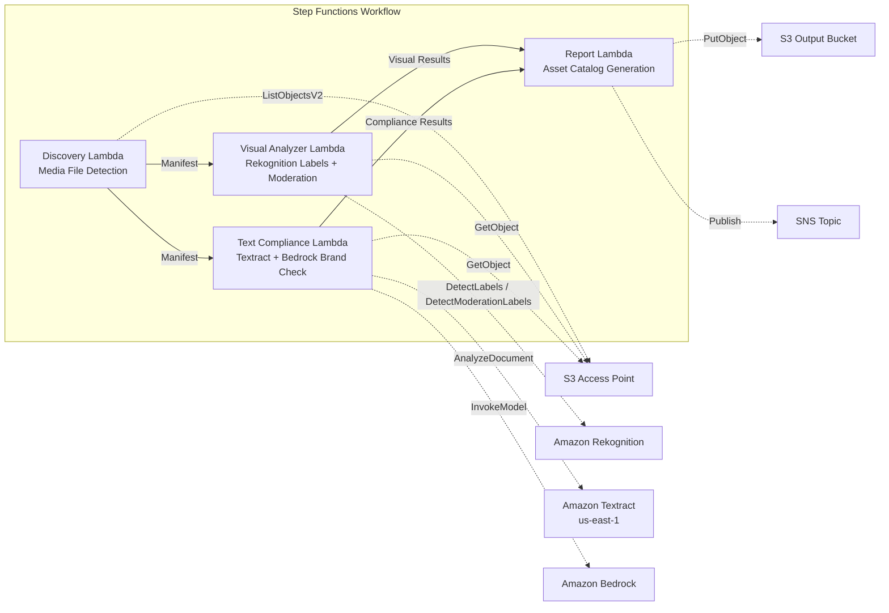

# UC19: Advertising & Marketing / Creative Asset Management — Asset Cataloging and Brand Compliance Check

🌐 **Language / 言語**: [日本語](README.md) | English | [한국어](README.ko.md) | [简体中文](README.zh-CN.md) | [繁體中文](README.zh-TW.md) | [Français](README.fr.md) | [Deutsch](README.de.md) | [Español](README.es.md)

📚 **Documentation**: [Architecture Diagram](docs/architecture.en.md) | [Demo Guide](docs/demo-guide.en.md)

## Overview

A serverless workflow that leverages S3 Access Points on FSx for ONTAP to automate the cataloging of advertising creative assets (images and videos), visual analysis, text compliance checking, and brand guideline conformance validation.

### When This Pattern Is Suitable

- Creative assets (JPEG, PNG, TIFF, MP4, MOV, PSD) are accumulated on FSx for ONTAP
- You want to perform Rekognition-based visual metadata extraction (labels, text detection, moderation)
- You want to automate brand terminology compliance checking of text overlays via Textract + Bedrock
- You want to auto-generate an asset catalog (JSON/CSV) and manage compliance status centrally
- You want to automatically flag moderation-violating assets and integrate them into a human review workflow

### When This Pattern Is Not Suitable

- Real-time video streaming review is required (second-level responsiveness)
- A full DAM (Digital Asset Management) platform is required
- A large-scale video editing/rendering pipeline is required
- An environment where network reachability to the ONTAP REST API cannot be ensured

### Main Features

- Automatic detection of creative assets (JPEG/PNG/TIFF/MP4/MOV/PSD) via S3 AP
- Rekognition label extraction (up to 50 tags/asset) + moderation inspection
- Textract text overlay extraction
- Bedrock brand terminology guideline compliance checking
- Asset catalog generation (JSON + CSV, one record per asset)
- Automatic flagging of moderation violations ("requires-review")

## Success Metrics

### Outcome
Automate creative asset cataloging and brand compliance checking to streamline quality control in advertising production workflows.

### Metrics
| Metric | Target Value (Example) |
|-----------|------------|
| Assets processed / execution | > 100 assets |
| Compliance check accuracy | > 95% |
| Moderation detection rate | > 98% |
| Report generation time | < 3 min / batch |
| Cost / daily execution | < $2.00 |
| Human Review required rate | > 10% (all moderation-flagged assets are reviewed) |

### Measurement Method
Step Functions execution history, Rekognition label/moderation results, Textract extraction results, Bedrock brand check inference logs, CloudWatch EMF Metrics (ProcessingDuration, SuccessCount, ErrorCount).

### Human Review Requirements
- Assets with moderation violations (confidence ≥ 80%) are flagged as "requires-review" and confirmed by a human
- Brand guideline non-compliant assets are reviewed by the marketing team
- Monthly compliance reports are reviewed by the creative director

## Architecture



### Workflow Steps

1. **Discovery**: Detect creative asset files from the S3 AP (format + size filters)
2. **Visual Analyzer**: Rekognition label extraction (up to 50 tags) + moderation inspection
3. **Text Compliance**: Extract text overlays with Textract → check brand guideline compliance with Bedrock
4. **Report**: Asset catalog generation (JSON + CSV) + moderation violation flags + SNS notification

## Prerequisites

> **S3 AP NetworkOrigin Note**: The Discovery Lambda is deployed inside a VPC. If the S3 Access Point's NetworkOrigin is `Internet`, it cannot be accessed via an S3 Gateway VPC Endpoint (because requests are not routed to the FSx data plane). Use an S3 AP with NetworkOrigin=VPC, or configure access via a NAT Gateway. See [S3AP Compatibility Notes](../docs/s3ap-compatibility-notes.md) for details.

- An AWS account and appropriate IAM permissions
- FSx for ONTAP file system (ONTAP 9.17.1P4D3 or later)
- A volume with S3 Access Point enabled (storing creative assets)
- VPC and private subnets
- Amazon Bedrock model access enabled (Claude / Nova)
- A region where Amazon Rekognition is available
- Amazon Textract available (uses cross-region invocation to us-east-1)

## Deployment

### 1. Review Parameters

Review the brand guidelines JSON file and moderation threshold in advance.

### 2. SAM Deploy

```bash
# Prerequisite: AWS SAM CLI is required. 'sam build' packages the code and shared layer automatically.
sam build

sam deploy \
  --stack-name fsxn-adtech-creative \
  --parameter-overrides \
    S3AccessPointAlias=<your-volume-ext-s3alias> \
    S3AccessPointName=<your-s3ap-name> \
    VpcId=<your-vpc-id> \
    PrivateSubnetIds=<subnet-1>,<subnet-2> \
    ScheduleExpression="cron(0 0 * * ? *)" \
    NotificationEmail=<your-email@example.com> \
    BrandGuidelinesS3Key=brand-guidelines.json \
    ModerationConfidenceThreshold=80 \
    MaxTagsPerAsset=50 \
    EnableVpcEndpoints=false \
    EnableCloudWatchAlarms=false \
  --capabilities CAPABILITY_NAMED_IAM \
  --resolve-s3 \
  --region ap-northeast-1
```

> **Note**: `template.yaml` is used with the SAM CLI (`sam build` + `sam deploy`).
> To deploy directly with the `aws cloudformation deploy` command, use `template-deploy.yaml` (which requires pre-packaging the Lambda zip files and uploading them to S3).

## Configuration Parameters

| Parameter | Description | Default | Required |
|-----------|------|----------|------|
| `S3AccessPointAlias` | FSx for ONTAP S3 AP Alias (for input) | — | ✅ |
| `S3AccessPointName` | S3 AP name (for ARN-based IAM permission grants) | `""` | ⚠️ Recommended |
| `ScheduleExpression` | EventBridge Scheduler schedule expression | `cron(0 0 * * ? *)` | |
| `VpcId` | VPC ID | — | ✅ |
| `PrivateSubnetIds` | List of private subnet IDs | — | ✅ |
| `NotificationEmail` | SNS notification email address | — | ✅ |
| `BrandGuidelinesS3Key` | S3 key of the brand terminology guidelines JSON file | — | ✅ |
| `ModerationConfidenceThreshold` | Moderation confidence threshold (%) | `80` | |
| `MaxTagsPerAsset` | Maximum number of tags per asset | `50` | |
| `MapConcurrency` | Number of parallel executions for the Map state | `10` | |
| `LambdaMemorySize` | Lambda memory size (MB) | `512` | |
| `LambdaTimeout` | Lambda timeout (seconds) | `300` | |
| `EnableVpcEndpoints` | Enable Interface VPC Endpoints | `false` | |
| `EnableCloudWatchAlarms` | Enable CloudWatch Alarms | `false` | |

## ⚠️ Performance Considerations

- FSx for ONTAP throughput capacity is **shared across NFS/SMB/S3 AP**. When processing in parallel with MapConcurrency=10, it may impact other workloads on the same volume.
- When bulk-processing a large number of files, check the FSx for ONTAP Throughput Capacity (MBps) and adjust MapConcurrency as needed.
- Recommended: In production, start with MapConcurrency=5 and increase gradually while monitoring the FSx for ONTAP CloudWatch metric (ThroughputUtilization).

## Cleanup

```bash
aws s3 rm s3://fsxn-adtech-creative-output-${AWS_ACCOUNT_ID} --recursive

aws cloudformation delete-stack \
  --stack-name fsxn-adtech-creative \
  --region ap-northeast-1

aws cloudformation wait stack-delete-complete \
  --stack-name fsxn-adtech-creative \
  --region ap-northeast-1
```

## Supported Regions

UC19 uses the following services:

| Service | Region Constraint |
|---------|-------------|
| Amazon Rekognition | Check supported regions ([Rekognition supported regions](https://docs.aws.amazon.com/general/latest/gr/rekognition.html)) |
| Amazon Textract | us-east-1 (cross-region invocation) |
| Amazon Bedrock | Check supported regions ([Bedrock supported regions](https://docs.aws.amazon.com/general/latest/gr/bedrock.html)) |
| AWS X-Ray | Available in nearly all regions |
| CloudWatch EMF | Available in nearly all regions |

> UC19 uses cross-region invocation (us-east-1) for Textract. This is handled transparently in shared/cross_region_client.py.

## Reference Links

- [FSx for ONTAP S3 Access Points overview](https://docs.aws.amazon.com/fsx/latest/ONTAPGuide/accessing-data-via-s3-access-points.html)
- [Amazon Rekognition documentation](https://docs.aws.amazon.com/rekognition/latest/dg/what-is.html)
- [Amazon Textract documentation](https://docs.aws.amazon.com/textract/latest/dg/what-is.html)
- [Amazon Bedrock API reference](https://docs.aws.amazon.com/bedrock/latest/APIReference/API_runtime_InvokeModel.html)

---

## AWS Documentation Links

| Service | Documentation |
|---------|------------|
| FSx for ONTAP | [User Guide](https://docs.aws.amazon.com/fsx/latest/ONTAPGuide/what-is-fsx-ontap.html) |
| S3 Access Points | [S3 AP for FSx for ONTAP](https://docs.aws.amazon.com/fsx/latest/ONTAPGuide/s3-access-points.html) |
| Step Functions | [Developer Guide](https://docs.aws.amazon.com/step-functions/latest/dg/welcome.html) |
| Amazon Rekognition | [Developer Guide](https://docs.aws.amazon.com/rekognition/latest/dg/what-is.html) |
| Amazon Textract | [Developer Guide](https://docs.aws.amazon.com/textract/latest/dg/what-is.html) |
| Amazon Bedrock | [User Guide](https://docs.aws.amazon.com/bedrock/latest/userguide/what-is-bedrock.html) |

### Well-Architected Framework Alignment

| Pillar | Alignment |
|----|------|
| Operational Excellence | X-Ray tracing, EMF metrics, compliance monitoring |
| Security | Least-privilege IAM, KMS encryption, asset access control |
| Reliability | Step Functions Retry/Catch, exponential backoff (3 retries) |
| Performance Efficiency | Parallel image processing, cross-region Textract |
| Cost Optimization | Serverless, Rekognition pay-per-use |
| Sustainability | On-demand execution, incremental processing |

---

## Cost Estimate (Approximate Monthly)

> **Note**: The following are approximations for the ap-northeast-1 region; actual costs vary with usage. Check the latest pricing in the [AWS Pricing Calculator](https://calculator.aws/).

### Serverless Components (Pay-per-use)

| Service | Unit Price | Assumed Usage | Approx. Monthly |
|---------|------|-----------|---------|
| Lambda | $0.0000166667/GB-sec | 4 functions × daily execution | ~$1-3 |
| S3 API (GetObject/ListObjects) | $0.0047/10K requests | ~3K requests/day | ~$0.45 |
| Step Functions | $0.025/1K state transitions | ~400 transitions/day | ~$0.30 |
| Rekognition (DetectLabels) | $0.001/image | ~100 images/day | ~$3.00 |
| Rekognition (DetectModerationLabels) | $0.001/image | ~100 images/day | ~$3.00 |
| Textract (AnalyzeDocument) | $0.015/page | ~50 pages/day | ~$0.75 |
| Bedrock (Nova Lite) | $0.00006/1K input tokens | ~20K tokens/execution | ~$1-3 |
| SNS | $0.50/100K notifications | ~10 notifications/day | ~$0.05 |
| CloudWatch Logs | $0.76/GB ingested | ~300 MB/month | ~$0.23 |

### Fixed Cost (FSx for ONTAP — assumes existing environment)

| Component | Monthly |
|--------------|------|
| FSx for ONTAP (128 MBps, 1 TB) | ~$230 (shared existing environment) |
| S3 Access Point | No additional charge (S3 API charges only) |

### Total Estimate

| Configuration | Approx. Monthly |
|------|---------|
| Minimal (once daily, ~50 assets) | ~$5-10 |
| Standard (daily + alarms enabled, ~200 assets) | ~$15-35 |
| Large-scale (high frequency + many assets) | ~$50-150 |

> **Governance Caveat**: Cost estimates are approximations, not guaranteed values. Actual billing varies with usage patterns, data volume, and region.

---

## Local Testing

### Prerequisites Check

```bash
# Verify prerequisites
aws --version          # AWS CLI v2
sam --version          # SAM CLI
python3 --version      # Python 3.9+
docker --version       # Docker (for sam local)
aws sts get-caller-identity  # AWS credentials
```

### sam local invoke

```bash
# Build
# Prerequisite: AWS SAM CLI is required. 'sam build' packages the code and shared layer automatically.
sam build

# Run the Discovery Lambda locally
sam local invoke DiscoveryFunction --event events/discovery-event.json

# With environment variable overrides
sam local invoke DiscoveryFunction \
  --event events/discovery-event.json \
  --env-vars env.json
```

### Unit Tests

```bash
python3 -m pytest tests/ -v
```

See [Local Testing Quick Start](../docs/local-testing-quick-start.md) for details.

---

## Governance Note

> This pattern provides technical architecture guidance. It does not constitute legal, compliance, or regulatory advice. Organizations should consult qualified professionals. Advertising creative compliance checking is AI-assisted; final decisions must be made by humans. Conformance with industry-specific advertising regulations (Pharmaceutical and Medical Device Act, Act against Unjustifiable Premiums and Misleading Representations, etc.) requires separate verification.

> **Related Regulations**: 景品表示法 (Act against Unjustifiable Premiums and Misleading Representations), 個人情報保護法 (Act on the Protection of Personal Information)

---

## S3AP Compatibility

See [S3AP Compatibility Notes](../docs/s3ap-compatibility-notes.md) for the compatibility constraints, troubleshooting, and trigger patterns of S3 Access Points for FSx for ONTAP.
