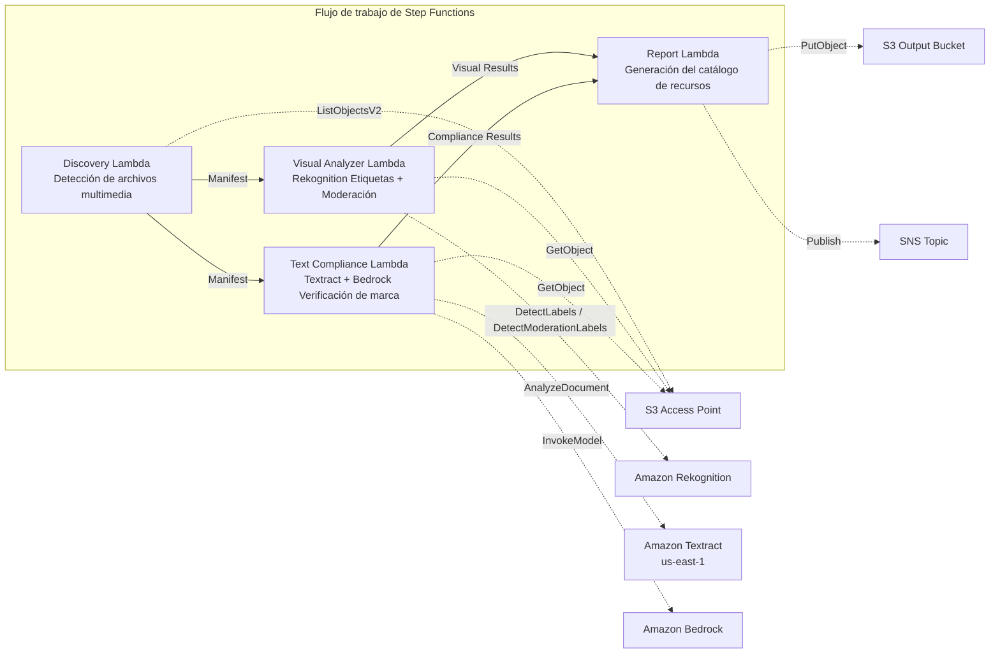

# UC19: Publicidad y Marketing / Gestión de recursos creativos — Catalogación de recursos y verificación de conformidad de marca

🌐 **Language / 言語**: [日本語](README.md) | [English](README.en.md) | [한국어](README.ko.md) | [简体中文](README.zh-CN.md) | [繁體中文](README.zh-TW.md) | [Français](README.fr.md) | [Deutsch](README.de.md) | Español

📚 **Documentación**: [Diagrama de arquitectura](docs/architecture.es.md) | [Guía de demostración](docs/demo-guide.es.md)

## Descripción general

Un flujo de trabajo serverless que aprovecha los S3 Access Points de FSx for ONTAP para realizar la catalogación automática de recursos creativos publicitarios (imágenes y vídeos), el análisis visual, la verificación de conformidad del texto y la validación del cumplimiento de las directrices de marca.

### Cuándo es adecuado este patrón

- Los recursos creativos (JPEG, PNG, TIFF, MP4, MOV, PSD) están acumulados en FSx for ONTAP
- Desea realizar la extracción de metadatos visuales con Rekognition (etiquetas, detección de texto, moderación)
- Desea automatizar la verificación de conformidad de la terminología de marca de las superposiciones de texto mediante Textract + Bedrock
- Desea generar automáticamente un catálogo de recursos (JSON/CSV) y gestionar el estado de conformidad de forma centralizada
- Desea marcar automáticamente los recursos que infringen la moderación e integrarlos en un flujo de trabajo de revisión humana

### Cuándo no es adecuado este patrón

- Se requiere una revisión de streaming de vídeo en tiempo real (capacidad de respuesta en segundos)
- Se requiere una plataforma DAM (Digital Asset Management) completa
- Se requiere una canalización de edición/renderizado de vídeo a gran escala
- Un entorno en el que no se puede garantizar la accesibilidad de red a la API REST de ONTAP

### Funciones principales

- Detección automática de recursos creativos (JPEG/PNG/TIFF/MP4/MOV/PSD) a través de S3 AP
- Extracción de etiquetas con Rekognition (hasta 50 etiquetas/recurso) + inspección de moderación
- Extracción de superposiciones de texto con Textract
- Verificación de conformidad de las directrices de terminología de marca con Bedrock
- Generación del catálogo de recursos (JSON + CSV, un registro por recurso)
- Marcado automático de infracciones de moderación («requires-review»)

## Success Metrics

### Outcome
Automatizar la catalogación de recursos creativos y la verificación de conformidad de marca para agilizar el control de calidad en los flujos de trabajo de producción publicitaria.

### Metrics
| Métrica | Valor objetivo (ejemplo) |
|-----------|------------|
| Recursos procesados / ejecución | > 100 assets |
| Precisión de la verificación de conformidad | > 95% |
| Tasa de detección de moderación | > 98% |
| Tiempo de generación del informe | < 3 min / lote |
| Coste / ejecución diaria | < $2.00 |
| Tasa de Human Review requerida | > 10% (todos los recursos marcados por moderación se revisan) |

### Measurement Method
Historial de ejecución de Step Functions, resultados de etiquetas/moderación de Rekognition, resultados de extracción de Textract, registros de inferencia de verificación de marca de Bedrock, CloudWatch EMF Metrics (ProcessingDuration, SuccessCount, ErrorCount).

### Human Review Requirements
- Los recursos con infracciones de moderación (confidence ≥ 80%) se marcan como «requires-review» y son confirmados por una persona
- Los recursos que no cumplen las directrices de marca son revisados por el equipo de marketing
- Los informes de conformidad mensuales son revisados por el director creativo

## Arquitectura



### Pasos del flujo de trabajo

1. **Discovery**: Detectar archivos de recursos creativos desde el S3 AP (filtros de formato + tamaño)
2. **Visual Analyzer**: Extracción de etiquetas con Rekognition (hasta 50 etiquetas) + inspección de moderación
3. **Text Compliance**: Extraer superposiciones de texto con Textract → verificar la conformidad de las directrices de marca con Bedrock
4. **Report**: Generación del catálogo de recursos (JSON + CSV) + indicadores de infracción de moderación + notificación SNS

## Requisitos previos

> **Nota sobre S3 AP NetworkOrigin**: La Discovery Lambda se despliega dentro de una VPC. Si el NetworkOrigin del S3 Access Point es `Internet`, no se puede acceder a través de un S3 Gateway VPC Endpoint (porque las solicitudes no se enrutan al plano de datos de FSx). Utilice un S3 AP con NetworkOrigin=VPC o configure el acceso a través de una NAT Gateway. Consulte [S3AP Compatibility Notes](../docs/s3ap-compatibility-notes.md) para más detalles.

- Una cuenta de AWS y permisos IAM adecuados
- Sistema de archivos FSx for ONTAP (ONTAP 9.17.1P4D3 o posterior)
- Un volumen con S3 Access Point habilitado (que almacena los recursos creativos)
- VPC y subredes privadas
- Acceso a modelos de Amazon Bedrock habilitado (Claude / Nova)
- Una región donde Amazon Rekognition esté disponible
- Amazon Textract disponible (usa llamada interregional a us-east-1)

## Procedimiento de despliegue

### 1. Verificación de parámetros

Verifique de antemano el archivo JSON de las directrices de marca y el umbral de moderación.

### 2. Despliegue con SAM

```bash
# Requisito previo: se necesita AWS SAM CLI. «sam build» empaqueta el código y la capa compartida automáticamente.
sam build

sam deploy \
  --stack-name fsxn-adtech-creative \
  --parameter-overrides \
    S3AccessPointAlias=<your-volume-ext-s3alias> \
    S3AccessPointName=<your-s3ap-name> \
    VpcId=<your-vpc-id> \
    PrivateSubnetIds=<subnet-1>,<subnet-2> \
    ScheduleExpression="cron(0 0 * * ? *)" \
    NotificationEmail=<your-email@example.com> \
    BrandGuidelinesS3Key=brand-guidelines.json \
    ModerationConfidenceThreshold=80 \
    MaxTagsPerAsset=50 \
    EnableVpcEndpoints=false \
    EnableCloudWatchAlarms=false \
  --capabilities CAPABILITY_NAMED_IAM \
  --resolve-s3 \
  --region ap-northeast-1
```

> **Nota**: `template.yaml` se usa con el SAM CLI (`sam build` + `sam deploy`).
> Para desplegar directamente con el comando `aws cloudformation deploy`, use `template-deploy.yaml` (que requiere el empaquetado previo de los archivos zip de Lambda y su carga en S3).

## Lista de parámetros de configuración

| Parámetro | Descripción | Predeterminado | Obligatorio |
|-----------|------|----------|------|
| `S3AccessPointAlias` | FSx for ONTAP S3 AP Alias (para entrada) | — | ✅ |
| `S3AccessPointName` | Nombre del S3 AP (para la concesión de permisos IAM basados en ARN) | `""` | ⚠️ Recomendado |
| `ScheduleExpression` | Expresión de programación de EventBridge Scheduler | `cron(0 0 * * ? *)` | |
| `VpcId` | VPC ID | — | ✅ |
| `PrivateSubnetIds` | Lista de ID de subredes privadas | — | ✅ |
| `NotificationEmail` | Dirección de correo electrónico de notificación SNS | — | ✅ |
| `BrandGuidelinesS3Key` | Clave S3 del archivo JSON de las directrices de terminología de marca | — | ✅ |
| `ModerationConfidenceThreshold` | Umbral de confianza de moderación (%) | `80` | |
| `MaxTagsPerAsset` | Número máximo de etiquetas por recurso | `50` | |
| `MapConcurrency` | Número de ejecuciones paralelas del estado Map | `10` | |
| `LambdaMemorySize` | Tamaño de memoria de Lambda (MB) | `512` | |
| `LambdaTimeout` | Tiempo de espera de Lambda (segundos) | `300` | |
| `EnableVpcEndpoints` | Habilitar Interface VPC Endpoints | `false` | |
| `EnableCloudWatchAlarms` | Habilitar CloudWatch Alarms | `false` | |

## ⚠️ Consideraciones de rendimiento

- La capacidad de rendimiento de FSx for ONTAP se **comparte entre NFS/SMB/S3 AP**. Al procesar en paralelo con MapConcurrency=10, puede afectar a otras cargas de trabajo en el mismo volumen.
- Al procesar por lotes un gran número de archivos, verifique la Throughput Capacity (MBps) de FSx for ONTAP y ajuste MapConcurrency según sea necesario.
- Recomendación: en el entorno de producción, comience primero con MapConcurrency=5 y auméntelo gradualmente mientras supervisa la métrica de CloudWatch de FSx for ONTAP (ThroughputUtilization).

## Limpieza

```bash
aws s3 rm s3://fsxn-adtech-creative-output-${AWS_ACCOUNT_ID} --recursive

aws cloudformation delete-stack \
  --stack-name fsxn-adtech-creative \
  --region ap-northeast-1

aws cloudformation wait stack-delete-complete \
  --stack-name fsxn-adtech-creative \
  --region ap-northeast-1
```

## Supported Regions

UC19 utiliza los siguientes servicios:

| Servicio | Restricción de región |
|---------|-------------|
| Amazon Rekognition | Verifique las regiones compatibles ([Regiones compatibles con Rekognition](https://docs.aws.amazon.com/general/latest/gr/rekognition.html)) |
| Amazon Textract | us-east-1 (llamada interregional) |
| Amazon Bedrock | Verifique las regiones compatibles ([Regiones compatibles con Bedrock](https://docs.aws.amazon.com/general/latest/gr/bedrock.html)) |
| AWS X-Ray | Disponible en casi todas las regiones |
| CloudWatch EMF | Disponible en casi todas las regiones |

> UC19 utiliza la llamada interregional (us-east-1) para Textract. Se gestiona de forma transparente en shared/cross_region_client.py.

## Enlaces de referencia

- [Descripción general de FSx for ONTAP S3 Access Points](https://docs.aws.amazon.com/fsx/latest/ONTAPGuide/accessing-data-via-s3-access-points.html)
- [Documentación de Amazon Rekognition](https://docs.aws.amazon.com/rekognition/latest/dg/what-is.html)
- [Documentación de Amazon Textract](https://docs.aws.amazon.com/textract/latest/dg/what-is.html)
- [Referencia de la API de Amazon Bedrock](https://docs.aws.amazon.com/bedrock/latest/APIReference/API_runtime_InvokeModel.html)

---

## Enlaces a la documentación de AWS

| Servicio | Documentación |
|---------|------------|
| FSx for ONTAP | [Guía del usuario](https://docs.aws.amazon.com/fsx/latest/ONTAPGuide/what-is-fsx-ontap.html) |
| S3 Access Points | [S3 AP for FSx for ONTAP](https://docs.aws.amazon.com/fsx/latest/ONTAPGuide/s3-access-points.html) |
| Step Functions | [Guía del desarrollador](https://docs.aws.amazon.com/step-functions/latest/dg/welcome.html) |
| Amazon Rekognition | [Guía del desarrollador](https://docs.aws.amazon.com/rekognition/latest/dg/what-is.html) |
| Amazon Textract | [Guía del desarrollador](https://docs.aws.amazon.com/textract/latest/dg/what-is.html) |
| Amazon Bedrock | [Guía del usuario](https://docs.aws.amazon.com/bedrock/latest/userguide/what-is-bedrock.html) |

### Conformidad con el Well-Architected Framework

| Pilar | Conformidad |
|----|------|
| Excelencia operativa | Rastreo X-Ray, métricas EMF, supervisión de conformidad |
| Seguridad | IAM de privilegio mínimo, cifrado KMS, control de acceso a recursos |
| Fiabilidad | Step Functions Retry/Catch, exponential backoff (3 reintentos) |
| Eficiencia del rendimiento | Procesamiento de imágenes en paralelo, Textract interregional |
| Optimización de costes | Serverless, Rekognition de pago por uso |
| Sostenibilidad | Ejecución bajo demanda, procesamiento incremental |

---

## Estimación de costes (aproximación mensual)

> **Nota**: Los valores siguientes son aproximaciones para la región ap-northeast-1; los costes reales varían según el uso. Verifique los precios más recientes en la [AWS Pricing Calculator](https://calculator.aws/).

### Componentes serverless (pago por uso)

| Servicio | Precio unitario | Uso supuesto | Aproximación mensual |
|---------|------|-----------|---------|
| Lambda | $0.0000166667/GB-sec | 4 funciones × ejecución diaria | ~$1-3 |
| S3 API (GetObject/ListObjects) | $0.0047/10K requests | ~3K requests/día | ~$0.45 |
| Step Functions | $0.025/1K state transitions | ~400 transitions/día | ~$0.30 |
| Rekognition (DetectLabels) | $0.001/image | ~100 images/día | ~$3.00 |
| Rekognition (DetectModerationLabels) | $0.001/image | ~100 images/día | ~$3.00 |
| Textract (AnalyzeDocument) | $0.015/page | ~50 pages/día | ~$0.75 |
| Bedrock (Nova Lite) | $0.00006/1K input tokens | ~20K tokens/ejecución | ~$1-3 |
| SNS | $0.50/100K notifications | ~10 notifications/día | ~$0.05 |
| CloudWatch Logs | $0.76/GB ingested | ~300 MB/mes | ~$0.23 |

### Coste fijo (FSx for ONTAP — se presupone un entorno existente)

| Componente | Mensual |
|--------------|------|
| FSx for ONTAP (128 MBps, 1 TB) | ~$230 (entorno existente compartido) |
| S3 Access Point | Sin cargo adicional (solo cargos de S3 API) |

### Estimación total

| Configuración | Aproximación mensual |
|------|---------|
| Configuración mínima (1 ejecución diaria, ~50 recursos) | ~$5-10 |
| Configuración estándar (diaria + alarmas habilitadas, ~200 recursos) | ~$15-35 |
| Configuración a gran escala (alta frecuencia + muchos recursos) | ~$50-150 |

> **Governance Caveat**: Las estimaciones de costes son aproximaciones, no valores garantizados. La facturación real varía según los patrones de uso, el volumen de datos y la región.

---

## Pruebas locales

### Verificación de Prerequisites

```bash
# Verificación de los requisitos previos
aws --version          # AWS CLI v2
sam --version          # SAM CLI
python3 --version      # Python 3.9+
docker --version       # Docker (para sam local)
aws sts get-caller-identity  # Credenciales de AWS
```

### sam local invoke

```bash
# Build
# Requisito previo: se necesita AWS SAM CLI. «sam build» empaqueta el código y la capa compartida automáticamente.
sam build

# Ejecución local de la Discovery Lambda
sam local invoke DiscoveryFunction --event events/discovery-event.json

# Con sustitución de variables de entorno
sam local invoke DiscoveryFunction \
  --event events/discovery-event.json \
  --env-vars env.json
```

### Pruebas unitarias

```bash
python3 -m pytest tests/ -v
```

Consulte [Inicio rápido de pruebas locales](../docs/local-testing-quick-start.md) para más detalles.

---

## Governance Note

> Este patrón proporciona orientación de arquitectura técnica. No constituye asesoramiento legal, de conformidad ni regulatorio. Las organizaciones deben consultar a profesionales cualificados. La verificación de conformidad de las creatividades publicitarias es asistida por IA; las decisiones finales deben ser tomadas por personas. La conformidad con las regulaciones publicitarias específicas del sector (Ley de productos farmacéuticos y dispositivos médicos, Ley contra las primas injustificables y las representaciones engañosas, etc.) requiere una verificación aparte.

> **Regulaciones relacionadas**: 景品表示法 (Ley contra las primas injustificables y las representaciones engañosas), 個人情報保護法 (Ley de protección de la información personal)

---

## S3AP Compatibility

Consulte [S3AP Compatibility Notes](../docs/s3ap-compatibility-notes.md) para conocer las restricciones de compatibilidad, la resolución de problemas y los patrones de activación de los S3 Access Points for FSx for ONTAP.
