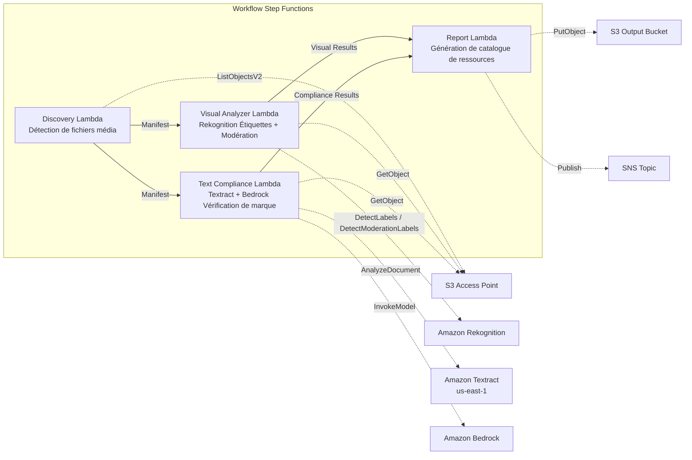

# UC19 : Publicité et Marketing / Gestion des ressources créatives — Catalogage des ressources et vérification de la conformité de marque

🌐 **Language / 言語**: [日本語](README.md) | [English](README.en.md) | [한국어](README.ko.md) | [简体中文](README.zh-CN.md) | [繁體中文](README.zh-TW.md) | Français | [Deutsch](README.de.md) | [Español](README.es.md)

📚 **Documentation** : [Schéma d'architecture](docs/architecture.fr.md) | [Guide de démonstration](docs/demo-guide.fr.md)

## Vue d'ensemble

Un workflow serverless qui exploite les S3 Access Points de FSx for ONTAP pour automatiser le catalogage des ressources créatives publicitaires (images et vidéos), l'analyse visuelle, la vérification de conformité du texte et la validation de la conformité aux directives de marque.

### Quand ce modèle est adapté

- Les ressources créatives (JPEG, PNG, TIFF, MP4, MOV, PSD) sont accumulées sur FSx for ONTAP
- Vous souhaitez réaliser une extraction de métadonnées visuelles avec Rekognition (étiquettes, détection de texte, modération)
- Vous souhaitez automatiser la vérification de conformité de la terminologie de marque des superpositions de texte via Textract + Bedrock
- Vous souhaitez générer automatiquement un catalogue de ressources (JSON/CSV) et gérer l'état de conformité de façon centralisée
- Vous souhaitez signaler automatiquement les ressources en infraction de modération et les intégrer à un workflow de revue humaine

### Quand ce modèle n'est pas adapté

- Une revue de streaming vidéo en temps réel est requise (réactivité à la seconde)
- Une plateforme DAM (Digital Asset Management) complète est requise
- Un pipeline de montage et de rendu vidéo à grande échelle est requis
- Un environnement où la joignabilité réseau vers l'API REST ONTAP ne peut pas être garantie

### Fonctionnalités principales

- Détection automatique des ressources créatives (JPEG/PNG/TIFF/MP4/MOV/PSD) via S3 AP
- Extraction d'étiquettes avec Rekognition (jusqu'à 50 étiquettes/ressource) + inspection de modération
- Extraction des superpositions de texte avec Textract
- Vérification de conformité des directives de terminologie de marque avec Bedrock
- Génération de catalogue de ressources (JSON + CSV, un enregistrement par ressource)
- Signalement automatique des infractions de modération (« requires-review »)

## Success Metrics

### Outcome
Automatiser le catalogage des ressources créatives et la vérification de conformité de marque afin de rationaliser le contrôle qualité dans les workflows de production publicitaire.

### Metrics
| Métrique | Valeur cible (exemple) |
|-----------|------------|
| Ressources traitées / exécution | > 100 assets |
| Précision de la vérification de conformité | > 95% |
| Taux de détection de modération | > 98% |
| Temps de génération du rapport | < 3 min / lot |
| Coût / exécution quotidienne | < $2.00 |
| Taux de Human Review requis | > 10% (toutes les ressources signalées par modération sont vérifiées) |

### Measurement Method
Historique d'exécution Step Functions, résultats d'étiquettes/modération Rekognition, résultats d'extraction Textract, journaux d'inférence de vérification de marque Bedrock, CloudWatch EMF Metrics (ProcessingDuration, SuccessCount, ErrorCount).

### Human Review Requirements
- Les ressources présentant des infractions de modération (confidence ≥ 80%) sont signalées comme « requires-review » et confirmées par un humain
- Les ressources non conformes aux directives de marque sont examinées par l'équipe marketing
- Les rapports de conformité mensuels sont examinés par le directeur de création

## Architecture



### Étapes du workflow

1. **Discovery** : Détecter les fichiers de ressources créatives depuis le S3 AP (filtres de format + taille)
2. **Visual Analyzer** : Extraction d'étiquettes avec Rekognition (jusqu'à 50 étiquettes) + inspection de modération
3. **Text Compliance** : Extraire les superpositions de texte avec Textract → vérifier la conformité aux directives de marque avec Bedrock
4. **Report** : Génération de catalogue de ressources (JSON + CSV) + indicateurs d'infraction de modération + notification SNS

## Prérequis

> **Note sur S3 AP NetworkOrigin** : La Discovery Lambda est déployée à l'intérieur d'un VPC. Si le NetworkOrigin du S3 Access Point est `Internet`, l'accès via un S3 Gateway VPC Endpoint est impossible (car les requêtes ne sont pas routées vers le plan de données FSx). Utilisez un S3 AP avec NetworkOrigin=VPC, ou configurez l'accès via une NAT Gateway. Voir [S3AP Compatibility Notes](../docs/s3ap-compatibility-notes.md) pour plus de détails.

- Un compte AWS et des permissions IAM appropriées
- Système de fichiers FSx for ONTAP (ONTAP 9.17.1P4D3 ou ultérieur)
- Un volume avec S3 Access Point activé (stockant les ressources créatives)
- VPC et sous-réseaux privés
- Accès aux modèles Amazon Bedrock activé (Claude / Nova)
- Une région où Amazon Rekognition est disponible
- Amazon Textract disponible (utilise l'appel inter-régions vers us-east-1)

## Procédure de déploiement

### 1. Vérification des paramètres

Vérifiez au préalable le fichier JSON des directives de marque et le seuil de modération.

### 2. Déploiement SAM

```bash
# Prérequis : AWS SAM CLI est requis. « sam build » package le code et la couche partagée automatiquement.
sam build

sam deploy \
  --stack-name fsxn-adtech-creative \
  --parameter-overrides \
    S3AccessPointAlias=<your-volume-ext-s3alias> \
    S3AccessPointName=<your-s3ap-name> \
    VpcId=<your-vpc-id> \
    PrivateSubnetIds=<subnet-1>,<subnet-2> \
    ScheduleExpression="cron(0 0 * * ? *)" \
    NotificationEmail=<your-email@example.com> \
    BrandGuidelinesS3Key=brand-guidelines.json \
    ModerationConfidenceThreshold=80 \
    MaxTagsPerAsset=50 \
    EnableVpcEndpoints=false \
    EnableCloudWatchAlarms=false \
  --capabilities CAPABILITY_NAMED_IAM \
  --resolve-s3 \
  --region ap-northeast-1
```

> **Remarque** : `template.yaml` s'utilise avec le SAM CLI (`sam build` + `sam deploy`).
> Pour déployer directement avec la commande `aws cloudformation deploy`, utilisez `template-deploy.yaml` (qui nécessite le pré-packaging des fichiers zip Lambda et leur téléversement vers S3).

## Liste des paramètres de configuration

| Paramètre | Description | Par défaut | Requis |
|-----------|------|----------|------|
| `S3AccessPointAlias` | FSx for ONTAP S3 AP Alias (pour l'entrée) | — | ✅ |
| `S3AccessPointName` | Nom du S3 AP (pour l'octroi de permissions IAM basées sur l'ARN) | `""` | ⚠️ Recommandé |
| `ScheduleExpression` | Expression de planification EventBridge Scheduler | `cron(0 0 * * ? *)` | |
| `VpcId` | VPC ID | — | ✅ |
| `PrivateSubnetIds` | Liste des ID de sous-réseaux privés | — | ✅ |
| `NotificationEmail` | Adresse e-mail de notification SNS | — | ✅ |
| `BrandGuidelinesS3Key` | Clé S3 du fichier JSON des directives de terminologie de marque | — | ✅ |
| `ModerationConfidenceThreshold` | Seuil de confiance de modération (%) | `80` | |
| `MaxTagsPerAsset` | Nombre maximal d'étiquettes par ressource | `50` | |
| `MapConcurrency` | Nombre d'exécutions parallèles de l'état Map | `10` | |
| `LambdaMemorySize` | Taille de mémoire Lambda (MB) | `512` | |
| `LambdaTimeout` | Délai d'expiration Lambda (secondes) | `300` | |
| `EnableVpcEndpoints` | Activer les Interface VPC Endpoints | `false` | |
| `EnableCloudWatchAlarms` | Activer les CloudWatch Alarms | `false` | |

## ⚠️ Considérations de performance

- La capacité de débit de FSx for ONTAP est **partagée entre NFS/SMB/S3 AP**. Un traitement en parallèle avec MapConcurrency=10 peut impacter les autres charges de travail sur le même volume.
- Pour un traitement par lot d'un grand nombre de fichiers, vérifiez la Throughput Capacity (MBps) de FSx for ONTAP et ajustez MapConcurrency selon les besoins.
- Recommandation : en production, commencez par MapConcurrency=5 et augmentez progressivement tout en surveillant la métrique CloudWatch de FSx for ONTAP (ThroughputUtilization).

## Nettoyage

```bash
aws s3 rm s3://fsxn-adtech-creative-output-${AWS_ACCOUNT_ID} --recursive

aws cloudformation delete-stack \
  --stack-name fsxn-adtech-creative \
  --region ap-northeast-1

aws cloudformation wait stack-delete-complete \
  --stack-name fsxn-adtech-creative \
  --region ap-northeast-1
```

## Supported Regions

UC19 utilise les services suivants :

| Service | Contrainte de région |
|---------|-------------|
| Amazon Rekognition | Vérifiez les régions prises en charge ([Régions prises en charge par Rekognition](https://docs.aws.amazon.com/general/latest/gr/rekognition.html)) |
| Amazon Textract | us-east-1 (appel inter-régions) |
| Amazon Bedrock | Vérifiez les régions prises en charge ([Régions prises en charge par Bedrock](https://docs.aws.amazon.com/general/latest/gr/bedrock.html)) |
| AWS X-Ray | Disponible dans presque toutes les régions |
| CloudWatch EMF | Disponible dans presque toutes les régions |

> UC19 utilise l'appel inter-régions (us-east-1) pour Textract. Cela est géré de façon transparente dans shared/cross_region_client.py.

## Liens de référence

- [Présentation des FSx for ONTAP S3 Access Points](https://docs.aws.amazon.com/fsx/latest/ONTAPGuide/accessing-data-via-s3-access-points.html)
- [Documentation Amazon Rekognition](https://docs.aws.amazon.com/rekognition/latest/dg/what-is.html)
- [Documentation Amazon Textract](https://docs.aws.amazon.com/textract/latest/dg/what-is.html)
- [Référence de l'API Amazon Bedrock](https://docs.aws.amazon.com/bedrock/latest/APIReference/API_runtime_InvokeModel.html)

---

## Liens vers la documentation AWS

| Service | Documentation |
|---------|------------|
| FSx for ONTAP | [Guide de l'utilisateur](https://docs.aws.amazon.com/fsx/latest/ONTAPGuide/what-is-fsx-ontap.html) |
| S3 Access Points | [S3 AP for FSx for ONTAP](https://docs.aws.amazon.com/fsx/latest/ONTAPGuide/s3-access-points.html) |
| Step Functions | [Guide du développeur](https://docs.aws.amazon.com/step-functions/latest/dg/welcome.html) |
| Amazon Rekognition | [Guide du développeur](https://docs.aws.amazon.com/rekognition/latest/dg/what-is.html) |
| Amazon Textract | [Guide du développeur](https://docs.aws.amazon.com/textract/latest/dg/what-is.html) |
| Amazon Bedrock | [Guide de l'utilisateur](https://docs.aws.amazon.com/bedrock/latest/userguide/what-is-bedrock.html) |

### Conformité au Well-Architected Framework

| Pilier | Conformité |
|----|------|
| Excellence opérationnelle | Traçage X-Ray, métriques EMF, surveillance de la conformité |
| Sécurité | IAM à moindre privilège, chiffrement KMS, contrôle d'accès aux ressources |
| Fiabilité | Step Functions Retry/Catch, exponential backoff (3 tentatives) |
| Efficacité des performances | Traitement d'images en parallèle, Textract inter-régions |
| Optimisation des coûts | Serverless, Rekognition à l'usage |
| Durabilité | Exécution à la demande, traitement incrémental |

---

## Estimation des coûts (approximation mensuelle)

> **Note** : Les valeurs ci-dessous sont des approximations pour la région ap-northeast-1 ; les coûts réels varient selon l'utilisation. Vérifiez les tarifs les plus récents dans le [AWS Pricing Calculator](https://calculator.aws/).

### Composants serverless (à l'usage)

| Service | Prix unitaire | Utilisation supposée | Approximation mensuelle |
|---------|------|-----------|---------|
| Lambda | $0.0000166667/GB-sec | 4 fonctions × exécution quotidienne | ~$1-3 |
| S3 API (GetObject/ListObjects) | $0.0047/10K requests | ~3K requests/jour | ~$0.45 |
| Step Functions | $0.025/1K state transitions | ~400 transitions/jour | ~$0.30 |
| Rekognition (DetectLabels) | $0.001/image | ~100 images/jour | ~$3.00 |
| Rekognition (DetectModerationLabels) | $0.001/image | ~100 images/jour | ~$3.00 |
| Textract (AnalyzeDocument) | $0.015/page | ~50 pages/jour | ~$0.75 |
| Bedrock (Nova Lite) | $0.00006/1K input tokens | ~20K tokens/exécution | ~$1-3 |
| SNS | $0.50/100K notifications | ~10 notifications/jour | ~$0.05 |
| CloudWatch Logs | $0.76/GB ingested | ~300 MB/mois | ~$0.23 |

### Coût fixe (FSx for ONTAP — environnement existant supposé)

| Composant | Mensuel |
|--------------|------|
| FSx for ONTAP (128 MBps, 1 TB) | ~$230 (environnement existant partagé) |
| S3 Access Point | Aucun frais supplémentaire (frais S3 API uniquement) |

### Estimation totale

| Configuration | Approximation mensuelle |
|------|---------|
| Configuration minimale (1 exécution quotidienne, ~50 ressources) | ~$5-10 |
| Configuration standard (quotidien + alarmes activées, ~200 ressources) | ~$15-35 |
| Configuration à grande échelle (haute fréquence + nombreuses ressources) | ~$50-150 |

> **Governance Caveat** : Les estimations de coûts sont des approximations, pas des valeurs garanties. La facturation réelle varie selon les schémas d'utilisation, le volume de données et la région.

---

## Tests locaux

### Vérification des Prerequisites

```bash
# Vérification des prérequis
aws --version          # AWS CLI v2
sam --version          # SAM CLI
python3 --version      # Python 3.9+
docker --version       # Docker (pour sam local)
aws sts get-caller-identity  # Identifiants AWS
```

### sam local invoke

```bash
# Build
# Prérequis : AWS SAM CLI est requis. « sam build » package le code et la couche partagée automatiquement.
sam build

# Exécution locale de la Discovery Lambda
sam local invoke DiscoveryFunction --event events/discovery-event.json

# Avec substitution des variables d'environnement
sam local invoke DiscoveryFunction \
  --event events/discovery-event.json \
  --env-vars env.json
```

### Tests unitaires

```bash
python3 -m pytest tests/ -v
```

Voir [Démarrage rapide des tests locaux](../docs/local-testing-quick-start.md) pour plus de détails.

---

## Governance Note

> Ce modèle fournit des orientations d'architecture technique. Il ne constitue pas un conseil juridique, de conformité ou réglementaire. Les organisations doivent consulter des professionnels qualifiés. La vérification de conformité des créations publicitaires est assistée par l'IA ; les décisions finales doivent être prises par des humains. La conformité aux réglementations publicitaires propres au secteur (loi sur les produits pharmaceutiques et dispositifs médicaux, loi contre les primes injustifiables et représentations trompeuses, etc.) nécessite une vérification distincte.

> **Réglementations associées** : 景品表示法 (loi contre les primes injustifiables et représentations trompeuses), 個人情報保護法 (loi sur la protection des informations personnelles)

---

## S3AP Compatibility

Consultez les [S3AP Compatibility Notes](../docs/s3ap-compatibility-notes.md) pour les contraintes de compatibilité, le dépannage et les modèles de déclenchement des S3 Access Points for FSx for ONTAP.
