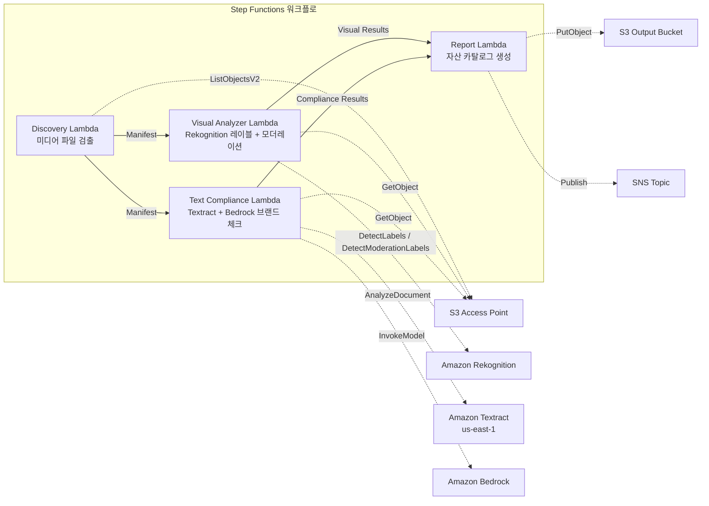

# UC19: 광고·마케팅 / 크리에이티브 자산 관리 — 자산 카탈로그화 및 브랜드 컴플라이언스 체크

🌐 **Language / 言語**: [日本語](README.md) | [English](README.en.md) | 한국어 | [简体中文](README.zh-CN.md) | [繁體中文](README.zh-TW.md) | [Français](README.fr.md) | [Deutsch](README.de.md) | [Español](README.es.md)

📚 **문서**: [아키텍처 다이어그램](docs/architecture.ko.md) | [데모 가이드](docs/demo-guide.ko.md)

## 개요

FSx for ONTAP의 S3 Access Points를 활용하여 광고 크리에이티브 자산(이미지·동영상)의 자동 카탈로그화, 시각적 분석, 텍스트 컴플라이언스 체크, 브랜드 가이드라인 준수 검증을 실현하는 서버리스 워크플로입니다.

### 이 패턴이 적합한 경우

- 크리에이티브 자산(JPEG, PNG, TIFF, MP4, MOV, PSD)이 FSx for ONTAP에 축적되어 있다
- Rekognition을 통한 시각적 메타데이터 추출(레이블, 텍스트 감지, 모더레이션)을 수행하고 싶다
- Textract + Bedrock을 통한 텍스트 오버레이의 브랜드 용어 준수 체크를 자동화하고 싶다
- 자산 카탈로그(JSON/CSV)를 자동 생성하고 컴플라이언스 상태를 일원 관리하고 싶다
- 모더레이션 위반 자산을 자동으로 플래그 처리하고 사람 검토 워크플로에 통합하고 싶다

### 이 패턴이 적합하지 않은 경우

- 실시간 동영상 스트리밍 심사가 필요하다(초 단위의 즉시 응답성)
- 완전한 DAM(Digital Asset Management) 플랫폼이 필요하다
- 대규모 동영상 편집·렌더링 파이프라인이 필요하다
- ONTAP REST API로의 네트워크 도달성을 확보할 수 없는 환경

### 주요 기능

- S3 AP 경유로 크리에이티브 자산(JPEG/PNG/TIFF/MP4/MOV/PSD) 자동 검출
- Rekognition을 통한 레이블 추출(자산당 최대 50개 태그) + 모더레이션 검사
- Textract를 통한 텍스트 오버레이 추출
- Bedrock을 통한 브랜드 용어 가이드라인 준수 체크
- 자산 카탈로그 생성(JSON + CSV, 자산당 1레코드)
- 모더레이션 위반 자동 플래그 처리("requires-review")

## Success Metrics

### Outcome
크리에이티브 자산의 카탈로그화와 브랜드 컴플라이언스 체크를 자동화하여 광고 제작 워크플로의 품질 관리를 효율화한다.

### Metrics
| 메트릭 | 목표값(예) |
|-----------|------------|
| 처리된 자산 수 / 실행 | > 100 assets |
| 컴플라이언스 체크 정확도 | > 95% |
| 모더레이션 검출률 | > 98% |
| 리포트 생성 시간 | < 3분 / 배치 |
| 비용 / 일일 실행 | < $2.00 |
| Human Review 필수율 | > 10%(모더레이션 플래그가 붙은 자산은 전건 확인) |

### Measurement Method
Step Functions 실행 이력, Rekognition 레이블/모더레이션 결과, Textract 추출 결과, Bedrock 브랜드 체크 추론 로그, CloudWatch EMF Metrics(ProcessingDuration, SuccessCount, ErrorCount).

### Human Review Requirements
- 모더레이션 위반(confidence ≥ 80%) 자산은 "requires-review"로 플래그 처리하고 사람이 확인
- 브랜드 가이드라인 비준수 자산은 마케팅 팀이 검토
- 월간 컴플라이언스 리포트는 크리에이티브 디렉터가 확인

## 아키텍처



### 워크플로 단계

1. **Discovery**: S3 AP에서 크리에이티브 자산 파일을 검출(포맷 + 크기 필터)
2. **Visual Analyzer**: Rekognition으로 레이블 추출(최대 50개 태그) + 모더레이션 검사
3. **Text Compliance**: Textract로 텍스트 오버레이 추출 → Bedrock으로 브랜드 가이드라인 준수 체크
4. **Report**: 자산 카탈로그 생성(JSON + CSV) + 모더레이션 위반 플래그 + SNS 알림

## 사전 요구 사항

> **S3 AP NetworkOrigin 주의**: Discovery Lambda는 VPC 내에 배치됩니다. S3 Access Point의 NetworkOrigin이 `Internet`인 경우, S3 Gateway VPC Endpoint 경유로는 접근할 수 없습니다(FSx 데이터 플레인으로 라우팅되지 않기 때문). NetworkOrigin=VPC의 S3 AP를 사용하거나 NAT Gateway 경유 접근을 설정하세요. 자세한 내용은 [S3AP Compatibility Notes](../docs/s3ap-compatibility-notes.md)를 참조하세요.

- AWS 계정과 적절한 IAM 권한
- FSx for ONTAP 파일 시스템(ONTAP 9.17.1P4D3 이상)
- S3 Access Point가 활성화된 볼륨(크리에이티브 자산을 저장)
- VPC, 프라이빗 서브넷
- Amazon Bedrock 모델 액세스가 활성화됨(Claude / Nova)
- Amazon Rekognition을 사용할 수 있는 리전
- Amazon Textract 사용 가능(us-east-1로의 크로스 리전 호출 사용)

## 배포 절차

### 1. 파라미터 확인

브랜드 가이드라인 JSON 파일과 모더레이션 임계값을 사전에 확인합니다.

### 2. SAM 배포

```bash
# 전제: AWS SAM CLI가 필요합니다. sam build가 코드와 공유 레이어를 자동으로 패키징합니다.
sam build

sam deploy \
  --stack-name fsxn-adtech-creative \
  --parameter-overrides \
    S3AccessPointAlias=<your-volume-ext-s3alias> \
    S3AccessPointName=<your-s3ap-name> \
    VpcId=<your-vpc-id> \
    PrivateSubnetIds=<subnet-1>,<subnet-2> \
    ScheduleExpression="cron(0 0 * * ? *)" \
    NotificationEmail=<your-email@example.com> \
    BrandGuidelinesS3Key=brand-guidelines.json \
    ModerationConfidenceThreshold=80 \
    MaxTagsPerAsset=50 \
    EnableVpcEndpoints=false \
    EnableCloudWatchAlarms=false \
  --capabilities CAPABILITY_NAMED_IAM \
  --resolve-s3 \
  --region ap-northeast-1
```

> **주의**: `template.yaml`은 SAM CLI(`sam build` + `sam deploy`)로 사용합니다.
> `aws cloudformation deploy` 명령으로 직접 배포하는 경우에는 `template-deploy.yaml`을 사용하세요(Lambda zip 파일의 사전 패키징과 S3 업로드가 필요합니다).

## 설정 파라미터 목록

| 파라미터 | 설명 | 기본값 | 필수 |
|-----------|------|----------|------|
| `S3AccessPointAlias` | FSx for ONTAP S3 AP Alias(입력용) | — | ✅ |
| `S3AccessPointName` | S3 AP 이름(ARN 기반 IAM 권한 부여용) | `""` | ⚠️ 권장 |
| `ScheduleExpression` | EventBridge Scheduler의 스케줄 표현식 | `cron(0 0 * * ? *)` | |
| `VpcId` | VPC ID | — | ✅ |
| `PrivateSubnetIds` | 프라이빗 서브넷 ID 목록 | — | ✅ |
| `NotificationEmail` | SNS 알림 대상 이메일 주소 | — | ✅ |
| `BrandGuidelinesS3Key` | 브랜드 용어 가이드라인 JSON 파일의 S3 키 | — | ✅ |
| `ModerationConfidenceThreshold` | 모더레이션 신뢰도 임계값(%) | `80` | |
| `MaxTagsPerAsset` | 자산당 최대 태그 수 | `50` | |
| `MapConcurrency` | Map 스테이트의 병렬 실행 수 | `10` | |
| `LambdaMemorySize` | Lambda 메모리 크기 (MB) | `512` | |
| `LambdaTimeout` | Lambda 타임아웃 (초) | `300` | |
| `EnableVpcEndpoints` | Interface VPC Endpoints 활성화 | `false` | |
| `EnableCloudWatchAlarms` | CloudWatch Alarms 활성화 | `false` | |

## ⚠️ 성능에 관한 주의 사항

- FSx for ONTAP의 스루풋 용량은 **NFS/SMB/S3 AP 전체에서 공유**됩니다. MapConcurrency=10으로 병렬 처리를 수행하는 경우, 동일 볼륨의 다른 워크로드에 영향을 줄 수 있습니다.
- 대량 파일의 일괄 처리를 수행하는 경우에는 FSx for ONTAP의 Throughput Capacity (MBps)를 확인하고 필요에 따라 MapConcurrency를 조정하세요.
- 권장: 프로덕션 환경에서는 먼저 MapConcurrency=5로 시작하고, FSx for ONTAP의 CloudWatch 메트릭 (ThroughputUtilization)을 모니터링하면서 단계적으로 증가시키세요.

## 정리

```bash
aws s3 rm s3://fsxn-adtech-creative-output-${AWS_ACCOUNT_ID} --recursive

aws cloudformation delete-stack \
  --stack-name fsxn-adtech-creative \
  --region ap-northeast-1

aws cloudformation wait stack-delete-complete \
  --stack-name fsxn-adtech-creative \
  --region ap-northeast-1
```

## Supported Regions

UC19는 다음 서비스를 사용합니다:

| 서비스 | 리전 제약 |
|---------|-------------|
| Amazon Rekognition | 지원 리전을 확인([Rekognition 지원 리전](https://docs.aws.amazon.com/general/latest/gr/rekognition.html)) |
| Amazon Textract | us-east-1(크로스 리전 호출) |
| Amazon Bedrock | 지원 리전을 확인([Bedrock 지원 리전](https://docs.aws.amazon.com/general/latest/gr/bedrock.html)) |
| AWS X-Ray | 거의 모든 리전에서 사용 가능 |
| CloudWatch EMF | 거의 모든 리전에서 사용 가능 |

> UC19는 Textract에서 크로스 리전 호출(us-east-1)을 사용합니다. shared/cross_region_client.py에서 투과적으로 처리됩니다.

## 참고 링크

- [FSx for ONTAP S3 Access Points 개요](https://docs.aws.amazon.com/fsx/latest/ONTAPGuide/accessing-data-via-s3-access-points.html)
- [Amazon Rekognition 문서](https://docs.aws.amazon.com/rekognition/latest/dg/what-is.html)
- [Amazon Textract 문서](https://docs.aws.amazon.com/textract/latest/dg/what-is.html)
- [Amazon Bedrock API 레퍼런스](https://docs.aws.amazon.com/bedrock/latest/APIReference/API_runtime_InvokeModel.html)

---

## AWS 문서 링크

| 서비스 | 문서 |
|---------|------------|
| FSx for ONTAP | [사용자 가이드](https://docs.aws.amazon.com/fsx/latest/ONTAPGuide/what-is-fsx-ontap.html) |
| S3 Access Points | [S3 AP for FSx for ONTAP](https://docs.aws.amazon.com/fsx/latest/ONTAPGuide/s3-access-points.html) |
| Step Functions | [개발자 가이드](https://docs.aws.amazon.com/step-functions/latest/dg/welcome.html) |
| Amazon Rekognition | [개발자 가이드](https://docs.aws.amazon.com/rekognition/latest/dg/what-is.html) |
| Amazon Textract | [개발자 가이드](https://docs.aws.amazon.com/textract/latest/dg/what-is.html) |
| Amazon Bedrock | [사용자 가이드](https://docs.aws.amazon.com/bedrock/latest/userguide/what-is-bedrock.html) |

### Well-Architected Framework 대응

| 기둥 | 대응 |
|----|------|
| 운영 우수성 | X-Ray 트레이싱, EMF 메트릭, 컴플라이언스 모니터링 |
| 보안 | 최소 권한 IAM, KMS 암호화, 자산 액세스 제어 |
| 신뢰성 | Step Functions Retry/Catch, exponential backoff (3회 재시도) |
| 성능 효율성 | 병렬 이미지 처리, 크로스 리전 Textract |
| 비용 최적화 | 서버리스, Rekognition 종량 과금 |
| 지속 가능성 | 온디맨드 실행, 차분 처리 |

---

## 비용 견적(월액 개산)

> **비고**: 아래는 ap-northeast-1 리전의 개산이며, 실제 비용은 사용량에 따라 다릅니다. 최신 요금은 [AWS Pricing Calculator](https://calculator.aws/)에서 확인하세요.

### 서버리스 컴포넌트(종량 과금)

| 서비스 | 단가 | 상정 사용량 | 월액 개산 |
|---------|------|-----------|---------|
| Lambda | $0.0000166667/GB-sec | 4 함수 × 일일 실행 | ~$1-3 |
| S3 API (GetObject/ListObjects) | $0.0047/10K requests | ~3K requests/일 | ~$0.45 |
| Step Functions | $0.025/1K state transitions | ~400 transitions/일 | ~$0.30 |
| Rekognition (DetectLabels) | $0.001/image | ~100 images/일 | ~$3.00 |
| Rekognition (DetectModerationLabels) | $0.001/image | ~100 images/일 | ~$3.00 |
| Textract (AnalyzeDocument) | $0.015/page | ~50 pages/일 | ~$0.75 |
| Bedrock (Nova Lite) | $0.00006/1K input tokens | ~20K tokens/실행 | ~$1-3 |
| SNS | $0.50/100K notifications | ~10 notifications/일 | ~$0.05 |
| CloudWatch Logs | $0.76/GB ingested | ~300 MB/월 | ~$0.23 |

### 고정 비용(FSx for ONTAP — 기존 환경 전제)

| 컴포넌트 | 월액 |
|--------------|------|
| FSx for ONTAP (128 MBps, 1 TB) | ~$230 (기존 환경을 공유) |
| S3 Access Point | 추가 요금 없음(S3 API 요금만) |

### 합계 개산

| 구성 | 월액 개산 |
|------|---------|
| 최소 구성(일일 1회 실행, ~50 자산) | ~$5-10 |
| 표준 구성(일일 + 알람 활성화, ~200 자산) | ~$15-35 |
| 대규모 구성(고빈도 + 대량 자산) | ~$50-150 |

> **Governance Caveat**: 비용 견적은 개산이며, 보증값이 아닙니다. 실제 청구액은 사용 패턴, 데이터 양, 리전에 따라 다릅니다.

---

## 로컬 테스트

### Prerequisites 체크

```bash
# 사전 조건 확인
aws --version          # AWS CLI v2
sam --version          # SAM CLI
python3 --version      # Python 3.9+
docker --version       # Docker (sam local 용)
aws sts get-caller-identity  # AWS 자격 증명
```

### sam local invoke

```bash
# 빌드
# 전제: AWS SAM CLI가 필요합니다. sam build가 코드와 공유 레이어를 자동으로 패키징합니다.
sam build

# Discovery Lambda의 로컬 실행
sam local invoke DiscoveryFunction --event events/discovery-event.json

# 환경 변수 오버라이드 포함
sam local invoke DiscoveryFunction \
  --event events/discovery-event.json \
  --env-vars env.json
```

### 유닛 테스트

```bash
python3 -m pytest tests/ -v
```

자세한 내용은 [로컬 테스트 퀵 스타트](../docs/local-testing-quick-start.md)를 참조하세요.

---

## Governance Note

> 본 패턴은 기술 아키텍처 가이던스를 제공합니다. 법적·컴플라이언스·규제상의 조언이 아닙니다. 조직은 적격한 전문가에게 상담해야 합니다. 광고 크리에이티브의 컴플라이언스 체크는 AI 보조이며, 최종 판단은 사람이 수행해야 합니다. 업계 고유의 광고 규제(약기법, 경품표시법 등)에 대한 적합성은 별도로 확인이 필요합니다.

> **관련 규제**: 景品表示法(경품표시법), 個人情報保護法(개인정보보호법)

---

## S3AP Compatibility

S3 Access Points for FSx for ONTAP의 호환성 제약, 트러블슈팅, 트리거 패턴에 대해서는 [S3AP Compatibility Notes](../docs/s3ap-compatibility-notes.md)를 참조하세요.
