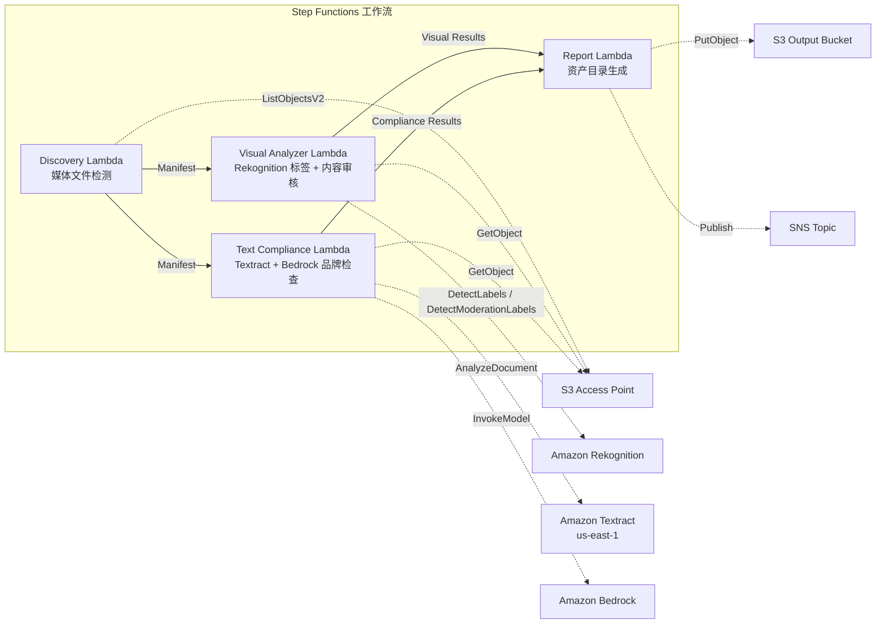

# UC19：广告·营销 / 创意资产管理 — 资产编目与品牌合规检查

🌐 **Language / 言語**: [日本語](README.md) | [English](README.en.md) | [한국어](README.ko.md) | 简体中文 | [繁體中文](README.zh-TW.md) | [Français](README.fr.md) | [Deutsch](README.de.md) | [Español](README.es.md)

📚 **文档**: [架构图](docs/architecture.zh-CN.md) | [演示指南](docs/demo-guide.zh-CN.md)

## 概述

利用 FSx for ONTAP 的 S3 Access Points，实现广告创意资产（图像·视频）的自动编目、视觉分析、文本合规检查以及品牌指南符合性验证的无服务器工作流。

### 适用此模式的场景

- 创意资产（JPEG、PNG、TIFF、MP4、MOV、PSD）已积累在 FSx for ONTAP 上
- 希望通过 Rekognition 进行视觉元数据提取（标签、文本检测、内容审核）
- 希望通过 Textract + Bedrock 自动化文本叠加层的品牌术语符合性检查
- 希望自动生成资产目录（JSON/CSV），并集中管理合规状态
- 希望自动标记违反内容审核的资产，并将其纳入人工审核工作流

### 不适用此模式的场景

- 需要实时视频流审查（秒级即时响应）
- 需要完整的 DAM（Digital Asset Management）平台
- 需要大规模视频编辑·渲染流水线
- 无法确保对 ONTAP REST API 的网络可达性的环境

### 主要功能

- 通过 S3 AP 自动检测创意资产（JPEG/PNG/TIFF/MP4/MOV/PSD）
- 通过 Rekognition 进行标签提取（每个资产最多 50 个标签）+ 内容审核检查
- 通过 Textract 进行文本叠加层提取
- 通过 Bedrock 进行品牌术语指南符合性检查
- 资产目录生成（JSON + CSV，每个资产 1 条记录）
- 自动标记内容审核违规（"requires-review"）

## Success Metrics

### Outcome
自动化创意资产的编目与品牌合规检查，提升广告制作工作流的质量管理效率。

### Metrics
| 指标 | 目标值（示例） |
|-----------|------------|
| 已处理资产数 / 执行 | > 100 assets |
| 合规检查准确率 | > 95% |
| 内容审核检出率 | > 98% |
| 报告生成时间 | < 3 分钟 / 批次 |
| 成本 / 每日执行 | < $2.00 |
| Human Review 必需率 | > 10%（带内容审核标记的资产全部确认） |

### Measurement Method
Step Functions 执行历史、Rekognition 标签/内容审核结果、Textract 提取结果、Bedrock 品牌检查推理日志、CloudWatch EMF Metrics（ProcessingDuration、SuccessCount、ErrorCount）。

### Human Review Requirements
- 内容审核违规（confidence ≥ 80%）的资产标记为 "requires-review"，由人工确认
- 不符合品牌指南的资产由营销团队审核
- 月度合规报告由创意总监确认

## 架构



### 工作流步骤

1. **Discovery**：从 S3 AP 检测创意资产文件（格式 + 大小过滤）
2. **Visual Analyzer**：使用 Rekognition 进行标签提取（最多 50 个标签）+ 内容审核检查
3. **Text Compliance**：使用 Textract 提取文本叠加层 → 使用 Bedrock 进行品牌指南符合性检查
4. **Report**：资产目录生成（JSON + CSV）+ 内容审核违规标记 + SNS 通知

## 前提条件

> **S3 AP NetworkOrigin 注意**：Discovery Lambda 部署在 VPC 内。若 S3 Access Point 的 NetworkOrigin 为 `Internet`，则无法通过 S3 Gateway VPC Endpoint 访问（因为请求不会路由到 FSx 数据平面）。请使用 NetworkOrigin=VPC 的 S3 AP，或配置经由 NAT Gateway 的访问。详情请参阅 [S3AP Compatibility Notes](../docs/s3ap-compatibility-notes.md)。

- AWS 账户和适当的 IAM 权限
- FSx for ONTAP 文件系统（ONTAP 9.17.1P4D3 或更高版本）
- 已启用 S3 Access Point 的卷（存储创意资产）
- VPC、私有子网
- 已启用 Amazon Bedrock 模型访问（Claude / Nova）
- Amazon Rekognition 可用的区域
- Amazon Textract 可用（使用对 us-east-1 的跨区域调用）

## 部署步骤

### 1. 参数确认

事先确认品牌指南 JSON 文件和内容审核阈值。

### 2. SAM 部署

```bash
# 前提：需要 AWS SAM CLI。sam build 会自动打包代码和共享层。
sam build

sam deploy \
  --stack-name fsxn-adtech-creative \
  --parameter-overrides \
    S3AccessPointAlias=<your-volume-ext-s3alias> \
    S3AccessPointName=<your-s3ap-name> \
    VpcId=<your-vpc-id> \
    PrivateSubnetIds=<subnet-1>,<subnet-2> \
    ScheduleExpression="cron(0 0 * * ? *)" \
    NotificationEmail=<your-email@example.com> \
    BrandGuidelinesS3Key=brand-guidelines.json \
    ModerationConfidenceThreshold=80 \
    MaxTagsPerAsset=50 \
    EnableVpcEndpoints=false \
    EnableCloudWatchAlarms=false \
  --capabilities CAPABILITY_NAMED_IAM \
  --resolve-s3 \
  --region ap-northeast-1
```

> **注意**：`template.yaml` 用于 SAM CLI（`sam build` + `sam deploy`）。
> 若使用 `aws cloudformation deploy` 命令直接部署，请使用 `template-deploy.yaml`（需要事先打包 Lambda zip 文件并上传到 S3）。

## 配置参数一览

| 参数 | 说明 | 默认值 | 必需 |
|-----------|------|----------|------|
| `S3AccessPointAlias` | FSx for ONTAP S3 AP Alias（用于输入） | — | ✅ |
| `S3AccessPointName` | S3 AP 名称（用于基于 ARN 的 IAM 权限授予） | `""` | ⚠️ 推荐 |
| `ScheduleExpression` | EventBridge Scheduler 的调度表达式 | `cron(0 0 * * ? *)` | |
| `VpcId` | VPC ID | — | ✅ |
| `PrivateSubnetIds` | 私有子网 ID 列表 | — | ✅ |
| `NotificationEmail` | SNS 通知目标邮箱地址 | — | ✅ |
| `BrandGuidelinesS3Key` | 品牌术语指南 JSON 文件的 S3 键 | — | ✅ |
| `ModerationConfidenceThreshold` | 内容审核置信度阈值（%） | `80` | |
| `MaxTagsPerAsset` | 每个资产的最大标签数 | `50` | |
| `MapConcurrency` | Map 状态的并行执行数 | `10` | |
| `LambdaMemorySize` | Lambda 内存大小 (MB) | `512` | |
| `LambdaTimeout` | Lambda 超时 (秒) | `300` | |
| `EnableVpcEndpoints` | 启用 Interface VPC Endpoints | `false` | |
| `EnableCloudWatchAlarms` | 启用 CloudWatch Alarms | `false` | |

## ⚠️ 关于性能的注意事项

- FSx for ONTAP 的吞吐量容量**在 NFS/SMB/S3 AP 之间共享**。使用 MapConcurrency=10 进行并行处理时，可能会影响同一卷上的其他工作负载。
- 进行大量文件的批量处理时，请确认 FSx for ONTAP 的 Throughput Capacity (MBps)，并根据需要调整 MapConcurrency。
- 建议：在生产环境中首先以 MapConcurrency=5 开始，一边监控 FSx for ONTAP 的 CloudWatch 指标 (ThroughputUtilization) 一边逐步增加。

## 清理

```bash
aws s3 rm s3://fsxn-adtech-creative-output-${AWS_ACCOUNT_ID} --recursive

aws cloudformation delete-stack \
  --stack-name fsxn-adtech-creative \
  --region ap-northeast-1

aws cloudformation wait stack-delete-complete \
  --stack-name fsxn-adtech-creative \
  --region ap-northeast-1
```

## Supported Regions

UC19 使用以下服务：

| 服务 | 区域约束 |
|---------|-------------|
| Amazon Rekognition | 确认支持的区域（[Rekognition 支持的区域](https://docs.aws.amazon.com/general/latest/gr/rekognition.html)） |
| Amazon Textract | us-east-1（跨区域调用） |
| Amazon Bedrock | 确认支持的区域（[Bedrock 支持的区域](https://docs.aws.amazon.com/general/latest/gr/bedrock.html)） |
| AWS X-Ray | 几乎所有区域均可用 |
| CloudWatch EMF | 几乎所有区域均可用 |

> UC19 在 Textract 中使用跨区域调用（us-east-1）。由 shared/cross_region_client.py 透明处理。

## 参考链接

- [FSx for ONTAP S3 Access Points 概述](https://docs.aws.amazon.com/fsx/latest/ONTAPGuide/accessing-data-via-s3-access-points.html)
- [Amazon Rekognition 文档](https://docs.aws.amazon.com/rekognition/latest/dg/what-is.html)
- [Amazon Textract 文档](https://docs.aws.amazon.com/textract/latest/dg/what-is.html)
- [Amazon Bedrock API 参考](https://docs.aws.amazon.com/bedrock/latest/APIReference/API_runtime_InvokeModel.html)

---

## AWS 文档链接

| 服务 | 文档 |
|---------|------------|
| FSx for ONTAP | [用户指南](https://docs.aws.amazon.com/fsx/latest/ONTAPGuide/what-is-fsx-ontap.html) |
| S3 Access Points | [S3 AP for FSx for ONTAP](https://docs.aws.amazon.com/fsx/latest/ONTAPGuide/s3-access-points.html) |
| Step Functions | [开发者指南](https://docs.aws.amazon.com/step-functions/latest/dg/welcome.html) |
| Amazon Rekognition | [开发者指南](https://docs.aws.amazon.com/rekognition/latest/dg/what-is.html) |
| Amazon Textract | [开发者指南](https://docs.aws.amazon.com/textract/latest/dg/what-is.html) |
| Amazon Bedrock | [用户指南](https://docs.aws.amazon.com/bedrock/latest/userguide/what-is-bedrock.html) |

### Well-Architected Framework 对应

| 支柱 | 对应 |
|----|------|
| 卓越运营 | X-Ray 跟踪、EMF 指标、合规监控 |
| 安全性 | 最小权限 IAM、KMS 加密、资产访问控制 |
| 可靠性 | Step Functions Retry/Catch、exponential backoff（3 次重试） |
| 性能效率 | 并行图像处理、跨区域 Textract |
| 成本优化 | 无服务器、Rekognition 按量计费 |
| 可持续性 | 按需执行、增量处理 |

---

## 成本估算（月度概算）

> **备注**：以下为 ap-northeast-1 区域的概算，实际成本因使用量而异。最新价格请在 [AWS Pricing Calculator](https://calculator.aws/) 确认。

### 无服务器组件（按量计费）

| 服务 | 单价 | 假定使用量 | 月度概算 |
|---------|------|-----------|---------|
| Lambda | $0.0000166667/GB-sec | 4 个函数 × 每日执行 | ~$1-3 |
| S3 API (GetObject/ListObjects) | $0.0047/10K requests | ~3K requests/天 | ~$0.45 |
| Step Functions | $0.025/1K state transitions | ~400 transitions/天 | ~$0.30 |
| Rekognition (DetectLabels) | $0.001/image | ~100 images/天 | ~$3.00 |
| Rekognition (DetectModerationLabels) | $0.001/image | ~100 images/天 | ~$3.00 |
| Textract (AnalyzeDocument) | $0.015/page | ~50 pages/天 | ~$0.75 |
| Bedrock (Nova Lite) | $0.00006/1K input tokens | ~20K tokens/执行 | ~$1-3 |
| SNS | $0.50/100K notifications | ~10 notifications/天 | ~$0.05 |
| CloudWatch Logs | $0.76/GB ingested | ~300 MB/月 | ~$0.23 |

### 固定成本（FSx for ONTAP — 假设为既有环境）

| 组件 | 月度 |
|--------------|------|
| FSx for ONTAP (128 MBps, 1 TB) | ~$230 (共享既有环境) |
| S3 Access Point | 无额外费用（仅 S3 API 费用） |

### 合计概算

| 配置 | 月度概算 |
|------|---------|
| 最小配置（每日执行 1 次，~50 个资产） | ~$5-10 |
| 标准配置（每日 + 启用告警，~200 个资产） | ~$15-35 |
| 大规模配置（高频 + 大量资产） | ~$50-150 |

> **Governance Caveat**：成本估算为概算，并非保证值。实际账单因使用模式、数据量、区域而异。

---

## 本地测试

### Prerequisites 检查

```bash
# 确认前提条件
aws --version          # AWS CLI v2
sam --version          # SAM CLI
python3 --version      # Python 3.9+
docker --version       # Docker (sam local 用)
aws sts get-caller-identity  # AWS 凭证
```

### sam local invoke

```bash
# 构建
# 前提：需要 AWS SAM CLI。sam build 会自动打包代码和共享层。
sam build

# 本地运行 Discovery Lambda
sam local invoke DiscoveryFunction --event events/discovery-event.json

# 带环境变量覆盖
sam local invoke DiscoveryFunction \
  --event events/discovery-event.json \
  --env-vars env.json
```

### 单元测试

```bash
python3 -m pytest tests/ -v
```

详情请参阅 [本地测试快速入门](../docs/local-testing-quick-start.md)。

---

## Governance Note

> 本模式提供技术架构指导。这不构成法律·合规·监管方面的建议。组织应咨询合格的专业人士。广告创意的合规检查为 AI 辅助，最终判断必须由人工进行。对行业特定广告法规（药机法、赠品标示法等）的符合性需另行确认。

> **相关法规**：景品表示法（赠品标示法）、个人信息保护法

---

## S3AP Compatibility

关于 S3 Access Points for FSx for ONTAP 的兼容性约束、故障排查和触发模式，请参阅 [S3AP Compatibility Notes](../docs/s3ap-compatibility-notes.md)。
