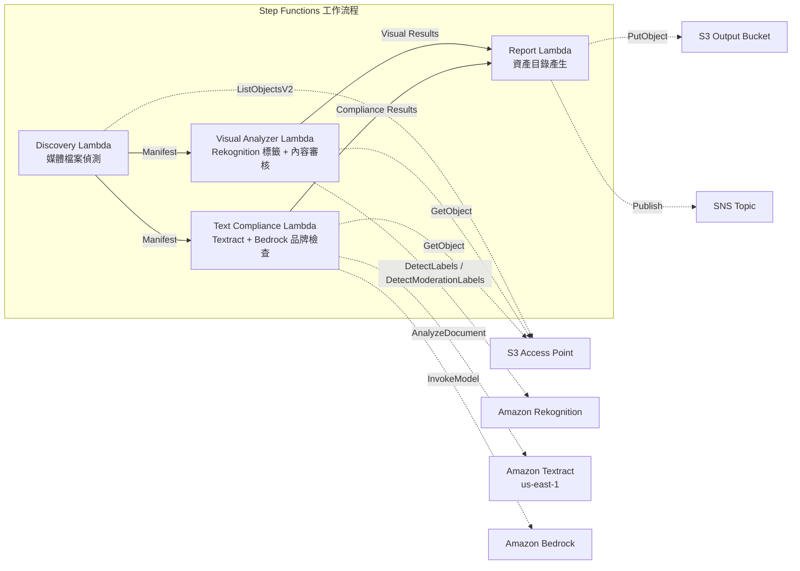

# UC19：廣告·行銷 / 創意資產管理 — 資產編目與品牌合規檢查

🌐 **Language / 言語**: [日本語](README.md) | [English](README.en.md) | [한국어](README.ko.md) | [简体中文](README.zh-CN.md) | 繁體中文 | [Français](README.fr.md) | [Deutsch](README.de.md) | [Español](README.es.md)

📚 **文件**: [架構圖](docs/architecture.zh-TW.md) | [示範指南](docs/demo-guide.zh-TW.md)

## 概觀

運用 FSx for ONTAP 的 S3 Access Points，實現廣告創意資產（影像·影片）的自動編目、視覺分析、文字合規檢查以及品牌指南符合性驗證的無伺服器工作流程。

### 適用此模式的情境

- 創意資產（JPEG、PNG、TIFF、MP4、MOV、PSD）已累積在 FSx for ONTAP 上
- 希望透過 Rekognition 進行視覺中繼資料擷取（標籤、文字偵測、內容審核）
- 希望透過 Textract + Bedrock 自動化文字疊加層的品牌用語符合性檢查
- 希望自動產生資產目錄（JSON/CSV），並集中管理合規狀態
- 希望自動標記違反內容審核的資產，並將其納入人工審查工作流程

### 不適用此模式的情境

- 需要即時影片串流審查（秒級即時回應性）
- 需要完整的 DAM（Digital Asset Management）平台
- 需要大規模影片編輯·算圖流水線
- 無法確保對 ONTAP REST API 的網路可達性的環境

### 主要功能

- 透過 S3 AP 自動偵測創意資產（JPEG/PNG/TIFF/MP4/MOV/PSD）
- 透過 Rekognition 進行標籤擷取（每個資產最多 50 個標籤）+ 內容審核檢查
- 透過 Textract 進行文字疊加層擷取
- 透過 Bedrock 進行品牌用語指南符合性檢查
- 資產目錄產生（JSON + CSV，每個資產 1 筆記錄）
- 自動標記內容審核違規（"requires-review"）

## Success Metrics

### Outcome
自動化創意資產的編目與品牌合規檢查，提升廣告製作工作流程的品質管理效率。

### Metrics
| 指標 | 目標值（範例） |
|-----------|------------|
| 已處理資產數 / 執行 | > 100 assets |
| 合規檢查準確率 | > 95% |
| 內容審核偵測率 | > 98% |
| 報告產生時間 | < 3 分鐘 / 批次 |
| 成本 / 每日執行 | < $2.00 |
| Human Review 必需率 | > 10%（帶內容審核標記的資產全數確認） |

### Measurement Method
Step Functions 執行歷史、Rekognition 標籤/內容審核結果、Textract 擷取結果、Bedrock 品牌檢查推論日誌、CloudWatch EMF Metrics（ProcessingDuration、SuccessCount、ErrorCount）。

### Human Review Requirements
- 內容審核違規（confidence ≥ 80%）的資產標記為 "requires-review"，由人工確認
- 不符合品牌指南的資產由行銷團隊審查
- 每月合規報告由創意總監確認

## 架構



### 工作流程步驟

1. **Discovery**：從 S3 AP 偵測創意資產檔案（格式 + 大小篩選）
2. **Visual Analyzer**：使用 Rekognition 進行標籤擷取（最多 50 個標籤）+ 內容審核檢查
3. **Text Compliance**：使用 Textract 擷取文字疊加層 → 使用 Bedrock 進行品牌指南符合性檢查
4. **Report**：資產目錄產生（JSON + CSV）+ 內容審核違規標記 + SNS 通知

## 前提條件

> **S3 AP NetworkOrigin 注意**：Discovery Lambda 部署在 VPC 內。若 S3 Access Point 的 NetworkOrigin 為 `Internet`，則無法透過 S3 Gateway VPC Endpoint 存取（因為請求不會路由到 FSx 資料平面）。請使用 NetworkOrigin=VPC 的 S3 AP，或設定經由 NAT Gateway 的存取。詳情請參閱 [S3AP Compatibility Notes](../docs/s3ap-compatibility-notes.md)。

- AWS 帳戶和適當的 IAM 權限
- FSx for ONTAP 檔案系統（ONTAP 9.17.1P4D3 或更新版本）
- 已啟用 S3 Access Point 的磁碟區（儲存創意資產）
- VPC、私有子網路
- 已啟用 Amazon Bedrock 模型存取（Claude / Nova）
- Amazon Rekognition 可用的區域
- Amazon Textract 可用（使用對 us-east-1 的跨區域呼叫）

## 部署步驟

### 1. 參數確認

事先確認品牌指南 JSON 檔案和內容審核閾值。

### 2. SAM 部署

```bash
# 前提：需要 AWS SAM CLI。sam build 會自動封裝程式碼和共用層。
sam build

sam deploy \
  --stack-name fsxn-adtech-creative \
  --parameter-overrides \
    S3AccessPointAlias=<your-volume-ext-s3alias> \
    S3AccessPointName=<your-s3ap-name> \
    VpcId=<your-vpc-id> \
    PrivateSubnetIds=<subnet-1>,<subnet-2> \
    ScheduleExpression="cron(0 0 * * ? *)" \
    NotificationEmail=<your-email@example.com> \
    BrandGuidelinesS3Key=brand-guidelines.json \
    ModerationConfidenceThreshold=80 \
    MaxTagsPerAsset=50 \
    EnableVpcEndpoints=false \
    EnableCloudWatchAlarms=false \
  --capabilities CAPABILITY_NAMED_IAM \
  --resolve-s3 \
  --region ap-northeast-1
```

> **注意**：`template.yaml` 用於 SAM CLI（`sam build` + `sam deploy`）。
> 若使用 `aws cloudformation deploy` 命令直接部署，請使用 `template-deploy.yaml`（需要事先封裝 Lambda zip 檔案並上傳到 S3）。

## 設定參數一覽

| 參數 | 說明 | 預設值 | 必需 |
|-----------|------|----------|------|
| `S3AccessPointAlias` | FSx for ONTAP S3 AP Alias（用於輸入） | — | ✅ |
| `S3AccessPointName` | S3 AP 名稱（用於基於 ARN 的 IAM 權限授予） | `""` | ⚠️ 建議 |
| `ScheduleExpression` | EventBridge Scheduler 的排程運算式 | `cron(0 0 * * ? *)` | |
| `VpcId` | VPC ID | — | ✅ |
| `PrivateSubnetIds` | 私有子網路 ID 清單 | — | ✅ |
| `NotificationEmail` | SNS 通知目標電子郵件地址 | — | ✅ |
| `BrandGuidelinesS3Key` | 品牌用語指南 JSON 檔案的 S3 金鑰 | — | ✅ |
| `ModerationConfidenceThreshold` | 內容審核信賴度閾值（%） | `80` | |
| `MaxTagsPerAsset` | 每個資產的最大標籤數 | `50` | |
| `MapConcurrency` | Map 狀態的平行執行數 | `10` | |
| `LambdaMemorySize` | Lambda 記憶體大小 (MB) | `512` | |
| `LambdaTimeout` | Lambda 逾時 (秒) | `300` | |
| `EnableVpcEndpoints` | 啟用 Interface VPC Endpoints | `false` | |
| `EnableCloudWatchAlarms` | 啟用 CloudWatch Alarms | `false` | |

## ⚠️ 關於效能的注意事項

- FSx for ONTAP 的輸送量容量**在 NFS/SMB/S3 AP 之間共用**。使用 MapConcurrency=10 進行平行處理時，可能會影響同一磁碟區上的其他工作負載。
- 進行大量檔案的批次處理時，請確認 FSx for ONTAP 的 Throughput Capacity (MBps)，並視需要調整 MapConcurrency。
- 建議：在生產環境中首先以 MapConcurrency=5 開始，一邊監控 FSx for ONTAP 的 CloudWatch 指標 (ThroughputUtilization) 一邊逐步增加。

## 清理

```bash
aws s3 rm s3://fsxn-adtech-creative-output-${AWS_ACCOUNT_ID} --recursive

aws cloudformation delete-stack \
  --stack-name fsxn-adtech-creative \
  --region ap-northeast-1

aws cloudformation wait stack-delete-complete \
  --stack-name fsxn-adtech-creative \
  --region ap-northeast-1
```

## Supported Regions

UC19 使用以下服務：

| 服務 | 區域限制 |
|---------|-------------|
| Amazon Rekognition | 確認支援的區域（[Rekognition 支援的區域](https://docs.aws.amazon.com/general/latest/gr/rekognition.html)） |
| Amazon Textract | us-east-1（跨區域呼叫） |
| Amazon Bedrock | 確認支援的區域（[Bedrock 支援的區域](https://docs.aws.amazon.com/general/latest/gr/bedrock.html)） |
| AWS X-Ray | 幾乎所有區域均可用 |
| CloudWatch EMF | 幾乎所有區域均可用 |

> UC19 在 Textract 中使用跨區域呼叫（us-east-1）。由 shared/cross_region_client.py 透明處理。

## 參考連結

- [FSx for ONTAP S3 Access Points 概觀](https://docs.aws.amazon.com/fsx/latest/ONTAPGuide/accessing-data-via-s3-access-points.html)
- [Amazon Rekognition 文件](https://docs.aws.amazon.com/rekognition/latest/dg/what-is.html)
- [Amazon Textract 文件](https://docs.aws.amazon.com/textract/latest/dg/what-is.html)
- [Amazon Bedrock API 參考](https://docs.aws.amazon.com/bedrock/latest/APIReference/API_runtime_InvokeModel.html)

---

## AWS 文件連結

| 服務 | 文件 |
|---------|------------|
| FSx for ONTAP | [使用者指南](https://docs.aws.amazon.com/fsx/latest/ONTAPGuide/what-is-fsx-ontap.html) |
| S3 Access Points | [S3 AP for FSx for ONTAP](https://docs.aws.amazon.com/fsx/latest/ONTAPGuide/s3-access-points.html) |
| Step Functions | [開發人員指南](https://docs.aws.amazon.com/step-functions/latest/dg/welcome.html) |
| Amazon Rekognition | [開發人員指南](https://docs.aws.amazon.com/rekognition/latest/dg/what-is.html) |
| Amazon Textract | [開發人員指南](https://docs.aws.amazon.com/textract/latest/dg/what-is.html) |
| Amazon Bedrock | [使用者指南](https://docs.aws.amazon.com/bedrock/latest/userguide/what-is-bedrock.html) |

### Well-Architected Framework 對應

| 支柱 | 對應 |
|----|------|
| 卓越營運 | X-Ray 追蹤、EMF 指標、合規監控 |
| 安全性 | 最小權限 IAM、KMS 加密、資產存取控制 |
| 可靠性 | Step Functions Retry/Catch、exponential backoff（3 次重試） |
| 效能效率 | 平行影像處理、跨區域 Textract |
| 成本最佳化 | 無伺服器、Rekognition 按量計費 |
| 永續性 | 隨需執行、增量處理 |

---

## 成本估算（每月概算）

> **備註**：以下為 ap-northeast-1 區域的概算，實際成本因使用量而異。最新價格請在 [AWS Pricing Calculator](https://calculator.aws/) 確認。

### 無伺服器元件（按量計費）

| 服務 | 單價 | 假定使用量 | 每月概算 |
|---------|------|-----------|---------|
| Lambda | $0.0000166667/GB-sec | 4 個函式 × 每日執行 | ~$1-3 |
| S3 API (GetObject/ListObjects) | $0.0047/10K requests | ~3K requests/天 | ~$0.45 |
| Step Functions | $0.025/1K state transitions | ~400 transitions/天 | ~$0.30 |
| Rekognition (DetectLabels) | $0.001/image | ~100 images/天 | ~$3.00 |
| Rekognition (DetectModerationLabels) | $0.001/image | ~100 images/天 | ~$3.00 |
| Textract (AnalyzeDocument) | $0.015/page | ~50 pages/天 | ~$0.75 |
| Bedrock (Nova Lite) | $0.00006/1K input tokens | ~20K tokens/執行 | ~$1-3 |
| SNS | $0.50/100K notifications | ~10 notifications/天 | ~$0.05 |
| CloudWatch Logs | $0.76/GB ingested | ~300 MB/月 | ~$0.23 |

### 固定成本（FSx for ONTAP — 假設為既有環境）

| 元件 | 每月 |
|--------------|------|
| FSx for ONTAP (128 MBps, 1 TB) | ~$230 (共用既有環境) |
| S3 Access Point | 無額外費用（僅 S3 API 費用） |

### 合計概算

| 組態 | 每月概算 |
|------|---------|
| 最小組態（每日執行 1 次，~50 個資產） | ~$5-10 |
| 標準組態（每日 + 啟用警示，~200 個資產） | ~$15-35 |
| 大規模組態（高頻 + 大量資產） | ~$50-150 |

> **Governance Caveat**：成本估算為概算，並非保證值。實際帳單因使用模式、資料量、區域而異。

---

## 本機測試

### Prerequisites 檢查

```bash
# 確認前提條件
aws --version          # AWS CLI v2
sam --version          # SAM CLI
python3 --version      # Python 3.9+
docker --version       # Docker (sam local 用)
aws sts get-caller-identity  # AWS 認證資訊
```

### sam local invoke

```bash
# 建置
# 前提：需要 AWS SAM CLI。sam build 會自動封裝程式碼和共用層。
sam build

# 本機執行 Discovery Lambda
sam local invoke DiscoveryFunction --event events/discovery-event.json

# 帶環境變數覆寫
sam local invoke DiscoveryFunction \
  --event events/discovery-event.json \
  --env-vars env.json
```

### 單元測試

```bash
python3 -m pytest tests/ -v
```

詳情請參閱 [本機測試快速入門](../docs/local-testing-quick-start.md)。

---

## Governance Note

> 本模式提供技術架構指導。這不構成法律·合規·法規方面的建議。組織應諮詢合格的專業人士。廣告創意的合規檢查為 AI 輔助，最終判斷必須由人工進行。對業界特定廣告法規（藥機法、贈品標示法等）的符合性需另行確認。

> **相關法規**：景品表示法（贈品標示法）、個人資訊保護法

---

## S3AP Compatibility

關於 S3 Access Points for FSx for ONTAP 的相容性限制、疑難排解和觸發模式，請參閱 [S3AP Compatibility Notes](../docs/s3ap-compatibility-notes.md)。
