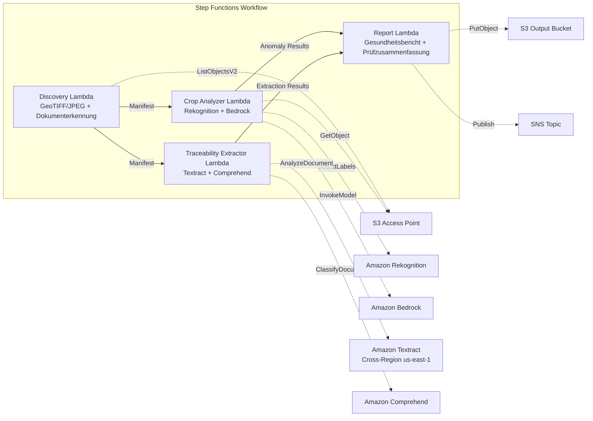

# UC21: Landwirtschaft & Lebensmittel — Analyse landwirtschaftlicher Luftbilder / Verwaltung von Rückverfolgbarkeitsdokumenten

🌐 **Language / 言語**: [日本語](README.md) | [English](README.en.md) | [한국어](README.ko.md) | [简体中文](README.zh-CN.md) | [繁體中文](README.zh-TW.md) | [Français](README.fr.md) | Deutsch | [Español](README.es.md)

📚 **Dokumentation**: [Architektur](docs/architecture.de.md) | [Demo-Leitfaden](docs/demo-guide.de.md)

## Überblick

Ein serverloser Workflow, der die S3 Access Points von FSx for ONTAP nutzt, um die Pflanzengesundheit anhand von Drohnen-/Luftbildern landwirtschaftlicher Flächen zu analysieren und die strukturierte Datenextraktion sowie die Chargenklassifizierung von Rückverfolgbarkeitsdokumenten (Ernteaufzeichnungen, Versandmanifeste, Prüfzertifikate) zu automatisieren.

### Wann dieses Muster geeignet ist

- Drohnen-/Luftbilder (GeoTIFF, GPS-getaggtes JPEG) werden auf FSx for ONTAP gesammelt
- Sie möchten die Pflanzengesundheit (Schädlinge/Krankheiten, Bewässerungsprobleme) mit KI automatisch erkennen
- Sie möchten Chargen-IDs, Datumsangaben, Herkunft und Verantwortliche automatisch aus Rückverfolgbarkeitsdokumenten extrahieren
- Sie möchten Compliance-Aufzeichnungen zur Lebensmittelsicherheit effizient verwalten
- Sie benötigen eine Visualisierung der Anomaliezahlen pro Feld und der betroffenen Bereiche

### Wann dieses Muster nicht geeignet ist

- Eine Echtzeit-Drohnensteuerung und Flugverwaltung ist erforderlich
- Der Aufbau einer kompletten Precision-Agriculture-Plattform ist erforderlich
- Eine Umgebung, in der die Netzwerkerreichbarkeit der ONTAP REST API nicht sichergestellt werden kann

### Hauptfunktionen

- Automatische Erkennung von GeoTIFF/JPEG-Bildern (mit GPS-Metadaten) über S3 AP (max. 500 MB/Bild)
- Vegetationsindex-Analyse und Anomalieklassifizierung mit Rekognition + Bedrock (behält nur Konfidenz ≥ 0,70)
- Strukturierte Datenextraktion aus Rückverfolgbarkeitsdokumenten mit Textract + Comprehend (Klassifizierungskonfidenz ≥ 0,80)
- Pflanzengesundheitsbericht (Anomaliezahlen pro Feld, Anomalietypen, betroffene Koordinaten)
- Rückverfolgbarkeits-Prüfzusammenfassung (Dokumentanzahl pro Charge, Verteilung der Klassifizierungskonfidenz)

## Success Metrics

### Outcome
Optimierung der Pflanzenüberwachung und der Lebensmittelsicherheits-Compliance landwirtschaftlicher Genossenschaften durch Automatisierung der Bildanalyse landwirtschaftlicher Flächen und der Verwaltung von Rückverfolgbarkeitsdokumenten.

### Metrics
| Metrik | Zielwert (Beispiel) |
|-----------|------------|
| Genauigkeit der Erkennung von Pflanzenanomalien | ≥ 70% confidence |
| Rückverfolgbarkeits-Klassifizierungsrate | ≥ 80% confidence |
| Verifizierungsrate der Standortinformationen | ≥ 90 % (Bilder mit GPS-Metadaten) |
| Berichtserstellungszeit | < 120 Sek. / Ausführung |
| Kosten / tägliche Ausführung | < $3.00 |
| Human-Review-Pflichtquote | > 20 % (Erkennungen mit geringer Konfidenz / nicht verifizierte Standorte) |

### Measurement Method
Step-Functions-Ausführungsverlauf, Rekognition/Bedrock-Inferenzprotokolle, Textract/Comprehend-Extraktionsergebnisse, CloudWatch EMF Metrics.

### Human Review Requirements
- Anomalieerkennungen mit einer Konfidenz von 0,70–0,80 werden von landwirtschaftlichen Fachleuten geprüft
- Bilder mit nicht verifiziertem Standort werden manuell den Feldern zugeordnet
- Rückverfolgbarkeitsdokumente mit einer Klassifizierungskonfidenz unter 0,80 werden als "review-required" gekennzeichnet

## Architektur



## Voraussetzungen

> **Hinweis zu S3 AP NetworkOrigin**: Die Discovery Lambda wird innerhalb einer VPC bereitgestellt. Wenn der NetworkOrigin des S3 Access Point `Internet` ist, kann nicht über den S3 Gateway VPC Endpoint darauf zugegriffen werden (da Anfragen nicht an die FSx-Datenebene weitergeleitet werden). Verwenden Sie einen S3 AP mit NetworkOrigin=VPC oder konfigurieren Sie den Zugriff über ein NAT Gateway. Siehe [S3AP Compatibility Notes](../docs/s3ap-compatibility-notes.md) für Details.

- Ein AWS-Konto und geeignete IAM-Berechtigungen
- Ein FSx for ONTAP-Dateisystem (ONTAP 9.17.1P4D3 oder höher)
- Ein Volume mit aktiviertem S3 Access Point
- Eine VPC und private Subnetze
- Aktivierter Amazon Bedrock-Modellzugriff
- Amazon Textract — Cross-Region-Aufruf (us-east-1) konfiguriert

## Bereitstellung

```bash
# Voraussetzung: AWS SAM CLI erforderlich. 'sam build' paketiert den Code und den Shared Layer automatisch.
sam build

sam deploy \
  --stack-name fsxn-agri-traceability \
  --parameter-overrides \
    S3AccessPointAlias=<your-volume-ext-s3alias> \
    S3AccessPointName=<your-s3ap-name> \
    VpcId=<your-vpc-id> \
    PrivateSubnetIds=<subnet-1>,<subnet-2> \
    ScheduleExpression="cron(0 0 * * ? *)" \
    NotificationEmail=<your-email@example.com> \
  --capabilities CAPABILITY_NAMED_IAM \
  --resolve-s3 \
  --region ap-northeast-1
```

> **Hinweis**: `template.yaml` wird mit der SAM CLI (`sam build` + `sam deploy`) verwendet.
> Für die direkte Bereitstellung mit dem Befehl `aws cloudformation deploy` verwenden Sie stattdessen `template-deploy.yaml` (dies erfordert das vorherige Paketieren der Lambda-Zip-Dateien und deren Upload nach S3).

> **LambdaMemorySize**: Der Standardwert ist 512 MB. Für die Verarbeitung von 500-MB-Bildern wird 1024 empfohlen (fügen Sie `LambdaMemorySize=1024` zu den Parameter-Overrides hinzu).

## Kostenschätzung (monatlich, ungefähr)

| Konfiguration | Monatliche Schätzung |
|------|---------|
| Minimale Konfiguration (einmal täglich) | ~$10-25 |
| Standardkonfiguration | ~$25-60 |

---

## ⚠️ Hinweise zur Performance

- Die Durchsatzkapazität von FSx for ONTAP wird **über NFS/SMB/S3 AP hinweg gemeinsam genutzt**. Bei paralleler Verarbeitung mit MapConcurrency=10 können andere Workloads auf demselben Volume beeinträchtigt werden.
- Prüfen Sie bei der Massenverarbeitung großer Dateimengen die Throughput Capacity (MBps) von FSx for ONTAP und passen Sie MapConcurrency entsprechend an.
- Empfohlen: Beginnen Sie in der Produktion mit MapConcurrency=5 und erhöhen Sie den Wert schrittweise, während Sie die CloudWatch-Metrik von FSx for ONTAP (ThroughputUtilization) überwachen.

## Governance Note

> Dieses Muster bietet technische Architekturhinweise. Es stellt keine Rechts-, Compliance- oder Regulierungsberatung dar. Die Verarbeitung von Lebensmittel-Rückverfolgbarkeitsdaten muss dem Lebensmittelhygienegesetz und dem Lebensmittelkennzeichnungsgesetz entsprechen.

> **Zugehörige Vorschriften**: Lebensmittelhygienegesetz, Lebensmittelkennzeichnungsgesetz, JAS-Gesetz

---

## S3AP Compatibility

Siehe [S3AP Compatibility Notes](../docs/s3ap-compatibility-notes.md).
