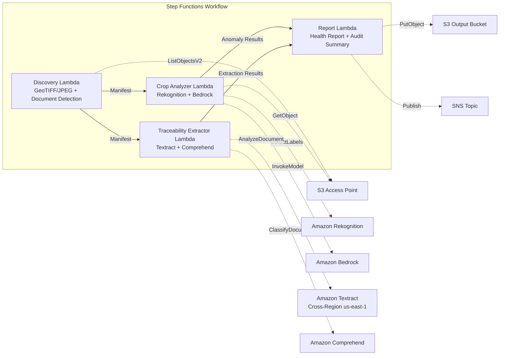

# UC21: Agriculture & Food — Farmland Aerial Imagery Analysis / Traceability Document Management

🌐 **Language / 言語**: [日本語](README.md) | English | [한국어](README.ko.md) | [简体中文](README.zh-CN.md) | [繁體中文](README.zh-TW.md) | [Français](README.fr.md) | [Deutsch](README.de.md) | [Español](README.es.md)

📚 **Documentation**: [Architecture](docs/architecture.en.md) | [Demo Guide](docs/demo-guide.en.md)

## Overview

A serverless workflow that leverages FSx for ONTAP S3 Access Points to analyze crop health from farmland drone/aerial imagery and to automate structured data extraction and lot classification for traceability documents (harvest records, shipping manifests, inspection certificates).

### When to Use This Pattern

- Drone/aerial imagery (GeoTIFF, GPS-tagged JPEG) is accumulated on FSx for ONTAP
- You want to automatically detect crop health issues (pests/diseases, irrigation problems) with AI
- You want to automatically extract lot IDs, dates, origin, and responsible parties from traceability documents
- You want to manage food safety compliance records efficiently
- You need to visualize per-field anomaly counts and affected areas

### When Not to Use This Pattern

- Real-time drone control and flight management is required
- Building an entire precision-agriculture platform is required
- An environment where network reachability to the ONTAP REST API cannot be ensured

### Key Features

- Auto-detection of GeoTIFF/JPEG images (with GPS metadata) via S3 AP (max 500 MB/image)
- Vegetation index analysis and anomaly classification with Rekognition + Bedrock (retains only confidence ≥ 0.70)
- Structured data extraction from traceability documents with Textract + Comprehend (classification confidence ≥ 0.80)
- Crop health report (per-field anomaly counts, anomaly types, affected coordinates)
- Traceability audit summary (document count per lot, classification confidence distribution)

## Success Metrics

### Outcome
Streamline crop monitoring and food safety compliance for agricultural cooperatives by automating farmland image analysis and traceability document management.

### Metrics
| Metric | Target (example) |
|-----------|------------|
| Crop anomaly detection accuracy | ≥ 70% confidence |
| Traceability classification rate | ≥ 80% confidence |
| Geolocation verification rate | ≥ 90% (images with GPS metadata) |
| Report generation time | < 120 sec / run |
| Cost / daily run | < $3.00 |
| Human Review required rate | > 20% (low-confidence detections / unverified locations) |

### Measurement Method
Step Functions execution history, Rekognition/Bedrock inference logs, Textract/Comprehend extraction results, CloudWatch EMF Metrics.

### Human Review Requirements
- Anomaly detections with confidence 0.70–0.80 are reviewed by agricultural experts
- Images with unverified geolocation are mapped to fields manually
- Traceability documents with classification confidence below 0.80 are flagged as "review-required"

## Architecture



## Prerequisites

> **S3 AP NetworkOrigin Note**: The Discovery Lambda is deployed inside a VPC. If the S3 Access Point's NetworkOrigin is `Internet`, it cannot be accessed via the S3 Gateway VPC Endpoint (because requests are not routed to the FSx data plane). Use an S3 AP with NetworkOrigin=VPC, or configure access through a NAT Gateway. See [S3AP Compatibility Notes](../docs/s3ap-compatibility-notes.md) for details.

- An AWS account and appropriate IAM permissions
- An FSx for ONTAP file system (ONTAP 9.17.1P4D3 or later)
- A volume with S3 Access Point enabled
- A VPC and private subnets
- Amazon Bedrock model access enabled
- Amazon Textract — Cross-Region (us-east-1) invocation configured

## Deployment

```bash
# Prerequisite: AWS SAM CLI required. 'sam build' packages the code and shared layer automatically.
sam build

sam deploy \
  --stack-name fsxn-agri-traceability \
  --parameter-overrides \
    S3AccessPointAlias=<your-volume-ext-s3alias> \
    S3AccessPointName=<your-s3ap-name> \
    VpcId=<your-vpc-id> \
    PrivateSubnetIds=<subnet-1>,<subnet-2> \
    ScheduleExpression="cron(0 0 * * ? *)" \
    NotificationEmail=<your-email@example.com> \
  --capabilities CAPABILITY_NAMED_IAM \
  --resolve-s3 \
  --region ap-northeast-1
```

> **Note**: `template.yaml` is used with the SAM CLI (`sam build` + `sam deploy`).
> To deploy directly with the `aws cloudformation deploy` command, use `template-deploy.yaml` instead (this requires pre-packaging the Lambda zip files and uploading them to S3).

> **LambdaMemorySize**: The default is 512 MB. For processing 500 MB images, 1024 is recommended (add `LambdaMemorySize=1024` to the parameter overrides).

## Cost Estimate (Monthly)

| Configuration | Monthly estimate |
|------|---------|
| Minimal (once daily) | ~$10-25 |
| Standard | ~$25-60 |

---

## ⚠️ Performance Considerations

- FSx for ONTAP throughput capacity is **shared across NFS/SMB/S3 AP**. When running parallel processing with MapConcurrency=10, other workloads on the same volume may be affected.
- For bulk processing of large numbers of files, check the FSx for ONTAP Throughput Capacity (MBps) and adjust MapConcurrency as needed.
- Recommended: In production, start with MapConcurrency=5 and increase it gradually while monitoring the FSx for ONTAP CloudWatch metric (ThroughputUtilization).

## Governance Note

> This pattern provides technical architecture guidance. It does not constitute legal, compliance, or regulatory advice. Handling of food traceability data must comply with the Food Sanitation Act and the Food Labeling Act.

> **Related Regulations**: Food Sanitation Act, Food Labeling Act, JAS Act

---

## S3AP Compatibility

See [S3AP Compatibility Notes](../docs/s3ap-compatibility-notes.md).
