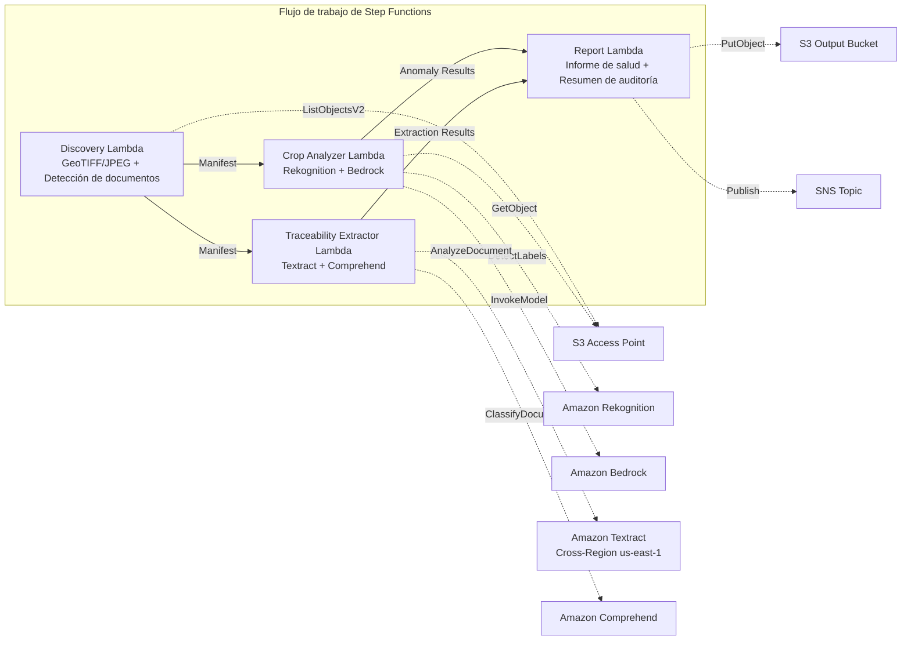

# UC21: Agricultura y alimentación — Análisis de imágenes aéreas de parcelas / Gestión de documentos de trazabilidad

🌐 **Language / 言語**: [日本語](README.md) | [English](README.en.md) | [한국어](README.ko.md) | [简体中文](README.zh-CN.md) | [繁體中文](README.zh-TW.md) | [Français](README.fr.md) | [Deutsch](README.de.md) | Español

📚 **Documentación**: [Arquitectura](docs/architecture.es.md) | [Guía de demostración](docs/demo-guide.es.md)

## Descripción general

Un flujo de trabajo serverless que aprovecha los S3 Access Points de FSx for ONTAP para analizar la salud de los cultivos a partir de imágenes de dron/aéreas de parcelas y automatizar la extracción de datos estructurados y la clasificación por lote de documentos de trazabilidad (registros de cosecha, manifiestos de envío, certificados de inspección).

### Cuándo usar este patrón

- Se acumulan imágenes de dron/aéreas (GeoTIFF, JPEG con GPS) en FSx for ONTAP
- Desea detectar automáticamente la salud de los cultivos (plagas/enfermedades, problemas de riego) con IA
- Desea extraer automáticamente los ID de lote, fechas, origen y responsables de los documentos de trazabilidad
- Desea gestionar de forma eficiente los registros de cumplimiento de seguridad alimentaria
- Necesita visualizar el recuento de anomalías por parcela y las áreas afectadas

### Cuándo no usar este patrón

- Se requiere control de dron y gestión de vuelo en tiempo real
- Se requiere construir una plataforma completa de agricultura de precisión
- Un entorno en el que no se puede garantizar la accesibilidad de red a la API REST de ONTAP

### Funciones principales

- Detección automática de imágenes GeoTIFF/JPEG (con metadatos GPS) a través de S3 AP (máx. 500 MB/imagen)
- Análisis del índice de vegetación y clasificación de anomalías con Rekognition + Bedrock (conserva solo confianza ≥ 0,70)
- Extracción de datos estructurados de documentos de trazabilidad con Textract + Comprehend (confianza de clasificación ≥ 0,80)
- Informe de salud de los cultivos (recuento de anomalías por parcela, tipos de anomalías, coordenadas afectadas)
- Resumen de auditoría de trazabilidad (recuento de documentos por lote, distribución de la confianza de clasificación)

## Success Metrics

### Outcome
Optimizar la monitorización de cultivos y el cumplimiento de la seguridad alimentaria de las cooperativas agrícolas mediante la automatización del análisis de imágenes de parcelas y la gestión de documentos de trazabilidad.

### Metrics
| Métrica | Valor objetivo (ejemplo) |
|-----------|------------|
| Precisión de detección de anomalías de cultivos | ≥ 70% confidence |
| Tasa de clasificación de trazabilidad | ≥ 80% confidence |
| Tasa de verificación de información de ubicación | ≥ 90 % (imágenes con metadatos GPS) |
| Tiempo de generación de informes | < 120 s / ejecución |
| Coste / ejecución diaria | < $3.00 |
| Tasa de Human Review requerida | > 20 % (detecciones de baja confianza / ubicaciones no verificadas) |

### Measurement Method
Historial de ejecución de Step Functions, registros de inferencia de Rekognition/Bedrock, resultados de extracción de Textract/Comprehend, CloudWatch EMF Metrics.

### Human Review Requirements
- Las detecciones de anomalías con confianza de 0,70 a 0,80 son revisadas por expertos agrícolas
- Las imágenes con ubicación no verificada se asignan a parcelas manualmente
- Los documentos de trazabilidad con confianza de clasificación inferior a 0,80 se marcan como "review-required"

## Arquitectura



## Requisitos previos

> **Nota sobre S3 AP NetworkOrigin**: La Discovery Lambda se despliega dentro de una VPC. Si el NetworkOrigin del S3 Access Point es `Internet`, no se puede acceder a él a través del S3 Gateway VPC Endpoint (porque las solicitudes no se enrutan al plano de datos de FSx). Use un S3 AP con NetworkOrigin=VPC, o configure el acceso a través de un NAT Gateway. Consulte [S3AP Compatibility Notes](../docs/s3ap-compatibility-notes.md) para más detalles.

- Una cuenta de AWS y permisos de IAM adecuados
- Un sistema de archivos FSx for ONTAP (ONTAP 9.17.1P4D3 o posterior)
- Un volumen con S3 Access Point habilitado
- Una VPC y subredes privadas
- Acceso a modelos de Amazon Bedrock habilitado
- Amazon Textract — llamada Cross-Region (us-east-1) configurada

## Procedimiento de despliegue

```bash
# Requisito previo: se necesita AWS SAM CLI. 'sam build' empaqueta el código y la capa compartida automáticamente.
sam build

sam deploy \
  --stack-name fsxn-agri-traceability \
  --parameter-overrides \
    S3AccessPointAlias=<your-volume-ext-s3alias> \
    S3AccessPointName=<your-s3ap-name> \
    VpcId=<your-vpc-id> \
    PrivateSubnetIds=<subnet-1>,<subnet-2> \
    ScheduleExpression="cron(0 0 * * ? *)" \
    NotificationEmail=<your-email@example.com> \
  --capabilities CAPABILITY_NAMED_IAM \
  --resolve-s3 \
  --region ap-northeast-1
```

> **Nota**: `template.yaml` se usa con la SAM CLI (`sam build` + `sam deploy`).
> Para desplegar directamente con el comando `aws cloudformation deploy`, use `template-deploy.yaml` en su lugar (esto requiere empaquetar previamente los archivos zip de Lambda y subirlos a S3).

> **LambdaMemorySize**: el valor predeterminado es 512 MB. Para procesar imágenes de 500 MB, se recomienda 1024 (agregue `LambdaMemorySize=1024` a las anulaciones de parámetros).

## Estimación de costos (mensual aproximada)

| Configuración | Estimación mensual |
|------|---------|
| Configuración mínima (una vez al día) | ~$10-25 |
| Configuración estándar | ~$25-60 |

---

## ⚠️ Consideraciones de rendimiento

- La capacidad de rendimiento de FSx for ONTAP se **comparte entre NFS/SMB/S3 AP**. Al ejecutar procesamiento en paralelo con MapConcurrency=10, otras cargas de trabajo en el mismo volumen pueden verse afectadas.
- Para el procesamiento por lotes de grandes cantidades de archivos, verifique la Throughput Capacity (MBps) de FSx for ONTAP y ajuste MapConcurrency según sea necesario.
- Recomendado: en producción, comience con MapConcurrency=5 y auméntelo gradualmente mientras monitorea la métrica de CloudWatch de FSx for ONTAP (ThroughputUtilization).

## Governance Note

> Este patrón proporciona orientación de arquitectura técnica. No constituye asesoramiento legal, de cumplimiento ni regulatorio. El tratamiento de los datos de trazabilidad alimentaria debe cumplir con la ley de higiene alimentaria y la ley de etiquetado de alimentos.

> **Regulaciones relacionadas**: ley de higiene alimentaria, ley de etiquetado de alimentos, ley JAS

---

## S3AP Compatibility

Consulte [S3AP Compatibility Notes](../docs/s3ap-compatibility-notes.md).
