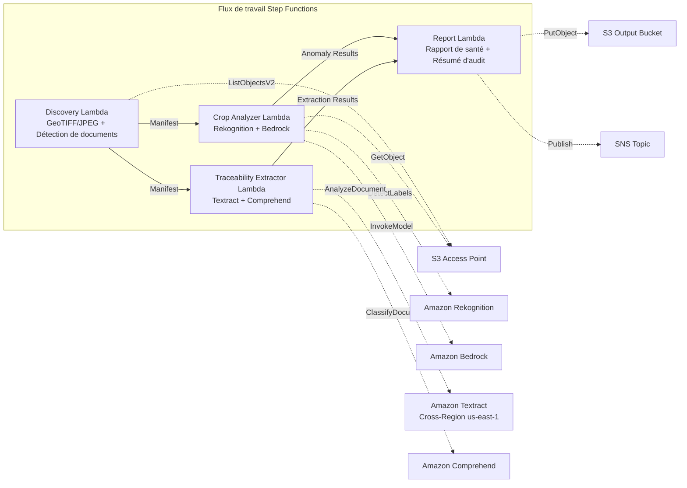

# UC21 : Agriculture et alimentation — Analyse d'imagerie aérienne de parcelles / Gestion des documents de traçabilité

🌐 **Language / 言語**: [日本語](README.md) | [English](README.en.md) | [한국어](README.ko.md) | [简体中文](README.zh-CN.md) | [繁體中文](README.zh-TW.md) | Français | [Deutsch](README.de.md) | [Español](README.es.md)

📚 **Documentation** : [Architecture](docs/architecture.fr.md) | [Guide de démonstration](docs/demo-guide.fr.md)

## Vue d'ensemble

Un workflow serverless qui exploite les S3 Access Points de FSx for ONTAP pour analyser la santé des cultures à partir de l'imagerie drone/aérienne des parcelles et automatiser l'extraction de données structurées et la classification par lot des documents de traçabilité (registres de récolte, manifestes d'expédition, certificats d'inspection).

### Quand utiliser ce modèle

- Des images drone/aériennes (GeoTIFF, JPEG géolocalisées par GPS) sont accumulées sur FSx for ONTAP
- Vous souhaitez détecter automatiquement l'état de santé des cultures (ravageurs/maladies, problèmes d'irrigation) avec l'IA
- Vous souhaitez extraire automatiquement les ID de lot, dates, origines et responsables des documents de traçabilité
- Vous souhaitez gérer efficacement les registres de conformité en matière de sécurité alimentaire
- Vous avez besoin de visualiser le nombre d'anomalies par parcelle et les zones affectées

### Quand ne pas utiliser ce modèle

- Un contrôle de drone et une gestion de vol en temps réel sont requis
- La construction d'une plateforme complète d'agriculture de précision est requise
- Un environnement où la joignabilité réseau vers l'API REST ONTAP ne peut être garantie

### Fonctionnalités principales

- Détection automatique des images GeoTIFF/JPEG (avec métadonnées GPS) via S3 AP (max. 500 Mo/image)
- Analyse d'indice de végétation et classification des anomalies avec Rekognition + Bedrock (conserve uniquement une confiance ≥ 0,70)
- Extraction de données structurées des documents de traçabilité avec Textract + Comprehend (confiance de classification ≥ 0,80)
- Rapport de santé des cultures (nombre d'anomalies par parcelle, types d'anomalies, coordonnées affectées)
- Résumé d'audit de traçabilité (nombre de documents par lot, distribution de la confiance de classification)

## Success Metrics

### Outcome
Rationaliser la surveillance des cultures et la conformité en matière de sécurité alimentaire des coopératives agricoles en automatisant l'analyse d'images de parcelles et la gestion des documents de traçabilité.

### Metrics
| Métrique | Valeur cible (exemple) |
|-----------|------------|
| Précision de détection des anomalies de culture | ≥ 70% confidence |
| Taux de classification de traçabilité | ≥ 80% confidence |
| Taux de vérification des informations de localisation | ≥ 90 % (images avec métadonnées GPS) |
| Temps de génération du rapport | < 120 s / exécution |
| Coût / exécution quotidienne | < $3.00 |
| Taux d'exigence de Human Review | > 20 % (détections à faible confiance / localisations non vérifiées) |

### Measurement Method
Historique d'exécution Step Functions, journaux d'inférence Rekognition/Bedrock, résultats d'extraction Textract/Comprehend, CloudWatch EMF Metrics.

### Human Review Requirements
- Les détections d'anomalies avec une confiance de 0,70 à 0,80 sont vérifiées par des experts agricoles
- Les images dont la localisation n'est pas vérifiée sont mappées manuellement aux parcelles
- Les documents de traçabilité dont la confiance de classification est inférieure à 0,80 sont signalés comme "review-required"

## Architecture



## Prérequis

> **Remarque sur S3 AP NetworkOrigin** : La Discovery Lambda est déployée à l'intérieur d'un VPC. Si le NetworkOrigin du S3 Access Point est `Internet`, il ne peut pas être accédé via le S3 Gateway VPC Endpoint (car les requêtes ne sont pas routées vers le plan de données FSx). Utilisez un S3 AP avec NetworkOrigin=VPC, ou configurez l'accès via un NAT Gateway. Voir [S3AP Compatibility Notes](../docs/s3ap-compatibility-notes.md) pour plus de détails.

- Un compte AWS et des autorisations IAM appropriées
- Un système de fichiers FSx for ONTAP (ONTAP 9.17.1P4D3 ou ultérieur)
- Un volume avec S3 Access Point activé
- Un VPC et des sous-réseaux privés
- Accès aux modèles Amazon Bedrock activé
- Amazon Textract — appel Cross-Region (us-east-1) configuré

## Procédure de déploiement

```bash
# Prérequis : AWS SAM CLI requis. 'sam build' empaquette automatiquement le code et la couche partagée.
sam build

sam deploy \
  --stack-name fsxn-agri-traceability \
  --parameter-overrides \
    S3AccessPointAlias=<your-volume-ext-s3alias> \
    S3AccessPointName=<your-s3ap-name> \
    VpcId=<your-vpc-id> \
    PrivateSubnetIds=<subnet-1>,<subnet-2> \
    ScheduleExpression="cron(0 0 * * ? *)" \
    NotificationEmail=<your-email@example.com> \
  --capabilities CAPABILITY_NAMED_IAM \
  --resolve-s3 \
  --region ap-northeast-1
```

> **Remarque** : `template.yaml` s'utilise avec la SAM CLI (`sam build` + `sam deploy`).
> Pour un déploiement direct avec la commande `aws cloudformation deploy`, utilisez plutôt `template-deploy.yaml` (cela nécessite d'empaqueter au préalable les fichiers zip Lambda et de les téléverser sur S3).

> **LambdaMemorySize** : la valeur par défaut est 512 Mo. Pour le traitement d'images de 500 Mo, 1024 est recommandé (ajoutez `LambdaMemorySize=1024` aux surcharges de paramètres).

## Estimation des coûts (mensuelle approximative)

| Configuration | Estimation mensuelle |
|------|---------|
| Configuration minimale (une fois par jour) | ~$10-25 |
| Configuration standard | ~$25-60 |

---

## ⚠️ Considérations de performance

- La capacité de débit de FSx for ONTAP est **partagée entre NFS/SMB/S3 AP**. Lors d'un traitement parallèle avec MapConcurrency=10, d'autres charges de travail sur le même volume peuvent être affectées.
- Pour le traitement par lots d'un grand nombre de fichiers, vérifiez la Throughput Capacity (MBps) de FSx for ONTAP et ajustez MapConcurrency en conséquence.
- Recommandé : en production, commencez par MapConcurrency=5 et augmentez progressivement tout en surveillant la métrique CloudWatch de FSx for ONTAP (ThroughputUtilization).

## Governance Note

> Ce modèle fournit des conseils d'architecture technique. Il ne constitue pas un avis juridique, de conformité ou réglementaire. Le traitement des données de traçabilité alimentaire doit être conforme à la loi sur l'hygiène alimentaire et à la loi sur l'étiquetage des aliments.

> **Réglementations associées** : loi sur l'hygiène alimentaire, loi sur l'étiquetage des aliments, loi JAS

---

## S3AP Compatibility

Voir [S3AP Compatibility Notes](../docs/s3ap-compatibility-notes.md).
