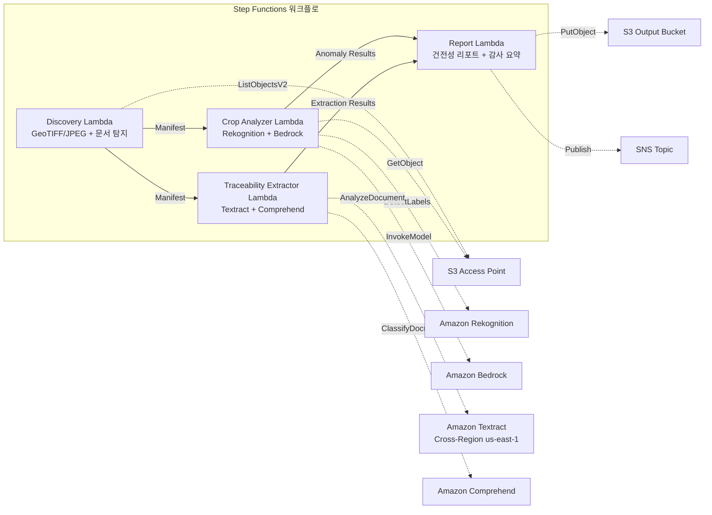

# UC21: 농업·식품 — 농지 항공 이미지 분석 / 트레이서빌리티 문서 관리

🌐 **Language / 言語**: [日本語](README.md) | [English](README.en.md) | 한국어 | [简体中文](README.zh-CN.md) | [繁體中文](README.zh-TW.md) | [Français](README.fr.md) | [Deutsch](README.de.md) | [Español](README.es.md)

📚 **문서**: [아키텍처](docs/architecture.ko.md) | [데모 가이드](docs/demo-guide.ko.md)

## 개요

FSx for ONTAP의 S3 Access Points를 활용하여 농지의 드론/항공 이미지에서 작물 건전성을 분석하고, 트레이서빌리티 문서(수확 기록, 출하 매니페스트, 검사 증명서)의 구조화 데이터 추출 및 로트 분류를 자동화하는 서버리스 워크플로입니다.

### 이 패턴이 적합한 경우

- 드론/항공 촬영 이미지(GeoTIFF, GPS 포함 JPEG)가 FSx for ONTAP에 축적되어 있음
- 작물 건전성(병해충, 관개 문제)을 AI로 자동 검출하고자 함
- 트레이서빌리티 문서에서 로트 ID, 날짜, 산지, 담당자를 자동 추출하고자 함
- 식품 안전 컴플라이언스 기록을 효율적으로 관리하고자 함
- 포장(圃場)별 이상 카운트와 영향 영역의 시각화가 필요함

### 이 패턴이 적합하지 않은 경우

- 실시간 드론 제어·비행 관리가 필요함
- 정밀 농업 플랫폼 전체의 구축이 필요함
- ONTAP REST API에 대한 네트워크 도달성을 확보할 수 없는 환경

### 주요 기능

- S3 AP 경유로 GeoTIFF/JPEG(GPS 메타데이터 포함) 이미지를 자동 검출(최대 500 MB/이미지)
- Rekognition + Bedrock에 의한 식생 지수 분석·이상 분류(신뢰도 ≥ 0.70만 유지)
- Textract + Comprehend에 의한 트레이서빌리티 문서의 구조화 데이터 추출(분류 신뢰도 ≥ 0.80)
- 작물 건전성 리포트(포장별 이상 카운트, 이상 유형, 영향 좌표)
- 트레이서빌리티 감사 요약(로트별 문서 수, 분류 신뢰도 분포)

## Success Metrics

### Outcome
농지 이미지 분석과 트레이서빌리티 문서 관리의 자동화를 통해 농업 협동조합의 작물 모니터링과 식품 안전 컴플라이언스를 효율화합니다.

### Metrics
| 메트릭 | 목표값(예) |
|-----------|------------|
| 작물 이상 검출 정확도 | ≥ 70% confidence |
| 트레이서빌리티 분류율 | ≥ 80% confidence |
| 위치 정보 검증율 | ≥ 90% (GPS 메타데이터 포함 이미지) |
| 리포트 생성 시간 | < 120초 / 실행 |
| 비용 / 일일 실행 | < $3.00 |
| Human Review 필수율 | > 20%(저신뢰도 검출·미검증 위치) |

### Measurement Method
Step Functions 실행 이력, Rekognition/Bedrock 추론 로그, Textract/Comprehend 추출 결과, CloudWatch EMF Metrics.

### Human Review Requirements
- 신뢰도 0.70–0.80의 이상 검출은 농업 전문가가 확인
- 위치 정보 미검증 이미지는 수동으로 포장 매핑
- 분류 신뢰도 0.80 미만의 트레이서빌리티 문서는 "review-required"로 플래그

## 아키텍처



## 사전 요구 사항

> **S3 AP NetworkOrigin 주의**: Discovery Lambda는 VPC 내에 배치됩니다. S3 Access Point의 NetworkOrigin이 `Internet`인 경우, S3 Gateway VPC Endpoint 경유로는 액세스할 수 없습니다(FSx 데이터 플레인으로 라우팅되지 않기 때문). NetworkOrigin=VPC의 S3 AP를 사용하거나 NAT Gateway 경유 액세스를 구성하세요. 자세한 내용은 [S3AP Compatibility Notes](../docs/s3ap-compatibility-notes.md)를 참조하세요.

- AWS 계정과 적절한 IAM 권한
- FSx for ONTAP 파일 시스템(ONTAP 9.17.1P4D3 이상)
- S3 Access Point가 활성화된 볼륨
- VPC, 프라이빗 서브넷
- Amazon Bedrock 모델 액세스 활성화
- Amazon Textract — Cross-Region (us-east-1) 호출 구성

## 배포 절차

```bash
# 전제: AWS SAM CLI가 필요합니다. sam build가 코드와 공유 레이어를 자동으로 패키징합니다.
sam build

sam deploy \
  --stack-name fsxn-agri-traceability \
  --parameter-overrides \
    S3AccessPointAlias=<your-volume-ext-s3alias> \
    S3AccessPointName=<your-s3ap-name> \
    VpcId=<your-vpc-id> \
    PrivateSubnetIds=<subnet-1>,<subnet-2> \
    ScheduleExpression="cron(0 0 * * ? *)" \
    NotificationEmail=<your-email@example.com> \
  --capabilities CAPABILITY_NAMED_IAM \
  --resolve-s3 \
  --region ap-northeast-1
```

> **주의**: `template.yaml`은 SAM CLI(`sam build` + `sam deploy`)로 사용합니다.
> `aws cloudformation deploy` 명령으로 직접 배포하는 경우에는 `template-deploy.yaml`을 사용하세요(Lambda zip 파일의 사전 패키징과 S3 업로드가 필요합니다).

> **LambdaMemorySize**: 기본값은 512 MB입니다. 500MB 이미지 처리 시에는 1024 권장(`LambdaMemorySize=1024`를 파라미터 오버라이드에 추가).

## 비용 예상(월간 개략)

| 구성 | 월간 개략 |
|------|---------|
| 최소 구성(일 1회) | ~$10-25 |
| 표준 구성 | ~$25-60 |

---

## ⚠️ 성능 관련 주의 사항

- FSx for ONTAP의 스루풋 용량은 **NFS/SMB/S3 AP 전체에서 공유**됩니다. MapConcurrency=10으로 병렬 처리를 수행할 경우 동일 볼륨의 다른 워크로드에 영향을 줄 수 있습니다.
- 대량 파일의 일괄 처리를 수행할 경우 FSx for ONTAP의 Throughput Capacity (MBps)를 확인하고 필요에 따라 MapConcurrency를 조정하세요.
- 권장: 프로덕션 환경에서는 처음에 MapConcurrency=5로 시작하고, FSx for ONTAP의 CloudWatch 메트릭(ThroughputUtilization)을 모니터링하면서 단계적으로 증가시키세요.

## Governance Note

> 본 패턴은 기술 아키텍처 가이던스를 제공합니다. 법적·컴플라이언스·규제상의 조언이 아닙니다. 식품 트레이서빌리티 데이터의 취급은 식품위생법 및 식품표시법을 준수해야 합니다.

> **관련 규제**: 식품위생법, 식품표시법, JAS 법

---

## S3AP Compatibility

[S3AP Compatibility Notes](../docs/s3ap-compatibility-notes.md)를 참조하세요.
