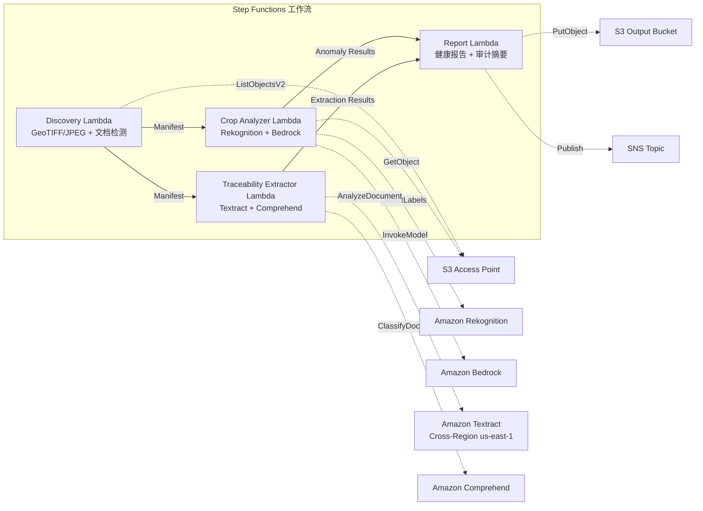

# UC21：农业·食品 — 农田航空影像分析 / 可追溯性文档管理

🌐 **Language / 言語**: [日本語](README.md) | [English](README.en.md) | [한국어](README.ko.md) | 简体中文 | [繁體中文](README.zh-TW.md) | [Français](README.fr.md) | [Deutsch](README.de.md) | [Español](README.es.md)

📚 **文档**: [架构](docs/architecture.zh-CN.md) | [演示指南](docs/demo-guide.zh-CN.md)

## 概述

一个利用 FSx for ONTAP 的 S3 Access Points 的无服务器工作流，从农田的无人机/航空影像中分析作物健康状况，并自动化可追溯性文档（收获记录、发货清单、检验证书）的结构化数据提取与批次分类。

### 适合使用此模式的场景

- 无人机/航空拍摄影像（GeoTIFF、带 GPS 的 JPEG）已积累在 FSx for ONTAP 中
- 希望用 AI 自动检测作物健康状况（病虫害、灌溉问题）
- 希望从可追溯性文档中自动提取批次 ID、日期、产地、责任人
- 希望高效管理食品安全合规记录
- 需要按田块可视化异常计数与受影响区域

### 不适合使用此模式的场景

- 需要实时无人机控制·飞行管理
- 需要构建整个精准农业平台
- 无法确保对 ONTAP REST API 的网络可达性的环境

### 主要功能

- 通过 S3 AP 自动检测 GeoTIFF/JPEG（带 GPS 元数据）影像（最大 500 MB/影像）
- 基于 Rekognition + Bedrock 的植被指数分析·异常分类（仅保留置信度 ≥ 0.70）
- 基于 Textract + Comprehend 的可追溯性文档结构化数据提取（分类置信度 ≥ 0.80）
- 作物健康报告（按田块的异常计数、异常类型、受影响坐标）
- 可追溯性审计摘要（按批次的文档数、分类置信度分布）

## Success Metrics

### Outcome
通过农田影像分析与可追溯性文档管理的自动化，提升农业合作社的作物监测与食品安全合规效率。

### Metrics
| 指标 | 目标值（示例） |
|-----------|------------|
| 作物异常检测精度 | ≥ 70% confidence |
| 可追溯性分类率 | ≥ 80% confidence |
| 位置信息验证率 | ≥ 90%（带 GPS 元数据的影像） |
| 报告生成时间 | < 120 秒 / 执行 |
| 成本 / 每日执行 | < $3.00 |
| Human Review 必需率 | > 20%（低置信度检测·未验证位置） |

### Measurement Method
Step Functions 执行历史、Rekognition/Bedrock 推理日志、Textract/Comprehend 提取结果、CloudWatch EMF Metrics。

### Human Review Requirements
- 置信度 0.70–0.80 的异常检测由农业专家确认
- 位置信息未验证的影像手动进行田块映射
- 分类置信度低于 0.80 的可追溯性文档标记为 "review-required"

## 架构



## 前提条件

> **S3 AP NetworkOrigin 注意**：Discovery Lambda 部署在 VPC 内。若 S3 Access Point 的 NetworkOrigin 为 `Internet`，则无法通过 S3 Gateway VPC Endpoint 访问（因为请求不会路由到 FSx 数据平面）。请使用 NetworkOrigin=VPC 的 S3 AP，或配置经由 NAT Gateway 的访问。详情请参阅 [S3AP Compatibility Notes](../docs/s3ap-compatibility-notes.md)。

- AWS 账户与适当的 IAM 权限
- FSx for ONTAP 文件系统（ONTAP 9.17.1P4D3 或更高版本）
- 已启用 S3 Access Point 的卷
- VPC、私有子网
- 已启用 Amazon Bedrock 模型访问
- Amazon Textract — Cross-Region (us-east-1) 调用配置

## 部署步骤

```bash
# 前提：需要 AWS SAM CLI。sam build 会自动打包代码与共享层。
sam build

sam deploy \
  --stack-name fsxn-agri-traceability \
  --parameter-overrides \
    S3AccessPointAlias=<your-volume-ext-s3alias> \
    S3AccessPointName=<your-s3ap-name> \
    VpcId=<your-vpc-id> \
    PrivateSubnetIds=<subnet-1>,<subnet-2> \
    ScheduleExpression="cron(0 0 * * ? *)" \
    NotificationEmail=<your-email@example.com> \
  --capabilities CAPABILITY_NAMED_IAM \
  --resolve-s3 \
  --region ap-northeast-1
```

> **注意**：`template.yaml` 用于 SAM CLI（`sam build` + `sam deploy`）。
> 若使用 `aws cloudformation deploy` 命令直接部署，请改用 `template-deploy.yaml`（需要预先打包 Lambda zip 文件并上传到 S3）。

> **LambdaMemorySize**：默认为 512 MB。处理 500MB 影像时推荐 1024（在参数覆盖中添加 `LambdaMemorySize=1024`）。

## 成本估算（每月概算）

| 配置 | 每月概算 |
|------|---------|
| 最小配置（每日 1 次） | ~$10-25 |
| 标准配置 | ~$25-60 |

---

## ⚠️ 性能注意事项

- FSx for ONTAP 的吞吐容量在 **NFS/SMB/S3 AP 之间共享**。以 MapConcurrency=10 进行并行处理时，可能会影响同一卷上的其他工作负载。
- 进行大量文件的批量处理时，请确认 FSx for ONTAP 的 Throughput Capacity (MBps)，并根据需要调整 MapConcurrency。
- 建议：在生产环境中先以 MapConcurrency=5 开始，并在监控 FSx for ONTAP 的 CloudWatch 指标（ThroughputUtilization）的同时逐步增加。

## Governance Note

> 本模式提供技术架构指导。它不构成法律、合规或监管方面的建议。食品可追溯性数据的处理必须符合食品卫生法和食品标示法。

> **相关法规**：食品卫生法、食品标示法、JAS 法

---

## S3AP Compatibility

请参阅 [S3AP Compatibility Notes](../docs/s3ap-compatibility-notes.md)。
