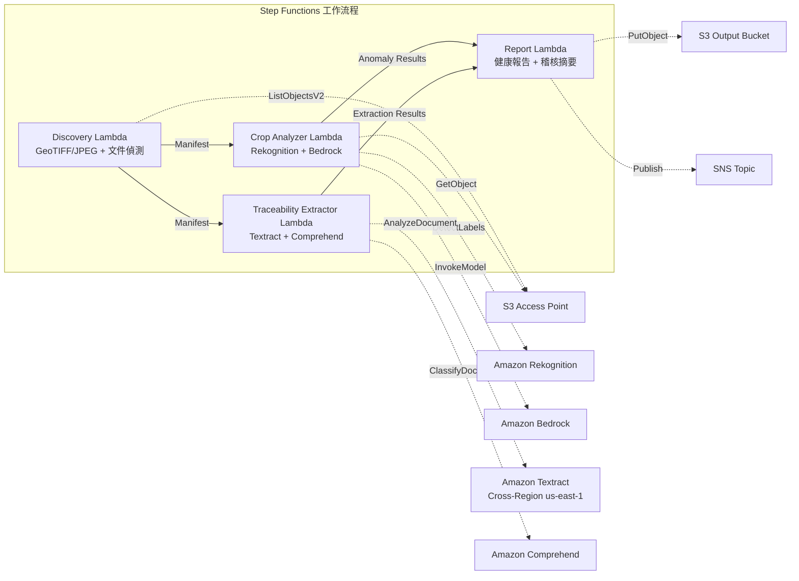

# UC21：農業·食品 — 農田航空影像分析 / 可追溯性文件管理

🌐 **Language / 言語**: [日本語](README.md) | [English](README.en.md) | [한국어](README.ko.md) | [简体中文](README.zh-CN.md) | 繁體中文 | [Français](README.fr.md) | [Deutsch](README.de.md) | [Español](README.es.md)

📚 **文件**: [架構](docs/architecture.zh-TW.md) | [示範指南](docs/demo-guide.zh-TW.md)

## 概述

一個利用 FSx for ONTAP 的 S3 Access Points 的無伺服器工作流程，從農田的無人機/航空影像中分析作物健康狀況，並自動化可追溯性文件（收穫記錄、出貨清單、檢驗證書）的結構化資料擷取與批次分類。

### 適合使用此模式的情境

- 無人機/航空拍攝影像（GeoTIFF、含 GPS 的 JPEG）已累積在 FSx for ONTAP 中
- 希望以 AI 自動偵測作物健康狀況（病蟲害、灌溉問題）
- 希望從可追溯性文件中自動擷取批次 ID、日期、產地、負責人
- 希望有效率地管理食品安全合規記錄
- 需要依田區可視化異常計數與受影響區域

### 不適合使用此模式的情境

- 需要即時無人機控制·飛行管理
- 需要建構整個精準農業平台
- 無法確保對 ONTAP REST API 的網路可達性的環境

### 主要功能

- 透過 S3 AP 自動偵測 GeoTIFF/JPEG（含 GPS 中繼資料）影像（最大 500 MB/影像）
- 基於 Rekognition + Bedrock 的植被指數分析·異常分類（僅保留信賴度 ≥ 0.70）
- 基於 Textract + Comprehend 的可追溯性文件結構化資料擷取（分類信賴度 ≥ 0.80）
- 作物健康報告（依田區的異常計數、異常類型、受影響座標）
- 可追溯性稽核摘要（依批次的文件數、分類信賴度分布）

## Success Metrics

### Outcome
透過農田影像分析與可追溯性文件管理的自動化，提升農業合作社的作物監測與食品安全合規效率。

### Metrics
| 指標 | 目標值（範例） |
|-----------|------------|
| 作物異常偵測精度 | ≥ 70% confidence |
| 可追溯性分類率 | ≥ 80% confidence |
| 位置資訊驗證率 | ≥ 90%（含 GPS 中繼資料的影像） |
| 報告產生時間 | < 120 秒 / 執行 |
| 成本 / 每日執行 | < $3.00 |
| Human Review 必需率 | > 20%（低信賴度偵測·未驗證位置） |

### Measurement Method
Step Functions 執行歷程、Rekognition/Bedrock 推論記錄、Textract/Comprehend 擷取結果、CloudWatch EMF Metrics。

### Human Review Requirements
- 信賴度 0.70–0.80 的異常偵測由農業專家確認
- 位置資訊未驗證的影像手動進行田區對應
- 分類信賴度低於 0.80 的可追溯性文件標記為 "review-required"

## 架構



## 先決條件

> **S3 AP NetworkOrigin 注意**：Discovery Lambda 部署在 VPC 內。若 S3 Access Point 的 NetworkOrigin 為 `Internet`，則無法透過 S3 Gateway VPC Endpoint 存取（因為請求不會路由到 FSx 資料平面）。請使用 NetworkOrigin=VPC 的 S3 AP，或設定經由 NAT Gateway 的存取。詳情請參閱 [S3AP Compatibility Notes](../docs/s3ap-compatibility-notes.md)。

- AWS 帳戶與適當的 IAM 權限
- FSx for ONTAP 檔案系統（ONTAP 9.17.1P4D3 或更新版本）
- 已啟用 S3 Access Point 的磁碟區
- VPC、私有子網路
- 已啟用 Amazon Bedrock 模型存取
- Amazon Textract — Cross-Region (us-east-1) 呼叫設定

## 部署步驟

```bash
# 前提：需要 AWS SAM CLI。sam build 會自動封裝程式碼與共用層。
sam build

sam deploy \
  --stack-name fsxn-agri-traceability \
  --parameter-overrides \
    S3AccessPointAlias=<your-volume-ext-s3alias> \
    S3AccessPointName=<your-s3ap-name> \
    VpcId=<your-vpc-id> \
    PrivateSubnetIds=<subnet-1>,<subnet-2> \
    ScheduleExpression="cron(0 0 * * ? *)" \
    NotificationEmail=<your-email@example.com> \
  --capabilities CAPABILITY_NAMED_IAM \
  --resolve-s3 \
  --region ap-northeast-1
```

> **注意**：`template.yaml` 用於 SAM CLI（`sam build` + `sam deploy`）。
> 若使用 `aws cloudformation deploy` 命令直接部署，請改用 `template-deploy.yaml`（需要預先封裝 Lambda zip 檔案並上傳到 S3）。

> **LambdaMemorySize**：預設為 512 MB。處理 500MB 影像時建議 1024（在參數覆寫中新增 `LambdaMemorySize=1024`）。

## 成本估算（每月概算）

| 配置 | 每月概算 |
|------|---------|
| 最小配置（每日 1 次） | ~$10-25 |
| 標準配置 | ~$25-60 |

---

## ⚠️ 效能注意事項

- FSx for ONTAP 的吞吐容量在 **NFS/SMB/S3 AP 之間共用**。以 MapConcurrency=10 進行並行處理時，可能會影響同一磁碟區上的其他工作負載。
- 進行大量檔案的批次處理時，請確認 FSx for ONTAP 的 Throughput Capacity (MBps)，並視需要調整 MapConcurrency。
- 建議：在生產環境中先以 MapConcurrency=5 開始，並在監控 FSx for ONTAP 的 CloudWatch 指標（ThroughputUtilization）的同時逐步增加。

## Governance Note

> 本模式提供技術架構指引。它不構成法律、合規或法規方面的建議。食品可追溯性資料的處理必須符合食品衛生法與食品標示法。

> **相關法規**：食品衛生法、食品標示法、JAS 法

---

## S3AP Compatibility

請參閱 [S3AP Compatibility Notes](../docs/s3ap-compatibility-notes.md)。
