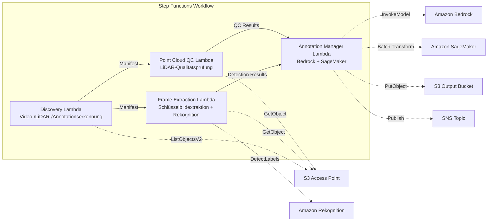

# UC9: Autonomes Fahren / ADAS — Bild- und LiDAR-Vorverarbeitung, Qualitätsprüfung, Annotation

🌐 **Language / 言語**: [日本語](README.md) | [English](README.en.md) | [한국어](README.ko.md) | [简体中文](README.zh-CN.md) | [繁體中文](README.zh-TW.md) | [Français](README.fr.md) | Deutsch | [Español](README.es.md)

📚 **Dokumentation**: [Architekturdiagramm](docs/architecture.de.md) | [Demo-Leitfaden](docs/demo-guide.de.md)

## Übersicht

Dies ist ein serverloser Workflow, der die S3 Access Points von Amazon FSx for NetApp ONTAP nutzt, um die Vorverarbeitung, Qualitätsprüfung und Annotationsverwaltung von Dashcam-Videos und LiDAR-Punktwolkendaten zu automatisieren.

### Fälle, in denen dieses Muster geeignet ist

- Eine große Menge an Dashcam-Videos und LiDAR-Punktwolkendaten ist auf FSx for ONTAP gespeichert
- Sie möchten die Extraktion von Schlüsselbildern aus Videos und die Objekterkennung (Fahrzeuge, Fußgänger, Verkehrszeichen) automatisieren
- Sie möchten regelmäßig Qualitätsprüfungen der LiDAR-Punktwolken durchführen (Punktdichte, Koordinatenkonsistenz)
- Sie möchten Annotations-Metadaten im COCO-kompatiblen Format verwalten
- Sie möchten die Punktwolken-Segmentierungsinferenz mit SageMaker Batch Transform integrieren

### Fälle, in denen dieses Muster nicht geeignet ist

- Eine Echtzeit-Inferenz-Pipeline für autonomes Fahren ist erforderlich
- Video-Transcodierung in großem Umfang (MediaConvert / EC2 ist besser geeignet)
- Vollständige LiDAR-SLAM-Verarbeitung (ein HPC-Cluster ist besser geeignet)
- Umgebungen, in denen die Netzwerkerreichbarkeit der ONTAP REST API nicht gewährleistet werden kann

### Hauptfunktionen

- Automatische Erkennung von Videos (.mp4, .avi, .mkv), LiDAR (.pcd, .las, .laz, .ply) und Annotationen (.json) über den S3 AP
- Objekterkennung (Fahrzeuge, Fußgänger, Verkehrszeichen, Fahrbahnmarkierungen) mit Rekognition DetectLabels
- Qualitätsprüfung von LiDAR-Punktwolken (point_count, coordinate_bounds, point_density, NaN-Validierung)
- Generierung von Annotationsvorschlägen mit Bedrock
- Punktwolken-Segmentierungsinferenz mit SageMaker Batch Transform
- Annotationsausgabe im COCO-kompatiblen JSON-Format

## Success Metrics

### Outcome
Durch die Automatisierung der Video-/LiDAR-Vorverarbeitung und Qualitätsprüfung wird die ADAS-Datenpipeline effizienter gestaltet.

### Metrics
| Metrik | Zielwert (Beispiel) |
|-----------|------------|
| Verarbeitete Frames / Ausführung | > 1.000 frames |
| Bestehensquote der Qualitätsprüfung | > 90 % |
| Annotations-Vorverarbeitungszeit | < 1 Minute / Frame |
| Verarbeitungsdurchsatz | > 500 frames/hour |
| Kosten / Ausführung | < 20 $ |
| Human-Review-Anteil | < 10 % (Frames, die die Qualitätsprüfung nicht bestehen) |

### Measurement Method
Step Functions-Ausführungsverlauf, Rekognition-/SageMaker-Inferenzergebnisse, CloudWatch Metrics, DynamoDB Task Token.

## Architektur



### Workflow-Schritte

1. **Discovery**: Video-, LiDAR- und Annotationsdateien vom S3 AP erkennen
2. **Frame Extraction**: Schlüsselbilder aus Videos extrahieren und Objekterkennung mit Rekognition durchführen
3. **Point Cloud QC**: Header-Metadaten aus LiDAR-Punktwolken extrahieren und Qualität überprüfen
4. **Annotation Manager**: Annotationsvorschläge mit Bedrock generieren, Punktwolken-Segmentierung mit SageMaker durchführen

## Voraussetzungen

- AWS-Konto und angemessene IAM-Berechtigungen
- FSx for ONTAP-Dateisystem (ONTAP 9.17.1P4D3 oder höher)
- Volume mit aktiviertem S3 Access Point (zur Speicherung von Video- und LiDAR-Daten)
- VPC, private Subnetze
- Amazon Bedrock-Modellzugriff aktiviert (Claude / Nova)
- SageMaker-Endpunkt (Punktwolken-Segmentierungsmodell) — optional

## Bereitstellungsschritte

### 1. SAM-Bereitstellung

```bash
# Voraussetzung: AWS SAM CLI erforderlich. „sam build“ verpackt Code und Shared Layer automatisch.
sam build

sam deploy \
  --stack-name fsxn-autonomous-driving \
  --parameter-overrides \
    S3AccessPointAlias=<your-volume-ext-s3alias> \
    S3AccessPointName=<your-s3ap-name> \
    VpcId=<your-vpc-id> \
    PrivateSubnetIds=<subnet-1>,<subnet-2> \
    ScheduleExpression="rate(1 hour)" \
    NotificationEmail=<your-email@example.com> \
    EnableVpcEndpoints=false \
    EnableCloudWatchAlarms=false \
  --capabilities CAPABILITY_NAMED_IAM \
  --resolve-s3 \
  --region ap-northeast-1
```

> **Hinweis**: `template.yaml` ist für die Verwendung mit der SAM CLI (`sam build` + `sam deploy`) vorgesehen.
> Für eine direkte Bereitstellung mit dem Befehl `aws cloudformation deploy` verwenden Sie stattdessen `template-deploy.yaml` (erfordert das vorherige Packen der Lambda-Zip-Dateien und das Hochladen auf S3).

## Liste der Konfigurationsparameter

| Parameter | Beschreibung | Standard | Erforderlich |
|-----------|------|----------|------|
| `S3AccessPointAlias` | FSx for ONTAP S3 AP Alias (für Eingabe) | — | ✅ |
| `S3AccessPointName` | S3-AP-Name (für ARN-basierte IAM-Berechtigungsvergabe; wenn ausgelassen, nur Alias-basiert) | `""` | ⚠️ Empfohlen |
| `ScheduleExpression` | EventBridge Scheduler-Zeitplanausdruck | `rate(1 hour)` | |
| `VpcId` | VPC-ID | — | ✅ |
| `PrivateSubnetIds` | Liste der privaten Subnetz-IDs | — | ✅ |
| `NotificationEmail` | SNS-Benachrichtigungs-E-Mail-Adresse | — | ✅ |
| `FrameExtractionInterval` | Intervall der Schlüsselbildextraktion (Sekunden) | `5` | |
| `MapConcurrency` | Anzahl paralleler Ausführungen im Map-Status | `5` | |
| `LambdaMemorySize` | Lambda-Speichergröße (MB) | `2048` | |
| `LambdaTimeout` | Lambda-Timeout (Sekunden) | `600` | |
| `EnableVpcEndpoints` | Interface VPC Endpoints aktivieren | `false` | |
| `EnableCloudWatchAlarms` | CloudWatch Alarms aktivieren | `false` | |

## Bereinigung

```bash
aws s3 rm s3://fsxn-autonomous-driving-output-${AWS_ACCOUNT_ID} --recursive

aws cloudformation delete-stack \
  --stack-name fsxn-autonomous-driving \
  --region ap-northeast-1

aws cloudformation wait stack-delete-complete \
  --stack-name fsxn-autonomous-driving \
  --region ap-northeast-1
```

## Referenzlinks

- [Übersicht über S3 Access Points für FSx for ONTAP](https://docs.aws.amazon.com/fsx/latest/ONTAPGuide/accessing-data-via-s3-access-points.html)
- [Amazon Rekognition Labelerkennung](https://docs.aws.amazon.com/rekognition/latest/dg/labels.html)
- [Amazon SageMaker Batch Transform](https://docs.aws.amazon.com/sagemaker/latest/dg/batch-transform.html)
- [COCO-Datenformat](https://cocodataset.org/#format-data)
- [Spezifikation des LAS-Dateiformats](https://www.asprs.org/divisions-committees/lidar-division/laser-las-file-format-exchange-activities)

## SageMaker Batch Transform-Integration (Phase 3)

In Phase 3 steht die **LiDAR-Punktwolken-Segmentierungsinferenz mit SageMaker Batch Transform** optional zur Verfügung. Sie verwendet das Callback Pattern von Step Functions (`.waitForTaskToken`), um asynchron auf den Abschluss der Batch-Inferenz-Jobs zu warten.

### Aktivierung

```bash
# Voraussetzung: AWS SAM CLI erforderlich. „sam build“ verpackt Code und Shared Layer automatisch.
sam build

sam deploy \
  --stack-name fsxn-autonomous-driving \
  --parameter-overrides \
    EnableSageMakerTransform=true \
    MockMode=true \
    ... # weitere Parameter
  --capabilities CAPABILITY_NAMED_IAM \
  --resolve-s3
```

### Workflow

```
Discovery → Frame Extraction → Point Cloud QC
  → [EnableSageMakerTransform=true] SageMaker Invoke (.waitForTaskToken)
  → SageMaker Batch Transform Job
  → EventBridge (job state change) → SageMaker Callback (SendTaskSuccess/Failure)
  → Annotation Manager (Rekognition + Integration der SageMaker-Ergebnisse)
```

### Mock-Modus

In der Testumgebung können Sie mit `MockMode=true` (Standardeinstellung) den Datenfluss des Callback Pattern überprüfen, ohne ein echtes SageMaker-Modell bereitzustellen.

- **MockMode=true**: Generiert eine Mock-Segmentierungsausgabe (zufällige Labels in gleicher Anzahl wie der Eingabe-`point_count`), ohne die SageMaker-API aufzurufen, und ruft SendTaskSuccess direkt auf
- **MockMode=false**: Führt den tatsächlichen SageMaker CreateTransformJob aus. Das Modell muss zuvor bereitgestellt sein

### Konfigurationsparameter (in Phase 3 hinzugefügt)

| Parameter | Beschreibung | Standard |
|-----------|------|----------|
| `EnableSageMakerTransform` | SageMaker Batch Transform aktivieren | `false` |
| `MockMode` | Mock-Modus (für Tests) | `true` |
| `SageMakerModelName` | SageMaker-Modellname | — |
| `SageMakerInstanceType` | Batch Transform-Instanztyp | `ml.m5.xlarge` |

## Unterstützte Regionen

UC9 verwendet die folgenden Dienste:

| Dienst | Regionale Einschränkung |
|---------|-------------|
| Amazon Rekognition | In fast allen Regionen verfügbar |
| Amazon Bedrock | Unterstützte Regionen prüfen ([Von Bedrock unterstützte Regionen](https://docs.aws.amazon.com/general/latest/gr/bedrock.html)) |
| SageMaker Batch Transform | In fast allen Regionen verfügbar (die Verfügbarkeit der Instanztypen variiert je nach Region) |
| AWS X-Ray | In fast allen Regionen verfügbar |
| CloudWatch EMF | In fast allen Regionen verfügbar |

> Wenn Sie SageMaker Batch Transform aktivieren, überprüfen Sie vor der Bereitstellung die Verfügbarkeit der Instanztypen in der Zielregion in der [AWS Regional Services List](https://aws.amazon.com/about-aws/global-infrastructure/regional-product-services/). Weitere Informationen finden Sie in der [Regionskompatibilitätsmatrix](../docs/region-compatibility.md).

---

## AWS-Dokumentationslinks

| Dienst | Dokumentation |
|---------|------------|
| FSx for ONTAP | [Benutzerhandbuch](https://docs.aws.amazon.com/fsx/latest/ONTAPGuide/what-is-fsx-ontap.html) |
| S3 Access Points | [S3 AP for FSx for ONTAP](https://docs.aws.amazon.com/fsx/latest/ONTAPGuide/s3-access-points.html) |
| Step Functions | [Entwicklerhandbuch](https://docs.aws.amazon.com/step-functions/latest/dg/welcome.html) |
| Amazon Rekognition | [Entwicklerhandbuch](https://docs.aws.amazon.com/rekognition/latest/dg/what-is.html) |
| Amazon SageMaker | [Entwicklerhandbuch](https://docs.aws.amazon.com/sagemaker/latest/dg/whatis.html) |
| Amazon Bedrock | [Benutzerhandbuch](https://docs.aws.amazon.com/bedrock/latest/userguide/what-is-bedrock.html) |

### Well-Architected Framework-Ausrichtung

| Säule | Ausrichtung |
|----|------|
| Operative Exzellenz | X-Ray-Tracing, EMF-Metriken, SageMaker-Job-Überwachung |
| Sicherheit | IAM mit geringsten Rechten, KMS-Verschlüsselung, Zugriffskontrolle für Video-/LiDAR-Daten |
| Zuverlässigkeit | Step Functions Retry/Catch, SageMaker-Callback-Wiederholungen |
| Leistungseffizienz | Parallele Frame-Verarbeitung, SageMaker Batch Transform |
| Kostenoptimierung | Serverlos, Unterstützung von SageMaker Spot-Instanzen |
| Nachhaltigkeit | On-Demand-Ausführung, inkrementelle Verarbeitung (nur neue Frames) |

---

## Kostenschätzung (monatliche Näherung)

> **Anmerkung**: Das Folgende ist eine Näherung für die Region ap-northeast-1; die tatsächlichen Kosten variieren je nach Nutzung. Prüfen Sie die aktuellen Preise mit dem [AWS Pricing Calculator](https://calculator.aws/).

### Serverlose Komponenten (nutzungsbasierte Abrechnung)

| Dienst | Stückpreis | Angenommene Nutzung | Monatliche Näherung |
|---------|------|-----------|---------|
| Lambda | $0.0000166667/GB-sec | 9 Funktionen × 200 frames/Tag | ~$1-5 |
| S3 API (GetObject/ListObjects) | $0.0047/10K requests | ~10K requests/Tag | ~$1.5 |
| Step Functions | $0.025/1K state transitions | ~1K transitions/Tag | ~$0.75 |
| Bedrock (Nova Lite) | $0.00006/1K input tokens | ~100K tokens/Ausführung | ~$3-10 |
| Athena | $5/TB scanned | ~100 MB/Abfrage | ~$0.5-2 |
| SNS | $0.50/100K notifications | ~100 notifications/Tag | ~$0.15 |
| CloudWatch Logs | $0.76/GB ingested | ~1 GB/Monat | ~$0.76 |
| SageMaker Inference | $0.046/hour (ml.m5.large) |

### Fixkosten (FSx for ONTAP — setzt eine bestehende Umgebung voraus)

| Komponente | Monatlich |
|--------------|------|
| FSx for ONTAP (128 MBps, 1 TB) | ~$230 (mit bestehender Umgebung geteilt) |
| S3 Access Point | Keine zusätzlichen Kosten (nur S3-API-Kosten) |

### Gesamtnäherung

| Konfiguration | Monatliche Näherung |
|------|---------|
| Minimal (tägliche Ausführung) | ~$5-15 |
| Standard (stündliche Ausführung) | ~$15-50 |
| Große Skalierung (hohe Frequenz + Alarme) | ~$50-150 |

> **Governance Caveat**: Kostenschätzungen sind Näherungswerte, keine garantierten Werte. Die tatsächlichen Gebühren variieren je nach Nutzungsmustern, Datenvolumen und Region.

---

## Lokales Testen

### Prüfung der Prerequisites

```bash
# Voraussetzungen prüfen
aws --version          # AWS CLI v2
sam --version          # SAM CLI
python3 --version      # Python 3.9+
docker --version       # Docker (für sam local)
aws sts get-caller-identity  # AWS-Anmeldeinformationen
```

### sam local invoke

```bash
# Build
# Voraussetzung: AWS SAM CLI erforderlich. „sam build“ verpackt Code und Shared Layer automatisch.
sam build

# Discovery Lambda lokal ausführen
sam local invoke DiscoveryFunction --event events/discovery-event.json

# Mit Überschreibung der Umgebungsvariablen
sam local invoke DiscoveryFunction \
  --event events/discovery-event.json \
  --env-vars env.json
```

### Unit-Tests

```bash
python3 -m pytest tests/ -v
```

Weitere Informationen finden Sie im [Schnellstart für lokales Testen](../docs/local-testing-quick-start.md).

---

## Ausgabebeispiel (Output Sample)

Beispielausgabe der Datenvorverarbeitungspipeline für autonomes Fahren:

```json
{
  "discovery": {
    "status": "completed",
    "object_count": 200,
    "categories": {"video": 50, "lidar": 100, "radar": 50}
  },
  "frame_extraction": {
    "total_frames": 1500,
    "extracted_from": 50,
    "fps": 30
  },
  "object_detection": [
    {
      "frame_id": "frame-0001",
      "objects": [
        {"class": "car", "confidence": 0.96, "bbox": [120, 80, 200, 150]},
        {"class": "pedestrian", "confidence": 0.89, "bbox": [400, 200, 50, 120]}
      ],
      "format": "COCO"
    }
  ],
  "lidar_qc": {
    "point_clouds_processed": 100,
    "avg_point_density": 64000,
    "quality_pass_rate_pct": 98.0
  }
}
```

> **Anmerkung**: Das Obige ist eine Beispielausgabe; die tatsächlichen Werte variieren je nach Umgebung und Eingabedaten. Benchmark-Zahlen sind eine Dimensionierungsreferenz (sizing reference), keine Service-Grenze (service limit).

---

## Governance Note

> Dieses Muster bietet technische Architekturberatung. Es stellt keine rechtliche, Compliance- oder regulatorische Beratung dar. Organisationen sollten qualifizierte Fachleute konsultieren.

---

## S3AP Compatibility

Informationen zu Kompatibilitätseinschränkungen, Fehlerbehebung und Trigger-Mustern von S3 Access Points for FSx for ONTAP finden Sie in den [S3AP Compatibility Notes](../docs/s3ap-compatibility-notes.md).
